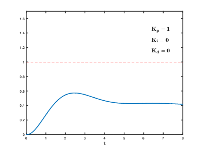
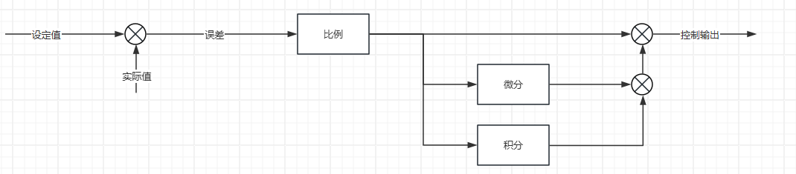
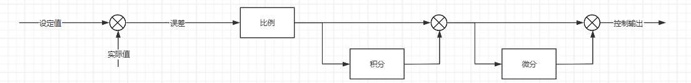
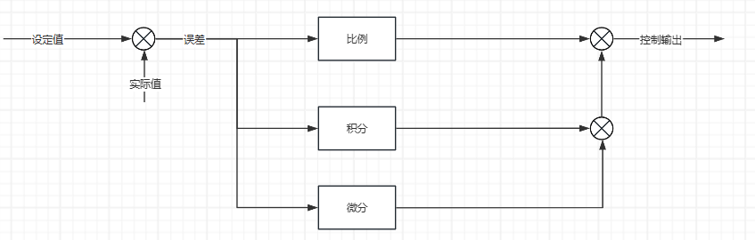
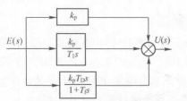
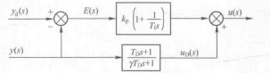
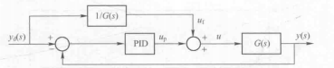
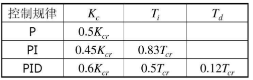

# Engine 基础PID控制

## 1. PID 控制器

### 闭环反馈控制

开环控制：输出只受系统输入控制，没有反馈回路，控制精度和抗干扰能力差。


闭环控制：引入反馈回路，利用输出和输入值的偏差对系统进行控制，避免偏离预定目标。


在经典控制理论中，通常使用反馈控制进行闭环控制，即将控制对象的输出量反馈到输入端进行比较，通过误差值调节输出。

### 经典控制系统的时域指标


通常的期望指标是在系统稳定的条件下，将系统调节时间尽可能缩短，同时超调量尽可能小，在不能改变系统固有特性的时候，需要外加控制器进行调节。

PID 控制器是一种常用的控制器，它具有不依赖于系统模型的优点，所以任何系统均可以首先使用 PID 进行粗略的调节。

### 连续系统 PID 控制器

PID 即 proportional（比例），integral（积分），differential（微分）。


<font color=LightGreen>1. 比例控制</font>

成比例的反映控制系统的偏差信号，控制器输出$u$与输入偏差$e$成正比，可以用来减小系统的偏差。 

$$
u = K_Pe
$$
$u$为控制器输出值，$K_p$为比例系数，$e$为偏差值。

> - $K_P$越大，系统响应越快，越快达到目标值。
> - $K_P$过大会使系统产生较大的超调和振荡，导致系统的稳定性变差。
> - 仅有比例环节无法消除静态误差。

**稳态误差：**系统控制过程趋于稳定时，目标值与实测值之间的偏差。产生原因是系统输出被外界影响抵消一部分。

> 实际上，比例控制无法提高系统型别，对于 0 型系统（对于阶跃信号存在误差），比例控制并不能够消除阶跃信号的稳态误差。

<font color=LightGreen>2. 积分控制</font>

对输入偏差$e$进行积分，只要存在偏差，积分环节就会不断起作用，**主要用于消除静态误差**。 
$$
u = K_Pe+K_I\int_0^t e(\tau)d\tau
$$
$u$为控制器输出值，$K_P$为比例系数，$K_I$为积分系数，$e$为偏差值。

> - $K_I$越大，消除静态误差的时间越短，越快达到目标值。
> - $K_I$过大会使系统产生较大的超调和振荡，导致系统的稳定性变差。
> - 对于惯性较大的系统，积分环节动态响应较差，容易产生超调、振荡甚至不稳定。

<font color=LightGreen>3. 微分控制</font>

对输入偏差$e$进行微分，检测偏差的变化率。

$$
u = K_pe+K_I\int_0^t e(\tau)d\tau+K_D\frac{de(t)}{dt}
$$

$u$为控制器输出值，$K_p$为比例系数，$K_I$为积分系数，$K_D$为微分系数，$e_k$为第k次采样偏差值

> - $K_D$或者偏差变化趋势越大，微分环节作用越强，对超调和振荡的抑制越强。
>
> - $K_D$对于系统噪声十分敏感，$K_D$过大会引起系统的不稳定，容易引入高频噪声。



### 离散系统 PID 控制器

使用单片机控制时，由于单片机为数字系统，输出是离散的时间序列，所以需要将连续 PID 控制器离散化。

<font color=LightGreen>1. 位置式（全量式）PID</font>

将连续系统 PID 控制器离散化，使用后向差分。$T_s$ 为采样时间（通常是控制周期）。
$$
u(n) = K_P e(n) + K_IT_s \sum_{i=0}^ne(i)+\frac{K_D}{T_s}(e(n)-e(n-1))
$$

```c
/**
  * @brief 全量式PID算法
  * @param PID PID结构体
  */
void PID_Cal(PID *PID)
{
    PID->error = PID->ref - PID->fdb;                   						/* 计算偏差 */
    
    PID->sumerror += PID->error;
    PID->output = (PID->Kp * PID->error)                       					/* 比例环节 */
                       + (PID->Ki * PID->Ts * PID->sumerror)                	/* 积分环节 */
                       + (PID->Kd * (PID->error - PID->lasterror) / PID->Ts); 	/* 微分环节 */
    PID->lasterror = PID->error;
}
```

位置式PID控制存在积分累加环节，计算量相对较大。

<font color=LightGreen>2. 增量式 PID</font>
$$
u(n-1) = K_P e(n-1) + K_IT_s \sum_{i=0}^{n-1}e(i)+\frac{K_D}{T_s}(e(n-1)-e(n-2)) 
\\
\Delta u(n) = u(n) - u(n-1) = K_P(e(n)-e(n-1)) + K_IT_s e(n) + \frac{K_D}{T_s}(e(n)-2e(n-1)+e(n-2))
$$
增量式PID控制只与最近的三次采样的误差有关，计算复杂度降低。

```c
/**
  * @brief 增量式PID算法
  * @param PID PID结构体
  */
void PID_Cal(PID *PID)
{
    PID->error = PID->ref - PID->fdb;                   												/* 计算偏差 */
    
    PID->output += (PID->Kp * (PID->error - PID->lasterror))                       						/* 比例环节 */
                     + (PID->Ki * PID->Ts * PID->error)                                             	/* 积分环节 */
                     + (PID->Kd * (PID->error - 2 * PID->lasterror + PID->preverror) / PID->Ts);  		/* 微分环节 */
    
    PID->preverror = PID->lasterror;                                        							/* 存储偏差，用于下次计算 */
    PID->lasterror = PID->error;
}
```

<font color=Yellow>注意：</font>离散PID系统存在控制频率要求，实际使用时需要在硬件定时器中使用，周期越小，要求系统抗噪声能力较强，同时参数值较小。

## 2. PID 控制器的形式和改进

### PID 控制器的形式

- 标准形式 PID

  
  
  $$
  u(t) = K_p(e(t)+\frac{1}{T_I}\int_0^t e(\tau)d\tau+T_D\frac{de(t)}{dt})
  $$
  
  此时：$K_p = K_p$，$K_I = \frac{K_p}{T_I}$，$K_D = K_pT_D$；

- 串联形式 PID

  
  $$
  u(t) = K_p^,((1+\frac{T_D^,}{T_I^,})e(t)+\frac{1}{T_I^,}\int_0^t e(\tau)d\tau + T_D^,\frac{de(t)}{dt})
  $$
  标准形式 PID 总是可以表示为串联形式 PID：$K_p = K_p^,\frac{T_I^,+T_D^,}{T_I^,}$，$T_I = T_I^, + T_D^,$，$T_D = \frac{T_I^,T_D^,}{T_I^,+T_D^,}$。

  但是串联形式 PID 表示为标准形式 PID 时有限制：$T_I \geq 4T_D$，此时：$K_p^, = \frac{K_p}{2}(1+\sqrt{1-\frac{4T_D}{T_I}})$，$T_I^, = \frac{T_I}{2}(1+\sqrt{1-\frac{4T_D}{T_I}}) $，$$T_D^, = \frac{T_I}{2}(1-\sqrt{1-\frac{4T_D}{T_I}}) $$。

- 并联形式 PID

  

  通常使用这种 PID。

不同的 PID 形式只是不同的 PID 实现和不同的 PID 参数，本质是一致的。

### PID 控制器的改进

#### 积分饱和

在误差有大幅变化（例如大幅增加），积分器因为误差的大幅增加有很大的累计量，此时需要对积分器进行输出限制，称之为积分饱和。如果不进入饱和状态，控制输出将会无限增加，可能导致系统大幅度振荡。

抑制积分饱和有以下几种方法：

1. **积分分离**

   在误差较大时使用 PD/P 控制器，在误差较小时引入积分项。需要设置误差阈值 $\epsilon$。
   $$
   u_i(n) = \alpha K_IT_s\sum_{i=0}^ne(i) \\
   \alpha = 
   \left\{  
   \begin{array}{**lr**}  
   1,|e(n)| \leq \epsilon \\
   0,|e(n)| \geq \epsilon \\
   \end{array}  
   \right.
   $$

2. **变速积分**

   积分分离的改进方法：根据系统大小改变积分项的累加速度，偏差越大，积分越慢。
   $$
   u_i(n) = K_iT_s(\sum_{i=0}^{n-1}e(i)+f(e(n))e(n))
   $$
   $f$ 和 $|e(n)|$ 的关系可以自定义。
   $$
   f(e(n)) =
   \left\{  
   \begin{array}{**lr**}  
   1 & |e(n)| \leq B \\
   \frac{A-|e(n)|+B}{A} & B \leq |e(n)| \leq A+B \\
   0 & |e(n)| \geq A
   \end{array}  
   \right.
   $$
   $f$ 值在 $[0,1]$ 区间内变化，当 $|e(n)|$ 差大于所给分离区间 $A+B$ 后，$f=0$ ，不再对当前值 $e(n)$ 进行继续累加；当偏差 $|e(n)|$ 小于 $B$ 时，加入当前值 $e(n)$​，与一般 PID 积分项相同，积分动作达到最高速；而当偏差 $|e(n)|$ 在 $B$ 与 $A+B$ 之间时，则累加计入的是部分当前值。

3. **抗饱和算法**

   在计算 $u(n)$ 时，首先判断上一时刻的控制量 $u(n-1)$ 是否已超出限制范围：若 $u(n-1)>u_{max}$，则只累加负偏差；若 $u(n-1)<u_{max}$，则只累加正偏差。这种算法可以避免控制量长时间停留在饱和区。

#### 微分改进

1. **不完全微分**

   在 PID 控制中，微分信号的引入可改善系统的动态特性，但也易引进高频干扰，在误差扰动突变时尤其显出微分项的不足。

   对微分项加入低通滤波器进行滤波，可以抑制高频输出。

   
   $$
   u_D(n) = \frac{K_D}{T_s} (1-\alpha)(e(n)-e(n-1)) + \alpha u_D(n-1)
   $$
   式中：$\alpha = \frac{T_f}{T_s+T_f}$；

2. **微分先行**

   只对输出量 $y(n)$ 进行微分，而对给定值 $y_d(n)$ 不作微分。这样，在改变给定值时，输出不会改变，而被控量的变化通常是比较缓和的。这种输出量先行微分控制适用于给定值 $y_(n)$ 频繁升降的场合，可以避免给定值升降时所引起的系统振荡，从而明显地改善了系统的动态特性。
   
   
   $$
   \frac{u_D(s)}{y(s)} = \frac{T_D s+1}{\gamma T_Ds + 1}
   $$
   $ \frac{1}{\gamma T_Ds + 1}$ 为滤波器。
   $$
   u_D(n) = \frac{\gamma T_D}{\gamma T_D+T}u_D(n-1) + \frac{T_D + T}{\gamma T_D + T}y(n) + \frac{T_D}{\gamma T_D + T}y(n-1)
   $$

#### 其他改进

1. **死区PID**

   为了避免控制作用过于频繁，消除由于频繁动作所引起的振荡，可采用带死区的 PID 控制算法。
   $$
   e(n) = 
   \left\{  
   \begin{array}{**lr**}  
   0 & |e(n)|\leq|e_0| \\
   e(n) & |e(n)|\geq|e_0|
   \end{array}  
   \right.
   $$
   $e_0$ 为一个可调参数，其具体数值可根据实际控制对象由实验确定。若 $e_0$ 值太小，会使控制动作过于频繁，达不到稳定被控对象的目的；若 $e_0$ 值太大，则系统将产生较大的滞后。

2. **前馈补偿**

   当闭环系统为连续系统时，使前馈环节与闭环系统的传递函数之积为 1，从而实现输出完全复现输入。使用前馈控制前需要对被控对象的模型有了解，才能有针对性的设计出合适的前馈控制器。也就说，每个系统的前馈控制器都是不一样的，每个前馈控制器都是专用的。要实施前馈控制，首先必须得到被控系统的近似模型，这个模型越接近真实的系统，控制的效果就越明显。

   (比如带重力的角度伺服)

   
   
   前馈控制通常可以增加系统响应速度，没有前馈的系统响应速度会受到影响。

## 3. PID 参数手动整定

### ZN 整定法

1. 先调节 $K_p$ ，直至系统出现振荡（找到根轨迹和虚轴的交点），记录振荡周期 $T_{cr}$，控制器增益 $K_{cr}$。

2. 此时即可选定 PID 参数：

   

> 1. ZN 整定方法只提供最强的抗扰能力，输入指令变化快时参数不适配。
> 2. 对于纯滞后对象，积分控制过弱，难以调参。
> 3. 等幅振荡往往不能接受。

### Lambda 整定法

常见的控制对象可以用纯滞后一阶系统进行表示。因此得到三个参数：增益 $K$，纯滞后时间 $T$ 和系统时间常数 $\tau$。

一般系统在增大 $K_p$ 时会发生振荡（振荡是同相的），这个作用在纯滞后一阶系统视为纯滞后时间的结果（注意不是二阶系统振荡）。**纯滞后时间和 $K_p$ 呈现反比例关系。对于模型的特性而言，控制对象增益越大，$K_p$ 应当越小，系统时间常数越大，$K_p$ 应当越大。**

一般而言，$\frac{\tau}{T} \geq 1$ 时，被控对象由时间常数主导，应当由时间常数进行整定；反之被控对象由滞后时间主导，用滞后时间进行整定。

一般的，纯比例控制时：$K_p = \frac{\tau}{K(2T)}$ 。

加入积分控制器时，积分通过对偏差的累计消除误差，误差累积的速度和时间常数相对应，因此：$T_I = \tau$。

对于 Lambda 整定法而言：
$$
K_p = \frac{\tau}{K(T+\lambda)} \\
T_I = \tau 
$$
 $\lambda$ 为闭环时间常数。推荐为 $\lambda \geq T$。
