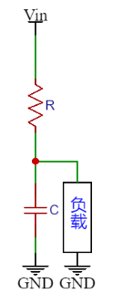

# Engine 基础滤波器

滤波器(Filter)，主要用于滤除或者保留特定的频率分量，比如去除 50Hz 频率的工频噪声，或者保留较低频率的速度信号，或者分离搭载在直流信号上的交流信号。滤波器分为模拟滤波器和数字滤波器，其中模拟滤波器通常使用运放环路实现，处理的对象是现实中的连续模拟信号；对于单片机系统，只能将模拟信号通过 ADC 转换为数字信号后，通过数字滤波器才能得到特定频率的信号。

数字滤波器分为 IIR(无限冲激响应滤波器) 和 FIR(有限冲激响应滤波器) ，IIR 的实现和 FIR 的实现不同的地方在于 IIR 使用一些之前的滤波器输出作为输入。主要的单片机实现是使用 IIR 滤波器。

IIR 滤波器的实现方法：

> 1. 将给定的数字滤波器的指标转换成过渡模拟滤波器的指标；
> 2. 设计过渡模拟滤波器；
> 3. 将过渡模拟滤波器系统函数转换成数字滤波器的系统函数。

## 1. 数字滤波器

### 一阶低通滤波器

主要用于保留低频分量，滤除高频分量。

一阶低通滤波器的物理模型来源于一阶RC滤波器，其输出信号与电容的容抗和电阻的阻抗形成的电路网络有关，此电路网络是由电阻分压网络衍生而来。



RC滤波器对于频率为$\omega$的输入，输出结果为：
$$
U_o = U_i \frac{\frac{1}{\omega C}}{\sqrt{(\frac{1}{\omega C})^2+R^2}}
$$
可以看到，一阶低通滤波器对于高频信号的输出较小，对于低频信号的输出较大，滤除了高频噪声。

对一阶低通滤波器进行 Laplace 变换得到传递函数：
$$
G(s) = \frac{1}{1+Ts}
$$
在离散系统中，使用后向差分的 z 变换：
$$
s = \frac{1-z^{-1}}{T_s}
$$
得到：
$$
Y(z) = X(z) \frac{1}{1+\frac{RC}{T_s}}+Y(z)z^{-1}\frac{\frac{RC}{T_s}}{1+\frac{RC}{T_s}} 
\\
Y(n) = Y(n-1) + (X(n) - Y(n-1))\frac{T_s}{T_s+RC}
$$
则滤波器系数:
$$
\alpha = \frac{\omega_cT_s}{1+\omega_cT_s}
$$
即可得到数字一阶低通滤波器:
$$
Y(n) = (1-\alpha)Y(n-1) + \alpha X(n)
$$

```c
#define LOW_PASS_FILTERING_ALPHA 0.4f //1~0

typedef struct {
    float value_current;
    float value_last;
} FOLPF_DATATypeDef;

void FLOAT_FirstOrderLowPassFiltering_Process(FOLPF_DATATypeDef *data_pointer){
    // caculate
    data_pointer->value_current=((1-LOW_PASS_FILTERING_ALPHA)*data_pointer->value_last)
                                +(LOW_PASS_FILTERING_ALPHA *data_pointer->value_current);
    // update
    data_pointer->value_last=data_pointer->value_current;
}
```

<font color=Yellow>注意：</font>对速度采样应当使用定时器，如果存在通信，可以单独使用线程首先获取一个全局变量，随后在定时器中断中定时获取全局变量进行采样。速度信号是低频信号，应当使用一阶低通滤波器进行去噪。


