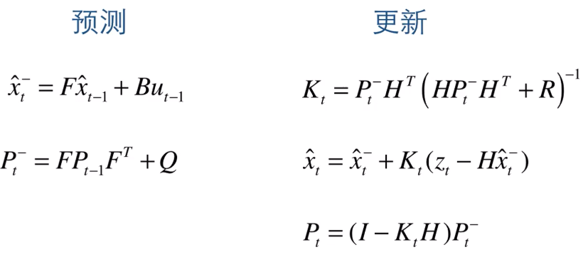

# Engine Basic Kalman Filter

> **参考资料：**
>
> [DR_CAN 的 Kalman Filter 讲解](https://www.bilibili.com/video/BV1ez4y1X7eR/?spm_id_from=333.788&vd_source=2d2507d13250e2545de99f3c552af296)

Kalman Filter 是一种最优化递归数字处理算法，在控制意义上，Kalman Filter 相比于普通的滤波器更倾向于**观测器**的性质。Kalman Filter 广泛应用在导航，视觉追踪中。

> 在随机控制理论中，Kalman Filter 是状态估计的一部分，状态估计还包含预测（预测未来值），平滑（平滑过去值），滤波（校正当前值）。

Kalman Filter 之所以被广泛应用，是因为现实世界具有很多的不确定性。

> - 不存在完美的数学模型进行没有误差的建模；
> - 系统的扰动不可控；
> - 测量的传感器存在精度问题，存在误差。

## 1. 引例

**例1 硬币的测量 **

> 对于一个硬币，对其多次测量，得到以下的结果：$z_1,z_2,...,z_k$。
>
> 测量工具存在误差（这是普遍的），所以要使用取平均值的方法**估计**真实的数据。
> $$
> \hat{x_k} = \frac{1}{k} \sum_{i=1}^k z_i = \frac{1}{k} \sum_{i=1}^{k-1} z_i + \frac{1}{k}z_k = \frac{k-1}{k}\hat{x_{k-1}} + \frac{1}{k}z_k = \hat{x_{k-1}} + \frac{1}{k}(z_k - \hat{x_{k-1}})
> $$
> 上式将普遍的求平均值的估计方式改写为了递推式，**通过上一次的估计值和这一次的测量值得到这一次的估计值**，同时，测量（估计）的次数越多，$k$越大，两次估计值之间相差越小，**随着测量的增加，测量值的权重越来越低**。
>
> 令$K_k = \frac{1}{k}$，则上式改写为：
> $$
> \hat{x_k} = \hat{x_{k-1}} + K_k(z_k - \hat{x_{k-1}}) \tag{1}
> $$
> $K_k$ 即为卡尔曼增益（Kalman Gain）。
>
> 现在引入估计误差$e_{EST}$和测量误差$e_{MEA}$，Kalman Gain 可表示为下式（一维形式）：
> $$
> K_k = \frac{e_{EST(k-1)}}{e_{EST(k-1)} + e_{MEA(k)}} \tag{2}
> $$
> (2)式在之后的小节将会详细推导，先分析（2）式的含义：
>
> > - 假定在$k$次测量时，$e_{EST(k-1)} \gg e_{MEA(k)}$，则$K_k \to 1$，$\hat{x_k} \to z_k$，说明在估计误差远大于测量误差时，测量值的可信度更高，权重更大。
> > - 假定在$k$次测量时，$e_{EST(k-1)} \ll e_{MEA(k)}$，则$K_k \to 0$，$\hat{x_k} \to \hat{x_{k-1}}$，说明在估计误差远大于测量误差时，前一次值的可信度更高，权重更大。
>
> 所以，测量硬币的直径可以分为以下几步：
>
> > - Step 1：计算 Kalman Gain（使用（2）式）；
> > - Step 2：计算当前估计值（使用（1）式）；
> > - Step 3：更新估计误差（使用下述给出的（3）式）。（测量误差是测量仪器自带的，无需更新，但是估计误差会随着估计次数的增加会越来越少）。
> >
> > $$
> > e_{EST(k)} = (1 - K_k)e_{EST(k-1)} \tag{3}
> > $$

## 2. Kalman Filter 的数学基础

### 数据融合（Data Fusion）

**例2 两个秤称同一个物体，假定第一个秤测量值为$z_1$，标准差为$\sigma_1$，第一个秤测量值为$z_2$，标准差为$\sigma_2$，估计该物体的重量并求其标准差。（假设测量误差符合正态分布） **

> 显然，估计值在$z_1$和$z_2$之间，而且更倾向于标准差$\sigma$较小的一侧。
>
> 基于第一个假设，假定估计值为：
> $$
> \hat{z} = z_1 + K(z_2 - z_1) \tag{2.1}
> $$
> 上式和（1）式极为相似，可以认为$K$即为Kalman Gain。
>
> 为了使得估计值足够精确，则应当使得$\sigma_{\hat{z}}$最小，等同于方差$var(\hat{z})$最小。
> $$
> \sigma_{\hat{z}} = var(z_1 + K(z_2 - z_1)) = var((1-K)z_1) + var(Kz_2) = (1-K)^2var(z_1) + K^2var(z_2)
> $$
> 令$\frac{d\sigma^2}{dK} = 0$，则可使得估计误差最小，此时
> $$
> K = \frac{\sigma_1^2}{\sigma_1^2 + \sigma_2^2} \tag{2.2}
> $$
> 上式即为（2）式的一个来源。将$K$代入估计式（2.1），即可得到估计值和对应的最小标准差。

### 协方差矩阵（Covariance Matrix）

假设有$n$个样本，每个样本有对应的测量属性$x_i$，$y_i$，其均值为$\overline{x_i}$，$\overline{y_i}$。则样本的协方差矩阵可以写为：
$$
\bold{P} = \left[\begin{matrix}\sigma_{x}^2 & \sigma_x\sigma_y \\ \sigma_y\sigma_x & \sigma_y^2\end{matrix}\right] 
$$
其中，$\sigma_x\sigma_y$为$x$和$y$的协方差。
$$
cov(X,Y) = \frac{\sum_{i=1}^n(x_i-\overline{x})(y_i-\overline{y})}{n}
$$
如果$cov(X,Y)$大于0，则$x$，$y$正相关，反之则负相关。

### 状态空间（State Space）

**例3 受迫振动的物体，假设弹簧劲度系数为$k$，摩擦因数为$\mu$，受迫力为$F(t)$ **

> 由力学关系，可以得到
> $$
> m\ddot{x} + \mu\dot{x} + kx  = F(t) \tag{3.1}
> $$
> 在经典控制理论中，通常使用Laplace变换求输入到输出的传递函数$G(s)$：
> $$
> G(s) = \frac{X(s)}{F(s)} = \frac{1}{ms^2 + \mu s + k} \tag{3.2}
> $$
> 在现代控制理论中，通常使用一阶微分方程组描述输入和输出的关系，为了将高阶微分方程转化为一阶微分方程组，通常需要处于中间变量地位的状态变量。
>
> 比如，在此例中，使用$x_1 = x$，$x_2 = \dot{x}$为状态变量，则方程（3.1）可以表示为：
> $$
> \left[\begin{matrix}\dot{x_1} \\ \dot{x_2}\end{matrix}\right] = \left[\begin{matrix}0 & 1 \\ -\frac{k}{m} & -\frac{\mu}{m}\end{matrix}\right]\left[\begin{matrix}x_1 \\ x_2\end{matrix}\right] + \left[\begin{matrix}0 \\ \frac{1}{m}\end{matrix}\right]\left[\begin{matrix}F(t)\end{matrix}\right] \tag{3.3}
> $$
> 系统输出可表示为：
> $$
> x = \left[\begin{matrix}1 & 0\end{matrix}\right]\left[\begin{matrix}x_1 \\ x_2\end{matrix}\right] + \left[\begin{matrix}0 \end{matrix}\right]\left[\begin{matrix}F(t)\end{matrix}\right] \tag{3.4}
> $$

通常的，使用以下公式表述状态空间：
$$
\bold{\dot{X}}(t) = \bold{AX}(t) + \bold{BU}(t) \tag{4}
$$

$$
\bold{Y}(t) = \bold{CX}(t) + \bold{DU}(t) \tag{5}
$$

（4）式称为状态空间的状态方程，描述系统状态变量与系统输入之间关系，（5）式称为状态空间的输出方程，描述系统的状态变量与输出变量关系。$\bold{A}$为状态矩阵，$\bold{B}$为输入矩阵，$\bold{C}$为输出矩阵，$\bold{D}$为直接传递矩阵。

在 Kalman Filter 关注的领域中，通常令$\bold{D} = \bold{O}$，$\bold{Y}$为可以测量的测量值（受到测量噪声影响），$\bold{X}$为系统状态的估计值（受到系统过程噪声影响）。（4），（5）式离散化并改写为：
$$
\bold{{X}}_k = \bold{AX}_{k-1} + \bold{BU}_{k} + \bold{w_{k}} \tag{6}
$$

$$
\bold{Z}_k = \bold{HX}_k + \bold{v}_k \tag{7}
$$

## 3. Kalman Filter

> ***实质：使用当前的系统输出和前一个系统状态估计得到当前的系统状态融合得到当前系统状态。***

### 公式推导

1. 假设条件
   - 过程噪声$\bold{w}$符合正态分布：$P(w) \sim (0,Q)$；
   - 测量噪声$\bold{v}$也符合正态分布：$P(v) \sim (0,R)$；过程噪声和测量噪声是白噪声（不同时刻的噪声值相互独立）且相互独立。
   - 状态的初值为正态分布，且与噪声相互独立。由于是线性系统，由随机过程理论可知，系统状态在任一时刻满足正态分布。

>$Q$为协方差矩阵，由定义可得：
>$$
Q = E(\bold{ww}^T) \tag{8}
>$$
>
>> 说明：假设过程噪声向量为$\bold{w} = [w_1 \quad w_2]^T$，则
>> $$
>> \bold{ww}^T = \left[\begin{matrix}w_1^2 & w_1w_2 \\ w_2w_1 & w_2^2\end{matrix}\right]
>> $$
>> 则由$var(X) = E(X^2) - E(X)^2 = E(X^2)$：
>> $$
>> E(\bold{ww}^T) = \left[\begin{matrix}E(w_1^2) & E(w_1w_2) \\ E(w_2w_1) & E(w_2^2)\end{matrix}\right] = \left[\begin{matrix}\sigma_{w_1}^2 & \sigma_{w_1}\sigma_{w_2} \\ \sigma_{w_2}\sigma_{w_1} & \sigma_{w_2}^2\end{matrix}\right] = Q
>> $$

2. 公式推导:

	现在已知的有：上一次（时刻）的估计值$\hat{\bold{x_{k-1}}}$，当次（当前时刻）测量值$\bold{z_k}$

	由状态空间方程可以直接得到先验估计值$\hat{\bold{x_{k}^{-}}}$：
	$$
	\hat{\bold{x_{k}^{-}}} = \bold{A}\hat{\bold{x_{k-1}}}+\bold{Bu}_{k} 		\tag{9}
	$$
	由输出方程可得测量值$\hat{\bold{x_{MEA(k)}}}$：
	$$
	\hat{\bold{x_{MEA(k)}}} = \bold{H}^{-1}\bold{z_k} \tag{10}
	$$
	此时得到了两个不准确的当前估计值，首先进行数据融合：
	$$
	\bold{\hat{x_k}} = \hat{\bold{x_{k}^{-}}} + \bold{G}(\bold{H}^{-1}\bold{z_k} - \hat{\bold{x_{k}^{-}}}) \tag{11}
	$$
	做变换$\bold{G} = \bold{K_k H}$，则得到后验估计值：
	$$
	\bold{\hat{x_k}} = \hat{\bold{x_{k}^{-}}} + \bold{K_k}(\bold{z_k} - \bold{H}\hat{\bold{x_{k}^{-}}}) \tag{12}
	$$
	$\bold{K_k}$为Kalman Gain。接下来需要寻找$\bold{K_k}$使得$\bold{x_k}-\bold{\hat{x_k}}$最小：

	假设后验误差$\bold{e_k} = \bold{x_k}-\bold{\hat{x_k}}$，$P(e_k) \sim (0,P)$。则：
	$$
	\begin{aligned}
	\bold{x_k}-\bold{\hat{x_k}} &= \bold{x_k} - (\hat{\bold{x_{k}^{-}}} + \bold{K_k}(\bold{z_k} - \bold{H}\hat{\bold{x_{k}^{-}}})) \\ 
	&= \bold{x_k} - \hat{\bold{x_{k}^{-}}} - \bold{K_k}\bold{z_k}+ \bold{K_k}\bold{H}\hat{\bold{x_{k}^{-}}}
	\\
	&= \bold{x_k} - \hat{\bold{x_{k}^{-}}} - \bold{K_k}(\bold{Hx}_k + \bold{v}_k)+ \bold{K_k}\bold{H}\hat{\bold{x_{k}^{-}}} \\
	&= \bold{x_k} - \hat{\bold{x_{k}^{-}}} - \bold{K_k H}(\bold{x}_k - \hat{\bold{x_{k}^{-}}}) + \bold{K_k}\bold{v}_k \\
	&= (\bold{I} - \bold{K_k H})(\bold{x_k} - \hat{\bold{x_{k}^{-}}})+ \bold{K_k}\bold{v}_k \\
	&= (\bold{I} - \bold{K_k H})\bold{e_{k}^{-}}+ \bold{K_k}\bold{v}_k
	\end{aligned}
	$$

	$$
	\begin{aligned}
	P &= E(\bold{e_k e_k}^T) \\
	&= E[((\bold{I} - \bold{K_k H})\bold{e_{k}^{-}}+ \bold{K_k}\bold{v}_k)((\bold{I} - \bold{K_k H})\bold{e_{k}^{-}}+ \bold{K_k}\bold{v}_k)^T] \\
	&= E[((\bold{I} - \bold{K_k H})\bold{e_{k}^{-}}+ \bold{K_k}\bold{v}_k)(\bold{e_{k}^{-}}^T(\bold{I} - \bold{K_k H})^T+ \bold{v}_k^T\bold{K_k}^T)] \\
	&= E[(\bold{I} - \bold{K_k H})\bold{e_{k}^{-}}\bold{e_{k}^{-}}^T(\bold{I} - \bold{K_k H})^T] - E[(\bold{I} - \bold{K_k H})\bold{e_{k}^{-}}\bold{v}_k^T\bold{K_k}^T]-E[\bold{K_k}\bold{v}_k\bold{e_{k}^{-}}^T(\bold{I} - \bold{K_k H})^T]+E[\bold{K_k}\bold{v}_k\bold{v}_k^T\bold{K_k}^T]
	\end{aligned}
	$$

	由于$E(\bold{e_k}) = E(\bold{e_k^-}) = 0$，则$E[(\bold{I} - \bold{K_k H})\bold{e_{k}^{-}}\bold{v}_k^T\bold{K_k}^T] = 0$，$E[\bold{K_k}\bold{v}_k\bold{e_{k}^{-}}^T(\bold{I} - \bold{K_k H})^T] = 0$。则有：
	$$
	\begin{aligned}
	\bold{P_k} &= (\bold{I} - \bold{K_k H})E(\bold{e_k^- (e_k^-)^T})(\bold{I} - \bold{K_k H})^T + \bold{K_k}E(\bold{v_k v_k^T})\bold{K_k}^T \\
	&= (\bold{I} - \bold{K_k H})\bold{P_k^-}(\bold{I} - \bold{K_k H})^T + \bold{K_k}\bold{R}\bold{K_k}^T \\
	&= (\bold{I} - \bold{K_k H})\bold{P_k^-}
	\end{aligned} \tag{13}
	$$
	由先验误差协方差矩阵和测量噪声可得后验误差协方差矩阵。只需要关心后验误差协方差矩阵对角线上的方差值最小即可，即使得$tr(\bold{P_k})$最小。

	由于$tr(\bold{P_K}) = tr(\bold{P_k}^T)$，则有：
	$$
	tr(\bold{P_K}) = tr(\bold{P_K^-}) - 2tr(\bold{K_k H P_k^-}) + tr(\bold{K_k H P_k^- H^T K_k^T}) + tr(\bold{K_k R K_k^T})
	$$
	令$\frac{dtr(\bold{P_k})}{d\bold{K_k}} = 0$，则由矩阵求导公式：
	$$
	\frac{dtr(\bold{AB})}{d\bold{A}} = \bold{B^T} 
	$$
	得到：
	$$
	-\bold{P_k^- H^T} + \bold{K_k}(\bold{HP_k^- H^T} + \bold{R}) = \bold{O}
	$$
	即得到**卡尔曼增益公式**：
	$$
	\bold{K_k} = \frac{\bold{P_k^- H^T}}{\bold{HP_k^- H^T + R}} \tag{14}
	$$
	接下来应求先验误差协方差：
	$$
	\begin{aligned}
	\bold{x_k}-\bold{\hat{x_k^-}} &= \bold{Ax_{k-1} + Bu_{k-1} + w_{k-1}} - \bold{A\hat{x_{k-1}} + Bu_{k-1}} \\
	&= \bold{Ae_{k-1} + w_{k-1}}
	\end{aligned}
	$$

	$$
	\begin{aligned}
	\bold{P_k^-} &= E(\bold{e_k e_k^T}) \\
	&= E[\bold{Ae_{k-1}e_{k-1}^T A^T}] + E[\bold{Ae_{k-1}w_{k-1}^T}] + E[\bold{w_{k-1} e_{k-1}^T A^T}] + E[\bold{w_{k-1}w_{k-1}^T}] \\ 
	&=\bold{ AP_{k-1}A^T + Q}
	\end{aligned} \tag{15}
	$$

	式（9），式（15）为 Kalman Filter 的预测过程公式；式（14），式 （12），式（13）为 Kalman Filter 的校正过程公式。
	
	

### $\bold{P},\bold{Q},\bold{R}$的整定

> $\bold{Q}$：$\bold{Q}$矩阵表示系统模型中过程噪声的协方差矩阵。它描述了系统状态在时间上的变化和不确定性。通常情况下，$\bold{Q}$矩阵的初始值可以根据系统的动态范围和预期的噪声水平进行估计。
> $\bold{R}$：$\bold{R}$矩阵表示测量模型中观测噪声的协方差矩阵。它描述了观测值和系统真实状态之间的不一致性或不确定性。$\bold{R}$矩阵的初始值可以通过对测量数据进行统计分析来估计。
> $\bold{P}$：$\bold{P}$矩阵表示状态估计的协方差矩阵，它描述了状态估计和真实状态之间的不确定性。$\bold{P}$矩阵的初始值可以根据系统的初始状态估计精度进行设置。

- $\bold{Q}$越大，滤波后的曲线跟测量曲线跟的越紧密，滤波后噪声越大；$\bold{Q} \ge 1$时，滤波效果差；$\bold{Q}$值越小，滤波效果越明显，太小滤波后效果趋于一条直线。（一般取小值）
- $\bold{P(0)}$决定初始增益的大小，影响初始时刻的收敛效果；在整体参数选取合适的时候，初始时刻滤波收敛效果影响不明显。
- $\bold{R}$决定稳态噪声，小了初始增益大，但是稳态容易引入噪声；$\bold{R}$越大对噪声越不敏感，即滤波后的数据跳动越小，但$\bold{R}$越大，滤波输出收敛的越慢。

## 4. Extern Kalman Filter

Kalman Filter 只能适用于线性随机系统的最优化状态估计，对于非线性系统，一种方法是使用线性化方法，使用扩展 Kalman Filter(EKF)。

非线性随机系统的状态空间方程：
$$
\bold{X}_k=f(\bold{X}_{k-1},\bold{U}_{k},\bold{w}_{k}) \\
\bold{Z}_k = h(\bold{X}_k,\bold{v}_k)
$$
注意：正态分布的噪声经过非线性系统后不再正态分布，因此必须线性化系统。

确定系统在真实点线性化即可，但对于离散随机系统，$f(\bold x_k)$最佳的线性化是在$\hat{\bold{x}}_{k-1}$处线性化，这样能最大限度的保持准确性。

对状态空间方程线性化（在$(\hat{\bold x}_{k-1},\bold{u}_k,0)$处展开）：
$$
\bold{x}_k = f(\bold{x}_{k-1},\bold{u}_k,\bold w_k) \approx f(\hat{\bold{x}_{k-1}},\bold{u}_k,0)+\frac{\partial f}{\partial \bold{x}_{k-1}}|_{(\hat{\bold x}_{k-1},\bold{u}_k,0)}(\bold x_{k-1} - \hat{\bold x}_{k-1}) + \frac{\partial f}{\partial \bold{w}_{k}}|_{(\hat{\bold x}_{k-1},\bold{u}_k,0)}\bold w_k
$$
其中令 $\frac{\partial f}{\partial \bold{x}_{k-1}}|_{(\hat{\bold x}_{k-1},\bold{u}_k,0)}$ 为 $\bold A_k$，$\frac{\partial f}{\partial \bold{w}_{k}}|_{(\hat{\bold x}_{k-1},\bold{u}_k,0)}$ 为 $\bold{W}_k$。

对输出方程线性化 (在$(\hat{\bold x}_k,0)$处展开)：
$$
\bold z_k = h(\bold x_k , \bold v_k) \approx h(\hat{\bold x_k} , 0) + \frac{\partial h}{\partial \bold{x}_{k}}|_{(\hat{\bold x}_{k},0)}(\bold x_{k} - \hat{\bold x}_{k}) + \frac{\partial h}{\partial \bold{v}_{k}}|_{(\hat{\bold x}_{k},0)}\bold v_{k}
$$
其中令 $\frac{\partial h}{\partial \bold{x}_{k}}|_{(\hat{\bold x}_{k},0)}$ 为 $\bold H_k$ ， $\frac{\partial h}{\partial \bold{v}_{k}}|_{(\hat{\bold x}_{k},0)}$ 为 $\bold V_k$。

预测方程：
$$
\bold{x}_k^-=f(\hat{\bold{x}_{k-1}},\bold{u}_{k}) \\
\bold P_k^- = \bold A_k \bold P_{k-1} \bold A_k^T + \bold W_k\bold Q \bold W_k^T
$$
校正方程：
$$
\bold{K_k} = \frac{\bold{P_k^- H_k^T}}{\bold{H_k P_k^- H_k^T + V_k R V_k^T}} \\
\bold{\hat{x_k}} = \hat{\bold{x_{k}^{-}}} + \bold{K_k}(\bold{z_k} - h(\hat{\bold x}_k,0)) \\
\bold{P_k} = (\bold{I} - \bold{K_k H})\bold{P_k^-}
$$

- EKF 的问题：

  需要计算非线性模型的雅克比矩阵，计算大，易出错，难得到；

  忽略高阶项，估计精度大受影响；

  模型不确定性的稳定性很差；

  在系统达到平稳状态时，将丧失对突变状态的跟踪能力；

  如果系统的误差传播函数不能很好的用线性函数来逼近，可能会导致滤波器发散。

## 5. Unscented Kalman Filter

对于非线性问题，扩展 Kalman Filter 除了计算量大，还有线性误差的影响，有没有别的方法。而无迹 Kalman Filter 则通过无迹变换（Unscented Transform，UT）来求出预测模型的均值和方差。

UKF生成了一些点，来近似非线性。由这些点来决定实际 $x$ 和 $P$ 的取值范围。UKF的采样点就是把不能解决的非线性单个变量的不确定性，用多个采样点的不确定性近似了。

- UT 变换

  **例4 对于随机变量$X～N(0,1)$，$Y=g(X)$，求$E(Y)$，$D(Y)$。**

  > 精确解：
  > $$
  > E(Y) = E(g(X)) = \int^{+\infty}_{-\infty}g(x)\frac{1}{\sqrt{2\pi}}e^{-\frac{x^2}{2}}dx \\
  > E(Y^2) = \int^{+\infty}_{-\infty}g^2(x)\frac{1}{\sqrt{2\pi}}e^{-\frac{x^2}{2}}dx \\
  > D(Y) = E(Y^2) - E^2(Y)
  > $$
  > 精确解是不好计算的，使用 UT 变换取近似解。
  >
  > 取三个带权重的粒子代替 $N(0,1)$ :
  > $$
  > x_1 = E(X),w_1=\frac{\lambda}{1+\lambda}\\
  > x_2 = E(X) - \sqrt{(1+\lambda)D(X)},w_2 = \frac{1}{2(1+\lambda)}\\
  > x_3 = E(X) + \sqrt{(1+\lambda)D(X)},w_3 = \frac{1}{2(1+\lambda)}
  > $$
  > $\lambda$ 为大于 0 的参数，可以任意取值。$\lambda$ 越大，粒子散布越开。
  > $$
  > y_i = f(x_i) 
  > $$
  > 此时可以求出 $E(Y)$ 和 $D(Y)$。

  UT 变换得到的结果仍然是近似的。

  > - 对于二阶以上的函数，EKF 不可能还原出 $E(Y)$ 和 $D(Y)$。但是 UT 变换可以还原出 $E(Y)$，UT 变换不能还原三阶以上的 $E(Y)$ 和 $D(Y)$。

- UKF 过程

  1. UT 变换求出采样点
     $$
     \bold{X}_k^{(i)} = [\bold{x}_k , \bold{x}_k+\sqrt{(\lambda+n_x)\bold{P}_k^{(i)}},\bold{x}_k-\sqrt{(\lambda+n_x)\bold{P}_k^{(i)}}]
     $$
     $n_x$ 为状态向量的维度，一共得到 $2n+1$ 个采样点。通常取 $\lambda = 3 - n_x$。$\sqrt{\bold{P}_k}^{(i)}$ 为正定矩阵分解为 $pp^T$ 后 $p$ 的第 $i$ 列。

  2. 求出采样点的权重
     $$
     \bold \omega_k^{(1)} = \frac{\lambda}{n_x+\lambda} \\
     \bold \omega_k^{(i)} = \frac{1}{2(n_x+\lambda)}
     $$
  
  3. 对采样点变换并求出先验估计
     $$
     \bold x_{k+1}^{-(i)} =f(\bold x_{k}^{(i)}) \\
     \hat{\bold x}_{k+1}^- = \sum_{i=1}^{2n_x+1}\omega_k^{(i)}\bold x_{k+1}^{-(i)} \\
     \bold P_{k+1}^- = \sum_{i=1}^{2n_x+1}\omega_k^{(i)}(\bold x_{k+1}^{-(i)}-\hat{\bold x}_{k+1}^-)(\bold x_{k+1}^{-(i)}-\hat{\bold x}_{k+1}^-)^T + \bold Q
     $$
     
  4. 对先验估计再次 UT 变换
     $$
     \hat{\bold{X}}_{k+1}^{-(i)} = [\hat{\bold{x}}_{k+1}^- , \hat{\bold{x}}_{k+1}^-+\sqrt{(\lambda+n_x)\hat{\bold{P}}_{k+1}^{-(i)}},\hat{\bold{x}}_{k+1}^--\sqrt{(\lambda+n_x)\hat{\bold{P}}_{k+1}^{-(i)}}]
     $$
  
  5. 求出输出量的均值和方差
     $$
     \bold y_{k+1}^{-(i)} =h(\hat{\bold{x}}_{k+1}^{-(i)}) \\
     \hat{\bold y}_{k+1} = \sum_{i=1}^{2n_x+1}\omega_k^{(i)}\bold {\hat{y}}_{k+1}^{-(i)} \\
     \bold P_{y(k+1)} = \sum_{i=1}^{2n_x+1}\omega_k^{(i)}(\bold y_{k+1}^{-(i)}-\hat{\bold y}_{k+1})(\bold y_{k+1}^{-(i)}-\hat{\bold y}_{k+1})^T + \bold R
     $$
     这里是输出估计值的方差，实际上和输出估计值误差的方差是一致的（见随机控制理论）。
  
  6. 求互协方差矩阵并求出 Kalman 增益： 
     $$
     \bold P_{xy} = \sum_{i=1}^{2n_x+1}(\bold x_{k+1}^{-(i)}-\hat{\bold x}_{k+1}^-)(\bold y_{k+1}^{-(i)}-\hat{\bold y}_{k+1})^T \\
     \bold K_{k+1} = \bold P_{xy} \bold P_y^{-1}
     $$
  
  7. 数据融合
     $$
     \hat{\bold x}_{k+1}^+ = \hat{\bold x}_{k+1}^-+\bold K_{k+1}(\bold y_{k+1}-\hat{\bold y}_{k+1}) \\
     \bold P_{k+1}^+ = \bold P_{k+1}^- + \bold K_{k+1} \bold P_y \bold K_{k+1}^T
     $$
