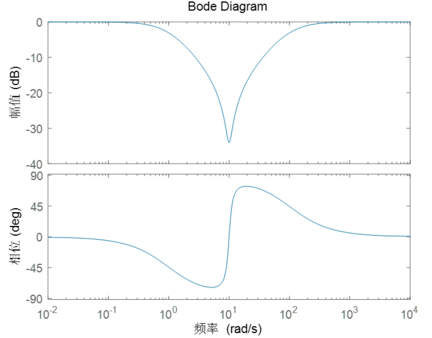
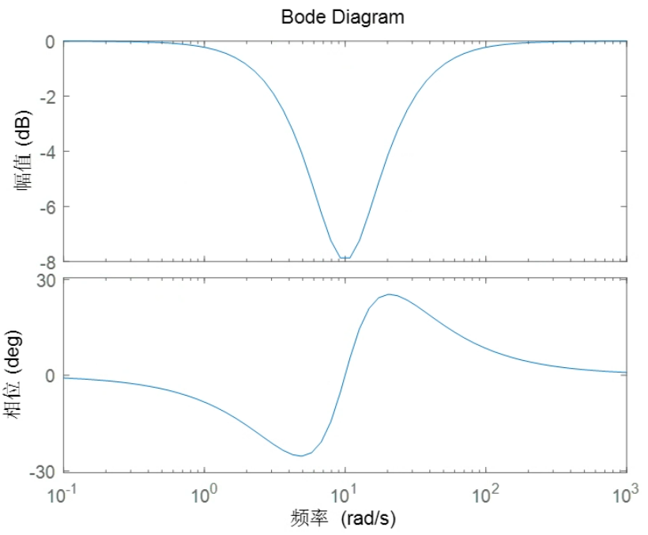
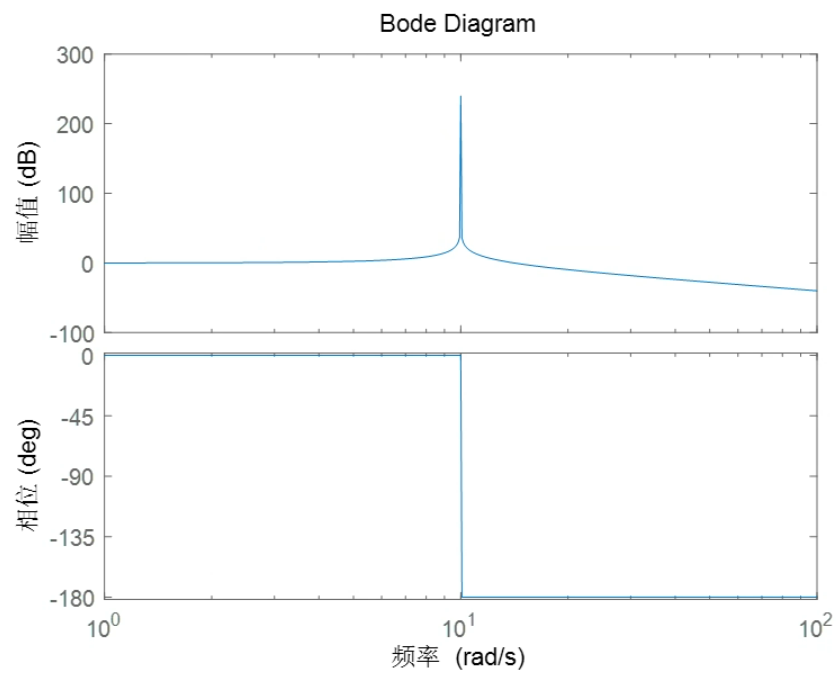
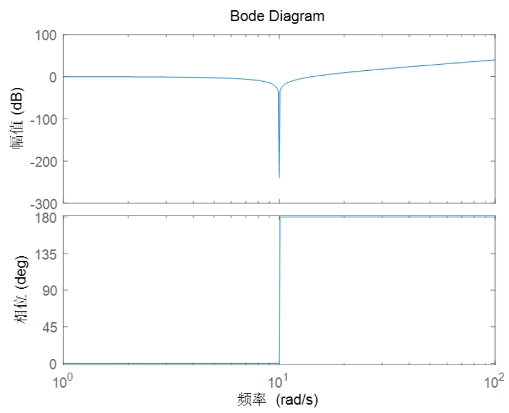
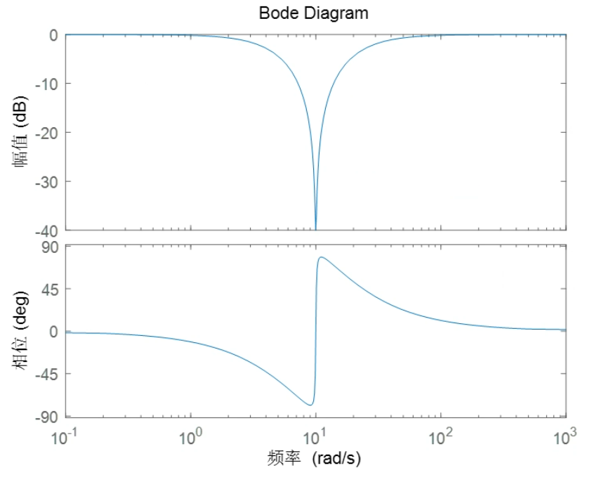
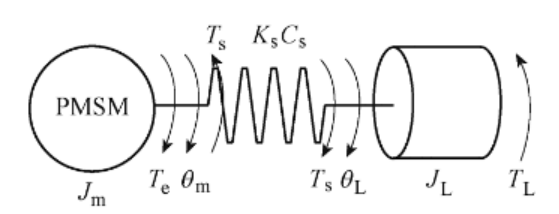
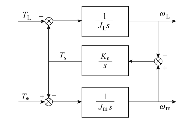
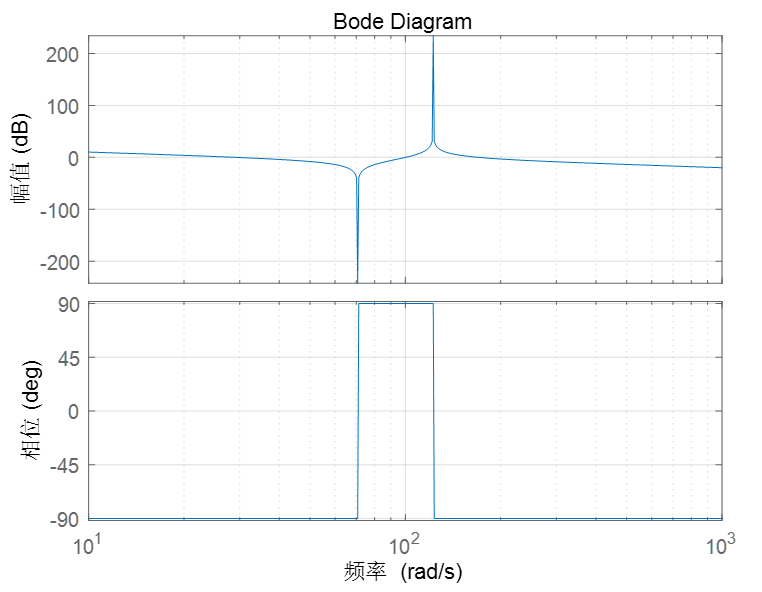

# Engine 陷波滤波器

陷波滤波器是一种带阻滤波器，和普通的带阻滤波器不同的点在于，陷波滤波器的阻带很窄，一般用于滤除一个频点的信号。

## 1. 陷波滤波器

> 参考：[视频](https://www.bilibili.com/video/BV17QiSBtEFa/?spm_id_from=333.337.search-card.all.click&vd_source=2d2507d13250e2545de99f3c552af296)

---

带阻滤波器可以由一个低通滤波器和一个高通滤波器并联而成。
$$
G(s) = \frac{\omega_1}{s+\omega_1} + \frac{s}{s+\omega_2} (\omega_1 < \omega_2)
$$
然而这样的设计方式会使得阻带宽度和阻带深度呈互斥关系，阻带宽度越窄，阻带深度越浅。

低通滤波器截止频率1rad/s，高通滤波器截止频率100rad/s，阻带中心频率10rad/s

低通滤波器截止频率5rad/s，高通滤波器截止频率20rad/s，阻带中心频率10rad/s

因此该设计方法不适合用于构建陷波滤波器。

---

考虑从二阶低通滤波器出发构建陷波滤波器，一个二阶低通滤波器的传递函数为：
$$
G(s) = \frac{\omega_n^2}{s^2+2\zeta\omega_ns+\omega_n^2}
$$
$\zeta$ 为阻尼比，$\omega_n$ 为中心频率。

当阻尼比下降时，中心频率处的增益会上升，如果 $\zeta = 0$ 则使得增益无限。

中心频率10rad/s，阻尼比为0的二阶低通滤波器，中心频率处的增益无限。

此时可以取该二阶低通滤波器的逆系统：
$$
G(s) = \frac{s^2+2\zeta\omega_ns+\omega_n^2}{\omega_n^2}
$$

中心频率10rad/s，阻尼比为0的二阶低通滤波器的逆系统

逆系统和原系统的幅频特性关于 0dB 线对称。因此，这个逆系统在中心频率处的增益接近为 0，具有良好的陷波性。

但是这个逆系统无法物理实现，同时在高频处有 40dB/10倍频 的增益变化率，因此需要在系统中添加合适的极点。

首先系统需要添加两个极点保证因果性和高频的零增益变化率。同时为了保证高频增益为 0dB，这两个极点的位置应关于中心频率对称。因此，陷波滤波器的传递函数为：
$$
G(s) = \frac{s^2+2\zeta\omega_ns+\omega_n^2}{\omega_n^2} \frac{a\omega_n}{s+a\omega_n}\frac{\frac{\omega_n}a}{s+\frac{\omega_n}{a}} = \frac{s^2+2\zeta\omega_ns+\omega_n^2}{s^2+(a+\frac{1}{a})\omega_ns+\omega_n^2}
$$
$a$ 用于调整陷波带宽，$\zeta$ 用于调整陷波深度，$\omega_n$ 用于确定中心频率。

中心频率10rad/s，阻尼比0.01，带宽参数为1的陷波滤波器

## 2. 控制系统中的陷波滤波器

一个典型的例子是防止共振。

以双惯量系统为例，双惯量系统示意图如下：

双惯量系统由柔性连接装置（刚度系数 $K_s$，阻尼系数 $C_s$），柔性连接装置形变时产生转矩 $T_s$。电机侧的电磁转矩 $T_e$ 和柔性连接装置转矩 $T_s$ 共同作用于电机转轴，柔性连接装置转矩 $T_s$ 和负载转矩 $T_L$ 作用于执行机构。

可以得到微分方程：
$$
J_m\frac{d\omega_m}{dt} = T_e - B_m\omega_m - T_s \\
J_L\frac{d\omega_L}{dt} = T_s - B_L\omega_L - T_L \\
T_s = C_s(\omega_m-\omega_L)+K_s(\theta_m-\theta_L) \\
\omega_m = \frac{d\theta_m}{dt} \\
\omega_L = \frac{d\theta_L}{dt}
$$
一般的，可以忽略 $C_s$。进行 Laplace 变换可以得到：
$$
J_m\theta_ms^2 = T_e - B_m\omega_m - T_s \\
J_L\theta_Ls^2 = T_s - B_L\omega_L - T_L \\
T_s = K_s(\theta_m-\theta_L) \\
\omega_m = \theta_ms \\
\omega_L = \theta_Ls
$$

电机角速度和电机电磁转矩的传递函数表示为：
$$
G(s) = \frac{\omega_m}{T_e} = \frac{J_Ls^2+K_s}{J_mJ_Ls^3+(J_m+J_L)K_ss}
$$
其频率特性如下：

弹性环节为系统引入了共轭的零极点，共轭零点引入系统的反谐振频率 $\omega_{ARF}$，该处增益为0，共轭极点引入系统的谐振频率 $\omega_{NTF}$，该处增益为无限。
$$
\omega_{ARF} = \sqrt{\frac{K_s}{J_L}} \\
\omega_{NTF} = \sqrt{\frac{(J_m+J_L)K_s}{J_mJ_L}}
$$
对于谐振频率点，需要在控制器输出侧加入中心频率为 $\omega_{NTF}$ 陷波滤波器，以避免控制器输出谐振频率的控制信号，造成共振。

