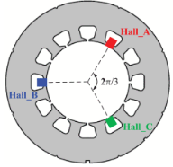
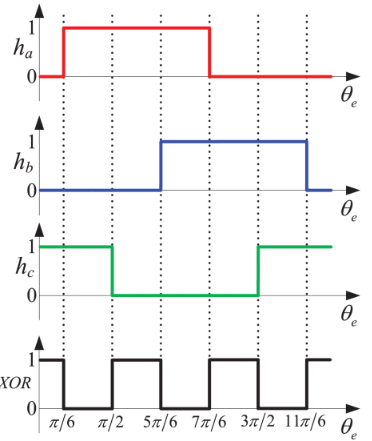
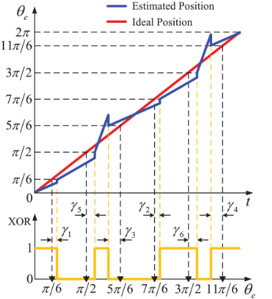
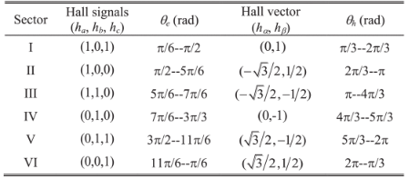
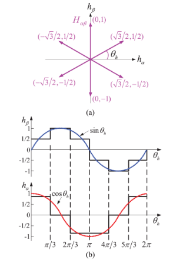
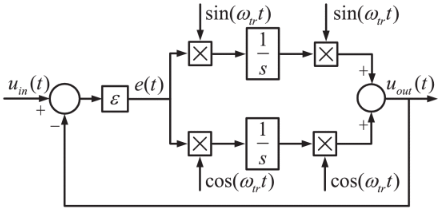
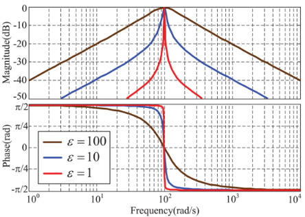
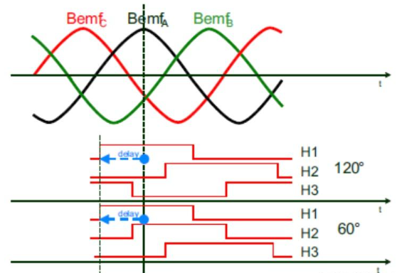

# 开关 HALL 传感器

## 1. 三相开关 HALL 传感器

### 速度/角度获取

> 参考文献：
>
> 1. G. Liu, B. Chen and X. Song, "High-Precision Speed and Position Estimation Based on Hall Vector Frequency Tracking for PMSM With Bipolar Hall-Effect Sensors," in *IEEE Sensors Journal*, vol. 19, no. 6, pp. 2347-2355, 15 March15, 2019, doi: 10.1109/JSEN.2018.2885020. 

对于三相开关 HALL 传感器，通常以 120° 的机械间隔对称安装在定子上。如果 HALL 传感器检测到的磁场从 S 极变为 N 极，霍尔信号将从低电平变为高电平。

一个机械周期内的 HALL 信号如下：

HALL 传感器是一种低精度的传感器，成本低廉，因此得到了十分广泛的使用。接下来介绍电机运行时如何得到机械速度和机械角度。

#### 插值法

$h_a$，$h_b$，$h_c$ 的异或在一个机械周期内将机械角度划分为六个区域(每个区域的机械角度为 $\frac{\pi}{3}$)，由此，当检测到 HALL 信号变化时，可以通过以下公式得到上一个 HALL 区间的机械角速度：

$$
\omega_m = \frac{\frac{\pi}{3}}{\Delta T_H}
$$
$\Delta T_H$ 为上一个 HALL 区间的时间间隔。

对于 HALL 区间内的角度，可以通过线性插值的方式获取近似值：
$$
\theta_m(k) = \theta_m(k-1) + \omega_m T_s \\
\theta_m(0) = \theta_{HALL}(n) & n=1,2,3,4,5,6
$$
即为：在 HALL 信号发生跳变时，计算上一个 HALL 区间的机械角速度，根据该角速度对当前 HALL 区间的角度进行插值计算，同时跳变时使用 HALL 角度对当前机械角度进行修正。$T_s$ 为速度采样周期。这样得到的角度值会有较大的波动。

#### 锁相环法

 HALL 信号是一个周期性质的信号，获取速度和角度实际上是获取该信号的频率和相位，可以通过信号正交化的方式获取正交 HALL 信号，从而构造正交锁相环进行速度和角度获取。

首先按照以下变换获取正交 HALL 信号：
$$
\begin{bmatrix}
h_{\alpha} \\
h_{\beta} \\
\end{bmatrix}
= 
\begin{bmatrix}
-\frac{\sqrt 3}{2} & 0 & -\frac{\sqrt 3}{2} \\
\frac{1}{2} & -1 & \frac{1}{2}  
\end{bmatrix}
\begin{bmatrix}
h_a \\
h_b \\
h_c
\end{bmatrix}
$$
通过这个变换获得的正交 HALL 信号相位和机械角度关系为：
$$
\theta_m = \theta_h - \frac{\pi}{6}
$$

 $h_{\alpha}$ 和 $h_{\beta}$ 分别包含基波和高次谐波，基波分别是 $\theta_h$ 的余弦函数和正弦函数，它们与转子位置相关。高次谐波是高频干扰，需要被消除。

接下来进行正余弦信号的提取，一种方法是使用 SOGI，这里介绍另外一种方法 HVFT。

HVFT 的表达式如下：
$$
u_{out}(t) = \sin(\omega_{tr}t)\int e(t)\sin(\omega_{tr}t)dt + \cos(\omega_{tr}t)\int e(t)\cos(\omega_{tr}t)dt
$$
计算该式的二阶导数可以得到：
$$
\frac{d^2u_{out}(t)}{dt^2} + \omega_{tr}^2u_{out}(t) = \frac{de(t)}{dt}
$$
传递函数：
$$
\frac{u_{out}(s)}{e(t)} = \frac{s}{s^2+\omega_{tr}^2}
$$

$$
G(s) = \frac{u_{out}(s)}{u_{in}(s)} = \frac{\epsilon s}{s^2+\epsilon s + \omega_{tr}^2} 
$$

其幅频特性如下，SFTF 可以检测频率为 $\omega_{tr}$ 的信号并消除其他频率的干扰。如果将 $\omega_{tr}$ 选为输入的基频，输入的基波将被提取出来：

通常选择 $\omega_{tr}$ 为一个机械周期的平均速度以减小误差(通过任意 HALL 信号的周期获得)。 

此后可以分别在 $\alpha$ 和 $\beta$ 信号上分别使用 SOGI/HVFT ，然后通过正交锁相环/反正切法估计得到位置和速度。

### 预定位

三相 HALL 将机械角度分为六个扇区，一开始定位可以判断当前在哪一个扇区，然后取扇区中点为预定位位置。

### 电角度零点偏移校正

A 相反电动势最高点是 0 电角度。这里规定 A 相 HALL 的信号上升沿到电机 A 相反电动势最高点的延迟电角度为电角度偏移量。

测量时，需要将电机三相线接入一个三相对称电阻，然后星接形成虚拟中性点。电机被拖动，从而形成发电机运行。然后测定延迟时间 $t_{delay}$，再测定反电动势频率 $T_s$ ，电角度偏移为：
$$
\theta_{offset} = 2\pi \times \frac{t_{delay}}{T_s}
$$
