# 三相单层绕组

> 本节内容可参考电机学。

---

***基本步骤：***

1. 分相 —— 把定子槽分配到各相，对于 $m$ 相 $Q$ 槽绕组，每相可分得 $\frac{Q}{m}$ 个槽：

   - **列出绕组的基本参数**：槽数 $Q$，相数 $m$，极数 $2p$；

   - **计算每极每相槽数**：$q = \frac{Q}{2pm}$；

   - **给槽进行编号**：沿定子内圆周按转子旋转方向(通常为逆时针)依次给每个槽编号；

   - **绘制槽电动势星形图**：定子槽是分布 $p \cdot 360\degree$ 的电角度内，相邻两个槽内导体感应电势的相位差就是一个电槽距角。

     以槽号来命名该槽内导体电势相量，把各槽内导体的感应电势用相量图来表示，该相量图称为槽电势星形图。

     槽电动势星形图反映了各槽导体中感应电势的相位关系，所有定子槽内导体的感应电势都分布在 $360\degree$ 的电角度范围内，**对于不同的极槽配合，某些槽内导体的感应电势相位可能会出现周期性重叠，每重叠一层，称为一个单元电机**。

   - **划分相带**：对于 $m$ 相绕组，每相的平均相带即为 $\frac{180\degree}{m}$，当然实际的相带可以是大小不等的，但平均相带仍然是 $\frac{180\degree}{m}$。对于整数槽绕组，可以划分为宽度相等的相带，称为等相带。

     以三相绕组为例，按照最大基波电势叠加原则，首先将槽电势星型图上的所有相量划分为六个 $\frac{180\degree}{3} = 60\degree$ 的相带，这样每个相带所属的槽内导体串联会得到比较大的基波电势；然后把这六个相带分配到三相中去。

     按照对称原则，三相绕组所属的相带必须互差 120°，如果某个相带被分配给 A 相，那么 B 相的相带应该滞后 A 相 120°，C 相的相带应该超前 A 相 120°。根据最大基波电势叠加原则，与 A 相相带成 180° 的相带应属于 A 相，但由于相位相反，因此称为 -A 相带，通常记为 X 相带；同理与 B 相带和 C 相带相位相反的相带分别记为 Y 相带和 Z 相带。这样就把六个相带全部划分完毕。按照从超前到滞后的顺序，各相带的次序依次为 A—Z—B—X—C—Y；

2. 构成单线圈

   通过端部将两个槽内的导体连接起来组成一个单线圈，把两个互差 $180\degree$ 电角度的两个槽内的导体反向串联起来得到的基波电势最大。

   于单层绕组每个槽内只有一层导体，而一个线圈需要有两个线圈边，因此单层绕组的单线圈总个数等于总槽数的一半。

   > - **节距 $y_1$ **：一个单线圈的两个边所跨越的距离称为第一节距(节距)，节距可以用所跨越的槽数表示，可以用所跨越的弧长表示，可以用所跨越的电角度表示。
   >
   > - **极距 $\tau$ **：一个磁极在电枢圆周上所覆盖的距离，极距也可以用槽数、弧长或电角度表示，用电角度表示时一个极距为 180° 电角度；
   >
   > - 如果 $y_1<\tau$，则称为短距线圈或短距绕组；如果 $y_1 = \tau$，则称为整距线圈或整距绕组；如果线圈节距 $y_1>\tau$，则称为长距线圈或长距绕组。
   >
   >   根据最大基波电势叠加原则，整距线圈获得的基波电势最大，但由于受某些条件制约，或为了贯彻非工作谐波最小原则，有时也会采用短距或长距线圈。
   >
   >   整数槽单层绕组必须采用整距线圈；
   >
   >   整数槽双层绕组，为了削弱谐波通常采用短距线圈；
   >
   >   分数槽绕组受极槽配合制约可能会采用短距或长距线圈。

3. 构成极相组

   按照分相的结果，把同一相中一个相带或若干个相带中的各槽线圈串联起来就构成一个极相组。并不是每个相带中的线圈串联都可以构成一个完整的极相组，构成极相组的条件是同一相中的各极相组产生的电势必须大小相等，相位相同或相反，各极相组之间即可以并联也可以串联。

4. 连接极相组构成一相绕组，把每相绕组按要求连接起来构成多相绕组

5. 绘制绕组展开图

---

***[示例1] 2极6槽单层绕组***

1. 计算每极每相槽数：
   $$
   q = \frac{Q}{2pm} = \frac{6}{2\cdot3} = 1
   $$

   为整数槽绕组。

2. 给每个槽进行编号：

   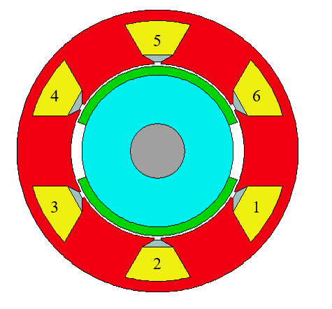

3. 绘制槽电动势星形图并划分相带：

   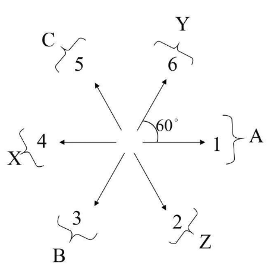

4. 构成线圈：将相位差 180° 电角度的两个槽内导体反向串联起来合成的基波电动势最大。

   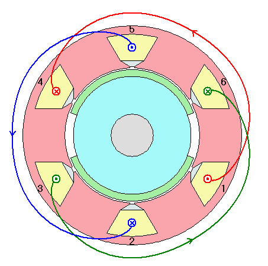

---

***[示例2] 2极12槽单层绕组***

1. 计算每极每相槽数：
   $$
   q = \frac{Q}{2pm} = \frac{12}{2\cdot3} = 2
   $$

   为整数槽绕组。

2. 绘制槽电动势星形图并划分相带：

   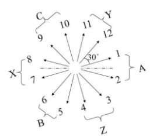

   两个相邻槽分布在一个相带里，然后将原来集中在一个槽里的导体分散布置在两个槽里，这样把所有的导体串联起来，产生的合成感应电势的相位仍然会与原来集中在一个槽里时的合成电势相位完全一致。

3. 构成线圈：

   - 叠绕组：两个单线圈的节距相等，两线圈的端部一个叠在另一个上面。

     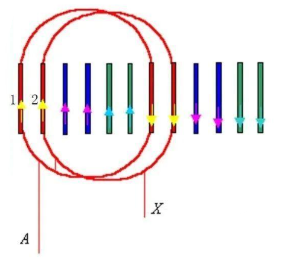

   - 同心式绕组：其特点是两个单线圈的节距不同，2-7 的线圈是一个短距线圈，1-8的线圈是一个长距线圈，二者组成了一个像同心圆一样的形状，因此称其为同心绕组。

     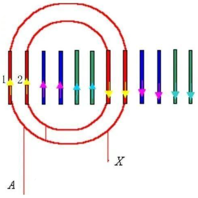

   - 链式绕组：两个单线圈的节距相同，2-7的线圈是一个短距线圈，1-8的线圈同样是一个短距线圈，只不过其端部的跨接与2-7线圈相反。

     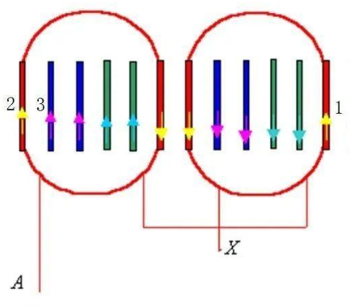

4. 构成极相组

   叠绕组的两个单线圈中电势存在相位差，二者不能并联，必须串联，因此这种接法每相只能构成一个极相组；

   同心式绕组的两个单线圈虽然电势相位相同，大小也相同，但由于两个线圈的端部跨距不同，导致两个线圈的直流电阻和端部漏抗就不同，它们之间也只能串联不能并联，因此这种接法也只能构成一个极相组；

   链式绕组的两个单线圈一模一样，两个线圈电势大小相等、相位相同，直流电阻和电抗也相同，它们之间即可以串联也可以并联，因此这种接法就可以构成两个极相组。

---

***[示例3] 4极24槽单层绕组***

1. 计算每极每相槽数：
   $$
   q = \frac{Q}{2pm} = \frac{24}{4\cdot3} = 2
   $$

2. 绘制槽电动势星形图并划分相带：

   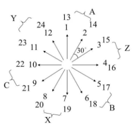

   前 12 个槽与后 12 个槽的槽电动势相位是完全重合的，因此有两个单元电机。对于多对极整数槽绕组，每对极下的槽电势都是呈周期性重复的，把一对极及其所属的槽数称为一个单元电机，有多少层重叠，就有多少个单元电机，**对整数槽电机，单元电机个数就是极对数**。

3. 构成线圈：

   - 叠绕组：

     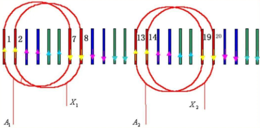

   - 同心式绕组：

     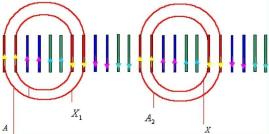

   - 链式绕组：

     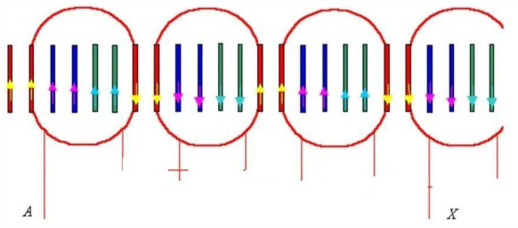

4. 构成极相组和绕组：

   对于整数槽单层绕组而言，采用叠绕组和同心式绕组接法时，每相的极相组数与极对数相等，即每相的最大极相组数是 $p$ ，最大并联支路数也为 $p$ ；采用链式接法时，每相的极相组数最多可以是$2p$ ，最大并联支路数也是 $2p$。

   > 如果 $q$ 为奇数，则构不成链式绕组，因为奇数不能平均分为两份使其端部分别向两侧连接，因此对于 $q$ 为奇数的电机，最大并联支路数只能是 $p$。
   >
   > 此时只能做交叉链式绕组，分为大圈链和小圈链。