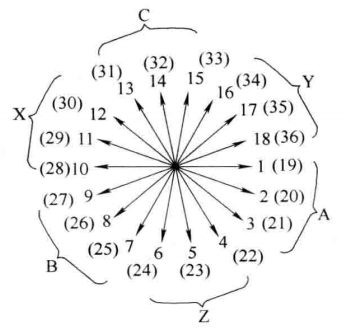
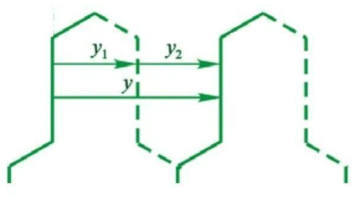

# 三相整数槽双层绕组

> 本节可参考电机学。

由于每个槽内有两层导体，一个线圈有两个线圈边，因此双层绕组的总线圈个数等于总槽数。

---

***[示例4] 4极36槽双层绕组***

1. 计算每极每相槽数
   $$
   q = \frac{Q}{2pm} = \frac{36}{4\cdot3} = 3
   $$

2. 绘制槽电动势星形图并划分相带

   

   由于是两对极整数槽绕组，因此有两个单元电机，每个单元电机有 18 个槽，共 36 槽。槽距角为 20°。

   在双层绕组中，上层线圈边的电势星形图与槽电势星形图完全相同。下层线圈边的位置取决于线圈的节距。如果将各个线圈的上层边电动势相量与下层边电动势相量相减，得到各线圈的电势相量，也构成一个电动势星形图，相邻两相量间相位差也是槽距角。所以在双层绕组里，槽电动势星形图的每一个相量既可以假定是槽内上层线圈边的电势相量，也可以看着是一个线圈的电动势相量。分析中一般视为一个线圈的电动势相量。

   对于双层绕组的相带划分就可以正负相带宽度不相等，但是正相带和负相带的平均值必须为 $\frac{180\degree}{3} = 60\degree$，最极端的方法就是 120° 正相带和 0° 负相带。但是考虑到合成电动势的幅值问题，通常还是采用 60° 的正负相带。

3. 构成线圈：

   如果把一个线圈的一个边放在某个槽的上层，另一个边就可以放在另一个槽的下层，两个边所跨越的距离叫做第一节距 $y_1$。

   按最大基波电势叠加原则，节距与极距相等时，线圈获得的基波电势最大，为此最好取 $y_1=\tau$；

   但按照非工作谐波最小原则，$y_1=\tau$ 却并不是一个最好的选择，因为这个选择获得的感应电势通常会存在很大的谐波，适当短距或长距都能够很好地削弱某些谐波，但由于长距比短距端部长，用铜量大，因此通常都采用短距，即选取 $y_1<\tau$ 且 $y_1\approx\tau$ 为宜。

4. 构成极相组：

   - 叠绕组

     **把每极下同一个相带中的三个槽内线圈依次串联**起来构成一个极相组，1# 线圈的尾端连接 2# 线圈的首端；2# 线圈的尾端连接 3# 线圈的首端，构成一个极相组。

     对于双层叠绕组，每相可以构成 $2p$ 个极相组，每个极相组的感应电势都大小相等，相位相同或相反，它们之间可以并联也可以串联。

     整数槽双层叠绕组每相可以构成 $2p$ 个极相组，因此每相最多可以构成 $2p$ 条支路，即最大并联支路数等于极数。

   - **把同一极性下的线圈分别串联**起来构成一个极相组。如果将第一个 S1 极下的 3# 线圈的上层边作为一个极相组的首端 A1，那么将 3# 线圈的尾端(10# 槽的下层边)与第二个 S2 极下的 21# 线圈首端连接起来；21# 线圈的尾端(28# 槽的下层边)与 2# 线圈首端连接起来；2# 线圈的尾端(9# 槽的下层边)与 20# 线圈首端连接起来；20# 线圈的尾端(27# 槽的下层边)与 1# 线圈首端连接起来；1# 线圈的尾端(8# 槽的下层边)与 19# 线圈首端连接起来；最后从 19# 线圈的尾端(26# 槽的下层边)引出，作为整个极相组尾端A2。

   相邻两个串联线圈，前一个线圈的尾端(下层边)到后一个线圈的首端(上层边)所跨越的距离称为第二节距 $y_2$，两个相邻的串联线圈对应边之间所跨越的距离称为合成节距 $y$。
   $$
   y = y_1 + y_2
   $$

   

   > 由于波绕组的连接规律是将同一极性下的属于同一相的各线圈按波浪形式依次串联起来组成一个极相组，也就是说两个相邻的串联线圈分别是两个不同 N 极(或 S 极)下的同相线圈，它们的对应边通常是跨越了一对极的距离(两个极距)，因此合成节距通常为 $y=2\tau = \frac{Q}{p}$。
   >
   > 每沿电枢绕行了一圈，最后一个线圈的尾端就重新回到了第一个线圈的首端槽号而形成了闭合的回路，使得极相组无法继续连接；为了能够继续串联下去，每绕行一圈，就必须人为地后退或前移一个槽才能使线圈串联得以连续下去，如果减小一个槽，就意味着每绕行一圈后退一个槽，即最后一个线圈的下层边连接第一个线圈左边的线圈的上层边，称为左行连接；如果每绕行一圈合成节距人为增大一槽就称为右行连接。由于左行连接端部较短，因此通常采用左行连接方式。
   >
   > 波绕组的最大并联支路数理论上为 2，实则不然，如果用 $y=2\tau+1$槽来连接线圈，便可得到 $2p$ 个极相组，使最大并联支路数达到 $2p$。

   叠绕组和波绕组仅仅是连接方式不同，产生的电势和磁势是完全相同的。

   叠绕组的优点是短距时端部较短，可以通过短距节省端部用铜量；缺点是嵌线时最后几个线圈嵌线比较困难，另外线圈组(极相组)之间的连线(简称极间连线)较多，当极数很多时，极间连线相当费铜。另外由于极间连线较多，也使得端部引接线排列比较杂乱。叠绕组的线圈通常是多匝线圈，主要用于中小型同步电机和异步电机的定子绕组。

   波绕组的优点是可以减少线圈组之间的连接线，另外所有绕组的引出线都可集中在一对极距范围内，这为绕组的出线设计带来了极大的方便；缺点是短距不能节省端部用铜量，波绕组的线圈通常是单匝线圈，适用于极对数很多的场合，多用于水轮发电机的定子绕组和绕线式异步电机的转子绕组，大型双馈异步风力发电机的转子绕组就常采用波绕组。