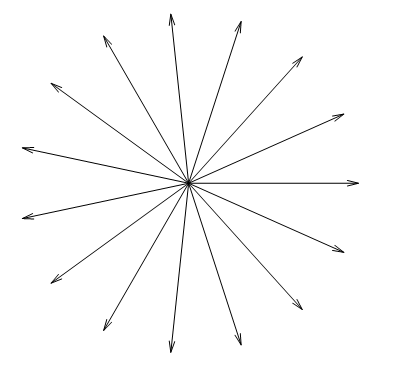
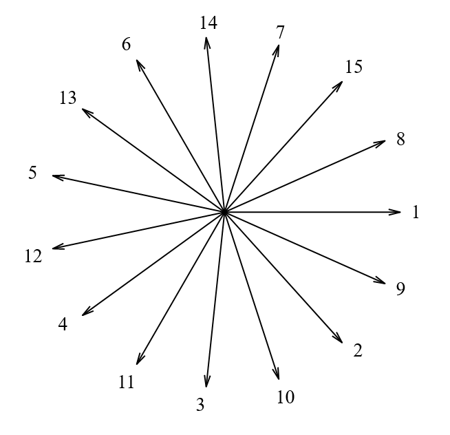

# 三相分数槽双层绕组

## 1. 分数槽绕组的槽电动势星形图和相带划分

分数槽绕组的每极每相槽数 $q$ 为分数，意味着每个极下每相的槽数不是整数，但是槽数必然是整数。$q$ 的含义是整个电机总槽数分到每极每相下的平均值，这表明每相在各个极下所占的槽数是不相等的，某些极下所占的槽数比另外某些极下所占槽数多一个(少一个)槽。
$$
q = \frac{Q}{2pm} = \frac{N}{d}
$$
$\frac{N}{d}$ 为不可约的分数，每相在一个极下平均占有 $\frac{N}{d}$ 个(分数)槽，这表明了每相在 $d$ 个极下占有 $N$ 个槽。

> 举一个例子：$Q = 30,2p=8$ 的 8 极 30 槽电机，
> $$
> q = \frac{Q}{2pm} = \frac{30}{8\cdot 3} = \frac{5}{4}
> $$
> 也就是说，每相在 4 个极下占有 5 个槽，这样只有一个极下占 2 槽，另外三个极下各占 1 个槽。

1. 单元电机

   在整数槽绕组中，每一对极下的槽数也是整数，每一对极下相应各槽在磁极下的分布都是完全一样的，即整数槽绕组各对极下的槽电势分布呈周期性变化，后一对极下的槽电势相位分布重复前一对极，各对极下的槽电势星型图相互重叠，任意一对极下的槽电势分布都能完整地代表其它各对极下的槽电势分布；

   将能够完整代表每对极下槽电势相位分布信息的最小单元称为单元电机，槽电势星型图的每一层就对应一个单元电机，有多少层重叠，就有多少个单元电机。一个单元电机的极槽配合可以完整地反映出整个电机的槽电势相位信息。

   对于分数槽绕组，并不一定是每对极下的槽分布完全一样，可能经过若干对极后，才出现槽电势相位重复的情况，由此分数槽绕组的单元电机个数可能不是极对数 $p$，而是要看槽电势星型图经过多少对极才能重叠一次。

   **分数槽绕组的单元电机数为槽数 $Q$ 和极对数 $p$ 的最大公约数 $t$**，每个单元电机的极对数 $p^, = \frac{p}{t}$，槽数 $Q^,=\frac{Q}{t}$；

   > 仍然以 8 极 30 槽电机为例，
   >
   > $p = 4$，$Q = 30$ 的最大公约数 $t = 2$，该电机有两个单元电机。

2. 槽电动势星形图 —— 以 8 极 30 槽电机为例

   每个单元电机的槽数 $Q^, = \frac{Q}{t} = 15$；一个单元电机有 15 个槽，意味着槽电势星型图上就有15根相量，首先在 360° 的范围内均匀地画出 15 根相量，但是不进行标号。

   

   相邻两个向量之间的夹角为：
   $$
   \alpha^, = \frac{360\degree}{Q^,} = \frac{360\degree}{15}=24\degree
   $$
   相邻两个槽之间的电动势相位差(槽距角)为：
   $$
   \alpha = \frac{360\degree \cdot 2}{15} = 48\degree
   $$
   由此槽电动势星形图的标号如下：

   