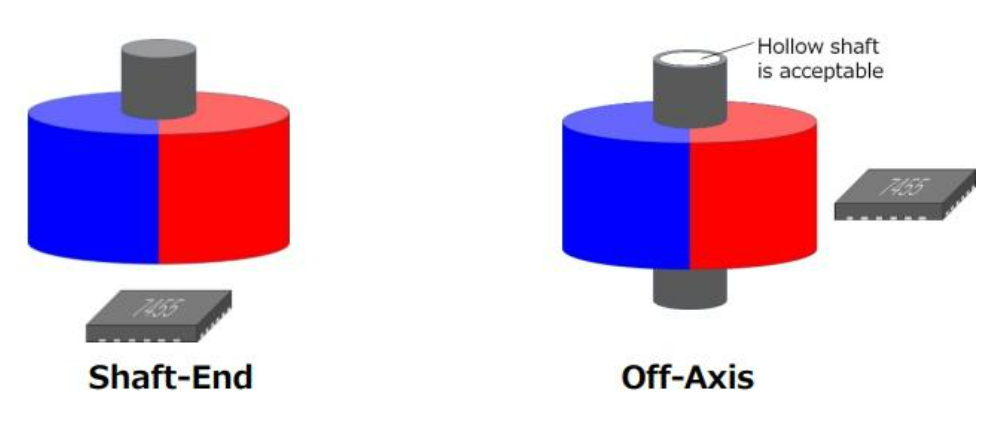
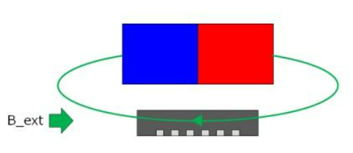
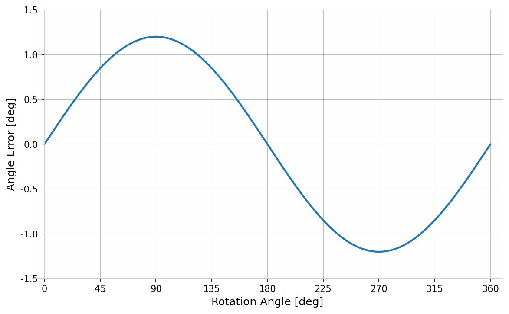
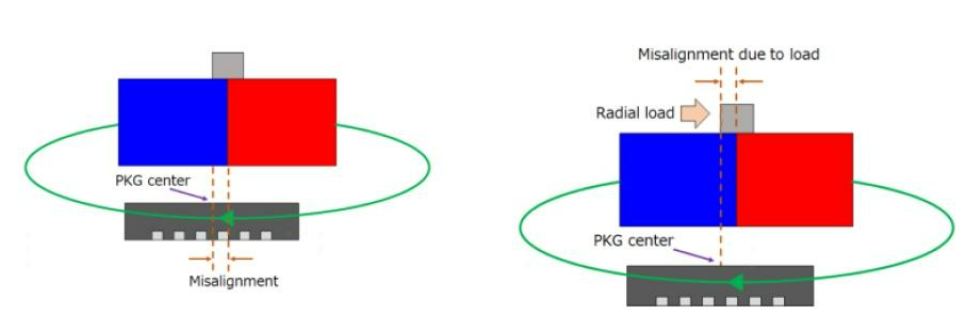
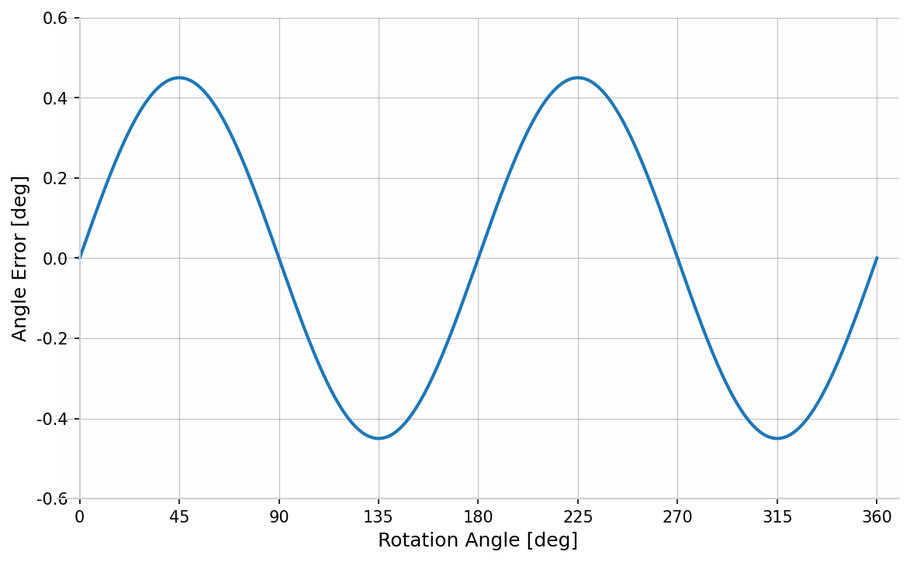
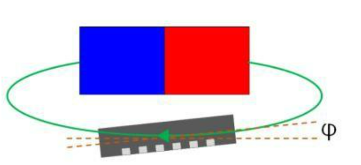
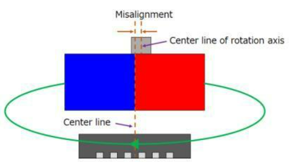
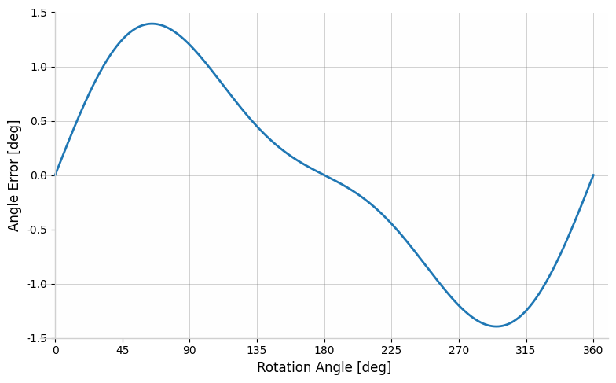

# 磁编码器误差及校正

磁编码器通过正交的磁场检测单元，输出两路正交的正弦电压信号，通过 PLL/反正切法 进行位置解算，在使用时由于外部干扰、安装公差等因素，会导致位置信号存在误差。

磁编码器的安装方式包括在轴安装和离轴安装，在轴安装是指磁铁和传感器放置在旋转轴端；离轴安装是指磁铁套在旋转轴上、传感器放置在磁铁附近。

> 离轴安装可以使结构更紧凑，并可兼容空心轴结构——空心轴结构可以允许线缆等通过马达的旋转轴，可以节省系统空间和减少与外部设备的接口。但是磁场检测单元输出的两路正弦信号往往存在幅值偏差、直流偏置、相位偏差都会造成解算角度存在误差，且离轴安装相比于在轴安装，检测的磁场强度偏差会更大，从而导致角度误差更大。

## 1. 磁编码器误差来源

- 磁场偏移干扰

  外部直流磁场会产生基波误差：$e = A\sin(\theta+\alpha)$，$A$ 取决于外部磁场强度，$\alpha$ 取决于外部磁场角度。

  

  

- 水平偏移干扰

  磁铁与编码器器之间的中心轴偏移会产生二次谐波误差：$e = C\sin(2\theta+\beta)$。$C$ 由偏移程度决定，$\beta$ 由偏移方向决定。

  

  

- 安装倾斜干扰

  磁铁/编码器安装倾斜会产生二次谐波误差：$e = D\sin(2\theta+\gamma)$。$D$ 由倾斜程度决定，$\gamma$ 由倾斜方向决定。

  

  

- 磁铁偏心干扰

  磁铁安装偏心会产生一次和二次谐波误差：$e = E\sin(\theta+\sigma)+F\sin(2\theta+\epsilon)$。$E$，$F$ 由偏心量决定，$\sigma$，$\epsilon$ 由偏心方向决定。

  

  

## 2. 磁编码器校正

1. 谐波补偿

   角度误差包含谐波分量 $e = \sum_{i=1}^n(A_i\sin(i\theta+\alpha_i)+B_i\cos(i\theta+\beta_i))$。

   通常情况下，只需要考虑四阶以内的低次谐波，同时依赖对拖电机或其他高精度传感器测量，在一个旋转周期内采集多个参考角度，并与原始解算角度作差得到角度误差，再进行 FFT 获得低次谐波的幅值和相位，最后反向补偿谐波分量、实时校正原始解算角度。

2. 查找表

   依赖对拖电机或其他高精度传感器测量，在一个旋转周期内采集多个参考角度，并与原始解算角度作差得到角度误差表，形成误差补偿查找表，运行时基于生成的查找表进行插值计算。

   也可以使用电压开环拖动，将电机拖到中高速运行状态（避免齿槽转矩），从而形成查找表。
