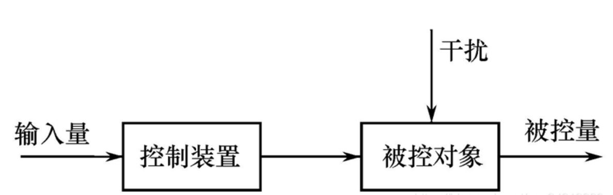
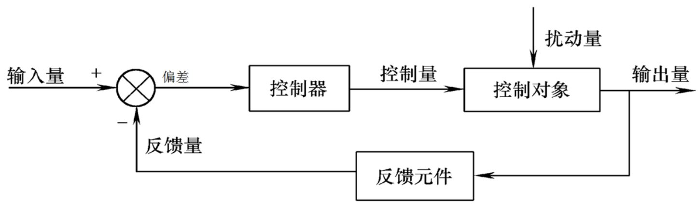
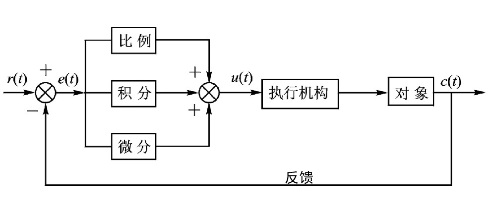
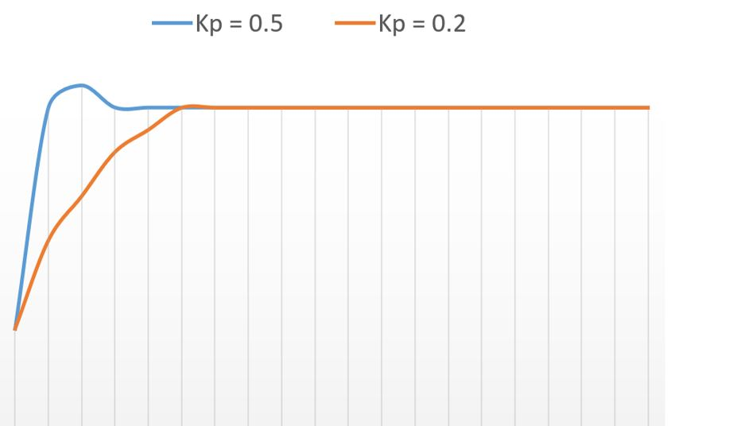
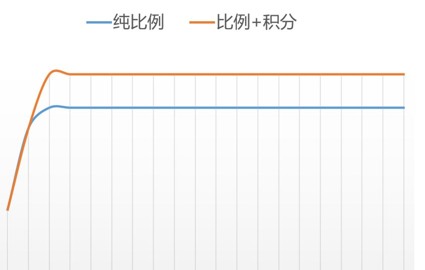
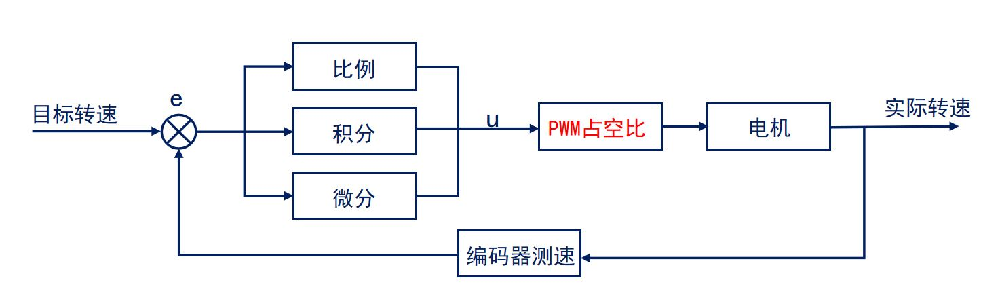

# STM32 电机驱动 1-3_直流有刷电机闭环驱动

##  1. PID控制算法

### 开环控制和闭环控制

- 开环控制：输出只受系统输入控制，没有反馈回路，控制精度和抗干扰能力差。



- 闭环控制：引入反馈回路，利用输出和输入值的偏差对系统进行控制，避免偏离预定目标。



### PID控制算法



PID 是 Proportional（比例）、Integral（积分）、Differential（微分）算法，是一种结合比例、积分和微分三个环节于一体的闭环控制算法。

#### 比例P控制

成比例地反应控制系统的偏差信号，输出$u$与输入偏差$e$成正比，可以用来减小系统的偏差。
$$
u = K_Pe
$$
$u$为输出值，$K_p$为比例系数，$e$为偏差值。

> - $K_p$越大，系统响应越快，越快达到目标值。
>
> - $K_p$过大会使系统产生较大的超调和振荡，导致系统的稳定性变差。
>
> - 仅有比例环节无法消除静态误差。



**静态误差：**系统控制过程趋于稳定时，目标值与实测值之间的偏差。

- 产生静差原因：输出$u$被外部影响抵消

#### 积分I控制

对输入偏差$e$进行积分，只要存在偏差，积分环节就会不断起作用，**主要用于消除静态误差**。
$$
u = K_pe+K_I\int_0^t e(\tau)d\tau
\\
u=K_pe+K_I\sum e
$$
$u$为输出值，$K_p$为比例系数，$K_I$为积分系数，$e$为偏差值。



> - $K_I$越大，消除静态误差的时间越短，越快达到目标值。
>
> - $K_I$过大会使系统产生较大的超调和振荡，导致系统的稳定性变差。
>
> - 对于惯性较大的系统，积分环节动态响应较差，容易产生超调、振荡。

#### 微分D控制

$$
u = K_pe+K_I\int_0^t e(\tau)d\tau+K_D\frac{de(t)}{dt}
\\
u=K_pe+K_I\sum e+K_D(e_k-e_{k-1})
$$

$u$为输出值，$K_p$为比例系数，$K_I$为积分系数，$K_D$为微分系数，$e_k$为第k次采样偏差值

> - $K_D$或者变化趋势越大，微分环节作用越强，对超调和振荡的抑制越强。
>
> - $K_D$过大会引起系统的不稳定，容易引入高频噪声。

### 离散PID算法

1. 位置式（全量式）PID

$$
u_k=K_pe_k+K_I\sum e+K_D(e_k-e_{k-1})
$$

>- $u_k$直接对应对象的输出（位置），如果计算出现异常，对系统影响很大。
>
>- 全量计算，要对偏差 e 进行累加，计算量大。
>
>- 在不带积分部件的对象中可以得到很好效果，例如电液伺服阀、温控设备等。

2. 增量式PID

$$
\Delta u = u_k-u_{k-1} = K_p(e_k-e_{k-1})+K_Ie_k+K_d(e_k-2e_{k-1}+e_{k-2})
$$
>- 增量式PID计算的是相对上一次输出的增量
>
>- 增量只与近3次的偏差有关，计算出现异常对系统工作影响较小。
>
>- 计算量少，实时性相对较好。

```c
/**
  * @brief 全量式PID算法
  * @param PID PID结构体
  * @param Feedback_Value 输入量
  * @retval 输出量
  */
int32_t PID_Cal(PID *PID,float Feedback_Value)
{
    PID->Error = (float)(PID->SetPoint - Feedback_Value);                   /* 计算偏差 */
    
    PID->SumError += PID->Error;
    PID->ActualValue = (PID->Proportion * PID->Error)                       /* 比例环节 */
                       + (PID->Integral * PID->SumError)                    /* 积分环节 */
                       + (PID->Derivative * (PID->Error - PID->LastError)); /* 微分环节 */
    PID->LastError = PID->Error;
    
    return ((int32_t)(PID->ActualValue));                                   /* 返回计算后输出的数值 */
}

/**
  * @brief 增量式PID算法
  * @param PID PID结构体
  * @param Feedback_Value 输入量
  * @retval 输出量
  */
int32_t PID_Cal(PID *PID,float Feedback_Value)
{
    PID->Error = (float)(PID->SetPoint - Feedback_Value);                   /* 计算偏差 */
    
    PID->ActualValue += (PID->Proportion * (PID->Error - PID->LastError))                       /* 比例环节 */
                     + (PID->Integral * PID->Error)                                             /* 积分环节 */
                     + (PID->Derivative * (PID->Error - 2 * PID->LastError + PID->PrevError));  /* 微分环节 */
    
    PID->PrevError = PID->LastError;                                        /* 存储偏差，用于下次计算 */
    PID->LastError = PID->Error;
    
    return ((int32_t)(PID->ActualValue));                                   /* 返回计算后输出的数值 */
}
```

## 2. 电机PID的闭环控制

### 单环控制

#### 速度环



获得当前转速（中断采样方法） -> 进行PID计算 -> 输出PWM占空比

#### 位置环

通过编码器当前的计数总值来反映电机的位置。


获得当前位置（中断采样方法） -> 进行PID计算 -> 输出PWM占空比