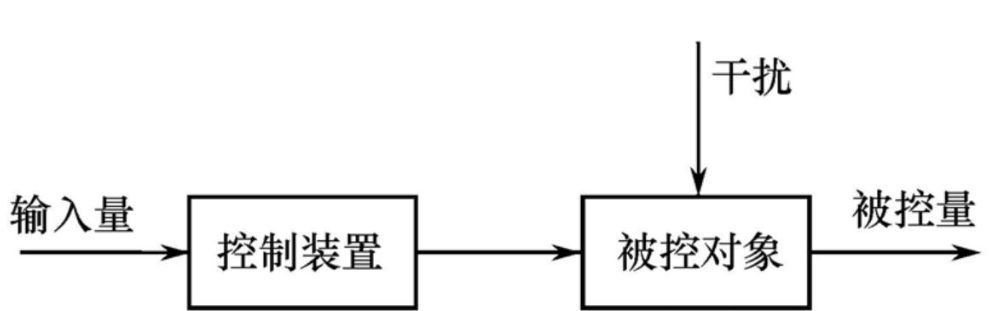
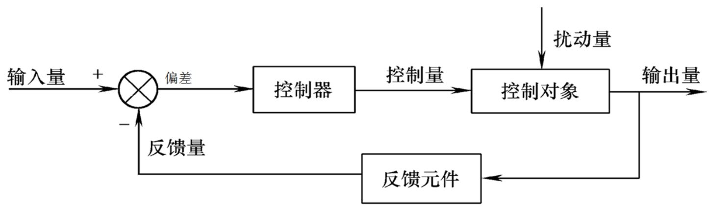
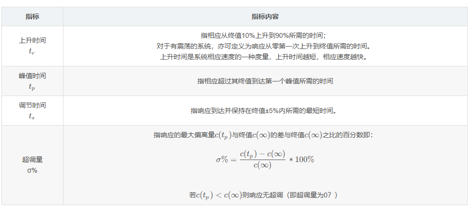
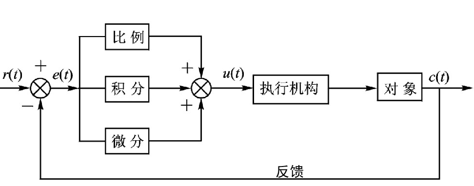
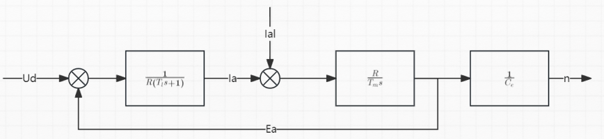
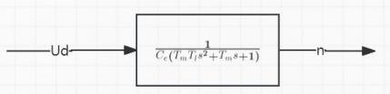
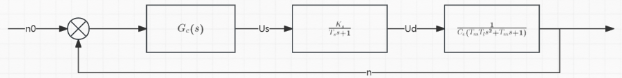
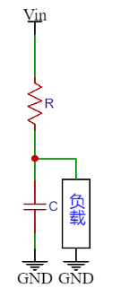

# Engine 1.3_直流电机闭环控制

## 1. PID 控制器

### 闭环反馈控制

开环控制：输出只受系统输入控制，没有反馈回路，控制精度和抗干扰能力差。


闭环控制：引入反馈回路，利用输出和输入值的偏差对系统进行控制，避免偏离预定目标。


在经典控制理论中，通常使用反馈控制进行闭环控制，即将控制对象的输出量反馈到输入端进行比较，通过误差值调节输出。

### 经典控制系统的时域指标



通常的期望指标是在系统稳定的条件下，将系统调节时间尽可能缩短，同时超调量尽可能小，在不能改变系统固有特性的时候，需要外加控制器进行调节。

PID 控制器是一种常用的控制器，它具有不依赖于系统模型的优点，所以任何系统均可以首先使用 PID 进行粗略的调节。

### 连续系统 PID 控制器

PID 即 proportional（比例），integral（积分），differential（微分）。



<font color=LightGreen>1. 比例控制</font>

成比例的反映控制系统的偏差信号，控制器输出$u$与输入偏差$e$成正比，可以用来减小系统的偏差。 

$$
u = K_Pe
$$
$u$为控制器输出值，$K_p$为比例系数，$e$为偏差值。

> - $K_P$越大，系统响应越快，越快达到目标值。
> -  $K_P$过大会使系统产生较大的超调和振荡，导致系统的稳定性变差。
> - 仅有比例环节无法消除静态误差。

**稳态误差：**系统控制过程趋于稳定时，目标值与实测值之间的偏差。产生原因是系统输出被外界影响抵消一部分。

> 实际上，比例控制无法提高系统型别，对于 0 型系统（对于阶跃信号存在误差），比例控制并不能够消除阶跃信号的稳态误差。

<font color=LightGreen>2. 积分控制</font>

对输入偏差$e$进行积分，只要存在偏差，积分环节就会不断起作用，**主要用于消除静态误差**。 
$$
u = K_Pe+K_I\int_0^t e(\tau)d\tau
$$
$u$为控制器输出值，$K_P$为比例系数，$K_I$为积分系数，$e$为偏差值。

> - $K_I$越大，消除静态误差的时间越短，越快达到目标值。
> - $K_I$过大会使系统产生较大的超调和振荡，导致系统的稳定性变差。
> - 对于惯性较大的系统，积分环节动态响应较差，容易产生超调、振荡甚至不稳定。

<font color=LightGreen>3. 微分控制</font>

对输入偏差$e$进行微分，检测偏差的变化率。

$$
u = K_pe+K_I\int_0^t e(\tau)d\tau+K_D\frac{de(t)}{dt}
$$

$u$为控制器输出值，$K_p$为比例系数，$K_I$为积分系数，$K_D$为微分系数，$e_k$为第k次采样偏差值

> - $K_D$或者偏差变化趋势越大，微分环节作用越强，对超调和振荡的抑制越强。
>
> - $K_D$对于系统噪声十分敏感，$K_D$过大会引起系统的不稳定，容易引入高频噪声。


### 离散系统 PID 控制器

使用单片机控制时，由于单片机为数字系统，输出是离散的时间序列，所以需要将连续 PID 控制器离散化。

<font color=LightGreen>1. 位置式（全量式）PID</font>

将连续系统 PID 控制器离散化，使用后向差分。
$$
u(n) = K_P e(n) + K_I \sum_{i=0}^ne(i)+K_D(e(n)-e(n-1))
$$

```c
/**
  * @brief 全量式PID算法
  * @param PID PID结构体
  * @param Feedback_Value 输入量
  * @retval 输出量
  */
int32_t PID_Cal(PID *PID,float Feedback_Value)
{
    PID->Error = (float)(PID->SetPoint - Feedback_Value);                   /* 计算偏差 */
    
    PID->SumError += PID->Error;
    PID->ActualValue = (PID->Proportion * PID->Error)                       /* 比例环节 */
                       + (PID->Integral * PID->SumError)                    /* 积分环节 */
                       + (PID->Derivative * (PID->Error - PID->LastError)); /* 微分环节 */
    PID->LastError = PID->Error;
    
    return ((int32_t)(PID->ActualValue));                                   /* 返回计算后输出的数值 */
}
```

位置式PID控制存在积分累加环节，计算量相对较大。

<font color=LightGreen>2. 增量式 PID</font>
$$
u(n-1) = K_P e(n-1) + K_I \sum_{i=0}^{n-1}e(i)+K_D(e(n-1)-e(n-2)) 
\\
\Delta u(n) = u(n) - u(n-1) = K_P(e(n)-e(n-1)) + K_I e(n) + K_D(e(n)-2e(n-1)+e(n-2))
$$
增量式PID控制只与最近的三次采样的误差有关，计算复杂度降低。

```c
/**
  * @brief 增量式PID算法
  * @param PID PID结构体
  * @param Feedback_Value 输入量
  * @retval 输出量
  */
int32_t PID_Cal(PID *PID,float Feedback_Value)
{
    PID->Error = (float)(PID->SetPoint - Feedback_Value);                   /* 计算偏差 */
    
    PID->ActualValue += (PID->Proportion * (PID->Error - PID->LastError))                       /* 比例环节 */
                     + (PID->Integral * PID->Error)                                             /* 积分环节 */
                     + (PID->Derivative * (PID->Error - 2 * PID->LastError + PID->PrevError));  /* 微分环节 */
    
    PID->PrevError = PID->LastError;                                        /* 存储偏差，用于下次计算 */
    PID->LastError = PID->Error;
    
    return ((int32_t)(PID->ActualValue));                                   /* 返回计算后输出的数值 */
}
```

<font color=Yellow>注意：</font>离散PID系统存在控制频率要求，实际使用时需要在硬件定时器中使用，周期越小，要求系统抗噪声能力较强，同时参数值较小。

### 直流电机的系统模型

<font color=LightGreen>1. PWM 系统模型</font>

PWM变换器可以视为系统中的一个环节，电枢电压和控制电压呈线性关系，但是由于电枢电压是均值等效的，所以电枢电压的响应存在延迟，PWM变换器可以视为存在延迟的比例环节。

通常取 $T_s$ 为 PWM 变换器周期 $T$，由于 $T$ 很大，实际考虑时采用一个惯性环节近似：
$$
G(s) = K_se^{-T_ss} \approx \frac{K_s}{T_ss+1}
$$
<font color=LightGreen>2. 直流电机系统模型</font>

首先做出以下假设：

（1）电机的励磁电流恒定的，故反电动势和转速成正比，力矩和电枢回路的电流呈正比，此时可以将磁通量计算到 $C_e$ 和 $C_m$ 中；
（2）忽略气隙等非线性因素，假设系统是线性的。

电枢回路的电势平衡方程：
$$
L_a\frac{di_a}{dt} + i_aR_a + E_a = U_d 
$$
( 电机学教材中忽略了电枢回路的电感，通常需要考虑电枢回路由于绕组存在的电感和附加的电感 )

电机轴的动力学方程：
$$
T_e - T_L = J\frac{dn}{dt}
$$
定义电机的电枢回路电磁时间常数：
$$
T_l = \frac{L_a}{R_a}
$$
定义电机的电力拖动系统机电时间常数：
$$
T_m = \frac{JR_a}{C_eC_m}
$$
做 Laplace 变换得到系统结构框图如下：



通常将负载电流视为扰动项，故变换为以下框图：



转速环系统框图如下：



未加入控制器前，系统为三阶系统，且不存在微分环节。系统是 0 型系统，所以使用 PID 控制器进行控制。（实际使用时使用 PD 控制器可以达到较好效果）

## 2. 数字滤波器

### 数字一阶低通滤波器

一阶低通滤波器的物理模型来源于一阶RC滤波器，其输出信号与电容的容抗和电阻的阻抗形成的电路网络有关，此电路网络是由电阻分压网络衍生而来。



RC滤波器对于频率为$\omega$的输入，输出结果为：
$$
U_o = U_i \frac{\frac{1}{\omega C}}{\sqrt{(\frac{1}{\omega C})^2+R^2}}
$$
可以看到，一阶低通滤波器对于高频信号的输出较小，对于低频信号的输出较大，滤除了高频噪声。

对一阶低通滤波器进行 Laplace 变换得到传递函数：
$$
G(s) = \frac{1}{1+Ts}
$$
在离散系统中，使用后向差分的 z 变换：
$$
s = \frac{1-z^{-1}}{T}
$$
得到：
$$
Y(z) = X(z) \frac{1}{1+\frac{RC}{T}}+Y(z)z^{-1}\frac{\frac{RC}{T}}{1+\frac{RC}{T}} 
\\
Y(n) = Y(n-1) + (X(n) - Y(n-1))\frac{T}{T+RC}
$$
令时间常数 $T$ 趋近于 0：
$$
Y(n) = (1-2\pi fT)Y(n-1) + (2\pi fT)X(n)
$$
即可得到数字一阶低通滤波器。

```c
#define LOW_PASS_FILTERING_ALPHA 0.4f //1~0

typedef struct {
    float value_current;
    float value_last;
} FOLPF_DATATypeDef;

void FLOAT_FirstOrderLowPassFiltering_Process(FOLPF_DATATypeDef *data_pointer){
    // caculate
    data_pointer->value_current=((1-LOW_PASS_FILTERING_ALPHA)*data_pointer->value_last)
                                +(LOW_PASS_FILTERING_ALPHA *data_pointer->value_current);
    // update
    data_pointer->value_last=data_pointer->value_current;
}
```

<font color=Yellow>注意：</font>对速度采样应当使用定时器，如果存在通信，可以单独使用线程首先获取一个全局变量，随后在定时器中断中定时获取全局变量进行采样。速度信号是低频信号，应当使用一阶低通滤波器进行去噪。

