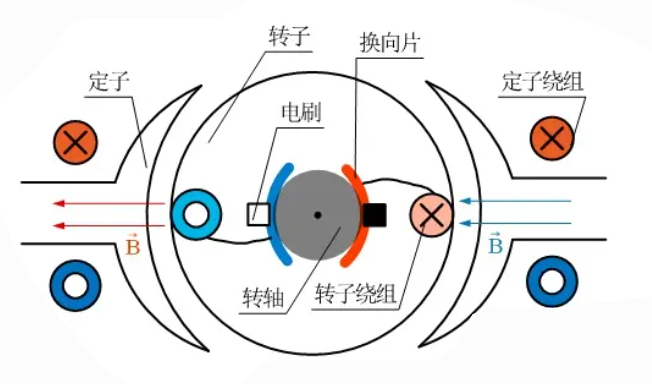
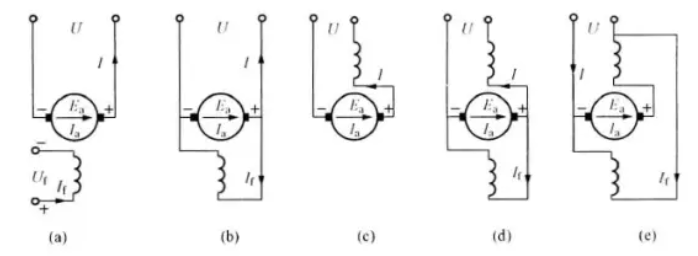
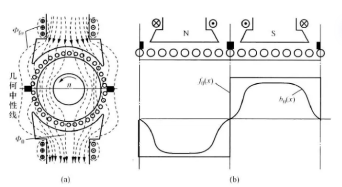
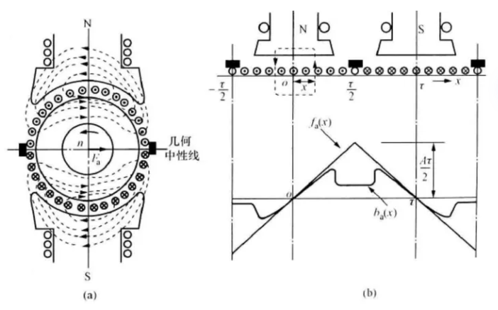
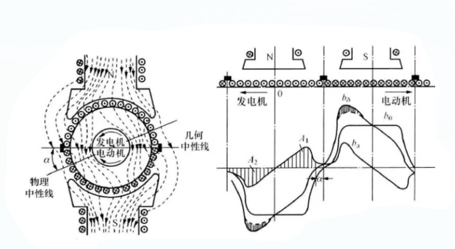
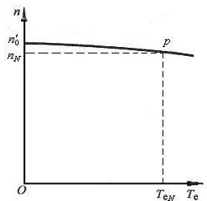
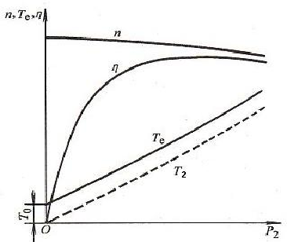
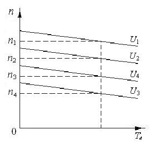
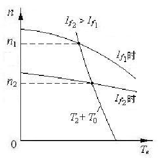
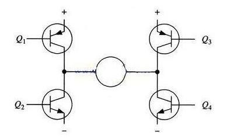

# Engine 1.1_直流电机基本原理

[直流电机原理介绍][https://www.bilibili.com/video/BV1cx411Z76w/?spm_id_from=333.337.search-card.all.click]

## 1. 直流电机的运行原理

### 直流电机的结构和运行原理

直流电机的定子是电刷，转子是电枢和换向器，电枢绕组缠绕在电枢铁芯表面，构成线圈。

> C和D两片半圆周的铜片构成换向器，两个弹性铜片靠在换向器两侧的A和B是电刷，电源通过电刷向导线框供电， 线框中就有电流通过，在线框两侧放一对磁极N和S，形成磁场，磁力线由N到S。
>
> 线框通有电流时， 两侧导线就会受到磁场的作用力，方向依左手定则判断，红色和蓝色线框部分分别会受到力$F_1$和$F_2$， 这两个力的方向相反，这使得线框会转动。
>
> 当线框转过90°时，换向器改变了线框电流的方向，产生的安培力方向不变， 于是导线框会连续旋转下去，这就是直流电动机的工作原理。

## 2. 直流电机的磁场

构成主磁极可以使用永磁体和励磁绕组，使用励磁绕组的方式分别为他励，串励，并励，复励。

构成电机的磁场由两部分构成：励磁磁场和电枢磁场，电枢磁场对电机磁场的影响称为电枢反应。

> - 励磁磁场
>
> 
>
> - 电枢磁场
>
> 
>
> - 电枢反应后的磁场
>
> 

## 3. 直流电动机的运行特性

### 直流电机的运行方程

#### 电压方程

导体棒在气隙磁场中旋转，切割磁感线残生感应电动势，每根导体棒的感应电动势为 
$$
e = B_{\delta}lv
$$
$B_{\delta}$为电枢反应气隙磁密。

总的反电动势：
$$
E_a = C_en\Phi \tag{1}
$$
$C_e$为电动势常数，$n = \frac{60\omega}{2\pi}$为转速，$\Phi$为总磁通量。

在回路中，电路方程(他励)为：
$$
E_a + I_aR_a = U \tag{2}
$$
由上述两式可以得到，控制电压和控制磁通量可以控制转速，**通常通过控制电压从而控制转速**。由于转速的积分可以得到位置(角度)，**控制电压也可以控制位置**。

#### 力矩方程

电枢表面任一根导体因为有电流流过，在气隙磁场中收到安培力，由此可得电磁转矩表达式：
$$
T_e = C_T\Phi I_a
$$
$C_T$为转矩常数。由上式可知，**控制电流可以控制电机力矩**。

#### 机械特性

永磁直流电动机的机械特性较硬，带载时的转速下降较慢。

#### 工作特性

电流对转速的影响较小，对转矩的影响较大。

### 直流电机的调速方式

$$
n = \frac{U-I_a(R_a+R_\Omega)}{C_e\Phi}
$$

- 调压调速：调节电枢电压，转速只能从额定电压对应的转速往下调，不能比额定转速高，负载转矩不变时，随着转速改变，电枢电流不变，适宜带恒转矩负载。（最常用的方式）

  
  
- 弱磁调速：对于永磁电机无效，因为无法调节励磁，不宜带恒转矩负载，弱磁调控时转矩应下降，宜带恒功率负载。

  

- 电枢串电阻调速：很不常用。

## 4. 直流电机的控制电路

通常采用调压调速的方式进行直流电机的控制，考虑到电源通常为 DC 电源，直流电机的电枢电压是 DC 电压，使用 DC-DC 电路可以控制直流电机。

### PWM 调制

脉冲宽度调制（Pulse width modulation，PWM）信号，按一定的规则对脉冲的宽度进行调制， 既可改变电路输出电压的大小，也可改变输出频率。PWM通过一定的频率下改变通电和断电的时间从而控制输出脉冲的占空比，从而实现模拟量的输出。

$T_1$为高电平时间，$T_2$为低电平时间，$T$为PWM周期。

占空比公式：
$$
\eta = \frac{T_1}{T} \times 100%
$$
在低频条件下，可以看到明显的高低电平变化；

通常为实现模拟量输出，使用高频PWM信号，使得在宏观时间内高频率的高低电平变化等效为一个介于0到最大电压之间的值（有效值），此时等效输出电压： $$ V = \eta V_{max} $$ 。

对于直流有刷电机而言，电压和转速成正比，故对应的： $$ v = \eta v_{max} $$。

### H桥控制电路

使用DC-DC电路对直流电机进行控制。为了实现直流电机的正/反向加速/制动，采用四象限Buck电路，即H桥电路。

> 当Q1和Q4导通时，电流将经过Q1从左往右流过电机， 再经过Q4流到电源负极，电机可以顺时针转动。
>
> 当Q3和Q2导通时，电流将经过Q3从右往左流过电机， 再经过Q2流到电源负极，电机可以逆时针转动。
>
> 特别地，当同一侧的Q1和Q2同时导通时，电流将从电源先后经过Q1和Q2，然后直接流到电源负极， 在这个回路中除了三极管以外就没有其他负载（没有经过电机），这时电流可能会达到最大值，此时可能会烧毁三极管。

改进后加入逻辑控制，避免同相导通。

> 新增加了两个非门和4个与门， 经过这样的组合就可以实现一个信号控制两个同一侧的三极管， 并且可以保证在同一侧中两个三级管不会同时导通在同一时刻只会有一个三极管是导通的。

### 驱动芯片

L298N是ST公司的产品，内部包含4通道逻辑驱动电路，是一种二相和四相电机的专门驱动芯片， 即内含两个H桥的高电压大电流双桥式驱动器，接收标准的TTL逻辑电平信号，可驱动4.5 V~46 V、 2A以下的电机，电流峰值输出可达3A。

| IN1  | IN2  | ENA  | 电机状态 |
| ---- | ---- | ---- | -------- |
| ×    | ×    | 0    | 电机停止 |
| 1    | 0    | 1    | 电机正转 |
| 0    | 1    | 1    | 电机反转 |
| 0    | 0    | 1    | 电机停止 |
| 1    | 1    | 1    | 电机停止 |

相比之下，TB6612芯片比L298N更加实用，可以自行查找TB6612的Data Sheet进行设计。