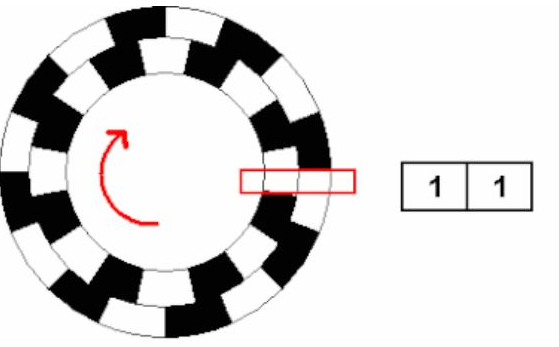
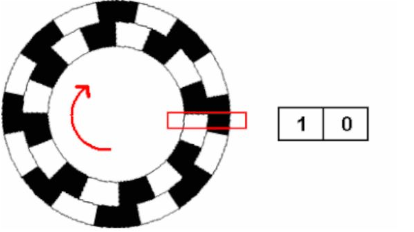
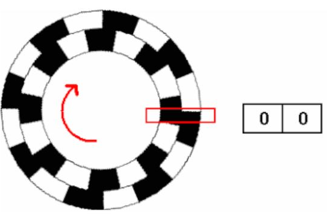
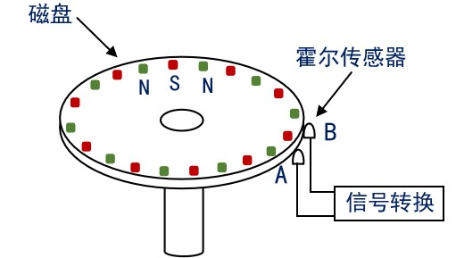
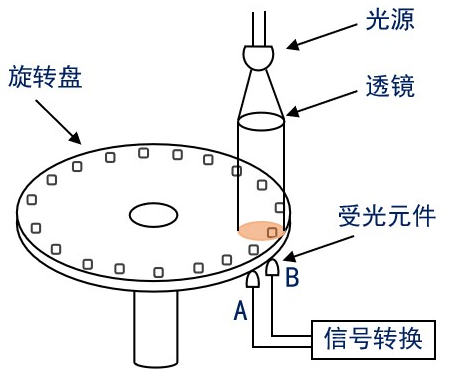
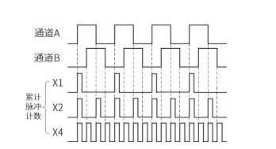

# Engine 1.2_编码器

编码器是一种用来测量机械旋转或位移的传感器。这种传感器能够测量机械部件在旋转或直线运动时的位移位置或速度等信息，并将其转换成一系列电信号。

编码器可以根据不同的方式分出很多种类型。例如根据检测原理，可分为**光学式、磁式、感应式和电容式**。根据内部机械结构的运动方式，可分为**线性编码器和旋转编码器**。根据其刻度实现方法及信号输出形式，又可分为**增量式、绝对式以及混合式**三种。

## 1. 编码器的基本原理

### 增量式编码器和绝对式编码器

#### 增量式编码器

增量式旋转编码器是将设备运动时的**位移信息变成连续的脉冲信号**，**脉冲个数表示位移量的大小**。只有当设备运动的时候增量式编码器才会输出信号。编码器一般会把这些信号分为通道 A和通道 B 两组输出，并且这两组信号间有 90° 的相位差。同时采集这两组信号就可以知道设备的运动和方向。除了通道 A、通道 B 以外，很多增量式编码器还会设置一个额外的通道 Z 输出信号，用来表示编码器特定的参考位置，传感器转一圈 Z 轴信号才会输出一个脉冲。**增量式编码器只输出设备的位置变化和运动方向，不会输出设备的绝对位置**。

增量式编码器的码盘上有两圈线槽，两圈线槽的之间会错开一定的角度，这个角度会使得光电检测装置输出的两相信号相差 1/4 周期 (90°)。

码盘的具体工作方式如下图所示。黑色代表透光，白色代表遮光。当码盘转动时，内圈和外圈的线槽会依次透过光线，光电检测装置检测到光线通断的变化，就会相应的输出脉冲信号，因为内外圈遮光和透光时候存在时间差，所以也就有了 A、B 两通道信号的相位差。







根据两相信号变化的先后顺序就可以判断运动方向，记录输出的脉冲个数可以知道位移量的大小，同时通过输出信号的频率就能得到速度。

一些增量式编码器上会有 4 圈线槽，分别对应 A、B、-A、-B 四相信号，相邻两相信号间也是差1/4 周期，只不过这种编码器会把-A 和-B 两相信号反相，然后叠加到 A、通道 B，用来增强信号。除了通道 A、通道 B 以外，很多增量式编码器还会设置一个额外的通道 Z 输出信号。通道 Z 信号也在码盘上有对应的线槽，不过只有一条，码盘转一圈才会经过一次。通道 Z 信号一般用做参考零位，指示设备位置或者清除积累量。

> 另一种较为常用的增量式编码器是霍尔编码器。霍尔增量式编码器在结构上和光电式几乎相同，只不过检测原理变成了霍尔效应。内部元件也稍有不同，霍尔编码器的码盘上不是线槽，而是不同的磁极，或者有些直接把电机的旋转磁场当作码盘，然后检测装置换成了霍尔传感器。输出和光电式相同，仍然是相位差 1/4 周期的 A、B 两通道信号。

增量式编码器计数起点任意设定，可实现多圈无限累加和测量。需要提高分辨率时，可触发 A、B 两通道信号的上升沿和下降沿对原脉冲数进行倍频。但是当接收设备停机重启后，增量式编码器需要重新寻找参考零点。

#### 绝对式编码器

绝对式旋转编码器是将设备运动时的位移信息通过二进制编码的方式变成数字量直接输出。这种编码器与增量式编码器的区别主要在内部的码盘。绝对式编码器的码盘**利用若干透光和不透光的线槽组成一套二进制编码，这些二进制码与编码器转轴的每一个不同角度是唯一对应的，读取这些二进制码就能知道设备的绝对位置**，所以叫它绝对式编码器。绝对式编码器一般常用自然二进制、格雷码或者 BCD 码等编码方式。

绝对式编码器的码盘上有很多圈线槽，被称为码道，每一条码道内部线槽数量和长度都不同。它们共同组成一套二进制编码，一条码道对应二进制数的其中一个位，通常是码盘最外侧的码道表示最低位，最内侧的码道表示最高位。码道的数量决定了二进制编码的位数，一个绝对式编码器有 N 条码道，它就能输出 N 位二进制数，且输出二进制数的总个数是 $2^N$ 个。这些二进制数与转轴的机械位置是固定的，和编码器外部因素无关，所以叫做绝对式编码器。在接收设备断电重启后绝对式编码器无需寻找参考零点。

白色块透光表示 0，黑色块不透光表示 1。码盘上的二进制数逆时针依次增大。


码盘有 3 条码道，一共可表示 23=8 个二进制数，所以整个码盘被分成了 8 个扇区，每个扇区表示一个 3 位二进制数，每个二进制数对应一个转轴的位置信息。码盘采用自然二进制编码，自然二进制编码的优点是很方便直观，但是受编码器制造和安装精度的影响，实际应用中二进制数的每一位不可能同时改变，或者出现码盘停在两个扇区中间，这些情况都很容易造成读数错误。

> 为了避免出现读数错误，可以使用格雷码来解决，白色块透光表示 0，黑色块不透光表示 1。码盘上的二进制数逆时针依次增大。
>
> 

绝对式编码器还分为单圈绝对式编码器和多圈绝对式编码器，上面举的两个例子都是针对单圈也就是 360° 以内的情况，当码盘转动超过 360°，输出的编码会重复，这样不符合绝对式编码器数据唯一的要求，所以就出现了多圈绝对式编码器。多圈绝对式编码器的量程可以超过 360°，并且通常超出很多，其内部结构也比单圈的复杂.

### 霍尔编码器和光电编码器

1. 霍尔编码器



2. 光电编码器



旋转编码器内部大都由码盘、光电检测装置和信号处理电路等部分构成。码盘上刻了若干圈线槽，线槽等距并且可透光，当码盘旋转时就会周期性的透过和遮挡来自光电检测装置的光线，这样检测装置就会周期性的生成若干电信号。但是这些电信号通常比较微弱，需要加入一套处理电路对信号进行放大和整形，最后把信号整形为脉冲信号并向外输出。

### 编码器基本参数

1. 分辨率：指编码器能够分辨的最小单位。对于增量式编码器，其分辨率表示为编码器转轴旋转一圈所产生的脉冲数，即脉冲数/转 (Pulse Per Revolution 或 PPR)。码盘上透光线槽的数目其实就等于分辨率，也叫多少线，较为常见的有 5-6000 线。对于绝对式编码器，内部码盘所用的位数就是它的分辨率，单位是位 (bit)，具体还分单圈分辨率和多圈分辨率。
2. 精度：精度是指编码器每个读数与转轴实际位置间的最大误差，通常用角度、角分或角秒来表示。例如有些绝对式编码器参数表里会写 ±20′′，这个就表示编码器输出的读数与转轴实际位置之间存在正负 20 角秒的误差，精度由码盘刻线加工精度、转轴同心度、材料的温度特性、电路的响应时间等各方面因素共同决定。
3. 最大响应频率：指编码器每秒输出的脉冲数，单位是 Hz。计算公式： $$ 最大响应频率 = 分辨 率 * 轴转速/60 $$
4. 信号输出形式：对于增量式编码器，每个通道的信号独立输出，输出电路形式通常有集电极开路输出、推挽输出、差分输出等。对于绝对式编码器，由于是直接输出几十位的二进制数，为了确保传输速率和信号质量，一般采用串行输出或总线型输出，例如同步串行接口 (SSI)、RS485、CANopen 或 EtherCAT 等，也有一部分是并行输出，输出电路形式与增量式编码器相同。

> **倍频方式**: 增量式编码器输出的脉冲波形信号形式常见的有两种：
> 
> 1. 一种是占空比 50% 的方波，通道 A 和 B 相位差为 90°；
> 2. 另一种则是正弦波这类模拟信号，通道 A 和 B 相位差同样为 90°。
> 
> 对于第 1 种形式的方波信号，如果把两个通道组合起来看的话，可以发现A和B各自的上升沿和降沿都能计数，至少在1/2个原始方波周期内就可以计数一次，最多 1/4 个原始方波周期。这样计数频率就是原始方波信号的2倍或4倍，换句话说就是，将编码器的分辨率提高了2到4倍。
> 
> 

### 编码器测速原理

- M法：频率测量法

一个固定的定时时间内（以秒为单位），统计这段时间的编码器脉冲数，计算速度值。设编码器单圈总脉冲数为 C，在时间 $T_0$ 内，统计到的编码器脉冲数为 $M_0$。

则转速为： $$ n = \frac{M_0}{CT_0} $$ 编码器单圈总脉冲数 C 是常数，所以转速n跟$M_0$成正比。这就使得在高速测量时$M_0$变大，可以获得较好的测量精度和平稳性，但是如果速度很低，低到每个 $T_0 $内只有少数几个脉冲，此时算出的速度误差就会比较大，并且很不稳定。也有一些方法可以改善 M 法在低速测量的准确性，上一节提到的增量式编码器倍频技术就是其中一种，比如原本捕获到的脉冲$M_0$只有4个，经过4倍频后，相同电机状态$M_0$变成了16个也就提升了低速下的测量精度。

- T法：周期测量法

建立一个已知频率的高频脉冲并对其计数，计数时间由捕获到的编码器相邻两个脉冲的间隔时间$T_E$决定，计数值为$M_1$。设编码器单圈总脉冲数为 C，高频脉冲的频率为$F_0$，则转速 n 的计算公式为： $$ n=\frac{1}{CT_E}=\frac{F_0}{CM_1} $$ 公式中的编码器单圈总脉冲数 C 和高频脉冲频率$F_0$是常数，所以转速 n 跟$M_1$成反比。在电机高转速的时候，编码器脉冲间隔时间$T_E$很小，使得测量周期内的高频脉冲计数值$M_1$也变得很少，导致测量误差变大，而在低转速时$T_E$足够大，测量周期内的$M_1$也足够多，所以 T 法和 M 法刚好相反，更适合测量低速。

- MT法：

既测量编码器脉冲数又测量一定时间内的高频脉冲数。在一个相对固定的时间内，计数编码器脉冲数$M_0$，并计数一个已知频率为$F_0$的高频脉冲，计数值为$M_1$，计算速度值。设编码器单圈总脉冲数为 C，则转速 n 的计算公式为： $$ n=\frac{F_0M_0}{CM_1} $$ 由于 M/T 法公式中的 $F_0$ 和 $C$ 是常数，所以转速 $n$ 就只受$M_0$和$M_1$的影响。电机高速时，$M_0$增大，$M_1$ 减小，相当于M法，低速时，$M_1$增大，$M_0$减小，相当于 T 法。

## 2. STM32 的编码器模式

```c
/**
  * @brief 编码器启动函数
  * @param htim 定时器句柄
  * @param Channel 定时器通道
  */
HAL_StatusTypeDef HAL_TIM_Encoder_Start(TIM_HandleTypeDef *htim, uint32_t Channel);

/**
  * @brief 编码器关闭函数
  * @param htim 定时器句柄
  * @param Channel 定时器通道
  */
HAL_StatusTypeDef HAL_TIM_Encoder_Stop(TIM_HandleTypeDef *htim, uint32_t Channel);

/**
  * @brief 编码器启动函数（中断模式）
  * @param htim 定时器句柄
  * @param Channel 定时器通道
  */
HAL_StatusTypeDef HAL_TIM_Encoder_Start_IT(TIM_HandleTypeDef *htim, uint32_t Channel);

/**
  * @brief 编码器关闭函数（中断模式）
  * @param htim 定时器句柄
  * @param Channel 定时器通道
  */
HAL_StatusTypeDef HAL_TIM_Encoder_Stop_IT(TIM_HandleTypeDef *htim, uint32_t Channel);

/**
  * @brief 读取编码器值函数
  * @param __HANDLE__ 编码器读取函数
  */
__HAL_TIM_GET_COUNTER( __HANDLE__);

/**
  * @brief 读取编码器方向函数(是否向下计数)
  * @param __HANDLE__ 编码器读取函数
  * @retval 0：向上计数 1：向下计数
  */
__HAL_TIM_IS_TIM_COUNTING_DOWN( __HANDLE__);
```
