# STM32 电机驱动 2-2_步进电机加减速算法

## 1. 梯形加减速

### 梯形加减速简介

硬件驱动细分器与软件的细分参数或定时器分频参数设置不当时启动电机时， 会遇见步进电机有啸叫声但是不会转动，这是因为软件产生脉冲的频率大于步进电机的启动频率，步进电机有一个很重要的技术参数： 空载启动频率，也就是在没有负载的情况下能够正常启动的最大脉冲频率，如果脉冲频率大于该值，步进电机则不能够正常启动， 发生丢步或者堵转的情况；也可以理解为由于步进脉冲变化过快，转子由于惯性的作用跟不上电信号的变化。所以要使用加减速来解决启动频率低的问题，在启动时使用较低的脉冲频率，然后逐渐的加快频率。

为了使得不出现丢步或者超步现象并且提高效率，需要使得步进电机先以固定的加速度达到目标速度，然后以这个速度运行， 快到达目标步数时再减到最低速；整个过程是一个梯形的模型，所以以它的数学模型命名的加减速算法。

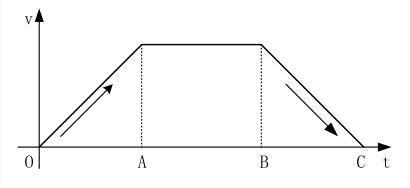

> 数学模型中一共分为三个阶段，OA加速部分、AB匀速部分和BC减速部分。
>
> - 在OA加速过程中，由低于步进电机的启动频率开始启动（模型中由0启动），以固定的加速度增加速度到目标值；
> - 在AB匀速过程中，以最大速度匀速运动；
> - 在BC减速部分中，以加速度不变的速度递减到0；
>
> 由于速度变化的曲线有折点，所以在启动、停止、匀速段中很容易产生冲击和振动。

### 梯形加减速算法

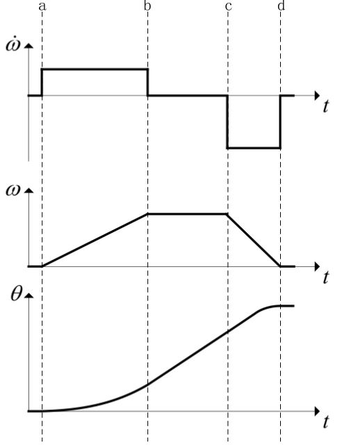

> 1. **起始点~a**：在这阶段中，速度、加速度、位置都没有变化；
> 2. **a~b阶段**：从虚线a开始，在这阶段中加速度不变，速度与位置不断上升，并且速度是以恒定加速度上升，上升到最大速度也就是速度曲线与虚线b的交点；
> 3. **b~c阶段**：在这阶段中，以不变的速度在运行，由于速度不变，则加速度为零，并且位置在这阶段呈现一个一次函数的上升阶段；
> 4. **c~d阶段**：在这阶段中，速度开始呈匀减速的状态，所以加速度为负值，但是位置依旧上升，但上升曲线逐渐变慢；

#### 脉冲时间间隔的计算

首先通过匀加速直线运动公式得出：
$$
\theta = \frac{1}{2}\beta t^2 \\
t = \sqrt{\frac{2\theta}{\beta}}
$$
式中，$t$为加速时间，$\beta$为角加速度，$\theta$为加速距离。

对于$n$步而言，加速时间转化为：
$$
t_n = \sqrt{\frac{2n\theta_0}{\beta}}
$$
$\theta_0$为步距角，由电机决定。$t_n$为$n$步所用的时间。

对于单个脉冲，其周期为两个相邻时间点的时间差：
$$
\delta t  = t_n - t_{n-1} 
$$
通过上式可以得出：
$$
c_n = \frac{1}{t_{TIM}}\sqrt{\frac{2\theta_0}{\beta}}(\sqrt{n+1}-\sqrt{n})
$$
$t_{TIM}$为定时器的计数周期，仅由预分频系数决定，$c_n$为定时器溢出值，即为$ARR$值。

$n = 0$时得到第一个脉冲的计数值：
$$
c_0 = \frac{1}{t_{TIM}}{\sqrt{\frac{2\theta_0}{\beta}}}
$$
通过递推得到任意的$c_n$：
$$
c_n = c_0(\sqrt{n+1}-\sqrt{n})
$$
为减小计算压力，使用泰勒展开的方法进行近似：
$$
c_n = c_{n-1}\frac{4n-1}{4n+1}
$$
由于泰勒公式进行近似会产生误差，引入修正系数$\alpha = 0.676$乘以$c_0$进行修正。

#### 加速度和步数的关系

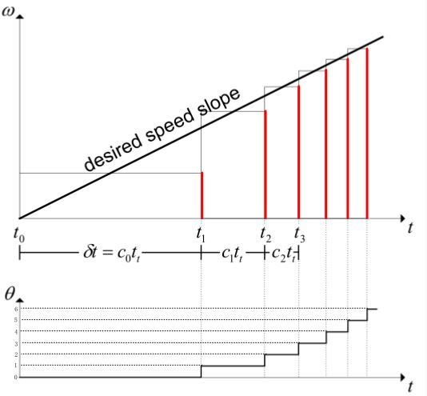

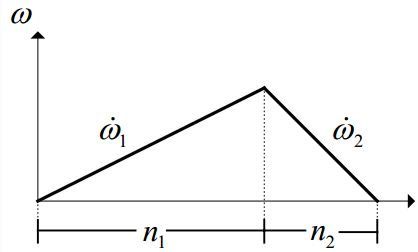

当速度达到最大值时，步数与加速度成反比，当加速度小的时候需要较多的步数，当加速度大的时候需要较少的步数就可以到达目标速度。
$$
n_1\beta_1 = n_2\beta_2
$$
如果给定总步数$n_0$，则有：
$$
n_1 = \frac{\beta_2 n_0}{\beta_1+\beta_2}
$$

### 梯形加减速的算法实现

#### 最小计数值（最大速度）计算

$$
\omega = \frac{\theta_0}{\delta t} \\
\delta t = ARR \times t_{TIM} = \frac{ARR}{f_{TIM}} \\
ARR = \frac{\theta_0 f_{TIM}}{\omega}
$$

定义变量`A_T_x100`（步距角乘以定时器频率放大100倍，为常数），并由此得到最小计数值（常数）：

```c
#define	 A_T_x100		step_theta * f_tim * 100;
#define  min_delay  	A_T_x100 / speed;
```

#### `c_0`的计算

定义中间常量`T1_FREQ_148`和`A_SQ`辅助计算：

```c
#define T1_FREQ_148		0.676 * f_tim / 100
#define A_SQ			2 * step_theta * 10000000000
```

此时，`c_0`根据公式即可计算：

```c
float c_0 = (T1_FREQ_148 * sqrt{A_SQ / accel}) / 100.0f
```

#### 持续加速到最大速度后减速到0

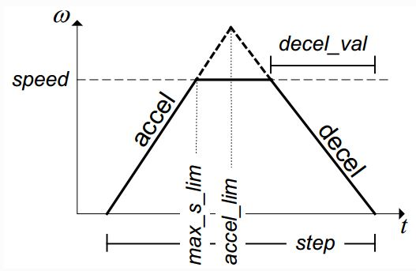

设定以下参数：

> - `speed`：最大速度；
> - `accel`：加速加速度；
> - `decel`：减速加速度；
> - `step` ：总步数；

推导出以下参数：

1. `max_s_lim`：速度从`0`加速到`speed`所需的步数；

由匀加速直线运动公式可得：
$$
n_1 \theta_0 = \frac{\omega_{max}^2}{2\beta}
$$

```c
float max_s_lim = (speed * speed)/(2 * step_theta * accel * 100);	// speed 被扩大了100倍，accel 被扩大了100倍
```

2. `accel_lim`：在忽略最大速度的情况下，开始减速之前的步数，也可以理解为加速度曲线与减速度曲线的交点；

```c
float accel_lim = (step * decel)/(accel + decel);
```

3. `decel_val`：实际减速的步数；

```c
float decel_val = -(max_s_lim * accel)/decel; 
```

注意，该种情况的条件为加速所需步数小于开始减速的步数，即为`max_s_lim < accel_lim`。

#### 在没达到最大速度之前开始减速到0

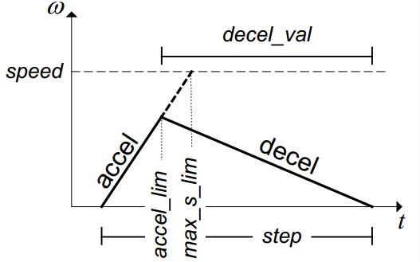

条件为`max_s_lim < accel_lim`，此时有：

```c
decel_val = -(step - accel_lim);
```

#### 状态机搭建

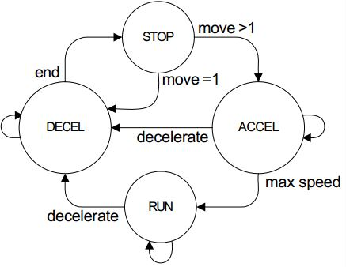

> - **第一种情况** ：当步数为1时，毫无疑问直接进入到减速阶段然后到停止状态
> - **第二种情况** ：当步数大于1，并且会加到最大速度，会经过：加速状态->匀速状态->减速状态->停止状态
> - **第三种情况** ：当步数大于1，并且不会加到最大速度，会经过：加速状态->减速状态->停止状态

#### 递推计算

对于加减速的每一步来说，都需要重新计算下一步的时间，计算的过程中可能会出现除不尽的项式， 为了更有利的加减速，可以采用加速向上取整，减速向下取整的原则来做运算，也可以采用余数累计的方法， 在这里使用的是将余数累计的方法来提高间隔时间的精度和准确性。

```c
new_step_delay = step_delay - (2 * step_delay + rest)/(4 *accel_count + 1);
new_rest = (2 * step_delay + rest) % (4 *accel_count + 1);
```

## 2. S形加减速

### S形加减速简介

S形加减速在启动停止以及高速运动时的速度变化的比较慢，导致冲击力噪音很小。

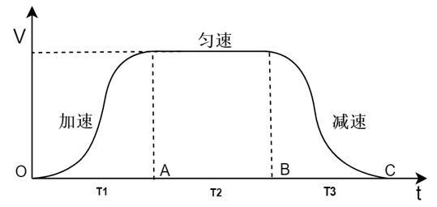

1. 七段式算法

具有平稳、精度高的特点，但该算法的参数复杂，大大降低到了工作效率且对硬件的要求较高。

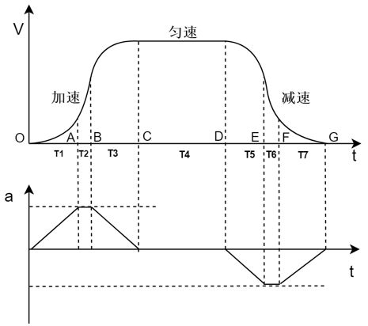

2. 五段式算法

算法简单、具有实时性和高精度的加减速控制算法。

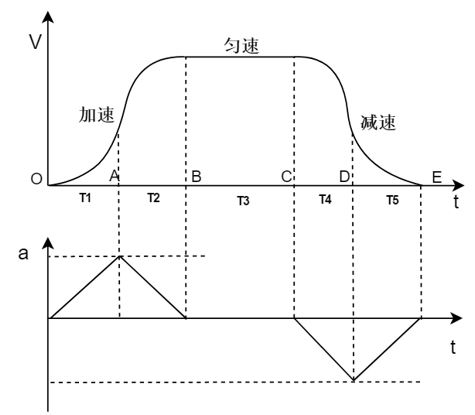

### 五段式S形加减速算法

#### 基本假设

需要的参数：总步数`step`，加速时间`t_1`，减速时间`t_2`，最大速度`v_max`。

求解参数：加速步数`n_1`，减速步数`n_2`，脉冲周期`c_n`。

通常假定$T_1 = T_2$。

#### 加加速步数求解（OA段）

$$
s_1 = \int v_1dt \\
\Delta v_1 = \int a_1 dt 
$$

假设急动度为$J$，则必有：
$$
a_1 = Jt
$$
在$0 $到$ t_1$有：
$$
\Delta v_1 = \frac{1}{2}Jt^2
$$
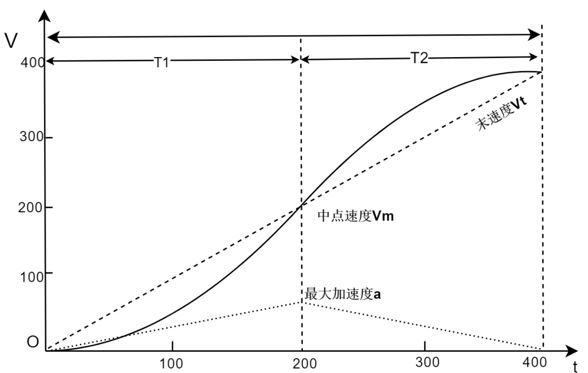

中点速度为：
$$
v_m = \frac{v_0 + v_{max}}{2}
$$
则有位移和末速度：
$$
s_1 = \frac{1}{6}Jt^2 \\
v = v_0 + \frac{1}{2}Jt^2
$$

#### 减加速步数求解（AB段）

对应的，有：
$$
v = v_{max} - \frac{1}{2}J(t-t_1)^2 \\
s_2 = v_{max}t - \frac{1}{6}Jt^3
$$


#### 脉冲周期确定

首先确定初始脉冲值：
$$
t = (\frac{6s_1}{J})^{\frac{1}{3}}
$$
随即计算下一个速度填入速度表。

