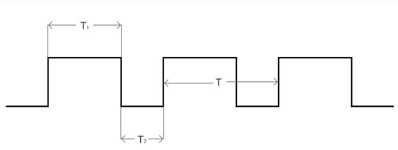
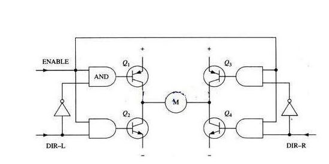
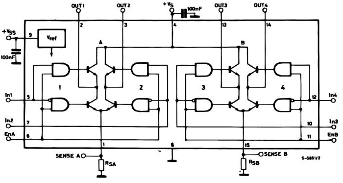
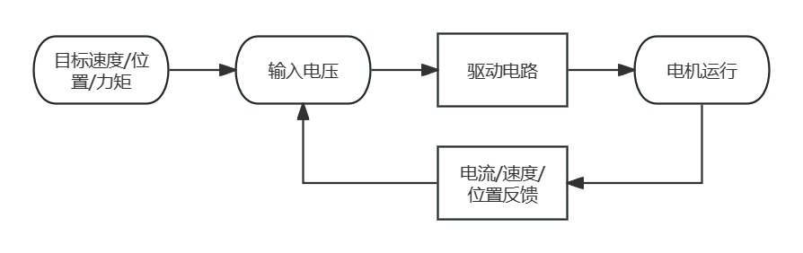
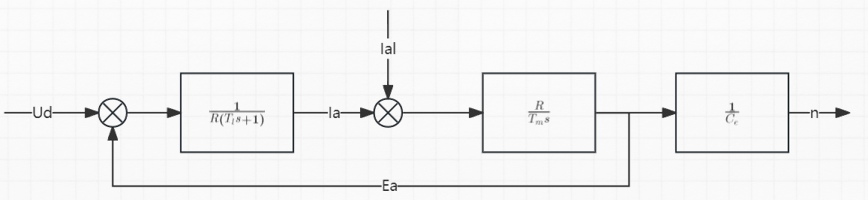
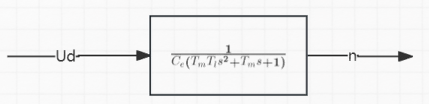
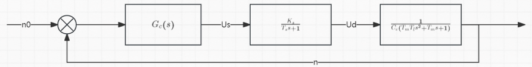

# Engine 直流电机的控制

## 1. 驱动原理和驱动电路

$$
n = \frac{U-I_a(R_a+R_\Omega)}{C_e\Phi}
$$

直流电机的调速方式有调压调速，弱磁调速，电枢串电阻调速。

> - 调压调速：调节电枢电压，转速只能从额定电压对应的转速往下调，不能比额定转速高，负载转矩不变时，随着转速改变，电枢电流不变，适宜带恒转矩负载。（最常用的方式）
> - 弱磁调速：对于永磁电机无效，因为无法调节励磁，不宜带恒转矩负载，弱磁调控时转矩应下降，宜带恒功率负载。
> - 电枢串电阻调速：很不常用。

通常采用调压调速的方式进行直流电机的控制，考虑到电源通常为 DC 电源，直流电机的电枢电压是 DC 电压，使用 DC-DC 电路可以控制直流电机。

### PWM 调制

脉冲宽度调制（Pulse width modulation，PWM）信号，按一定的规则对脉冲的宽度进行调制， 既可改变电路输出电压的大小，也可改变输出频率。PWM通过一定的频率下改变通电和断电的时间从而控制输出脉冲的占空比，从而实现模拟量的输出。

$T_1$为高电平时间，$T_2$为低电平时间，$T$为PWM周期。

占空比公式：
$$
D = \frac{T_1}{T} \times 100%
$$
在低频条件下，可以看到明显的高低电平变化；

通常为实现模拟量输出，使用高频PWM信号，使得在宏观时间内高频率的高低电平变化等效为一个介于0到最大电压之间的值（有效值），此时等效输出电压： $$ V = D V_{max} $$ 。

对于直流有刷电机而言，电压和转速成正比，故对应的： $$ v = D v_{max} $$。

### H桥驱动电路

使用DC-DC电路对直流电机进行控制。为了实现直流电机的正/反向加速/制动，采用四象限Buck电路，即H桥电路。

> 当Q1和Q4导通时，电流将经过Q1从左往右流过电机， 再经过Q4流到电源负极，电机可以顺时针转动。
>
> 当Q3和Q2导通时，电流将经过Q3从右往左流过电机， 再经过Q2流到电源负极，电机可以逆时针转动。
>
> 特别地，当同一侧的Q1和Q2同时导通时，电流将从电源先后经过Q1和Q2，然后直接流到电源负极， 在这个回路中除了三极管以外就没有其他负载（没有经过电机），这时电流可能会达到最大值，此时可能会烧毁三极管。

改进后加入逻辑控制，避免同相导通。

> 新增加了两个非门和4个与门， 经过这样的组合就可以实现一个信号控制两个同一侧的三极管， 并且可以保证在同一侧中两个三级管不会同时导通在同一时刻只会有一个三极管是导通的。

- L298N

  L298N 是 ST 公司的产品，内部包含4通道逻辑驱动电路，是一种二相和四相电机的专门驱动芯片， 即内含两个H桥的高电压大电流双桥式驱动器，接收标准的 TTL 逻辑电平信号，可驱动 4.5V ~ 46 V、 2A 以下的电机，电流峰值输出可达3A。

  

  | IN1  | IN2  | ENA  | 电机状态 |
  | ---- | ---- | ---- | -------- |
  | ×    | ×    | 0    | 电机停止 |
  | 1    | 0    | 1    | 电机正转 |
  | 0    | 1    | 1    | 电机反转 |
  | 0    | 0    | 1    | 电机停止 |
  | 1    | 1    | 1    | 电机停止 |

- TB6612 芯片

  TB6612FNG 是东芝半导体公司生产的一款直流电机驱动器件，它具有大电流 MOSFET-H 桥结构，双通道电路输出，可同时驱动 2 个电机。它具有很高的集成度，同时能提供足够的输出能力，运行性能和能耗方面也具有优势，因此在集成化、小型化的电机控制系统中，它可以作为理想的电机驱动器件。

  | 指标     | 参数              |
  | -------- | ----------------- |
  | 驱动电压 | VM输入(4.5-10V)   |
  | 逻辑电平 | VCC输入(2.7-5.5V) |
  | 工作电流 | 1.2A              |
  | 峰值电流 | 3.2A              |

  | 引脚名称 | 说明                           |
  | -------- | ------------------------------ |
  | PWMA     | A电机控制信号输入端            |
  | AIN2     | A电机输入端2                   |
  | AIN1     | A电机输入端1                   |
  | YSTB     | 正常工作/待机状态控制端        |
  | BIN1     | B电机输入端1                   |
  | BIN2     | B电机输入端2                   |
  | PWMB     | B电机控制信号输入端            |
  | VM       | 电机驱动电压输入端（4.5V~15V） |
  | VCC      | 逻辑电平输入端（2.7V~5.5V）    |
  | AO1      | A电机输出端1                   |
  | AO2      | A电机输出端2                   |
  | BO2      | B电机输出端2                   |
  | BO1      | B电机输出端1                   |
  
  | IN1  | IN2  | 直流电机的状态 |
  | ---- | ---- | -------------- |
  | 0    | 0    | 制动           |
  | 0    | 1    | 正转           |
  | 1    | 0    | 反转           |
  | 1    | 1    | 制动           |

## 2. 直流电机的闭环控制

### 直流电机的系统模型

1. PWM 系统模型

PWM变换器可以视为系统中的一个环节，电枢电压和控制电压呈线性关系，但是由于电枢电压是均值等效的，所以电枢电压的响应存在延迟，PWM变换器可以视为存在延迟的比例环节。

通常取 $T_s$ 为 PWM 变换器周期 $T$，由于 $T$ 很大，实际考虑时采用一个惯性环节近似：
$$
G(s) = K_se^{-T_ss} \approx \frac{K_s}{T_ss+1}
$$
2. 直流电机系统模型

首先做出以下假设：

（1）电机的励磁电流恒定的，故反电动势和转速成正比，力矩和电枢回路的电流呈正比，此时可以将磁通量计算到 $C_e$ 和 $C_m$ 中；
（2）忽略气隙等非线性因素，假设系统是线性的。

电枢回路的电势平衡方程：
$$
L_a\frac{di_a}{dt} + i_aR_a + E_a = U_d 
$$
( 电机学教材中忽略了电枢回路的电感，通常需要考虑电枢回路由于绕组存在的电感和附加的电感 )

电机轴的动力学方程：
$$
T_e - T_L = J\frac{dn}{dt}
$$
定义电机的电枢回路电磁时间常数：
$$
T_l = \frac{L_a}{R_a}
$$
定义电机的电力拖动系统机电时间常数：
$$
T_m = \frac{JR_a}{C_eC_m}
$$
做 Laplace 变换得到系统结构框图如下：

通常将负载电流视为扰动项，故变换为以下框图：

转速环系统框图如下：

未加入控制器前，系统为三阶系统，且不存在微分环节。系统是 0 型系统，所以使用 PID 控制器进行控制。（实际使用时使用 PD 控制器可以达到较好效果）
