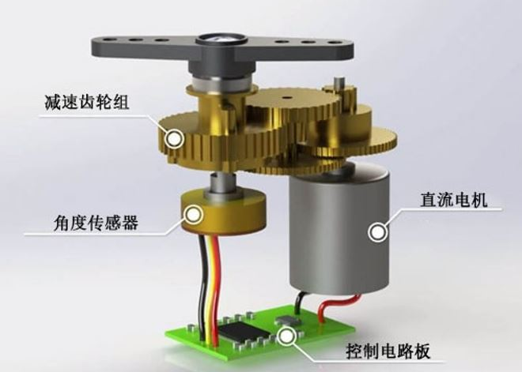
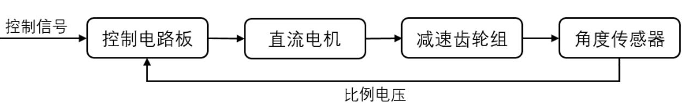
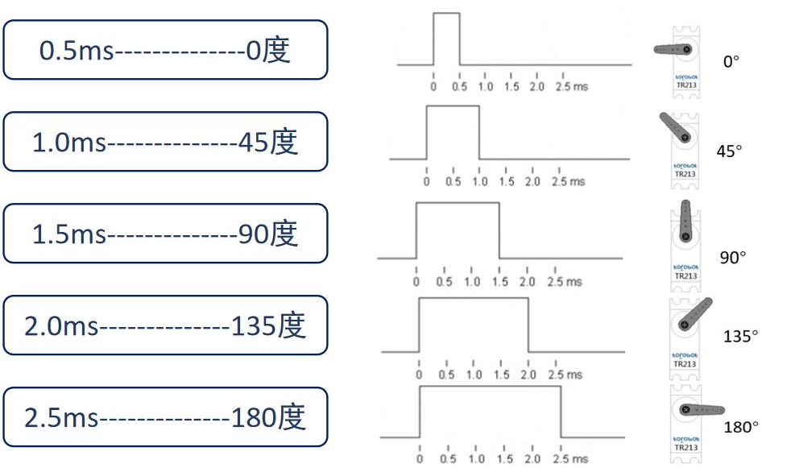

# Engine 2_舵机

## 1. 舵机

舵机（Servo）实际上可以看作一个自带闭环控制的直流电机，服从控制信号的要求而动作，可以很好的掌握电机角度。

特点：体积小、力矩大、结构简单、稳定性高。

舵机主要由**直流电机、减速齿轮组、角度传感器、控制电路**构成。

舵机内部是一个闭环回路：

## 2. 舵机驱动方法
舵机一般需要**周期为20ms**的PWM信号来控制，该脉冲的高电平时间一般为**0.5ms-2.5ms**范围，相对应舵盘位置的0-180°。

舵机有三条输入线：

>红线：VCC
>
>棕线/黑线：GND
>
>橙线/白线：信号线

## 3. 注意事项

1. 舵机不能够长时间堵转，长时间堵转的舵机会造成过大电流，如果舵机驱动电路额定功率不足可能会导致电源不稳。
2. 舵机的运行速度较慢，如果使用快速冲击结构考虑使用气动件。

