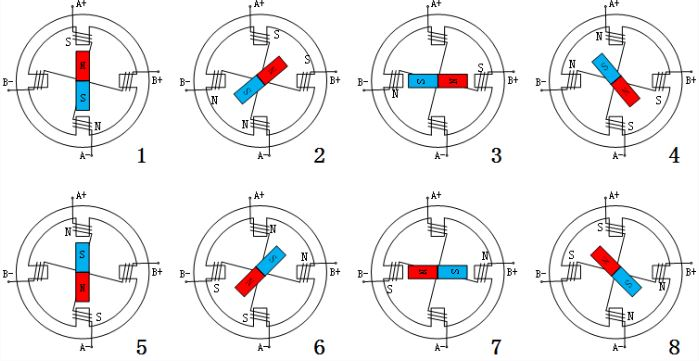

# STM32 电机驱动 3-1_步进电机驱动

## 1. 步进电机

步进电机是一种将电脉冲信号转换成相应角位移或线位移的电动机。

对于步进电机，每输入一个脉冲信号，转子就转动一个角度或前进一步。其输出的角位移或线位移与输入的脉冲数成正比，转速与脉冲频率成正比。因此，步进电动机又称脉冲电动机。

### 步进电机工作原理

通常步进电机的转子为永磁体，当电流流过定子绕组时，定子绕组产生一矢量磁场。磁场会带动转子旋转一定的角度， 使得转子的一对磁场方向与定子的磁场方向一致。当定子的矢量磁场旋转一个角度。转子也随着该磁场转步距角。 每输入一个电脉冲，电动机转动一个角度前进一步。它输出的角位移与输入的脉冲数成正比、转速与脉冲频率成正比。 改变绕组通电的顺序，电机就会反转。所以可用控制脉冲数量、频率及电动机各相绕组的通电顺序来控制步进电机的转动。

### 步进电机的分类

步进电机又分为单极性的步进电机和双极性的步进电机。

单双极性是指一个步进电机里面有几种电流的流向。五线四相步进电机四根线的电流走向汇总到公共线，称之为单极性电机。两相四线步进电机有两种不同的电流流向，为双极性的步进电机。

> - 单极性步进电机使用的是单极性绕组。其一个电极上有两个绕组，这种联接方式为当一个绕组通电时，产生一个北极磁场； 另一个绕组通电，则产生一个南极磁场。因为从驱动器到线圈的电流不会反向，所以可称其为单极绕组。
> - 双极性步进电机使用的是双极性绕组。每相用一个绕组，通过将绕组中电流反向，电磁极性被反向。

### 步进电机的驱动方式

#### 双极性整步驱动（单线圈通电）

> - 通电顺序：A+ -> B+ -> A- -> B- -> A+

#### 双极性整步驱动（双线圈通电）

> - 通电顺序：A+B+ -> B+A- -> A-B- -> B-A+ -> A+B+
>
> - 双线圈通电，磁场强度更大，力矩更大。

#### 双极性半步驱动

> - 半步的旋转方式旋转起来更加的顺滑。

#### 单极性整步驱动（单相通电）

> - 通电顺序：A -> B -> C -> D -> A

#### 单极性整步驱动（双相通电）

> - 通电顺序： AB -> BC -> CD -> DA -> AB

#### 单极性半步驱动

### 细分驱动器

通过改变定子的电流比例，改变转子在一个整步中的不同位置，可以将一个整步分成多个小步来运行。如果驱动器的细分能力很强， 可以将其分成32细分、64细分等；这不仅提高了步进电机旋转的顺畅度而且提高了每步的精度。
$$
\frac{脉冲数 \times 电机步距角}{细分数} = 旋转角度
$$

### 步进电机的参数

1. 静态参数

>**相数**：线圈的组数，两相步进电机步距角一般为 1.8°，三相的步进电机步距角为 1.2°，相数越多步距角越小
>
>**步距角**：一个脉冲信号所对应的电机转动的角度，这个步距角他不一定是电机实际工作的真正步距角，真正的步距角与驱动器的细分有关
>
>**拍数**：完成一个磁场周期性变化所需脉冲数
>
>**定位转矩**：电机在不通电状态下，电机转子自身的锁定力矩（由磁场齿形的谐波以及机械误差造成的）

2. 动态参数

>**步距角精度**：步进电机转动一个步距角度的实际值与理论值的误差。用百分比表示：误差/步距角 *100%
>
>**失步**：电机运转的步数，不等于理论上的步数。也可以叫做丢步，一般都是因负载过大或者是频率过快。
>
>**最大空载起动频率**：不加负载的情况下，能够直接起动的最大频率
>
>**最大空载运行频率**：电机不带负载的最高转速频率
>
>**运行距频特性**：输出转矩与输入脉冲频率的关系，是电机选型的根本依据
>
>**电机正反转控制**：改变通电顺序而改变电机的正反转

### 步进电机驱动器

1. 引脚定义

| 序号 | 引脚名称    | 引脚定义     |
| ---- | ----------- | ------------ |
| 1    | `ENA-(ENA)` | 输出使能负端 |
| 2    | `ENA+(5V)`  | 输出使能正端 |
| 3    | `DIR-(DIR)` | 方向控制负端 |
| 4    | `DIR+(5V)`  | 方向控制正端 |
| 5    | `PUL-(PUL)` | 脉冲控制负端 |
| 6    | `PUL+(5V)`  | 脉冲控制正端 |

> - `ENA`功能说明：控制器的输出是通过该组信号使能，又称脱机信号。当此信号有效时，输出关闭，电机绕组电流为零， 电机为无力矩状态，可以自由转动电机，适合需要手动调整电机的场合。
> - `DIR`功能说明：电机的方向控制信号，当此信号有效时，电机顺时针转动，当此信号无效时，电机逆时针旋转。
> - `PUL`功能说明：电机的转动控制信号，驱动器接收到的脉冲信号电机就会按照既定的方向旋转。电机的角位移与脉冲的数量成正比， 速度与脉冲的频率成正比。通常脉冲的有效宽度>= 5us，频率<= 125KHz。

2. 细分参数

驱动器的细分设置由拨码开关的 SW1 ~ SW3 来设定，默认为2细分，一般的两相四线制步进电机的步进角都是1.8°， 因此电机旋转一圈需要200个脉冲。

| 细分 | 脉冲  | SW1  | SW2  | SW3  |
| ---- | ----- | ---- | ---- | ---- |
| 2    | 400   | OFF  | OFF  | OFF  |
| 4    | 800   | ON   | OFF  | OFF  |
| 8    | 1600  | OFF  | ON   | OFF  |
| 16   | 3200  | ON   | ON   | OFF  |
| 32   | 6400  | OFF  | OFF  | ON   |
| 64   | 12800 | ON   | OFF  | ON   |
| 128  | 25600 | OFF  | ON   | ON   |
| 256  | 51200 | ON   | ON   | ON   |

3. 电流参数

驱动器的电流设置由拨码开关的 SW4 ~ SW7 来设定，默认为1.68A。这个电流值需要根据步进电机的额定电流来设定。 一般建议驱动器的输出电流设定和电机额定电流差不多或者小一点，如果电机空载， 则需将驱动器输出电流设置得尽可能小。

| 电流  | SW4  | SW5  | SW6  | SW7  |
| ----- | ---- | ---- | ---- | ---- |
| 1.68A | OFF  | OFF  | OFF  | OFF  |
| 2.20A | ON   | OFF  | OFF  | OFF  |
| 2.72A | OFF  | ON   | OFF  | OFF  |
| 3.25A | ON   | ON   | OFF  | OFF  |
| 3.82A | OFF  | OFF  | ON   | OFF  |
| 4.35A | ON   | OFF  | ON   | OFF  |
| 4.89A | OFF  | ON   | ON   | OFF  |
| 5.43A | ON   | ON   | ON   | OFF  |
| 0.89A | OFF  | OFF  | OFF  | ON   |
| 1.17A | ON   | OFF  | OFF  | ON   |
| 1.44A | OFF  | ON   | OFF  | ON   |
| 1.73A | ON   | ON   | OFF  | ON   |
| 2.19A | OFF  | OFF  | ON   | ON   |
| 2.31A | ON   | OFF  | ON   | ON   |
| 2.60A | OFF  | ON   | ON   | ON   |
| 2.89A | ON   | ON   | ON   | ON   |