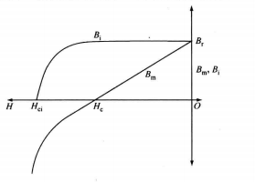
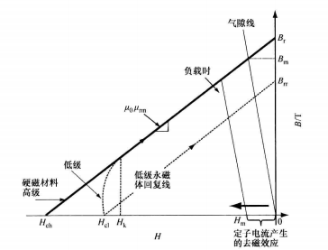
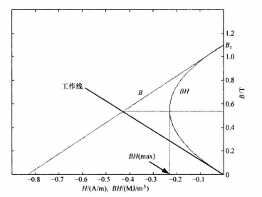
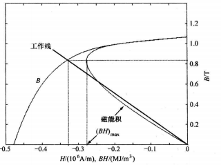
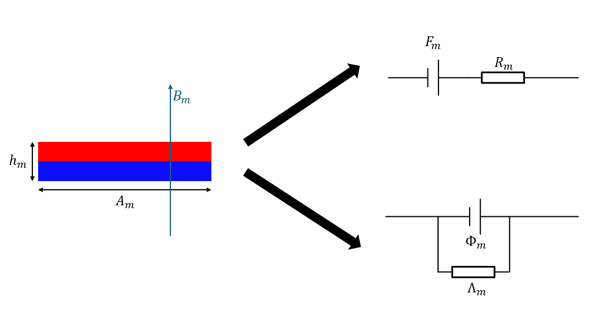
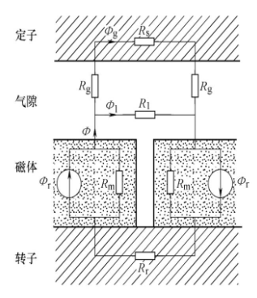
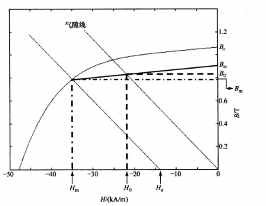

# 永磁体性质和磁路计算

## 1. 永磁体

### 永磁材料的基本性质

磁介质的本质关系为：
$$
B_m = \mu_0(H_m+M)=\mu_0 H_m+B_i
$$
$\mu_0H_m$ 称为励磁磁通密度，$B_i$ 称为内禀磁通密度，根据 $B_i$ 和 $H$ 的关系，物质可以分为三类：顺磁/抗磁质，软磁质，硬磁质。

| 材料类型       | $B_i-H_m$ 关系                    | 磁化曲线                                                     |
| -------------- | --------------------------------- | ------------------------------------------------------------ |
| 顺磁质/抗磁质  | $B_i=\chi\mu_0H_m$，$|\chi|\ll1$  | 斜率接近于 $\mu_0$ 的直线，过原点。$B_r \approx 0,H_c \approx 0$(外部磁场消失时磁性消失) |
| 软磁质         | $B_i=\chi\mu_0 H_m$，$\chi \gg 1$ | 斜率很大的直线，理想状态下过原点，但是由于存在很小的磁滞，有很小的 $B_r$ 和 $H_c$。 |
| 硬磁质(永磁质) | $B_i-H_m$ 曲线非线性              | 磁滞回线包围的面积很大，有很大的 $B_r$ 和 $H_c$。            |

永磁体在第二象限的内禀退磁曲线和退磁曲线如下：

一般的，永磁体在第二象限的内禀磁通密度为一个常值(也就是永磁性)，使得永磁体在第二象限的退磁曲线为一条直线，使得 $B_i = 0$ 的 $H_{ci}$ 为内禀矫顽力，使得 $B_m = 0$ 的 $H_c$ 为矫顽力。$H_m = 0$ 的磁通密度 $B_r$ 为剩磁。

如果永磁体在第二象限的内禀磁通密度不保持为常值，则该永磁体的永磁能力较弱，称为低级永磁体。低级永磁体的退磁曲线在磁通密度较低处存在一个称为膝点的拐点，外部弱磁磁场超过该点 $H_k$ 时，磁通密度陡降为0，同时 $H_m = H_{cl}$。此时如果撤掉弱磁磁场，永磁体的磁通密度将会沿着一条平行与原退磁曲线的直线回升(这个直线是近似的)，对应的剩磁为 $B_{rr} < B_r$，即发生不可逆退磁。

对于高级永磁体，正常弱磁情况下不大可能发生不可逆退磁。，回复线和退磁线基本一致。

- 磁能积

  定义永磁体的磁能积为工作磁场强度和工作磁通密度的乘积：$E_m=B_mH_m$。更高磁能积的永磁体适用于更高功率密度的电机。为了提高永磁体利用率，通常设计永磁体的工作点工作在最大磁能积点附近。

  对于高级永磁体，最大磁能积通过以下方式求出：
  $$
  E_m = B_mH_m =(B_r+\mu_0\mu_{rm}H_m)H_m \\
  \frac{dE_m}{dH_m}=B_r+2\mu_0\mu_{rm}H_m=0 \\
  H_m = -\frac{B_r}{2\mu_0\mu_{rm}}
  $$
  磁能积最大时，永磁体的磁通密度为剩磁的一半，此时定子需要提供较大的弱磁磁场。

  

  对于低级永磁体，其磁能积曲线如下：

  

## 2. 带永磁体的磁路计算

### 解析法

- 永磁体的磁路等效

  考虑永磁体的本质关系：$B_m = B_r - H_m\frac{B_r}{H_c}$，$B_r$ 为剩磁，$H_c$ 为矫顽力。

  如果将永磁体制作为厚度为 $h_m$，横截面为 $A_m$ 的立方永磁体，可以表述为等效磁阻串联恒磁动势源或者等效磁导并联恒磁通源(用戴维南定理转换)：

  
  $$
  F_m = H_mh_m \\
  R_m = \frac{1}{\Lambda_m} =  \frac{h_m}{\mu_{rm}\mu_0A_m} \\
  \Phi_m = B_mA_m \\
  $$

- 典型的 PMSM 磁路(空载)

  

### 图解法

适用气隙线/负载线和永磁体退磁曲线相交得到工作点(类似于非线性电路的图解法)。

