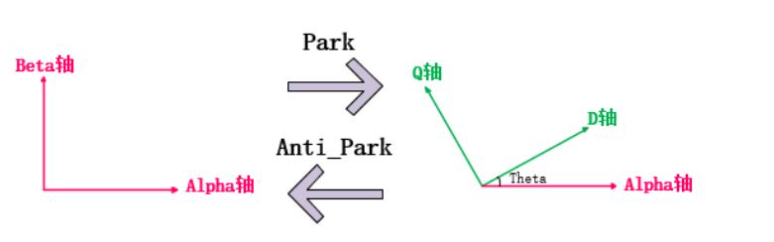

# Engine Clark变换 Park 变换

## 1.  Clark 变换

PMSM 电机需要通入三相电流以产生旋转磁场，由相量法可知，三相电流可以用三个夹角为120°的相量进行表示，考虑到单独求解每一相的电流比较复杂，使用 Clark 变换将三相电流降维到静止的 $\alpha$-$\beta$ 坐标系进行降维解耦。

通过投影将三相电流向量投影到 $\alpha$-$\beta$ 坐标系下：
$$
i_\alpha = i_a - \frac{1}{2}i_b - \frac{1}{2}i_c \\
i_\beta = \frac{\sqrt{3}}{2}i_b + \frac{\sqrt{3}}{2}i_c
$$
即：
$$
\left[\begin{matrix}
i_\alpha \\
i_\beta
\end{matrix}\right] = P
\left[\begin{matrix}
1 & -\frac{1}{2} & -\frac{1}{2} \\
0 & \frac{\sqrt{3}}{2} & -\frac{\sqrt{3}}{2}
\end{matrix}\right]
\left[\begin{matrix}
i_a \\ 
i_b \\
i_c
\end{matrix}\right]
$$

$P$ 为系数，如果存在等幅值约束，可以得到 $P=\frac{2}{3}$；如果存在等功率约束，可以得到 $P=\sqrt{\frac{2}{3}}$。

为了使线性区调制比范围是 $[0,1]$ ，通常定义调制比为线电压幅值与直流母线电压的比值，如果采用等幅值 Clark 变换，坐标变换将不会改变电流的幅值。与等功率变换相比，等功率变换调制比范围将扩大，超出线性调制区原来的范围。所以采用等功率变换时，电流控制器输出的指令电压需要再乘以$P = \sqrt{\frac{2}{3}}$，才能给逆变器进行 PWM 调制。

为节省电流采样成本，通常使用基尔霍夫定律进行化简：
$$
i_a + i_b + i_c = 0
$$
则有：
$$
\left[\begin{matrix}
i_\alpha \\
i_\beta
\end{matrix}\right] = 
\left[\begin{matrix}
1 & 0 \\
\frac{1}{\sqrt{3}} & \frac{2}{\sqrt{3}} 
\end{matrix}\right]
\left[\begin{matrix}
i_a \\ i_b
\end{matrix}\right]
$$

## 2. Park 变换

Clark 变换得到的 $i_\alpha$ 和 $i_\beta$ 在电机运行时仍然是变化的，为了进一步将电流和电角度解耦，可以考虑建立固连在转子上的 $d-q$ 坐标系，此时$i_d$，$i_q$和$\theta_e$被解耦。

Park 变换将定子静止的$\alpha$和$\beta$坐标系转换为固连在转子上的$d$和$q$坐标系，便于描述电机旋转时的电流规律。$d$ 轴平行于转子永磁体，$q$轴垂直于转子。$dq$坐标系相对于$\alpha \beta$坐标系旋转的角度为电角度。

$$
\left[\begin{matrix} i_d \\ i_q \end{matrix}\right] = \left[\begin{matrix} cos\theta_e & sin\theta_e \\ -sin\theta_e & cos\theta_e \end{matrix}\right] \left[\begin{matrix} i_\alpha \\ i_\beta \end{matrix}\right]
$$

$i_q$ 产生电机的力矩，是电机力矩环（电流环）的驱动目标，$i_d$ 产生电机的热量，通常需要控制为0。$\theta_e$表征电机的位置，是电机位置环的驱动目标。