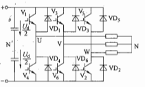
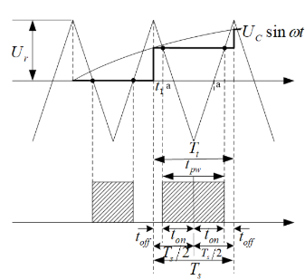
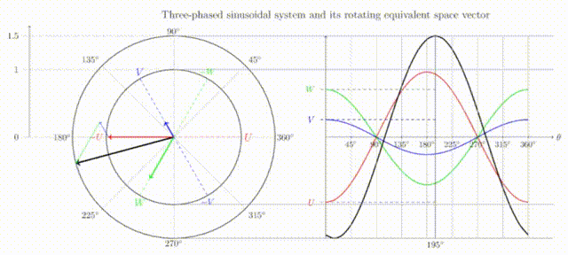
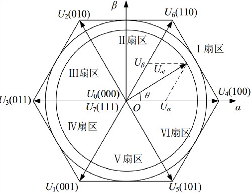

# Engine 三相电压源型逆变器

逆变器即 DC-AC 电路，将直流电转换为交流电。PMSM 的驱动使用三相交流电，使用三相桥式逆变器进行驱动：

$U_{dc}$称为母线电压。最普通的控制方式是方波控制：每相上下桥臂交替180度导通，每相上桥臂导通时间相差120度。

## 1. SPWM 调制

### 基本 SPWM 调制

- PWM 的基本原理：冲量相等而形状不同的窄脉冲加在具有惯性的环节上时，其效果基本相同。

  

  

- SPWM 基本原理：

  将正弦半波沿纵向分割为N等份。当N足够大时，正弦半波就被分割成宽度相等的脉冲序列把上述脉冲序列用相同数量的等幅而不等宽的矩形脉冲
  代替，使矩形脉冲的中点和相应正弦波部分的中点重合，且使矩形脉冲的面积（冲量）和相应的正弦波部分面积（冲量）相等，这就是PWM波形。脉冲的宽度按正弦规律变化且和正弦波面积等效的PWM波形，也称SPWM（Sinusoidal PWM）波形。
  
  
  
  - 计算法：根据正弦波频率、幅值和半周期脉冲数，准确计算PWM波各脉冲宽度和间隔，据此控制逆变电路开关器件的通断从而得到所需PWM波形的方法。缺点：计算繁琐，当输出正弦波的频率、幅值或相位变化时，开关点都要变化。
  
  - 调制法(最常用)：对脉冲的宽度进行调制的技术，即通过对一系列脉冲的宽度进行调制，来等效地获得所需要波形。
  
    在SPWM中，使用目标波形(正弦波)作为调制波，高频的锯齿波(不对称)/三角波(对称)作为高频载波，通过两个波的比较确定脉宽。
  
    - 自然采样法：在正弦波和三角波的自然交点时刻控制功率开关器件的通断。开关点求解复杂，难以在实时控制中在线计算，工程应用不多。
  
      
  
    - 规则采样法：对调制波进行采样，可以获得和自然采样法相近的结果，计算量小，便于在线计算。
  
      
  
      
  
- 三相逆变器 SPWM 调制：

  

  三相SPWM逆变器输出线电压的基波幅值为$\frac{\sqrt 3}{2}mU_d$，$m$ 为调制比，在不过调制（调制波不超过载波幅值）的条件下，调制比最大为1，此时直流电压利用率为0.866，利用率比较低。

## 2. SVPWM 调制

- 空间矢量：可以将旋转磁动势视为一个旋转的空间矢量，因此，和磁动势成比例关系的电流也是空间矢量。考虑到稳态时，电压也是一个对称正弦量，因此电压积分得到的磁链也是对称正弦量。电压型逆变器通过电压矢量生成旋转的电流矢量，从而使得电机旋转。（控制MOS管的开断可以控制三相电流流向，进而确定定子旋转磁场的方向）

  

  

- 三相逆变器的基本电压矢量

  定义ABC三个桥臂分别有0,1两种状态，0是下管开通上管关断，1是上管开通下管关断。（同一个半桥不可同时导通上下桥臂）。考虑到不同开关模式的三相线电压状态组成不同相位的电压相量，即有6个非零矢量（001，010，011，100，101，110）和两个零矢量（000，111）。

  | $S_a$ | $S_b$ | $S_c$ | 矢量符号 | $U_a$                | $U_b$                | $U_c$                |
  | ----- | ----- | ----- | -------- | -------------------- | -------------------- | -------------------- |
  | 0     | 0     | 0     | $U_0$    | 0                    | 0                    | 0                    |
  | 1     | 0     | 0     | $U_4$    | $\frac{2}{3}V_{cc}$  | $-\frac{1}{3}V_{cc}$ | $-\frac{1}{3}V_{cc}$ |
  | 1     | 1     | 0     | $U_6$    | $\frac{1}{3}V_{cc}$  | $\frac{1}{3}V_{cc}$  | $-\frac{2}{3}V_{cc}$ |
  | 0     | 1     | 0     | $U_2$    | $-\frac{1}{3}V_{cc}$ | $\frac{2}{3}V_{cc}$  | $-\frac{1}{3}V_{cc}$ |
  | 0     | 1     | 1     | $U_3$    | $-\frac{2}{3}V_{cc}$ | $\frac{2}{3}V_{cc}$  | $\frac{2}{3}V_{cc}$  |
  | 0     | 0     | 1     | $U_1$    | $-\frac{1}{3}V_{cc}$ | $-\frac{1}{3}V_{cc}$ | $\frac{2}{3}V_{cc}$  |
  | 1     | 0     | 1     | $U_5$    | $\frac{1}{3}V_{cc}$  | $-\frac{2}{3}V_{cc}$ | $\frac{1}{3}V_{cc}$  |
  | 1     | 1     | 1     | $U_7$    | 0                    | 0                    | 0                    |

  由此可以将电压矢量分为六个扇区：

  

  当电压不在六个标准电压矢量上时，为了得到该电压矢量，通常使用互补PWM控制逆变器，再由伏秒平衡原则(一个周期内，作用时间越长，作用值越大)产生对应电压相量(即发波方式)。

- 扇区判断

  如果存在传感器，可以通过电角度直接判断电压矢量的扇区。如果为无感控制，使用 $U_\alpha$ 和 $U_\beta$ 也可进行扇区判断。

  | 扇区 | 角度条件                                                   | 比例条件                               |
  | ---- | ---------------------------------------------------------- | -------------------------------------- |
  | 1    | $0 < arctan(\frac{U_\beta}{U_\alpha}) < 60^\circ$          | $0<\frac{U_\beta}{U_\alpha}<\sqrt{3}$  |
  | 2    | $60^\circ < arctan(\frac{U_\beta}{U_\alpha}) < 120^\circ$  | $|\frac{U_\beta}{U_\alpha}|>\sqrt{3}$  |
  | 3    | $120^\circ < arctan(\frac{U_\beta}{U_\alpha}) < 180^\circ$ | $0>\frac{U_\beta}{U_\alpha}>-\sqrt{3}$ |
  | 4    | $180^\circ < arctan(\frac{U_\beta}{U_\alpha}) < 240^\circ$ | $0<\frac{U_\beta}{U_\alpha}<\sqrt{3}$  |
  | 5    | $240^\circ < arctan(\frac{U_\beta}{U_\alpha}) < 300^\circ$ | $|\frac{U_\beta}{U_\alpha}|>\sqrt{3}$  |
  | 6    | $300^\circ < arctan(\frac{U_\beta}{U_\alpha}) < 360^\circ$ | $0>\frac{U_\beta}{U_\alpha}>-\sqrt{3}$ |

  > 简化扇区判断条件：
  >
  > - $U_1$ = $U_\beta$
  > - $U_2 = \frac{\sqrt{3}}{2}U_\alpha - \frac{1}{2}U_\beta$
  > - $U_3 = - \frac{\sqrt{3}}{2}U_\alpha - \frac{1}{2}U_\beta$
  >
  > 令A，B，C，取值条件如下：
  >
  > - $U_1 > 0$，$A = 1$，反之为0；
  > - $U_2 > 0$，$B = 1$，反之为0；
  > - $U_3 > 0$，$C = 1$，反之为0；
  >
  > $N = 4C + 2B + A$，则扇区确定条件如下：
  >
  > | 扇区 | A    | B    | C    | N    |
  > | ---- | ---- | ---- | ---- | ---- |
  > | 1    | 1    | 1    | 0    | 3    |
  > | 2    | 1    | 0    | 0    | 1    |
  > | 3    | 1    | 0    | 1    | 5    |
  > | 4    | 0    | 1    | 1    | 4    |
  > | 5    | 0    | 1    | 1    | 6    |
  > | 6    | 0    | 0    | 0    | 2    |

- 发波方式：为了减少谐波且保证波形的对称性，采用七段式或五段式的发波方法。

  - 七段式发波

    以扇区1为例：

    

    注意，每次发波只控制一个桥臂的MOS通断。

    发波顺序：0-4-6-7-6-4-0 或 7-6-4-0-4-6-7。

    如果考虑软件的计算方便，每次发波都先发000矢量，中间插入111矢量，那么就要按照图中红色曲线发波。

    无论七段式SVPWM还是五段式SVPWM，在一个开关周期内，一个开关都只做一次动作。但是由于七段式在一个周期内比五段式多插入了一个零矢量，导致电流频率是开关频率的两倍。 同时七段式的开关损耗比五段式多了1/3。

    此时控制桥臂的互补PWM应为中心对齐模式。

  - 五段式发波
  
    五段式SVPWM，又被称为DPWM。由于其在一个开关周期内只插入了一个零矢量，是不连续的SVPWM。而在不同扇区内对零矢量的不同选择，导致了DPWM有很多个变种，每个变种对开关管的损耗、相电压的谐波都会造成不同的结果。
  
    1. DPWM有最基本的两条路径，如下图所示：
  
      如果在六个扇区内都选择插入000矢量，那么六个扇区内的矢量分别是6-4-0-4-6，6-2-0-2-6，3-2-0-2-3，3-1-0-1-3,5-1-0-1-5,5-4-0-4-5，如下图蓝色曲线；
  
      如果在六个扇区内都选择插入111矢量，那么六个扇区内的矢量分别是4-6-7-6-4，2-6-7-6-2，2-3-7-3-2，1-3-7-3-1,1-5-7-5-1,4-5-7-5-4，如下图红色曲线；
    
      
    
    2. 以上方式会导致MOS管发热不均匀，为解决此问题，采用奇数扇区插入和偶数扇区相反的零矢量：
    
       
    
  
- 发波时间计算

  以第一扇区为例，按伏秒平衡的原则来合成该扇区内的任意电压矢量。式中$T$为PWM周期，$\frac{T_4}{T}$为$U_4$对应的占空比。

  $U_{ref}T = U_4T_4 + U_6T_6 + U_0(T - T_4-T_6)$

  以此类推：

  | 扇区 | N    | $T_x$                                                        | $T_y$                                                        |
  | ---- | ---- | ------------------------------------------------------------ | ------------------------------------------------------------ |
  | 1    | 3    | $\frac{\sqrt{3}T_S}{U_{dc}}(\frac{\sqrt{3}}{2}U_\alpha - \frac{1}{2}U_\beta)$ | $\frac{\sqrt{3}T_S}{U_{dc}}U_\beta$                          |
  | 2    | 1    | $\frac{\sqrt{3}T_S}{U_{dc}}(-\frac{\sqrt{3}}{2}U_\alpha + \frac{1}{2}U_\beta)$ | $\frac{\sqrt{3}T_S}{U_{dc}}(\frac{\sqrt{3}}{2}U_\alpha + \frac{1}{2}U_\beta)$ |
  | 3    | 5    | $\frac{\sqrt{3}T_S}{U_{dc}}U_\beta$                          | $ - \frac{\sqrt{3}T_S}{U_{dc}}(\frac{\sqrt{3}}{2}U_\alpha + \frac{1}{2}U_\beta)$ |
  | 4    | 4    | $- \frac{\sqrt{3}T_S}{U_{dc}}U_\beta$                        | $\frac{\sqrt{3}T_S}{U_{dc}}(- \frac{\sqrt{3}}{2}U_\alpha + \frac{1}{2}U_\beta)$ |
  | 5    | 6    | $- \frac{\sqrt{3}T_S}{U_{dc}}(\frac{\sqrt{3}}{2}U_\alpha + \frac{1}{2}U_\beta)$ | $- \frac{\sqrt{3}T_S}{U_{dc}}(- \frac{\sqrt{3}}{2}U_\alpha + \frac{1}{2}U_\beta)$ |
  | 6    | 2    | $\frac{\sqrt{3}T_S}{U_{dc}}(\frac{\sqrt{3}}{2}U_\alpha + \frac{1}{2}U_\beta)$ | $- \frac{\sqrt{3}T_S}{U_{dc}}U_\beta$                        |

- PWM占空比计算

  

  如图，以第一扇区为例，由于发波需要对称，所以零矢量被均分为两段。

  以此类推：

  | 扇区 | N    | $T_a$                       | $T_b$                       | $T_c$                       |
  | ---- | ---- | --------------------------- | --------------------------- | --------------------------- |
  | 1    | 3    | $\frac{T_s - T_x - T_y}{4}$ | $\frac{T_s + T_x - T_y}{4}$ | $\frac{T_s + T_x + T_y}{4}$ |
  | 2    | 1    | $\frac{T_s + T_x - T_y}{4}$ | $\frac{T_s - T_x - T_y}{4}$ | $\frac{T_s + T_x + T_y}{4}$ |
  | 3    | 5    | $\frac{T_s + T_x + T_y}{4}$ | $\frac{T_s - T_x - T_y}{4}$ | $\frac{T_s + T_x - T_y}{4}$ |
  | 4    | 4    | $\frac{T_s + T_x + T_y}{4}$ | $\frac{T_s + T_x - T_y}{4}$ | $\frac{T_s - T_x - T_y}{4}$ |
  | 5    | 6    | $\frac{T_s + T_x - T_y}{4}$ | $\frac{T_s + T_x + T_y}{4}$ | $\frac{T_s - T_x - T_y}{4}$ |
  | 6    | 2    | $\frac{T_s - T_x - T_y}{4}$ | $\frac{T_s + T_x + T_y}{4}$ | $\frac{T_s + T_x - T_y}{4}$ |