# Engine FOC 基本理论

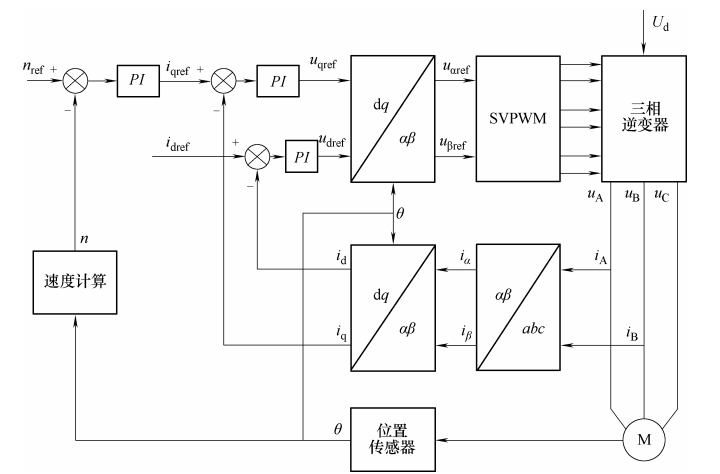

## 1. 坐标变换

### Clark 变换

PMSM 电机需要通入三相电流以产生旋转磁场，由相量法可知，三相电流可以用三个夹角为120°的相量进行表示，考虑到单独求解每一相的电流比较复杂，使用 Clark 变换将三相电流降维到静止的 $\alpha$-$\beta$ 坐标系进行降维解耦。

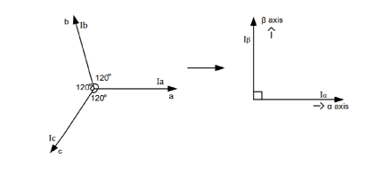

通过投影将三相电流向量投影到 $\alpha$-$\beta$ 坐标系下：
$$
i_\alpha = i_a - \frac{1}{2}i_b - \frac{1}{2}i_c \\
i_\beta = \frac{\sqrt{3}}{2}i_b + \frac{\sqrt{3}}{2}i_c
$$
即：
$$
\left[\begin{matrix}
i_\alpha \\
i_\beta
\end{matrix}\right] = P
\left[\begin{matrix}
1 & -\frac{1}{2} & -\frac{1}{2} \\
0 & \frac{\sqrt{3}}{2} & -\frac{\sqrt{3}}{2}
\end{matrix}\right]
\left[\begin{matrix}
i_a \\ 
i_b \\
i_c
\end{matrix}\right]
$$

$P$ 为系数，如果存在等幅值约束，可以得到 $P=\frac{2}{3}$；如果存在等功率约束，可以得到 $P=\sqrt{\frac{2}{3}}$。

为了使线性区调制比范围是 $[0,1]$ ，通常定义调制比为线电压幅值与直流母线电压的比值，如果采用等幅值 Clark 变换，坐标变换将不会改变电流的幅值。与等功率变换相比，等功率变换调制比范围将扩大，超出线性调制区原来的范围。所以采用等功率变换时，电流控制器输出的指令电压需要再乘以$P = \sqrt{\frac{2}{3}}$，才能给逆变器进行 PWM 调制。

为节省电流采样成本，通常使用基尔霍夫定律进行化简：
$$
i_a + i_b + i_c = 0
$$
则有：
$$
\left[\begin{matrix}
i_\alpha \\
i_\beta
\end{matrix}\right] = 
\left[\begin{matrix}
1 & 0 \\
\frac{1}{\sqrt{3}} & \frac{2}{\sqrt{3}} 
\end{matrix}\right]
\left[\begin{matrix}
i_a \\ i_b
\end{matrix}\right]
$$

### Park 变换

Clark 变换得到的 $i_\alpha$ 和 $i_\beta$ 在电机运行时仍然是变化的，为了进一步将电流和电角度解耦，可以考虑建立固连在转子上的 $d-q$ 坐标系，此时$i_d$，$i_q$和$\theta_e$被解耦。

Park 变换将定子静止的$\alpha$和$\beta$坐标系转换为固连在转子上的$d$和$q$坐标系，便于描述电机旋转时的电流规律。$d$ 轴平行于转子永磁体，$q$轴垂直于转子。$dq$坐标系相对于$\alpha \beta$坐标系旋转的角度为电角度。

$$
\left[\begin{matrix} i_d \\ i_q \end{matrix}\right] = \left[\begin{matrix} cos\theta_e & sin\theta_e \\ -sin\theta_e & cos\theta_e \end{matrix}\right] \left[\begin{matrix} i_\alpha \\ i_\beta \end{matrix}\right]
$$

$i_q$ 产生电机的力矩，是电机力矩环（电流环）的驱动目标，$i_d$ 产生电机的热量，通常需要控制为0。$\theta_e$表征电机的位置，是电机位置环的驱动目标。

## 2. 三相电压源逆变器

逆变器即 DC-AC 电路，将直流电转换为交流电。PMSM 的驱动使用三相交流电，使用三相桥式逆变器进行驱动：

$U_{dc}$称为母线电压。最普通的控制方式是方波控制：每相上下桥臂交替180度导通，每相上桥臂导通时间相差120度。

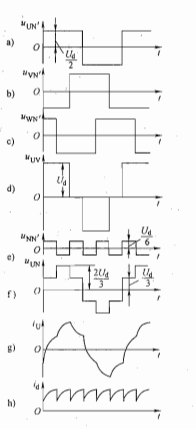

### SPWM 调制

- PWM 的基本原理：冲量相等而形状不同的窄脉冲加在具有惯性的环节上时，其效果基本相同。

  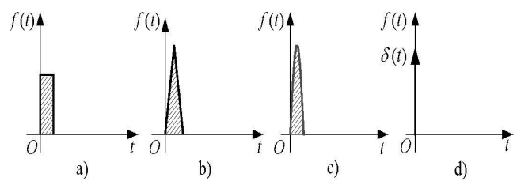

  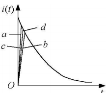

- SPWM 基本原理：

  将正弦半波沿纵向分割为N等份。当N足够大时，正弦半波就被分割成宽度相等的脉冲序列把上述脉冲序列用相同数量的等幅而不等宽的矩形脉冲
  代替，使矩形脉冲的中点和相应正弦波部分的中点重合，且使矩形脉冲的面积（冲量）和相应的正弦波部分面积（冲量）相等，这就是PWM波形。脉冲的宽度按正弦规律变化且和正弦波面积等效的PWM波形，也称SPWM（Sinusoidal PWM）波形。
  
  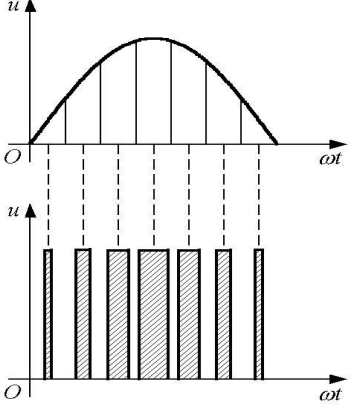
  
  - 计算法：根据正弦波频率、幅值和半周期脉冲数，准确计算PWM波各脉冲宽度和间隔，据此控制逆变电路开关器件的通断从而得到所需PWM波形的方法。缺点：计算繁琐，当输出正弦波的频率、幅值或相位变化时，开关点都要变化。
  
  - 调制法(最常用)：对脉冲的宽度进行调制的技术，即通过对一系列脉冲的宽度进行调制，来等效地获得所需要波形。
  
    在SPWM中，使用目标波形(正弦波)作为调制波，高频的锯齿波(不对称)/三角波(对称)作为高频载波，通过两个波的比较确定脉宽。
  
    - 自然采样法：在正弦波和三角波的自然交点时刻控制功率开关器件的通断。开关点求解复杂，难以在实时控制中在线计算，工程应用不多。
  
      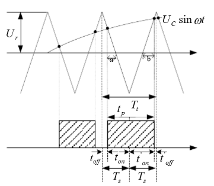
  
    - 规则采样法：对调制波进行采样，可以获得和自然采样法相近的结果，计算量小，便于在线计算。
  
      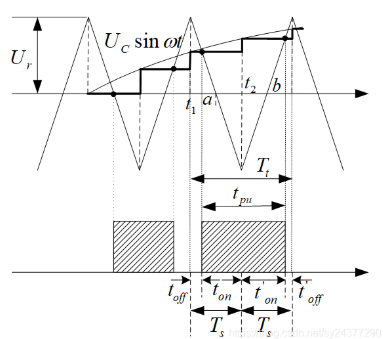
  
      
  
- 三相逆变器 SPWM 调制：

  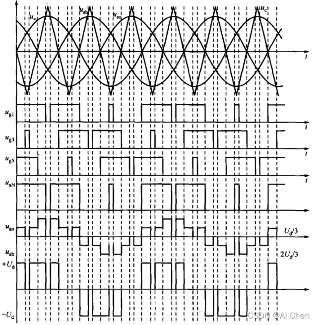

  三相SPWM逆变器输出线电压的基波幅值为$\frac{\sqrt 3}{2}mU_d$，$m$ 为调制比，在不过调制（调制波不超过载波幅值）的条件下，调制比最大为1，此时直流电压利用率为0.866，利用率比较低。

### SVPWM 调制

- 空间矢量：可以将旋转磁动势视为一个旋转的空间矢量，因此，和磁动势成比例关系的电流也是空间矢量。考虑到稳态时，电压也是一个对称正弦量，因此电压积分得到的磁链也是对称正弦量。电压型逆变器通过电压矢量生成旋转的电流矢量，从而使得电机旋转。（控制MOS管的开断可以控制三相电流流向，进而确定定子旋转磁场的方向）

  

  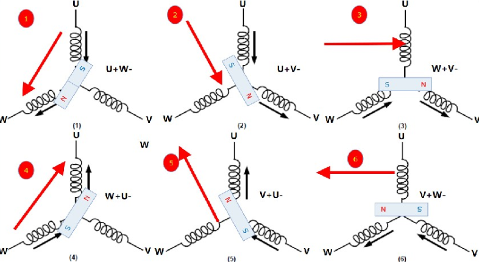

- 三相逆变器的基本电压矢量

  定义ABC三个桥臂分别有0,1两种状态，0是下管开通上管关断，1是上管开通下管关断。（同一个半桥不可同时导通上下桥臂）。考虑到不同开关模式的三相线电压状态组成不同相位的电压相量，即有6个非零矢量（001，010，011，100，101，110）和两个零矢量（000，111）。

  | $S_a$ | $S_b$ | $S_c$ | 矢量符号 | $U_a$                | $U_b$                | $U_c$                |
  | ----- | ----- | ----- | -------- | -------------------- | -------------------- | -------------------- |
  | 0     | 0     | 0     | $U_0$    | 0                    | 0                    | 0                    |
  | 1     | 0     | 0     | $U_4$    | $\frac{2}{3}V_{cc}$  | $-\frac{1}{3}V_{cc}$ | $-\frac{1}{3}V_{cc}$ |
  | 1     | 1     | 0     | $U_6$    | $\frac{1}{3}V_{cc}$  | $\frac{1}{3}V_{cc}$  | $-\frac{2}{3}V_{cc}$ |
  | 0     | 1     | 0     | $U_2$    | $-\frac{1}{3}V_{cc}$ | $\frac{2}{3}V_{cc}$  | $-\frac{1}{3}V_{cc}$ |
  | 0     | 1     | 1     | $U_3$    | $-\frac{2}{3}V_{cc}$ | $\frac{2}{3}V_{cc}$  | $\frac{2}{3}V_{cc}$  |
  | 0     | 0     | 1     | $U_1$    | $-\frac{1}{3}V_{cc}$ | $-\frac{1}{3}V_{cc}$ | $\frac{2}{3}V_{cc}$  |
  | 1     | 0     | 1     | $U_5$    | $\frac{1}{3}V_{cc}$  | $-\frac{2}{3}V_{cc}$ | $\frac{1}{3}V_{cc}$  |
  | 1     | 1     | 1     | $U_7$    | 0                    | 0                    | 0                    |

  由此可以将电压矢量分为六个扇区：

  

  当电压不在六个标准电压矢量上时，为了得到该电压矢量，通常使用互补PWM控制逆变器，再由伏秒平衡原则(一个周期内，作用时间越长，作用值越大)产生对应电压相量(即发波方式)。

- 扇区判断

  如果存在传感器，可以通过电角度直接判断电压矢量的扇区。如果为无感控制，使用 $U_\alpha$ 和 $U_\beta$ 也可进行扇区判断。

  | 扇区 | 角度条件                                                   | 比例条件                               |
  | ---- | ---------------------------------------------------------- | -------------------------------------- |
  | 1    | $0 < arctan(\frac{U_\beta}{U_\alpha}) < 60^\circ$          | $0<\frac{U_\beta}{U_\alpha}<\sqrt{3}$  |
  | 2    | $60^\circ < arctan(\frac{U_\beta}{U_\alpha}) < 120^\circ$  | $|\frac{U_\beta}{U_\alpha}|>\sqrt{3}$  |
  | 3    | $120^\circ < arctan(\frac{U_\beta}{U_\alpha}) < 180^\circ$ | $0>\frac{U_\beta}{U_\alpha}>-\sqrt{3}$ |
  | 4    | $180^\circ < arctan(\frac{U_\beta}{U_\alpha}) < 240^\circ$ | $0<\frac{U_\beta}{U_\alpha}<\sqrt{3}$  |
  | 5    | $240^\circ < arctan(\frac{U_\beta}{U_\alpha}) < 300^\circ$ | $|\frac{U_\beta}{U_\alpha}|>\sqrt{3}$  |
  | 6    | $300^\circ < arctan(\frac{U_\beta}{U_\alpha}) < 360^\circ$ | $0>\frac{U_\beta}{U_\alpha}>-\sqrt{3}$ |

  > 简化扇区判断条件：
  >
  > - $U_1$ = $U_\beta$
  > - $U_2 = \frac{\sqrt{3}}{2}U_\alpha - \frac{1}{2}U_\beta$
  > - $U_3 = - \frac{\sqrt{3}}{2}U_\alpha - \frac{1}{2}U_\beta$
  >
  > 令A，B，C，取值条件如下：
  >
  > - $U_1 > 0$，$A = 1$，反之为0；
  > - $U_2 > 0$，$B = 1$，反之为0；
  > - $U_3 > 0$，$C = 1$，反之为0；
  >
  > $N = 4C + 2B + A$，则扇区确定条件如下：
  >
  > | 扇区 | A    | B    | C    | N    |
  > | ---- | ---- | ---- | ---- | ---- |
  > | 1    | 1    | 1    | 0    | 3    |
  > | 2    | 1    | 0    | 0    | 1    |
  > | 3    | 1    | 0    | 1    | 5    |
  > | 4    | 0    | 1    | 1    | 4    |
  > | 5    | 0    | 1    | 1    | 6    |
  > | 6    | 0    | 0    | 0    | 2    |

- 发波方式：为了减少谐波且保证波形的对称性，采用七段式或五段式的发波方法。

  - 七段式发波

    以扇区1为例：

    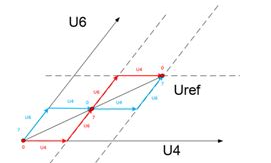

    注意，每次发波只控制一个桥臂的MOS通断。

    发波顺序：0-4-6-7-6-4-0 或 7-6-4-0-4-6-7。

    如果考虑软件的计算方便，每次发波都先发000矢量，中间插入111矢量，那么就要按照图中红色曲线发波。

    无论七段式SVPWM还是五段式SVPWM，在一个开关周期内，一个开关都只做一次动作。但是由于七段式在一个周期内比五段式多插入了一个零矢量，导致电流频率是开关频率的两倍。 同时七段式的开关损耗比五段式多了1/3。

    此时控制桥臂的互补PWM应为中心对齐模式。

  - 五段式发波
  
    五段式SVPWM，又被称为DPWM。由于其在一个开关周期内只插入了一个零矢量，是不连续的SVPWM。而在不同扇区内对零矢量的不同选择，导致了DPWM有很多个变种，每个变种对开关管的损耗、相电压的谐波都会造成不同的结果。
  
    1. DPWM有最基本的两条路径，如下图所示：
  
      如果在六个扇区内都选择插入000矢量，那么六个扇区内的矢量分别是6-4-0-4-6，6-2-0-2-6，3-2-0-2-3，3-1-0-1-3,5-1-0-1-5,5-4-0-4-5，如下图蓝色曲线；
  
      如果在六个扇区内都选择插入111矢量，那么六个扇区内的矢量分别是4-6-7-6-4，2-6-7-6-2，2-3-7-3-2，1-3-7-3-1,1-5-7-5-1,4-5-7-5-4，如下图红色曲线；
    
      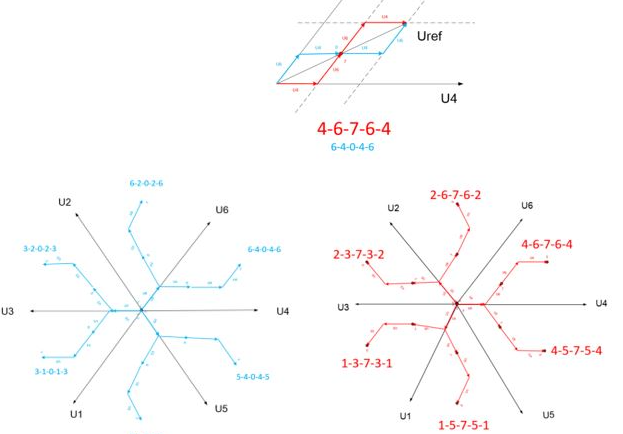
    
    2. 以上方式会导致MOS管发热不均匀，为解决此问题，采用奇数扇区插入和偶数扇区相反的零矢量：
    
       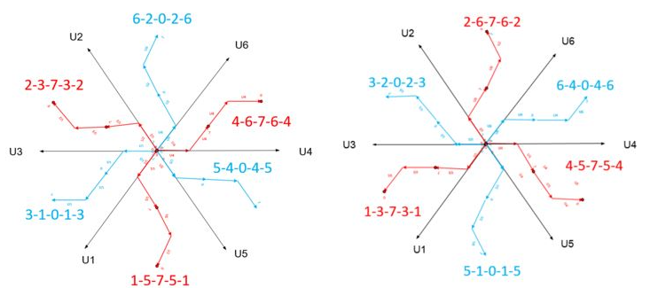
    
  
- 发波时间计算

  以第一扇区为例，按伏秒平衡的原则来合成该扇区内的任意电压矢量。式中$T$为PWM周期，$\frac{T_4}{T}$为$U_4$对应的占空比。

  $U_{ref}T = U_4T_4 + U_6T_6 + U_0(T - T_4-T_6)$

  以此类推：

  | 扇区 | N    | $T_x$                                                        | $T_y$                                                        |
  | ---- | ---- | ------------------------------------------------------------ | ------------------------------------------------------------ |
  | 1    | 3    | $\frac{\sqrt{3}T_S}{U_{dc}}(\frac{\sqrt{3}}{2}U_\alpha - \frac{1}{2}U_\beta)$ | $\frac{\sqrt{3}T_S}{U_{dc}}U_\beta$                          |
  | 2    | 1    | $\frac{\sqrt{3}T_S}{U_{dc}}(-\frac{\sqrt{3}}{2}U_\alpha + \frac{1}{2}U_\beta)$ | $\frac{\sqrt{3}T_S}{U_{dc}}(\frac{\sqrt{3}}{2}U_\alpha + \frac{1}{2}U_\beta)$ |
  | 3    | 5    | $\frac{\sqrt{3}T_S}{U_{dc}}U_\beta$                          | $ - \frac{\sqrt{3}T_S}{U_{dc}}(\frac{\sqrt{3}}{2}U_\alpha + \frac{1}{2}U_\beta)$ |
  | 4    | 4    | $- \frac{\sqrt{3}T_S}{U_{dc}}U_\beta$                        | $\frac{\sqrt{3}T_S}{U_{dc}}(- \frac{\sqrt{3}}{2}U_\alpha + \frac{1}{2}U_\beta)$ |
  | 5    | 6    | $- \frac{\sqrt{3}T_S}{U_{dc}}(\frac{\sqrt{3}}{2}U_\alpha + \frac{1}{2}U_\beta)$ | $- \frac{\sqrt{3}T_S}{U_{dc}}(- \frac{\sqrt{3}}{2}U_\alpha + \frac{1}{2}U_\beta)$ |
  | 6    | 2    | $\frac{\sqrt{3}T_S}{U_{dc}}(\frac{\sqrt{3}}{2}U_\alpha + \frac{1}{2}U_\beta)$ | $- \frac{\sqrt{3}T_S}{U_{dc}}U_\beta$                        |

- PWM占空比计算

  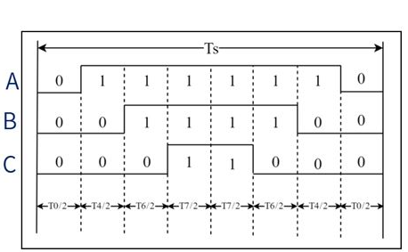

  如图，以第一扇区为例，由于发波需要对称，所以零矢量被均分为两段。

  以此类推：

  | 扇区 | N    | $T_a$                       | $T_b$                       | $T_c$                       |
  | ---- | ---- | --------------------------- | --------------------------- | --------------------------- |
  | 1    | 3    | $\frac{T_s - T_x - T_y}{4}$ | $\frac{T_s + T_x - T_y}{4}$ | $\frac{T_s + T_x + T_y}{4}$ |
  | 2    | 1    | $\frac{T_s + T_x - T_y}{4}$ | $\frac{T_s - T_x - T_y}{4}$ | $\frac{T_s + T_x + T_y}{4}$ |
  | 3    | 5    | $\frac{T_s + T_x + T_y}{4}$ | $\frac{T_s - T_x - T_y}{4}$ | $\frac{T_s + T_x - T_y}{4}$ |
  | 4    | 4    | $\frac{T_s + T_x + T_y}{4}$ | $\frac{T_s + T_x - T_y}{4}$ | $\frac{T_s - T_x - T_y}{4}$ |
  | 5    | 6    | $\frac{T_s + T_x - T_y}{4}$ | $\frac{T_s + T_x + T_y}{4}$ | $\frac{T_s - T_x - T_y}{4}$ |
  | 6    | 2    | $\frac{T_s - T_x - T_y}{4}$ | $\frac{T_s + T_x + T_y}{4}$ | $\frac{T_s + T_x - T_y}{4}$ |

## 3. 电流环控制

### 电流环PI控制

dq 坐标系下的电压方程可以表示为：
$$
\begin{cases}
\frac{d}{dt}i_d = -\frac{R_s}{L_d}i_d+\frac{L_q}{L_d}\omega_ei_q+\frac{1}{L_d}u_d \\
\frac{d}{dt}i_q = -\frac{R_s}{L_d}i_d+\frac{1}{L_q}\omega_e(L_di_d+\psi_f)+\frac{1}{L_q}u_q
\end{cases}
$$
定子电流分别在q轴和d轴产生耦合电动势，对上述方程进行解耦得到变换后的电压 $u_{d0}$ 和 $u_{q0}$ ：
$$
\begin{cases}
u_{d0} = u_d + \omega_eL_qi_q = Ri_d+L_d\frac{d}{dt}i_d \\
u_{q0} = u_q - \omega_e(L_di_d+\psi_f)=Ri_q+L_q\frac{d}{dt}i_q
\end{cases}
$$
 拉氏变换得到：
$$
\begin{bmatrix}
u_{d0} \\
u_{q0}
\end{bmatrix} 
=
\begin{bmatrix}
R_s+sL_d & 0 \\
0 & R_s+sL_q
\end{bmatrix} 
\begin{bmatrix}
i_d \\
i_q
\end{bmatrix}
$$
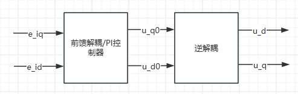

采用 PI 控制器后可以得到输出方程为：
$$
\begin{cases}
u_d^* = (K_{pd}+\frac{K_{id}}{s})(i_d^*-i_d)-\omega_eL_qi_q \\
u_q^* = (K_{pq}+\frac{K_{iq}}{s})(i_q^*-i_q)+\omega_e(L_di_d+\psi_f)
\end{cases}
$$
如果使用前馈解耦（考虑反电动势时），虽然 PI 控制器的参数可以按照典型Ⅰ型系统进行设计，但该方法却仅当电机的实际参数与模型参数匹配时，交叉耦合电动势才能得到完全解耦。再考虑到模型误差，应当采用采用模型精度要求低且对参数变化不灵敏的控制方式。

- 内模控制进行PI参数整定

  [参考资料1](https://www.bilibili.com/read/cv24581856/)

  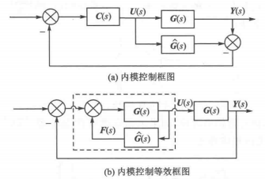

  $\hat{G(s)}$ 为过程模型， $G(s)$ 为被控过程， $C(s)$ 为内模控制器。

  对上述系统进行相加点交换，得到等效控制器：
  $$
  C^*(s) = \frac{C(s)}{1-C(s)\hat{G(s)}}
  $$
  系统闭环响应为：
  $$
  Y(s) = \frac{C(s)G(s)}{1+C(s)(G(s)-\hat{G(s)})}X(s)
  $$
  反馈信号为：
  $$
  F(s) = (G(s)-\hat G(s))U(s)
  $$
  模型精确时， $G(s) = \hat{G(s)}$ ，反馈信号为0，则在模型精确和无外界扰动输入的条件下，内模控制具有开环结构，且稳定性取决于控制器和被控过程。对开环稳定的过程而言，反馈的目的是克服过程的不确定性。也就是说，如果过程和过程输入都完全清楚，只需要前馈（开环）控制，而不需要反馈（闭环）控制。事实上，在工业过程控制中，克服扰动是控制系统的主要任务，而模型不确定性也是难免的。此时，反馈信号就反映了过程模型的不确定性和扰动的影响，从而构成了闭环控制结构。

  当被控过程稳定且模型精确 $G(s) = \hat{G(s)}$ 时，设计控制器使得 $ C(s) = \hat{G(s)}^{-1}$ 可以使得系统输出值都等于系统输入设定值。

  设计控制器时，通常需要加上滤波器从而保证系统的稳定性和鲁棒性。 使得：
  $$
  C(s) = \hat{G(s)}^{-1} \frac{1}{(Ts+1)^\gamma}
  $$

  因此，整定过程如下：

  [参考资料2](https://www.bilibili.com/read/cv25000595/)

  1. 求得内模控制器
  $$
  C(s) = \hat{G(s)}^{-1} \frac{1}{(Ts+1)^\gamma}
  $$
  基于内模控制的PID控制器设计中可以允许 $C(s)$ 的分子阶数大于分母的阶数。 由于电机的电磁时间常数比机械时间常数小很多，控制系统的电流环可近似视为一阶系统，取滤波器参数为1。
  $$
  G(s) = \hat{G(s)} = \begin{bmatrix}
  R_s+sL_d & 0 \\
  0 & R_s+sL_q
  \end{bmatrix}
  $$
  2. 求得内模控制的等效反馈控制器
  $$
  C^*(s) = \frac{C(s)}{1-C(s)\hat{G(s)}}
  $$
  求得：
  $$
  C^*(s) = \alpha 
  \begin{bmatrix}
  L_d+\frac{R}{s} & 0 \\
  0 & L_q+\frac{R}{s}
  \end{bmatrix}
  $$
  3. 通过比较内模控制的等效反馈控制器与PID控制器的标准形式，则可求得PID的控制参数。对于一阶系统，采用PI控制形式就可，对于二阶系统，采用PID控制形式即可。
  $$
  \begin{cases}
  K_{pd} = \alpha L_d \\
  K_{id} = \alpha R_s \\
  K_{pq} = \alpha L_q \\
  K_{iq} = \alpha R_s
  \end{cases}
  $$
  4. 通过调节滤波器参数去平衡PID控制的动态性能和稳态误差。

## 3. 速度环控制

速度 PI 控制器的 PI 参数如下：
$$
\begin{cases}
K_{p\omega} = \frac{\beta J}{1.5p\psi_f} \\
K_{i\omega} = \beta K_{p\omega}
\end{cases}
$$
电机的转动惯量都很难得到一个较准确的值，一些电机出厂铭牌中也少有提到，根据经验值可以自己判断（即使用手动调参法）。