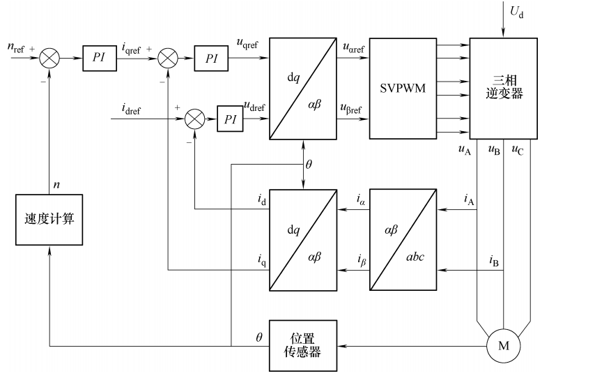
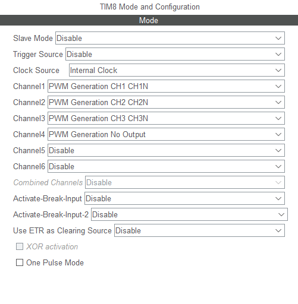
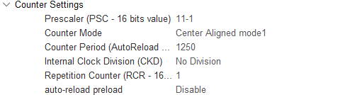
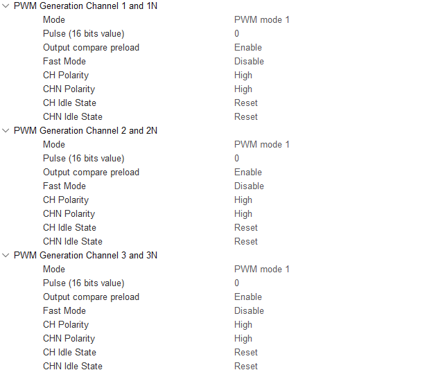
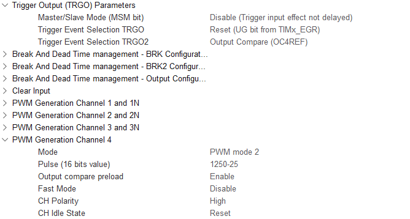
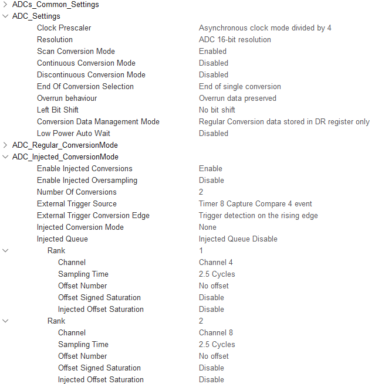

# Engine FOC 代码构建



## 1. 坐标变换模块

```c
/**
 * @brief       ABC 轴系转换到 alpha_beta 轴系
 * @param[in]       abc             ABC坐标系物理量
 * @param[out]      alpha_beta      alpha-beta坐标系物理量
 */
void abc_2_alphabeta(abc_t *abc, alpha_beta_t *alpha_beta)
{
    alpha_beta->alpha = sqrtf(2.f / 3.f) * ((1.f) * abc->a - (0.5f) * abc->b - (0.5f) * abc->c);
    alpha_beta->beta  = sqrtf(2.f / 3.f) * ((0.f) * abc->a + (sqrtf(3.f) / 2.f) * abc->b - (sqrtf(3.f) / 2.f) * abc->c);
}

/**
 * @brief       ABC 轴系转换到 dq 轴系
 * @param[in]       abc             ABC坐标系物理量
 * @param[out]      dq              dq坐标系物理量
 * @param[in]       theta           电角度
 */
void abc_2_dq(abc_t *abc, dq_t *dq, float theta)
{
    dq->d = (2.f / 3.f) * ((cosf(theta))*abc->a + (cosf(theta - 2.f * M_PI / 3.f)) * abc->b + (cosf(theta + 2.f * M_PI / 3.f)) * abc->c);
    dq->q = -(2.f / 3.f) * ((sinf(theta))*abc->a + (sinf(theta - 2.f * M_PI / 3.f)) * abc->b - (sinf(theta + 2.f * M_PI / 3.f)) * abc->c);
}

/**
 * @brief       alpha_beta 轴系转换到 ABC 轴系
 * @param[in]       alpha_beta      alpha-beta坐标系物理量
 * @param[out]      abc             ABC坐标系物理量
 */
void alphabeta_2_abc(alpha_beta_t *alpha_beta, abc_t *abc)
{
    abc->a = sqrtf(2.f / 3.f) * ((1.f) * alpha_beta->alpha - (0.f) * alpha_beta->beta);
    abc->b = sqrtf(2.f / 3.f) * (-(0.5f) * alpha_beta->alpha + (sqrtf(3.f) / 2.f) * alpha_beta->beta);
    abc->c = sqrtf(2.f / 3.f) * (-(0.5f) * alpha_beta->alpha - (sqrtf(3.f) / 2.f) * alpha_beta->beta);
}

/**
 * @brief       alpha_beta 轴系转换到 dq 轴系
 * @param[in]   alpha_beta          alpha-beta坐标系物理量
 * @param[out]  dq                  dq坐标系物理量
 * @param[in]   theta               电角度
 */
void alphabeta_2_dq(alpha_beta_t *alpha_beta, dq_t *dq, float theta)
{
    dq->d = (cosf(theta))*alpha_beta->alpha + (sinf(theta))*alpha_beta->beta;
    dq->q = -(sinf(theta))*alpha_beta->alpha + (cosf(theta))*alpha_beta->beta;
}

/**
 * @brief       dq 轴系转换到 abc 轴系
 * @param[in]   dq                  dq坐标系物理量
 * @param[out]  abc                 ABC坐标系物理量
 * @param[in]   theta               电角度
 */
void dq_2_abc(dq_t *dq, abc_t *abc, float theta)
{
    abc->a = cosf(theta) * dq->d - sinf(theta) * dq->q;
    abc->b = cosf(theta - 2.f * M_PI / 3.f) * dq->d - sinf(theta - 2.f * M_PI / 3.f) * dq->q;
    abc->c = cosf(theta + 2.f * M_PI / 3.f) * dq->d - sinf(theta + 2.f * M_PI / 3.f) * dq->q;
}

/**
 * @brief       dq 轴系转换到 alpha_beta 轴系
 * @param[in]   dq                  dq坐标系物理量
 * @param[out]  alpha_beta          alpha-beta坐标系物理量
 * @param[in]   theta               电角度
 */
void dq_2_alphabeta(dq_t *dq, alpha_beta_t *alpha_beta, float theta)
{
    alpha_beta->alpha = (cosf(theta))*dq->d - (sinf(theta))*dq->q;
    alpha_beta->beta  = (sinf(theta))*dq->d + (cosf(theta))*dq->q;
}
```

> 上述代码是使用 FPU 浮点运算单元后的代码。

## 2. SVPWM 模块

```c
/**
 * @brief       SVPWM 占空比生成函数
 * @attention   使用三次谐波注入法
 * @param       u_ref       参考电压
 * @param       u_dc         母线电压
 * @param       duty_abc   输出占空比
 */
void e_svpwm(abc_t *u_ref, float u_dc, duty_abc_t *duty_abc)
{
    float ua_ref_eq  = u_ref->a + 0.5f * get_middle(u_ref->a, u_ref->b, u_ref->c);
    duty_abc->dutya = 0.5f + ua_ref_eq / u_dc;
    float ub_ref_eq  = u_ref->b + 0.5f * get_middle(u_ref->a, u_ref->b, u_ref->c);
    duty_abc->dutyb = 0.5f + ub_ref_eq / u_dc;
    float uc_ref_eq  = u_ref->c + 0.5f * get_middle(u_ref->a, u_ref->b, u_ref->c);
    duty_abc->dutyc = 0.5f + uc_ref_eq / u_dc;
}
```

## 3. 增量式 PID 模块

```c
/**
 * @brief   通用 PID 控制器初始化
 * @param   pid         PID 控制器句柄
 * @param   kp          Kp
 * @param   ki          Ki
 * @param   kd          Kd
 * @param   outputMax   最大输出值
 * @attention   PID 为增量式
 */
void PID_init(PID_t *pid, float kp, float ki, float kd, float outputMax)
{
    pid->KP        = kp;
    pid->KI        = ki;
    pid->KD        = kd;
    pid->outputMax = outputMax;
}

/**
 * @brief   增量式PID计算
 */
void PID_Calc(PID_t *pid, uint8_t enable, float t_sample)
{
    pid->ref       = pid->ref * enable;
    pid->fdb       = pid->fdb * enable;
    pid->cur_error = pid->ref - pid->fdb;
    pid->output += pid->KP * (pid->cur_error - pid->error[1]) + pid->KI * t_sample * pid->cur_error + pid->KD * (pid->cur_error - 2 * pid->error[1] + pid->error[0]);
    pid->output   = pid->output * enable;
    pid->error[0] = pid->error[1];
    pid->error[1] = pid->ref - pid->fdb;
    /*设定输出上限*/
    if (pid->output > pid->outputMax) pid->output = pid->outputMax;
    if (pid->output < -pid->outputMax) pid->output = -pid->outputMax;
}
```

## 4. 角度获取

角度获取应当注意：

1. 机械角度零点和电角度零点之间存在偏置。该偏置可以通过以下方法得到：

   将转子对齐A轴，生成指向A轴的电压矢量，此时为电角度零点。

   > - $U_d=u_d,U_q=0,θ_e=0$；
   > - $U_d=0,U_q=u_q,θ_e=270°$。

2. 电角度正方向和机械角度正方向需要确定，开环转动时观察编码器数据是否是同一个增长方向的。

```c
/**
 * @brief   机械角度转换为电角度函数并归一化
 */
float normalize(int pole_pairs, float mechine_angle, float offset)
{
    float electric_angle = pole_pairs * mechine_angle - offset;
    float out            = electric_angle;
    while (out < -M_PI) {
        out = out + 2 * M_PI;
    }
    while (out > M_PI) {
        out = out - 2 * M_PI;
    }
    return out;
}
```

## 5. 时序配置

> 要点：ADC采样中断，TIM更新中断（**重复计数器和影子寄存器**）

- PWM 配置

  

  > 使用高级定时器的互补 PWM 输出通道1，2，3；同时使用一个内部 PWM 通道用以控制电流采样时序。

  - 时基单元配置

    

    > 1. 中心对齐模式(1,2,3均可,因为不使用比较中断)；
    > 2. 重复计数器RCR：设置为1，仅在下溢时执行改变占空比动作（保证波形完整）；
    > 3. 计数频率和定时器频率：尽量增大 ARR 值获得较高的分辨率（10kHz 逆变器开关频率）。

  - PWM 输出配置

    

    > 1. PWM 模式1，高极性：上桥臂通道两端高电平，中间低电平。此时占空比和CCR值成正比。
    >
    >    ```c
    >                TIM8->CCR1 = Load_duty_abc.dutya * TIM8->ARR;
    >                TIM8->CCR2 = Load_duty_abc.dutyb * TIM8->ARR;
    >                TIM8->CCR3 = Load_duty_abc.dutyc * TIM8->ARR;
    >    ```

  - PWM 死区配置

    

    > 1. 死区时间：
    >    $$
    >    50 \times \frac{1}{275M} = 0.182\mu s
    >    $$

  - ADC 触发源配置

    

    > 1. 选择TRGO触发源（任意）为通道4的比较触发，考虑到ADC在上升沿时触发，通道4配置为PWM模式2且距离计数中心有一定距离（自行测量）。此时在三角波顶点会进行一次ADC采样。

- ADC 配置（相电流采样）

  由于相电流采样，ADC 配置无需十分严格。

  

  > 1. 4分频 APB2 时钟获得 ADCCLK，采用 16 位 ADC。
  > 2. 采样三相电流尽量使用注入组通道，设置两个注入组（AB相电流）。配置为定时器的比较事件触发（上升沿）；
  > 3. 采样总时长设置为 14 个 ADCCLK。

## 6. 电流采样

### 相电流采样

考虑到交变电流的方向性，硬件采样电路必然会在 ADC 输入时加入偏置。该偏置应当在 FOC 初始化前通过采样零电流得出。

```c
/**
 * @brief   将 ADC 值转换为电流值
 * @param   curr_sample     电机采样电流结构体指针
 */
void adc_2_curr(curr_sample_t *curr_sample)
{
    curr_sample->curr_u = 9.6f * (curr_sample->adc_val_u - curr_sample->adc_val_u_offset) * 3.3f / 65535.f;
    curr_sample->curr_v = 9.6f * (curr_sample->adc_val_v - curr_sample->adc_val_v_offset) * 3.3f / 65535.f;
    curr_sample->curr_w = -curr_sample->curr_u - curr_sample->curr_v;
}
```

## 7. FOC 流程

```c
/**
 * @brief   ADC 注入组转换中断函数
 * @note	采样后执行 FOC 计算，SVPWM 输出延迟一个载波周期。
 */
void HAL_ADCEx_InjectedConvCpltCallback(ADC_HandleTypeDef *hadc)
{
    static int adc_cnt               = 0;
    static uint32_t adc_u_offset_sum = 0;
    static uint32_t adc_v_offset_sum = 0;
    UNUSED(hadc);
    if (hadc == &hadc1) {
        // Read Offset
        if (Load_curr.sample_flag == CURR_SAMPLE_GET_OFFSET) {
            adc_u_offset_sum += hadc1.Instance->JDR1;
            adc_v_offset_sum += hadc1.Instance->JDR2;
            adc_cnt++;
            if (adc_cnt == 20) {
                adc_cnt                    = 0;
                Load_curr.adc_val_u_offset = adc_u_offset_sum / 20.0f;
                Load_curr.adc_val_v_offset = adc_v_offset_sum / 20.0f;
                Load_curr.sample_flag      = CURR_SAMPLE_RUNNING;
                adc_u_offset_sum           = 0;
                adc_v_offset_sum           = 0;
            }
        }
        // Read Current
        else {
            Load_curr.adc_val_u = hadc1.Instance->JDR1;
            Load_curr.adc_val_v = hadc1.Instance->JDR2;
            adc_2_curr(&Load_curr);
            Load_iabc.a = Load_curr.curr_u;
            Load_iabc.b = Load_curr.curr_v;
            Load_iabc.c = Load_curr.curr_w;
            // software protection
            if ((Load_iabc.a * Load_iabc.a > 1 * 1) || (Load_iabc.b * Load_iabc.b > 1 * 1) || (Load_iabc.c * Load_iabc.c > 1 * 1)) {
                system_enable = 0;
            }
        }
    }
    // 角度和速度采样
    AD2S1210_Angle_Get();
    AD2S1210_Speed_Get(system_sample_time);

    // 采样电流变换为 dq 轴电流
    abc_2_dq(&Load_iabc, &Load_idq, Load_AD2S.Electrical_Angle);

    // 速度 PI 控制器计算
    Load_speed_pi.ref = load_speed_ref;
    Load_speed_pi.fdb = Load_AD2S.Speed;
    PID_Calc(&Load_speed_pi, system_enable, system_sample_time);

    // 电流 PI 控制器计算(id = 0)
    // d轴
    Load_id_pi.ref = 0;
    Load_id_pi.fdb = Load_idq.d;
    PID_Calc(&Load_id_pi, system_enable, system_sample_time);
    Load_udq.d = Load_id_pi.output;

    // q轴
    Load_iq_pi.ref = Load_speed_pi.output;
    Load_iq_pi.fdb = Load_idq.q;
    PID_Calc(&Load_iq_pi, system_enable, system_sample_time);
    Load_udq.q = Load_iq_pi.output;

    // SVPWM
    dq_2_abc(&Load_udq, &Load_uabc, Load_AD2S.Electrical_Angle);
    e_svpwm(&Load_uabc, 101, &Load_duty_abc);
}

/**
 * @brief   定时器中断
 * @note	载波下溢时执行
 */
void HAL_TIM_PeriodElapsedCallback(TIM_HandleTypeDef *htim)
{
    if (htim->Instance == TIM8) {
        // Inverter
        if (system_enable == 0) {
            TIM8->CCR1 = 0;
            TIM8->CCR2 = 0;
            TIM8->CCR3 = 0;
        } else {
            TIM8->CCR1 = Load_duty_abc.dutya * TIM8->ARR;
            TIM8->CCR2 = Load_duty_abc.dutyb * TIM8->ARR;
            TIM8->CCR3 = Load_duty_abc.dutyc * TIM8->ARR;
        }
    }
}

/**
 * @brief   Init Program
 */
static void init(void)
{
    // Wait
    HAL_Delay(50);
    // Init AD2S1210
    // Encoder Init
    AD2S1210_Init();
    // Init parameters
    system_enable              = 0;
    Load_udq.d                 = 0;
    Load_udq.q                 = 0;
    load_speed_ref             = 0;
    Load_curr.adc_val_u_offset = 0;
    Load_curr.adc_val_v_offset = 0;
    Load_curr.sample_flag      = CURR_SAMPLE_GET_OFFSET; // Read ADC Offset
    PID_init(&Load_id_pi, 0.02, 50, 0, 50);
    PID_init(&Load_iq_pi, 0.02, 50, 0, 50);
    PID_init(&Load_speed_pi, 0.1, 0.1, 0, 1);
    // Current Sample
    HAL_ADCEx_Calibration_Start(&hadc1, ADC_CALIB_OFFSET, ADC_SINGLE_ENDED);
    __HAL_ADC_CLEAR_FLAG(&hadc1, ADC_FLAG_JEOC);
    __HAL_ADC_CLEAR_FLAG(&hadc1, ADC_FLAG_EOC);
    HAL_TIM_PWM_Start(&htim8, TIM_CHANNEL_4);
    HAL_ADCEx_InjectedStart_IT(&hadc1);
    // Wait for Read ADC Offset
    while (Load_curr.sample_flag == CURR_SAMPLE_GET_OFFSET) {
        ;
    }
    // Open Inverter
    HAL_TIM_Base_Start_IT(&htim8);
    HAL_TIM_PWM_Start(&htim8, TIM_CHANNEL_1);
    HAL_TIM_PWM_Start(&htim8, TIM_CHANNEL_2);
    HAL_TIM_PWM_Start(&htim8, TIM_CHANNEL_3);
    HAL_TIMEx_PWMN_Start(&htim8, TIM_CHANNEL_1);
    HAL_TIMEx_PWMN_Start(&htim8, TIM_CHANNEL_2);
    HAL_TIMEx_PWMN_Start(&htim8, TIM_CHANNEL_3);
}
```

- FOC 搭建过程

  1. 实现各个模块（Part1-4）；

  2. 开环转动：实现一个电角度生成模块，用一个旋转的电压矢量直接拖动电机旋转（开环旋转），在此环节进行编码器偏移整定和方向整定（不必像SimpleFOC进行初始化整定）

  3. 电流闭环：先测量电机的电感和电阻参数得到大概的电流环PI参数。

     然后给定 d 轴电流（q轴 PI 控制器禁止输出，因为电机会转动），电机是不转动的（此操作为直流操作，应当快速进行），进行PI整定。得到 d 轴参数后，q 轴参数大概是确定的（强制堵转进行整定）。

  4. 速度闭环：普通的 PI 调节。
