# Engine 快速数学计算

> 1. 这里的快速算法适用于浮点数系统。
> 2. 对于 STM32F4 ，使用快速数学计算能够提高计算速度；**但是在 STM32H7 上的测试中，快速数学计算结果和直接调用 `math.h` (开启 FPU) 的结果几乎一致，甚至使用 `math.h` 的运算速度略微更快**。
> 3. 使用快速计算的意义在于：在中断中进行数学计算时大幅压缩时间以避免中断超时。

## 0. 检测代码的运行时间

检测代码运行时间的最简单手段是：在代码入口和出口处设置一个 GPIO 电平设置代码。随后用示波器直接检测 GPIO 的电平保持时间。

实际上，最耗费时间的代码是以下几种：

> 1. 大量的循环；
> 2. 所有通信；（提高通信速率可以压缩时间）
> 3. 数学计算。（尤其是没有 FPU 的单片机）

## 1. sin/cos() 快速算法

1. 泰勒展开法

   $$
   sinx = x - \frac{x^3}{3!} + \frac{x^5}{5!} -\frac{x^7}{7!} + ...
   $$

   其中，$x$ 是以弧度为单位的角度，级数的每一项符号交替变化，且指数和阶乘的指数依次递增2。

   代码实现（使用时入口处可以加入归一化代码）：

   ```c
   float fast_sin(float x)
   {
       while (x < 0) {
           x += 2 * M_PI;
       }
       while (x >= 2 * M_PI) {
           x -= 2 * M_PI;
       }
       
       float result = 0.0;
       float term = x;          // 第一项的值为x
       float denominator = 1.0; // 分母初始值为1
       int sign = 1;            // 符号标志，初始为正
       result += term;
       for (int i = 1; i <= 7; i++)
       {
           denominator *= (2 * i) * (2 * i + 1); // 计算下一项的分母
           term *= x * x;                        // 计算下一项的分子
           sign *= -1;                           // 更新符号
           result += sign * term / denominator;  // 计算当前项的值并累加到结果中
       }
       return result;
   }
   ```

   取 7 项在 float 中可以达到精度基本一致，但是由于有循环，仍然比较耗时。

2. 查表法

   预先生成一个有 N 个正弦值的表（ $0 - 2\pi$ 采样 N 个角度，N 越大精度越高）。

   使用 Matlab 生成：

   ```matlab
   % 示例使用
   num_points = 1024; % 正弦表的点数
   filename = 'sine_table.c'; % 输出文件名
   print_sine_table_c_format(num_points, filename);
   
   % 生成正弦表并打印为 C 语言 float 数组格式
   function print_sine_table_c_format(num_points, filename)
       % num_points 是正弦表的点数
       % filename 是输出文件名
       angles = linspace(0, 2 * pi, num_points); % 生成0到2π之间的角度值
       sin_table = sin(angles); % 计算正弦值
   
       % 打开文件进行写入
       fileID = fopen(filename, 'w');
       if fileID == -1
           error('无法打开文件进行写入');
       end
   
       % 写入 C 语言数组格式
       fprintf(fileID, 'float sin_table[%d] = {\n', num_points);
       for i = 1:num_points
           fprintf(fileID, '    %.6f', sin_table(i));
           if mod(i, 4) == 0
               fprintf(fileID, '\n');
           else
               fprintf(fileID, ',');
           end
       end
       fprintf(fileID, '};\n');
       fclose(fileID);
   
       fprintf('正弦表已成功写入文件: %s\n', filename);
   end
   ```

   随后使用查找法和线性插值：

   ```c
   float fast_sin(float x)
   {
       while (x < 0) {
           x += 2 * M_PI;
       }
       while (x >= 2 * M_PI) {
           x -= 2 * M_PI;
       }
   
       int index        = (int)((x / (2 * M_PI)) * M_TABLE_SIZE);
       float fractional = ((x / (2 * M_PI)) * M_TABLE_SIZE) - index;
   
       float y0 = sin_table[index];
       float y1 = sin_table[(index + 1) % M_TABLE_SIZE];
       return y0 + fractional * (y1 - y0);
   }
   ```

   该方法以空间换时间，存储空间充足时，推荐采用此法。

## 2. sqrt() 快速算法

1. 使用移位操作进行计算

   ```c
   float fast_sqrt(float x)
   {
       float xhalf = 0.5f * x;
       int i       = *(int *)&x;                 // get bits for floating VALUE
       i           = 0x5f375a86 - (i >> 1);      // gives initial guess y0
       x           = *(float *)&i;               // convert bits BACK to float
       x           = x * (1.5f - xhalf * x * x); // Newton step, repeating increases accuracy
       x           = x * (1.5f - xhalf * x * x); // Newton step, repeating increases accuracy
       x           = x * (1.5f - xhalf * x * x); // Newton step, repeating increases accuracy
       return 1 / x;
   }
   ```

   非常快速的算法，多次使用牛顿迭代法（最后一行）可以提高精度。

## 3. CORDIC 算法

CORDIC 是坐标旋转数字计算机算法的简称，由 Vloder 于 1959 年在设计美国航空导航控制系统的过程中首先提出, 主要用于解决导航系统中三角函数、反三角函数和开方等运算的实时计算问题。1971 年，Walther 将圆周系统、线性系统和双曲系统统一到一个 CORDIC 迭代方程里，从而提出了一种统一的 CORDIC 算法形式。

CORDIC 算法应用广泛，如离散傅里叶变换、离散余弦变换、离散 Hartley 变换、Chirp-Z 变换、 各种滤波以及矩阵的奇异值分解中都可应用 CORDIC 算法。从广义上讲，CORDIC 算法提供了一种数学计算的逼近方法。 由于它最终可分解为一系列的加减和移位操作，故非常适合硬件和嵌入式实现。

### 圆周系统 CORDIC 算法

在圆周系统下，CORDIC 算法解决了三角函数的计算问题，其中圆周系统又分旋转模式和向量模式。

#### 旋转模式

在单位圆上，向量 $\vec{OP}$ 与 X 轴正半轴夹角为 $\alpha$，故 P 点坐标可表示为 $(cos\alpha,sin\alpha)$。

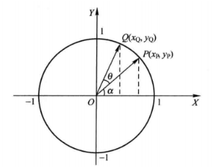

将向量 $\vec{OP}$ 逆时针旋转 $θ$ 角至向量 $\vec{OQ}$ ，此时 $\vec{OQ}$ 与 X 轴正半轴夹角为 $α+θ$ ，故 Q 点坐标可以表示为 $(cos(\alpha+\theta),sin(\alpha+\theta))$。

从而有：
$$
x_Q = x_P cos\theta - y_P sin\theta \\
y_Q = y_P cos\theta + x_P sin\theta
$$
提出余弦量：
$$
x_Q = cos\theta(x_P-y_P tan\theta) \\
y_Q = cos\theta(y_P+x_P tan\theta)
$$
$cosθ$ 只是改变了目标向量 $\vec{OQ}$ 的模长。如果去掉 $cosθ$ ， 此时 $\vec{OP}$ 旋转 $θ$ 角之后到达 $\vec{OR}$ ， 这种旋转称之为伪旋转（Pseudo Rotation)。可通过对伪旋转的输出加以补偿来获得真实旋转的结果。

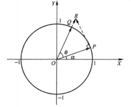

对于伪旋转，可将 $θ$ 分解为一系列的微小角度的和，即：
$$
\theta = \sum_{i=0}^{\infty} \theta_i
$$
将一次旋转分解成为一系列的微旋转。
$$
x_{i+1} = x_{i}-y_{i} tan\theta_i\\
y_{i+1} = y_{i}+x_{i} tan\theta_i
$$
定义每次旋转的步长：
$$
\theta_i = arctan(d_i2^{-i}) \\
d_i∈\{-1,1\}
$$
此时每次伪旋转只需要加法、减法和移位操作即可完成。

为了确定 $d_i$ 的值，引入一个新的变量 $z$：
$$
z_{i+1} = z_i-d_iarctan2^{-i}
$$
$z$ 初始化为 $\theta$，根据条件，对 $z_i$ 执行加或者减 $arctan2^{-i}$ 操作，使得 $z$ 的最终值为 0，该条件由 $d_i$ 决定，即：
$$
d_i = 
\left\{  
\begin{array}{**lr**}  
+1,z_i \geq 0 \\
-1,z_i \leq 0 \\
\end{array}  
\right.
$$
$d_i$ 为 +1 时表示逆时针旋转，为-1时表示顺时针旋转。$z$ 的迭代过程是将 $z$ 收敛于零的过程，也正是将 $θ$ 分解为一系列 $θ_i$ 的过程，**故 $z_i$ 可认为是第 $i$ 次旋转剩余的角度**。

- $\theta_i$ 的值

  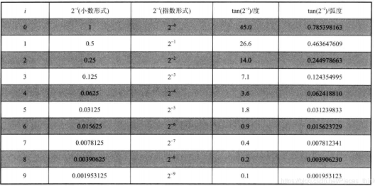

- 在很多场合中需要目标旋转角度可以覆盖 $[-180°,180°]$，这就需要预处理。

  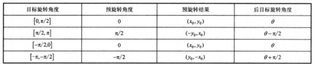
  $$
  x_{pre} = x_0 cos(\pi/2) - y_0 sin(\sigma \pi/2) = -\sigma y_0 \\
  y_{pre} = y_0 cos(\pi/2) + x_0 sin(\sigma \pi/2) = \sigma x_0 \\
  z_{pre} = z_0 - \sigma\pi/2 \\
  \sigma = sgn(z_0)
  $$
  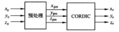

- 伪旋转补偿

  每次伪旋转都导致向量模长发生了变化。以 $K_i$ 表示第 i 次伪旋转模长补偿因子，故第 $i$ 次伪旋转真实旋转的结果应为：
  $$
  x_{i+1} = K_i(x_{i}-y_{i} d_i2^{-i})\\
  y_{i+1} = K_i(y_{i}+x_{i} d_i2^{-i})
  $$
  实际上：$K_i = cos\theta_i = \frac{1}{\sqrt{1+2^{-2i}}}$。

  n 次伪旋转的补偿乘积趋近于 0.607252935。

- 计算正弦和余弦函数

  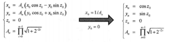

  ```c
  #define N 16        // 迭代次数
  #define K 1.6467605 // 缩放因子
  
  // 预设角度表
  float angle_table[] = {
      0.785398, 0.463647, 0.244978, 0.124354,
      0.062418, 0.031239, 0.015623, 0.007812,
      0.003906, 0.001953, 0.000976, 0.000488,
      0.000244, 0.000122, 0.000061, 0.000030};
  
  void fast_cossin(float theta, float *sin_theta, float *cos_theta)
  {
      float x = 1.0 / K; // 初始x坐标
      float y = 0.0;     // 初始y坐标
      float z = theta;   // 初始角度
  
      for (int i = 0; i < N; i++)
      {
          float xi = x;
          float yi = y;
          float zi = z;
          int dir = (zi >= 0) ? 1 : -1; // 根据当前角度决定旋转方向
          float factor = 1.0 / (1 << i); // 使用位移操作
          x = xi - yi * dir * factor; // 更新x和y坐标
          y = yi + xi * dir * factor;// 更新x和y坐标
          z = zi - dir * angle_table[i]; // 更新角度
      }
      *sin_theta = y;
      *cos_theta = x;
  }
  ```

- 极坐标系转换为直角坐标系

  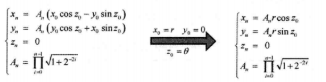

#### 向量模式

旋转模式下，每次迭代使 $z$ 趋向于 0。与之相比，向量模式下，则是使 $y$ 趋向于 0。为了达到这一目标， 每次迭代通过判断 $y_i$ 的符号确定旋转方向，最终使初始向量旋转至 X 轴的正半轴，这一过程也使得每次微旋转的旋转角度累加和存储在变量 $z$ 中。
$$
x_{i+1} = K_i(x_{i}-y_{i} d_i2^{-i})\\
y_{i+1} = K_i(y_{i}+x_{i} d_i2^{-i}) 
$$

$$
d_i = 
\left\{  
\begin{array}{**lr**}  
+1,y_i \leq 0 \\
-1,y_i \geq 0 \\
\end{array}  
\right.
$$

- 初始向量落入第二或第三象限

  根据对称性，当初始向量位于第二象限时，将其搬移至第一象限；当初始向量位于第三象限时，将其搬移至第四象限。

  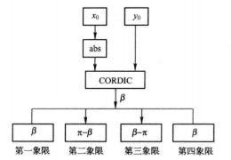

- 求复数的模

  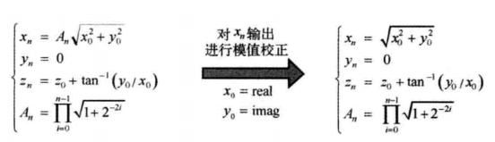

- 求反正切函数

  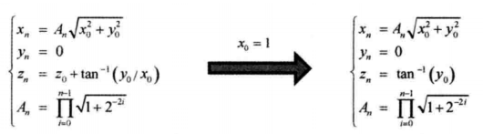

### 线性系统 CORDIC 算法

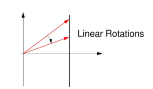

而圆周系统如下：

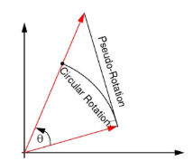

线性系统仍然有旋转模式和向量模式：

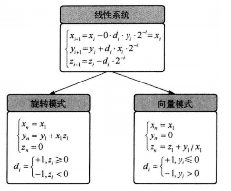

在旋转模式下 $|z1| \leq 1$ ，在向量模式下 $|\frac{y_1}{x_1}|≤1$ 。

旋转模式下，可利用 CORDIC 算法实现乘法运算；向量模式下，可利用 CORDIC 算法实现除法运算。

### 双曲系统 CORDIC 算法

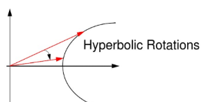

实际上是将所有正弦，余弦，正切函数换为对应的双曲函数。

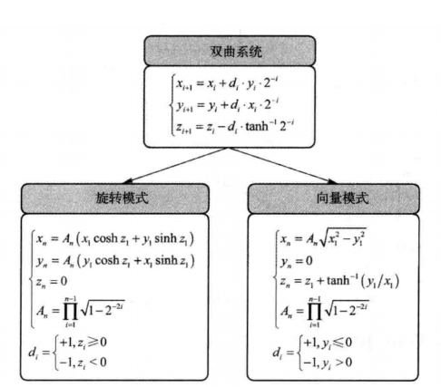

双曲系统的 CORDIC 算法可以进行双曲函数运算，对数运算和开方运算。比如进行对数/开方运算：

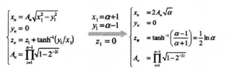

其中 $ |\frac{\alpha-1}{\alpha+1}| \leq 0.8069$。

### CORDIC 算法

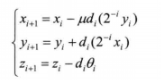

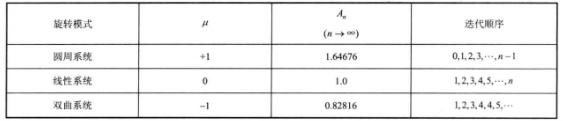

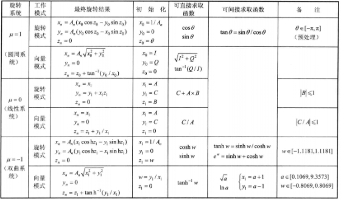
