# Engine 电流采样

- 电流采样的分类

  - 按电流传感器分类：霍尔元件，电流互感器，采样电阻。
  - 按采样位置分类：高端采样，低端采样。

## 1. 高端采样

直接采样桥臂输出电流，软件上无需再进行电流重构计算，采样值即真实输出电流，使用方便简单高效，较为稳定，但成本过高。

由于该位置采样所选器件需要承受母线电压，在电源非隔离条件下，**运放的抗共模电压指标需要大于等于母线电压（多数选母线电压的2倍）**，否则无法正常工作。电源隔离条件下，其参考地（GND）不同，所以无需考虑该问题。

电机三相电流遵循 $I_a+I_b+I_c=0$，故实际实现时只需采样任意两相电流即可获得完整三相输出电流；

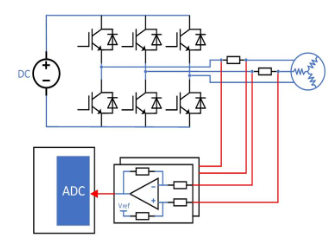

高端采样对时序的要求很小，一般的在载波中心直接采样即可。

## 2. 低端采样

### 单电阻采样(母线电流采样)

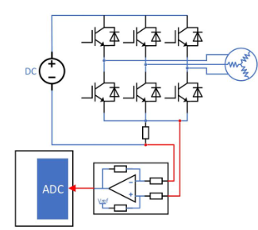

- 采样原理

  > - 电压矢量为 110 时，$I = -I_C$；
  >
  >   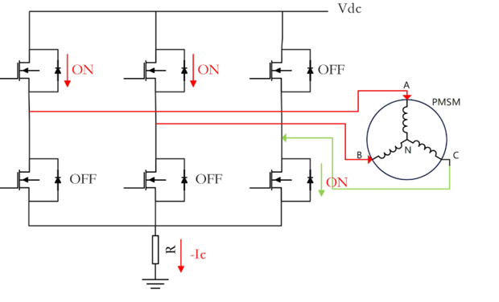
  >
  > - 电压矢量为 100 时，$I = I_A$；
  >
  >   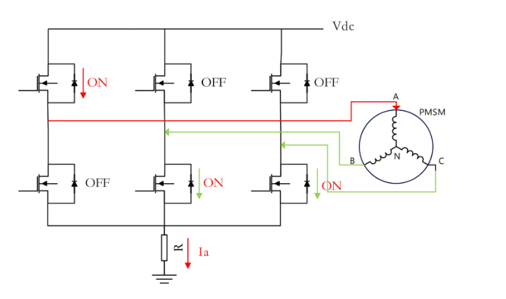

  因此：
  
  | 基本电压矢量 | 母线电流对应的相电流 |
  | ------------ | -------------------- |
  | 100          | $I_A$                |
  | 110          | $-I_C$               |
  | 010          | $I_B$                |
  | 011          | $-I_A$               |
  | 001          | $I_C$                |
  | 101          | $-I_B$               |
  
  母线电压的采样电阻在一种非零矢量的开关状态下只能检测出某一相的电流。由于电感有续流的特性，流过它的电流不能突变，那么当电感值足够大，载波周期足够小时，就可以把这一个载波周期内，两次不同开关状态下检测到的两相的电流，近似看成同一时刻这两相的电流值。从而根据基尔霍夫定律重构出这一时刻的三相电流。
  
- 观测区域和非观测区域

  采样过程需要一定的时间来完成，假设完成采集至少需要的时间为 $T_{min}$，如果某一个矢量的作用时间极短，留给ADC测量相电流的时间过短，ADC无法准确采集到电流，因此无法采集到准确的相电流进行相电流重构，这个矢量所在的区域就是非观测区。(下图的C相电流无法采集)

  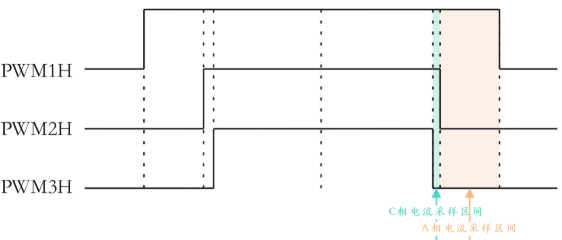

  非观测区由扇区过渡区和低压调制区两种类型的区域构成。

  1. 扇区过渡区：当目标电压矢量 $U_{ref}$ 位于扇区边界的时候，会使得 $U_{ref}$ 的值处于一个基本矢量作用时间较长而另一个基本矢量作用时间会很短的状态。

     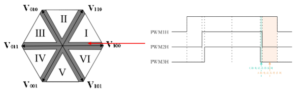

  2. 低压调制区：目标电压矢量 $U_{ref}$ 处于低调制区， $U_{ref}$ 幅值很小，构成它的两个基本电压矢量的作用时间都会很短。

     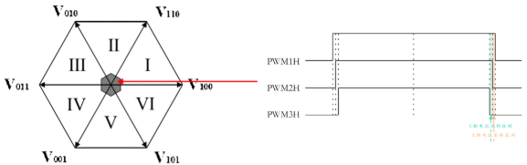

- 非观测区域的电流采样

  1. **移相法**

     拓展非零电压矢量作用的时间窗口，保证它们不小于最小采样时间 $T_{min}$。在非观测区时移相法会修改 SVPWM 的调制模式，采用非对称的 PWM 输出模式，确保 PWM 波形在后半周期有足够的采样时间。

     根据实际情况，将PWM1、PWM2、PWM3中占空比最小的，沿着中心向左平移，将PWM1、PWM2、PWM3中占空比最大的，沿着中心向右平移。

     > - 过渡区处理
     >
     >   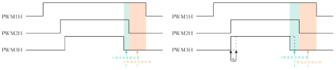
     >
     > - 低压调制区处理
     >
     >   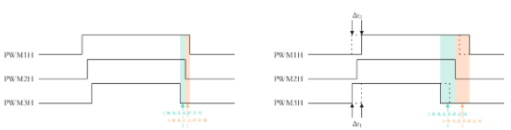

- 电流采样的最小时间

  电流采样最小脉宽时间 = 死区时间 + 开关管导通时间 + 振铃时间 + ADC转换时间；
  $$
  T_{min} = T_{dead} + T_{on} + T_{ring} + T_{ADC}
  $$

- 采样触发点：避开死区，振铃和导通时间。

  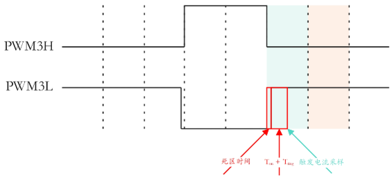

### 双电阻采样

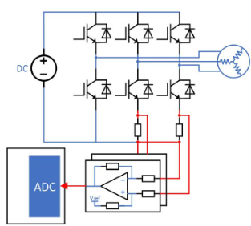

采样时刻为矢量 000 作用时进行采样，此时三相上桥臂截止，相电流通过二极管进行续流，通过采样续流电流可以得到真实的相电流。

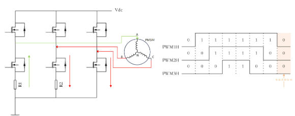

双电阻采样同样存在非观测区：

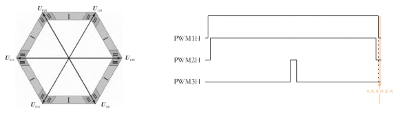

双电阻采样的非观测区也是由两部分组成：扇区过渡区、高压调制区；落在非观测区的电压矢量的基本矢量 000 作用时间过短，导致无法采集到准确的相电流进行重构。

 通常会约束电压最大相占空比在95%左右（可根据 $T_{min}$进行调整），保证电流采样有充足的空间。

### 三电阻采样

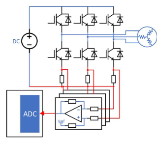

采样时刻为矢量 000 作用时进行采样，此时三相上桥臂截止，相电流通过二极管进行续流，通过采样续流电流可以得到真实的相电流。

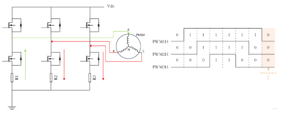

三电阻采样和双电阻采样的非观测区域一致，但是处理方式更加灵活，可以通过改变采样点位置以及移相进行电流重构。

> - 高压调制区处理：改变采样位置，不在 000 处采样。
>
>   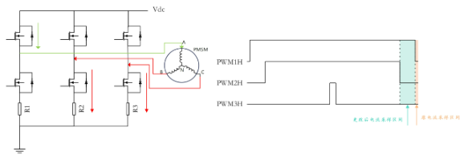
>
> - 过渡区处理：移相
>
>   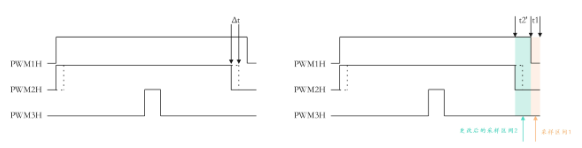