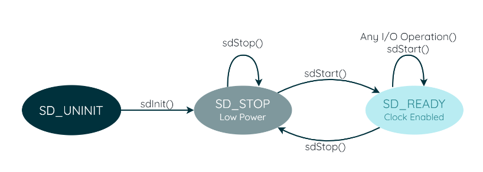

# Engine Chibios 操作系统简介

VESC 使用的 RTOS 是 Chibios，这是一款轻量化的实时操作系统。

Chibios 的官方文档/教程：[链接](https://www.playembedded.org/blog/)

学习 Chibios 的使用和移植之前，可以学习常见的 RTOS (比如 FreeRTOS)  以了解 RTOS 的基本概念。

## 0. Chibios 简介

Chibios 的作者是 Giovanni Di Sirio。Chibi 这个名称在日语是小孩的意思，所以 ChibiOS (ちびOS) 也被可以理解成小型的操作系统。

ChibiOS / RT 于2007年9月份在 SourceForge 公开发布。由于作者对当时现有的RTOS的不满，所以写了这个系统，作者心目中的RTOS应该是：优雅，快速，小型，静态的。这些也是 Chibios 的核心思想与系统的特点。所以专注于代码的优美性和一致性，以及内存的静态使用、确定性、强大的抽象功能，都是这个系统关键的特性。

ChibiOS 系统包含以下组件：

> 1. RT，用于嵌入式实时系统最快的 RTOS 解决方案。
> 2. NIL，用于嵌入式实时系统的最小 RTOS 解决方案。
> 3. OSLIB，高级功能包，可以在两者之上使用。
> 4. SB，Cortex-M4 和 M7 内核独有的扩展。ChibiOS/SB 能够在应用程序代码中创建称为 sandbox（沙箱）的隔离分区。
> 5. HAL，一个包含一组抽象设备驱动程序的包，允许跨不同架构实现有效的应用程序可移植性。
> 6. EX，许多板级外部设备（如 MEMS 等）的设备驱动程序。

## 1. Chibios 移植

### Linux 移植

> Linux 下使用 `make` 命令及其方便，而且 Chibios 例程可以很方便的在 Linux 下运行，所以先使用 Linux 进行移植。

> 开发环境：
>
> - `gcc-arm-none-eabi` 编译链；
> - Linux（Ubuntu 20.04）系统。

1. 首先下载 Chibios 源码：

   ```shell
   $ git clone https://github.com/ChibiOS/ChibiOS.git
   ```

   下载得到的源码文件夹结构大致如下：

   ```
   *****************************************************************************
   *** Files Organization                                                    ***
   *****************************************************************************
   
   --{root}                        - ChibiOS directory.
     +--readme.txt                 - This file.
     +--documentation.html         - Shortcut to the web documentation page.
     +--license.txt                - GPL license text.
     +--demos/                     - 参考例程
     +--docs/                      - Documentation.
     |  +--common/                 - Documentation common build resources.
     |  +--hal/                    - Builders for HAL.
     |  +--nil/                    - Builders for NIL.
     |  +--rt/                     - Builders for RT.
     +--ext/                       - 扩展组件
     +--os/                        - Chibios 系统组件
     |  +--common/                 - Chibios 共享组件
     |  |  +--abstractions/        - API emulator wrappers.
     |  |  |  +--cmsis_os/         - CMSIS-OS 接口
     |  |  |  +--nasa_osal/        - NASA 系统接口
     |  |  +--ext/                 - 操作系统使用的供应商文件
     |  |  +--ports/               - RT/NIL 组件公用接口
     |  |  +--portability/         - RT/NIL 组件公用接口
     |  |  +--startup/             - 芯片启动文件
     |  |  +--oop/					- 面向对象相关文件
     |  +--ex/                     - EX 组件.
     |  |  +--dox/                 - EX documentation resources.
     |  |  +--include/             - EX 头文件.
     |  |  +--devices /            - EX 设备文件.
     |  +--hal/                    - HAL 组件.
     |  |  +--boards/              - HAL 板级驱动文件
     |  |  +--dox/                 - HAL documentation resources.
     |  |  +--include/             - HAL high level headers.
     |  |  +--lib/                 - HAL libraries.
     |  |  |  +--complex/          - HAL collection of complex drivers.
     |  |  |  |  +--mfs/           - HAL managed flash storage driver.
     |  |  |  |  +--serial_nor/    - HAL legacy SNOR stack.
     |  |  |  |  +--xsnor/         - HAL improved SNOR stack.
     |  |  |  +--fallback/         - HAL fall back software drivers.
     |  |  |  +--peripherals/      - HAL peripherals interfaces.
     |  |  |  +--streams/          - HAL streams.
     |  |  +--osal/                - HAL 向操作系统开放的接口
     |  |  |  +--lib/              - HAL OSAL common modules.
     |  |  +--src/                 - HAL high level source.
     |  |  +--ports/               - HAL 硬件接口
     |  |  +--templates/           - HAL driver template files.
     |  |     +--osal/             - HAL OSAL templates.
     |  +--oslib/                  - RT/NIL 公用 RTOS 接口
     |  |  +--include/             - OSLIB high level headers.
     |  |  +--src/                 - OSLIB high level source.
     |  |  +--templates/           - OSLIB configuration template files.
     |  +--nil/                    - NIL 组件.
     |  |  +--dox/                 - NIL documentation resources.
     |  |  +--include/             - NIL high level headers.
     |  |  +--src/                 - NIL high level source.
     |  |  +--templates/           - NIL configuration template files.
     |  +--rt/                     - RT RTOS component.
     |  |  +--dox/                 - RT documentation resources.
     |  |  +--include/             - RT high level headers.
     |  |  +--src/                 - RT high level source.
     |  |  +--templates/           - RT configuration template files.
     |  +--various/                - Various portable support files.
     +--test/                      - Kernel test suite source code.
     |  +--lib/                    - Portable test engine.
     |  +--hal/                    - HAL test suites.
     |  |  +--testbuild/           - HAL build test and MISRA check.
     |  +--nil/                    - NIL test suites.
     |  |  +--testbuild/           - NIL build test and MISRA check.
     |  +--rt/                     - RT test suites.
     |  |  +--testbuild/           - RT build test and MISRA check.
     |  |  +--coverage/            - RT code coverage project.
     +--testex/                    - EX integration test demos.
     +--testhal/                   - HAL integration test demos.
   
   ```

2. 开始移植，首先在 `demos` 文件夹下找是否有类似类型的板级例程。如果有相应的板级例程，可以直接用例程移植。

3. 建立工程，工程结构如下：

   ```
   --{root}                       
     +--main.c                 	
     +--Makefile         
     +--Chibios                	- Chibios 源码
     +--cfg                     	- 配置文件
     |  +--halconf.h				- HAL 硬件抽象层相关配置
     |  +--chconf.h				- RTOS 相关配置
     |  +--mcuconf.h				- 芯片引脚和时钟树配置
   ```

4. 对源码进行裁剪：

   - Chibios 保留 `tools` （用于编译）和 `os`（核心源码）文件夹；

   - `os` 文件夹保留 `common` (公用组件)，`hal`（HAL硬件抽象层），`license`（许可证），`oslib`，`rt`（或者NIL，选择一种 RTOS），`various`。

   - `common` 文件夹保留 `ext`（扩展组件），`include`，`lib`，`oop`，`portability`，`ports`，`startup`，`utils`。

     - `ext` 保留 `ARM` 和 `ST` 文件夹，`ARM` 文件夹内保留 `CMSIS/Core`，`ST` 文件夹内保留芯片对应的文件夹。
     - `portability` 保留 `GCC` 。
     - `ports` 保留 `ARM-common` （ARM 公用接口），`ARMv7-M`（或者其他）。
     - `startup` 保留 `ARMCMx`。其内的 `devices` 保留对应芯片的文件夹，`compliers` 保留 `GCC`。

   - `hal` 文件夹删去 `dox` 和 `template`。

     - `boards` 文件夹：

       对于已经有对应 MCU 的文件夹，可以直接保留。

       如果不存在，首先新建文件夹，找到相似的 MCU，复制其 `board.c`，`board.h` 和 `board.mk` 文件。随后根据自身 MCU 对这些文件进行修正。

       > 可以使用 STM32CubeMX 进行辅助引脚对应。

     - `osal` 文件夹：

       保留 `lib` 文件夹，剩余三个文件夹 `os-less`（无 RTOS），`rt-nil`（有 RTOS），`sb`（沙箱）按需选择。

     - `ports` 文件夹：

       保留 `common` 和 `STM32`。`STM32` 保留 `LLD` 和对应芯片 MCU 的文件夹。

   - 剩余文件夹不变。

5. 编写配置文件：

   - `chconf.h`

     ChibiOS 内核带有默认设置，适用于大多数基本应用程序。但是，在某些情况下可能需要微调 RTOS 的行为以更好地满足项目要求。在 `chconf.h` 文件内可以找到与内核相关的所有配置选项。

     此文件允许自定义调度算法、内存管理以及系统的其他选项。它还包含预处理器开关，用于启用各种功能，例如互斥、信号量、管道和内存池。这些功能默认启用，但在某些情况下，例如当您需要减少内存占用时，可能需要禁用它们。

   - `halconf.h`

     ChibiOS 的硬件抽象层包含各种驱动程序和大量代码库，但这些代码库不一定必须包含在最终固件中。根据具体应用，用户可能需要启用或禁用某些驱动程序或更改其设置。`halconf.h` 是 HAL 驱动程序的所有配置选项所在的位置。

     该文件开头包含每个驱动程序的预处理器开关，按字母顺序排列。接下来是每个驱动程序的一个部分，其中包含编译时设置。一般来说，每次用户想要启用或禁用外设时，都需要修改此文件。

     值得注意的是，ChibiOS 的 HAL 被设计为模块化，因此用户可以只包含特定应用程序所需的驱动程序，并排除不需要的驱动程序。这可以减少最终固件的内存占用，并使开发过程更加高效。

     此外，该文件还包含配置驱动程序行为的选项，例如内部缓冲区的大小、串行驱动程序的默认波特率等。`halconf.h` 文件设计为用户友好型，方便开发人员快速找到需要更改的设置。

   - `mcuconf.h`

     与 HAL 相关的许多配置高度依赖于所使用的特定微控制器。例如，在 `halconf.h` 中启用驱动程序时，外设实例的数量取决于所使用的微控制器。同样，时钟配置或中断优先级也高度依赖于硬件。所有这些配置都包含在文件中 `mcuconf.h`，即使它们属于同一系列，不同的微控制器也可能存在差异。

     `mcuconf.h`包含正确配置微控制器所需的所有底层配置。它包含配置时钟树、中断优先级、引脚分配和其他微控制器特定参数的定义。

6. 编写 `Makefile`：

   ```makefile
   ##############################################################################
   # Build global options
   # NOTE: Can be overridden externally.
   #
   
   # Compiler options here.
   ifeq ($(USE_OPT),)
     USE_OPT = -O2 -ggdb -fomit-frame-pointer -falign-functions=16
   endif
   
   # C specific options here (added to USE_OPT).
   ifeq ($(USE_COPT),)
     USE_COPT = 
   endif
   
   # C++ specific options here (added to USE_OPT).
   ifeq ($(USE_CPPOPT),)
     USE_CPPOPT = -fno-rtti
   endif
   
   # Enable this if you want the linker to remove unused code and data.
   ifeq ($(USE_LINK_GC),)
     USE_LINK_GC = yes
   endif
   
   # Linker extra options here.
   ifeq ($(USE_LDOPT),)
     USE_LDOPT = 
   endif
   
   # Enable this if you want link time optimizations (LTO).
   ifeq ($(USE_LTO),)
     USE_LTO = yes
   endif
   
   # Enable this if you want to see the full log while compiling.
   ifeq ($(USE_VERBOSE_COMPILE),)
     USE_VERBOSE_COMPILE = no
   endif
   
   # If enabled, this option makes the build process faster by not compiling
   # modules not used in the current configuration.
   ifeq ($(USE_SMART_BUILD),)
     USE_SMART_BUILD = yes
   endif
   
   #
   # Build global options
   ##############################################################################
   
   ##############################################################################
   # Architecture or project specific options
   #
   
   # Stack size to be allocated to the Cortex-M process stack. This stack is
   # the stack used by the main() thread.
   ifeq ($(USE_PROCESS_STACKSIZE),)
     USE_PROCESS_STACKSIZE = 0x400
   endif
   
   # Stack size to the allocated to the Cortex-M main/exceptions stack. This
   # stack is used for processing interrupts and exceptions.
   ifeq ($(USE_EXCEPTIONS_STACKSIZE),)
     USE_EXCEPTIONS_STACKSIZE = 0x400
   endif
   
   # Enables the use of FPU (no, softfp, hard).
   ifeq ($(USE_FPU),)
     USE_FPU = no
   endif
   
   # FPU-related options.
   ifeq ($(USE_FPU_OPT),)
     USE_FPU_OPT = -mfloat-abi=$(USE_FPU) -mfpu=fpv4-sp-d16
   endif
   
   #
   # Architecture or project specific options
   ##############################################################################
   
   ##############################################################################
   # Project, target, sources and paths
   #
   
   # Define project name here
   PROJECT = ch
   
   # Target settings.(目标核心类型)
   MCU  = cortex-m3
   
   # Imported source files and paths.(文件夹位置)
   CHIBIOS  := ./Chibios
   CONFDIR  := ./cfg
   BUILDDIR := ./build
   DEPDIR   := ./.dep
   
   # Licensing files.(许可证文件)
   include $(CHIBIOS)/os/license/license.mk
   # Startup files.(启动文件)
   include $(CHIBIOS)/os/common/startup/ARMCMx/compilers/GCC/mk/startup_stm32f1xx.mk
   # HAL-OSAL files (optional).(硬件抽象层文件)
   include $(CHIBIOS)/os/hal/hal.mk							# HAL 
   include $(CHIBIOS)/os/hal/ports/STM32/STM32F1xx/platform.mk # 编译器接口
   include $(CHIBIOS)/os/hal/boards/STM32F103C8T6/board.mk     # 板级接口
   include $(CHIBIOS)/os/hal/osal/rt-nil/osal.mk				# RTOS 接口
   # RTOS files (optional).(RTOS文件)
   include $(CHIBIOS)/os/rt/rt.mk											# RTOS 
   include $(CHIBIOS)/os/common/ports/ARMv7-M/compilers/GCC/mk/port.mk		# 编译器接口
   # Auto-build files in ./source recursively.
   include $(CHIBIOS)/tools/mk/autobuild.mk								# 编译工具
   # Other files (optional).
   
   # Define linker script file here
   LDSCRIPT= $(STARTUPLD)/STM32F103x8.ld									# 链接文件
   
   # C sources that can be compiled in ARM or THUMB mode depending on the global
   # setting.	# C源文件
   CSRC = $(ALLCSRC) \
          main.c
   
   # C++ sources that can be compiled in ARM or THUMB mode depending on the global
   # setting.
   CPPSRC = $(ALLCPPSRC)
   
   # List ASM source files here.
   ASMSRC = $(ALLASMSRC)
   
   # List ASM with preprocessor source files here.
   ASMXSRC = $(ALLXASMSRC)
   
   # Inclusion directories.
   INCDIR = $(CONFDIR) $(ALLINC) $(TESTINC)
   
   # Define C warning options here.
   CWARN = -Wall -Wextra -Wundef -Wstrict-prototypes
   
   # Define C++ warning options here.
   CPPWARN = -Wall -Wextra -Wundef
   
   #
   # Project, target, sources and paths
   ##############################################################################
   
   ##############################################################################
   # Start of user section
   #
   
   # List all user C define here, like -D_DEBUG=1
   UDEFS =
   
   # Define ASM defines here
   UADEFS =
   
   # List all user directories here
   UINCDIR =
   
   # List the user directory to look for the libraries here
   ULIBDIR =
   
   # List all user libraries here
   ULIBS =
   
   #
   # End of user section
   ##############################################################################
   
   ##############################################################################
   # Common rules
   #
   
   RULESPATH = $(CHIBIOS)/os/common/startup/ARMCMx/compilers/GCC/mk
   include $(RULESPATH)/arm-none-eabi.mk
   include $(RULESPATH)/rules.mk
   
   #
   # Common rules
   ##############################################################################
   
   ##############################################################################
   # Custom rules
   #
   
   #
   # Custom rules
   ##############################################################################
   
   ```

7. `make` 进行编译和程序生成，使用 STM32 Utility 烧录。

## 2. Chibios HAL 库简介

Chibios 使用了自身的硬件抽象层（Hardware Abstract Library）。

### PAL(GPIO)

- GPIO 模式

  ```c
  /**
   * @name    Pads mode constants
   * @{
   */
  /**
   * @brief   After reset state.
   * @details The state itself is not specified and is architecture dependent,
   *          it is guaranteed to be equal to the after-reset state. It is
   *          usually an input state.
   */
  #define PAL_MODE_RESET                  0U
  /**
   * @brief   Safe state for <b>unconnected</b> pads.
   * @details The state itself is not specified and is architecture dependent,
   *          it may be mapped on @p PAL_MODE_INPUT_PULLUP,
   *          @p PAL_MODE_INPUT_PULLDOWN or @p PAL_MODE_OUTPUT_PUSHPULL for
   *          example.
   */
  #define PAL_MODE_UNCONNECTED            1U
  /**
   * @brief   Regular input high-Z pad.
   */
  #define PAL_MODE_INPUT                  2U
  /**
   * @brief   Input pad with weak pull up resistor.
   */
  #define PAL_MODE_INPUT_PULLUP           3U
  /**
   * @brief   Input pad with weak pull down resistor.
   */
  #define PAL_MODE_INPUT_PULLDOWN         4U
  /**
   * @brief   Analog input mode.
   */
  #define PAL_MODE_INPUT_ANALOG           5U
  /**
   * @brief   Push-pull output pad.
   */
  #define PAL_MODE_OUTPUT_PUSHPULL        6U
  /**
   * @brief   Open-drain output pad.
   */
  #define PAL_MODE_OUTPUT_OPENDRAIN       7U
  /** @} */
  ```

- 设置 GPIO 模式

  - 设置一个引脚

    ```c
    /**
     * @brief   Pad mode setup.
     * @details This function programs a pad with the specified mode.
     * @note    The operation is not guaranteed to be atomic on all the
     *          architectures, for atomicity and/or portability reasons you may
     *          need to enclose port I/O operations between @p osalSysLock() and
     *          @p osalSysUnlock().
     * @note    Programming an unknown or unsupported mode is silently ignored.
     * @note    The function can be called from any context.
     *
     * @param[in] port      port identifier
     * @param[in] pad       pad number within the port
     * @param[in] mode      pad mode
     *
     * @special
     */
    #define palSetPadMode(port, pad, mode) pal_lld_setpadmode(port, pad, mode)
    
    palSetPadMode(GPIOK, 5, PAL_MODE_OUTPUT_PUSHPULL);
    ```

    > 除了指定 GPIO 组号和端口号之外，可以通过对端口直接定义直接进行配置：
    >
    > ```c
    > #define LINE_LED_GREEN              PAL_LINE(GPIOK, 5U)
    > 
    > palSetLineMode(LINE_LED_GREEN, PAL_MODE_OUTPUT_PUSHPULL);
    > ```

  - 设置一组引脚
  
    ```c
    /**
     * @brief   Pads group mode setup.
     * @details This function programs a pads group belonging to the same port
     *          with the specified mode.
     * @note    The operation is not guaranteed to be atomic on all the
     *          architectures, for atomicity and/or portability reasons you may
     *          need to enclose port I/O operations between @p osalSysLock() and
     *          @p osalSysUnlock().
     * @note    Programming an unknown or unsupported mode is silently ignored.
     * @note    The function can be called from any context.
     *
     * @param[in] port      端口组号
     * @param[in] mask      掩码，1为更改
     * @param[in] offset    位偏移量
     * @param[in] mode      模式
     *
     * @special
     */
    #define palSetGroupMode(port, mask, offset, mode)                           \
      pal_lld_setgroupmode(port, mask, offset, mode)
    
    /* The following statements are equivalent. However, the last statement 
       sacrifices some compactness in exchange for clarity. */
    palSetGroupMode(GPIOA, 0x0070, 0, PAL_MODE_OUTPUT_PUSHPULL);
    palSetGroupMode(GPIOA, 0x0007, 4, PAL_MODE_OUTPUT_PUSHPULL);
    palSetGroupMode(GPIOA, PAL_PORT_BIT(4) | PAL_PORT_BIT(5) | PAL_PORT_BIT(6), 
                    0, PAL_MODE_OUTPUT_PUSHPULL);
    ```
  
- GPIO 输出

  ```c
  /**
   * @brief   Sets a pad logic state to @p PAL_HIGH.
   * @note    The operation is not guaranteed to be atomic on all the
   *          architectures, for atomicity and/or portability reasons you may
   *          need to enclose port I/O operations between @p osalSysLock() and
   *          @p osalSysUnlock().
   * @note    The function can be called from any context.
   *
   * @param[in] port      port identifier
   * @param[in] pad       pad number within the port
   *
   * @special
   */
  #define palSetPad(port, pad) pal_lld_setpad(port, pad)
  /**
   * @brief   Clears a pad logic state to @p PAL_LOW.
   * @note    The operation is not guaranteed to be atomic on all the
   *          architectures, for atomicity and/or portability reasons you may
   *          need to enclose port I/O operations between @p osalSysLock() and
   *          @p osalSysUnlock().
   * @note    The function can be called from any context.
   *
   * @param[in] port      port identifier
   * @param[in] pad       pad number within the port
   *
   * @special
   */
  #define palClearPad(port, pad) pal_lld_clearpad(port, pad)
  /**
   * @brief   Toggles a pad logic state.
   * @note    The operation is not guaranteed to be atomic on all the
   *          architectures, for atomicity and/or portability reasons you may
   *          need to enclose port I/O operations between @p osalSysLock() and
   *          @p osalSysUnlock().
   * @note    The function can be called from any context.
   *
   * @param[in] port      port identifier
   * @param[in] pad       pad number within the port
   *
   * @special
   */
  #define palTogglePad(port, pad) pal_lld_togglepad(port, pad)
  
  /**
   * @brief   Sets a line logic state to @p PAL_HIGH.
   * @note    The operation is not guaranteed to be atomic on all the
   *          architectures, for atomicity and/or portability reasons you may
   *          need to enclose port I/O operations between @p osalSysLock() and
   *          @p osalSysUnlock().
   * @note    The function can be called from any context.
   *
   * @param[in] line      line identifier
   *
   * @special
   */
  #define palSetLine(line) palSetPad(PAL_PORT(line), PAL_PAD(line))
  /**
   * @brief   Clears a line logic state to @p PAL_LOW.
   * @note    The operation is not guaranteed to be atomic on all the
   *          architectures, for atomicity and/or portability reasons you may
   *          need to enclose port I/O operations between @p osalSysLock() and
   *          @p osalSysUnlock().
   * @note    The function can be called from any context.
   *
   * @param[in] line      line identifier
   *
   * @special
   */
  #define palClearLine(line) palClearPad(PAL_PORT(line), PAL_PAD(line))
  /**
   * @brief   Toggles a line logic state.
   * @note    The operation is not guaranteed to be atomic on all the
   *          architectures, for atomicity and/or portability reasons you may
   *          need to enclose port I/O operations between @p osalSysLock() and
   *          @p osalSysUnlock().
   * @note    The function can be called from any context.
   *
   * @param[in] line      line identifier
   *
   * @special
   */
  #define palToggleLine(line) palTogglePad(PAL_PORT(line), PAL_PAD(line))
  
  /**
   * @brief   Writes a logic state on an output pad.
   * @note    The operation is not guaranteed to be atomic on all the
   *          architectures, for atomicity and/or portability reasons you may
   *          need to enclose port I/O operations between @p osalSysLock() and
   *          @p osalSysUnlock().
   * @note    The function can be called from any context.
   *
   * @param[in] port      port identifier
   * @param[in] pad       pad number within the port
   * @param[in] bit       logic value, the value must be @p PAL_LOW or
   *                      @p PAL_HIGH
   *
   * @special
   */
  #define palWritePad(port, pad, bit) pal_lld_writepad(port, pad, bit)
  /**
   * @brief   Writes a logic state on an output line.
   * @note    The operation is not guaranteed to be atomic on all the
   *          architectures, for atomicity and/or portability reasons you may
   *          need to enclose port I/O operations between @p osalSysLock() and
   *          @p osalSysUnlock().
   * @note    The function can be called from any context.
   *
   * @param[in] line      line identifier
   * @param[in] bit       logic value, the value must be @p PAL_LOW or
   *                      @p PAL_HIGH
   *
   * @special
   */
  #define palWriteLine(line, bit) pal_lld_writeline(line, bit)
  ```

- GPIO 数字输入

  - 检测一个引脚的输入

    ```c
    /* Defining a lines. */
    #define LINE_INPUT                  PAL_LINE(GPIOA, 3U)
    /* Configuring the line as Input pull-up. */
    palSetLineMode(LINE_INPUT, PAL_MODE_INPUT_PULLUP);
    if(palReadLine(LINE_INPUT) == PAL_HIGH) {
      /* The line is high. */
    }
    else {
      /* The line is low. */
    }
    ```

  - 检测一组引脚的输入

    ```c
    /* Defining the GPIO mask. */
    #define GPIOC_MASK                  PAL_PORT_BIT(0) | PAL_PORT_BIT(1) | \
                                        PAL_PORT_BIT(2) | PAL_PORT_BIT(3)
                                        
    /* Configuring the lines as Input pull-up. */
    palSetGroupMode(GPIOC, GPIOC_MASK, 0, PAL_MODE_INPUT_PULLUP);
    /* Reading the GPIOC group status. */
    uint16_t group_status = palReadGroup(GPIOC, GPIOC_MASK, 0);
    if(group_status & PAL_PORT_BIT(0)) {
      /* PC0 is high. */
    }
    else {
      /* PC0 is low. */
    }
    if(group_status & PAL_PORT_BIT(1)) {
      /* PC1 is high. */
    }
    else {
      /* PC1 is low. */
    }
    if(group_status & PAL_PORT_BIT(2)) {
      /* PC2 is high. */
    }
    else {
      /* PC2 is low. */
    }
    if(group_status & PAL_PORT_BIT(3)) {
      /* PC3 is high. */
    }
    else {
      /* PC3 is low. */
    }
    ```

### EXTI 

- 使能中断（`halconf.h`）

  ```c
  /*===========================================================================*/
  /* PAL driver related settings.                                              */
  /*===========================================================================*/
  /**
   * @brief   Enables synchronous APIs.
   * @note    Disabling this option saves both code and data space.
   */
  #if !defined(PAL_USE_CALLBACKS) || defined(__DOXYGEN__)
  #define PAL_USE_CALLBACKS                   TRUE
  #endif
  /**
   * @brief   Enables synchronous APIs.
   * @note    Disabling this option saves both code and data space.
   */
  #if !defined(PAL_USE_WAIT) || defined(__DOXYGEN__)
  #define PAL_USE_WAIT                        TRUE
  #endif
  ```

  > - `PAL_USE_CALLBACKS` 使能回调函数；
  > - `PAL_USE_WAIT` 使能中断事件；

  ```c
  /**
   * @brief   Pad event enable.
   * @note    Programming an unknown or unsupported mode is silently ignored.
   *
   * @param[in] port      port identifier
   * @param[in] pad       pad number within the port
   * @param[in] mode      pad event mode
   *
   * @api
   */
  #define palEnablePadEvent(port, pad, mode)                                  \
    do {                                                                      \
      osalSysLock();                                                          \
      palEnablePadEventI(port, pad, mode);                                    \
      osalSysUnlock();                                                        \
    } while (false)
  
  /* Enabling the Event Listening on PA3 for a Falling Edge. */
  palEnablePadEvent(GPIOA, 3, PAL_EVENT_MODE_FALLING_EDGE);
  ```

  > 不能在同一条线路上两次调用 `palEnablePadEvent` 或 `palEnableLineEvent`。

  外部中断模式选择：

  ```c
  /**
   * @name    PAL event modes
   * @{
   */
  #define PAL_EVENT_MODE_EDGES_MASK   3U  /**< @brief Mask of edges field.    */
  #define PAL_EVENT_MODE_DISABLED     0U  /**< @brief Channel disabled.       */
  #define PAL_EVENT_MODE_RISING_EDGE  1U  /**< @brief Rising edge callback.   */
  #define PAL_EVENT_MODE_FALLING_EDGE 2U  /**< @brief Falling edge callback.  */
  #define PAL_EVENT_MODE_BOTH_EDGES   3U  /**< @brief Both edges callback.    */
  /** @} */
  ```

- 回调函数

  ```c
  #if (PAL_USE_CALLBACKS == TRUE) || defined(__DOXYGEN__)
  /**
   * @brief   Associates a callback to a pad.
   *
   * @param[in] port      port identifier
   * @param[in] pad       pad number within the port
   * @param[in] cb        event callback function
   * @param[in] arg       callback argument
   *
   * @api
   */
  #define palSetPadCallback(port, pad, cb, arg)                               \
    do {                                                                      \
      osalSysLock();                                                          \
      palSetPadCallbackI(port, pad, cb, arg);                                 \
      osalSysUnlock();                                                        \
    } while (false)
  /**
   * @brief   Associates a callback to a line.
   *
   * @param[in] line      line identifier
   * @param[in] cb        event callback function
   * @param[in] arg       callback argument
   *
   * @api
   */
  #define palSetLineCallback(line, cb, arg)                                   \
    do {                                                                      \
      osalSysLock();                                                          \
      palSetLineCallbackI(line, cb, arg);                                     \
      osalSysUnlock();                                                        \
    } while (false)
  #endif /* PAL_USE_CALLBACKS == TRUE */
  ```

- 示例

  ```c
  #include "ch.h"
  #include "hal.h"
  #define MY_LINE                     PAL_LINE(GPIOA, 3U)
  /* Callback associated to the event. */
  static void my_callback(void *arg) {
    (void)arg;
    /* HERE GOES OUR ACTION. */
  }
  /* Application entry point. */
  int main(void) {
    /* ChibiOS/HAL and ChibiOS/RT initialization. */
    halInit();
    chSysInit();
   /* Configuring the Line as Input Pull Up.*/
    palSetLineMode(MY_LINE, PAL_MODE_INPUT_PULLUP);
   /* Enabling the event on the Line for a Falling edge. */
    palEnableLineEvent(MY_LINE, PAL_EVENT_MODE_FALLING_EDGE);
   /* Associating a callback to the Line. */
    palSetLineCallback(MY_LINE, my_callback, NULL);
    /* main() thread loop. */
    while (true) {
      palToggleLine(LINE_LED_GREEN);
      chThdSleepMilliseconds(500);
    }
  }
  ```

### SD(UART)



> - `SD_UNINIT`：驱动程序设置前的初始状态。一旦使用 `halInit()` 初始化系统并启用串行驱动程序和分配外围设备，此状态就会改变。
> - `SD_STOP`：在此状态下，驱动程序处于非活动状态。UART 外设不从时钟树接收任何电源，处于低功耗状态以节省能源。
> - `SD_READY`：驱动程序已准备好启动或已在运行。时钟树处于活动状态，UART 已设置并准备好进行数据传输。

- UART 配置（`halconf.h`）

  ```c
  /*===========================================================================*/
  /* SERIAL driver related settings.                                           */
  /*===========================================================================*/
  /**
   * @brief   Default bit rate.
   * @details Configuration parameter, this is the baud rate selected for the
   *          default configuration.
   */
  #if !defined(SERIAL_DEFAULT_BITRATE) || defined(__DOXYGEN__)
  #define SERIAL_DEFAULT_BITRATE              38400
  #endif
  /**
   * @brief   Serial buffers size.
   * @details Configuration parameter, you can change the depth of the queue
   *          buffers depending on the requirements of your application.
   * @note    The default is 16 bytes for both the transmission and receive
   *          buffers.
   */
  #if !defined(SERIAL_BUFFERS_SIZE) || defined(__DOXYGEN__)
  #define SERIAL_BUFFERS_SIZE                 16
  #endif
  ```

  > 可以自定义串口配置：
  >
  > ```c
  > /*
  >  * Serial configuration (115200 bps, 8-bit odd parity, 2 stop bits, no flow control).
  >  */
  > const SerialConfig serialcfg = {
  >   .speed = 115200,
  >   .cr1 = USART_CR1_PCE | USART_CR1_PS,  // Enables parity check and sets odd parity
  >   .cr2 = USART_CR2_STOP_1,              // Configures 2 stop bits
  >   .cr3 = 0U                             // No additional settings
  > };
  > ```

- UART 使用

  ```c
  /**
   * @brief   启动 UART 驱动程序
   *
   * @param[in] sdp       pointer to a @p SerialDriver object
   * @param[in] config    the architecture-dependent serial driver configuration.
   *                      If this parameter is set to @p NULL then a default
   *                      configuration is used.
   * @return              The operation status.
   *
   * @api
   */
  msg_t sdStart(SerialDriver *sdp, const SerialConfig *config)
      
  /**
   * @brief   停止 UART 驱动程序
   * @details Any thread waiting on the driver's queues will be awakened with
   *          the message @p MSG_RESET.
   *
   * @param[in] sdp       pointer to a @p SerialDriver object
   *
   * @api
   */
  void sdStop(SerialDriver *sdp);
  
  /**
   * @brief   UART 发送字符
   * @note    This function bypasses the indirect access to the channel and
   *          writes directly on the output queue. This is faster but cannot
   *          be used to write to different channels implementations.
   *
   * @param[in] sdp       pointer to a @p SerialDriver object
   * @param[in] b         the byte value to be written in the output queue
   * @return              The operation status.
   * @retval MSG_OK       if the operation succeeded.
   * @retval MSG_RESET    if the @p SerialDriver has been stopped.
   *
   * @api
   */
  #define sdPut(sdp, b) oqPut(&(sdp)->oqueue, b)
  
  /**
   * @brief   UART 读取字符
   * @note    This function bypasses the indirect access to the channel and
   *          reads directly from the input queue. This is faster but cannot
   *          be used to read from different channels implementations.
   *
   * @param[in] sdp       pointer to a @p SerialDriver object
   * @return              A byte value from the input queue.
   * @retval MSG_RESET    if the @p SerialDriver has been stopped.
   *
   * @api
   */
  #define sdGet(sdp) iqGet(&(sdp)->iqueue)
  
  /**
   * @brief   UART 发送函数(轮询)
   * @note    This function bypasses the indirect access to the channel and
   *          writes directly to the output queue. This is faster but cannot
   *          be used to write from different channels implementations.
   *
   * @param[in] sdp       pointer to a @p SerialDriver object
   * @param[in] b         pointer to the data buffer
   * @param[in] n         the maximum amount of data to be transferred, the
   *                      value 0 is reserved
   *
   * @api
   */
  #define sdWrite(sdp, b, n) oqWriteTimeout(&(sdp)->oqueue, b, n, TIME_INFINITE)
  
  /**
   * @brief   UART 读取函数(轮询)
   * @note    This function bypasses the indirect access to the channel and
   *          reads directly from the input queue. This is faster but cannot
   *          be used to read from different channels implementations.
   *
   * @param[in] sdp       pointer to a @p SerialDriver object
   * @param[in] b         pointer to the data buffer
   * @param[in] n         the maximum amount of data to be transferred, the
   *                      value 0 is reserved
   *
   * @api
   */
  #define sdRead(sdp, b, n) iqReadTimeout(&(sdp)->iqueue, b, n, TIME_INFINITE)
  
  /**
   * @brief   Direct write to a @p SerialDriver with timeout specification.
   * @note    This function bypasses the indirect access to the channel and
   *          writes directly on the output queue. This is faster but cannot
   *          be used to write to different channels implementations.
   *
   * @param[in] sdp       pointer to a @p SerialDriver object
   * @param[in] b         the byte value to be written in the output queue
   * @param[in] t         the number of ticks before the operation timeouts,
   *                      the following special values are allowed:
   *                      - @a TIME_IMMEDIATE immediate timeout.
   *                      - @a TIME_INFINITE no timeout.
   *                      .
   * @return              The operation status.
   * @retval MSG_OK       if the operation succeeded.
   * @retval MSG_TIMEOUT  if the specified time expired.
   * @retval MSG_RESET    if the @p SerialDriver has been stopped.
   *
   * @api
   */
  #define sdPutTimeout(sdp, b, t) oqPutTimeout(&(sdp)->oqueue, b, t)
  
  /**
   * @brief   Direct read from a @p SerialDriver with timeout specification.
   * @note    This function bypasses the indirect access to the channel and
   *          reads directly from the input queue. This is faster but cannot
   *          be used to read from different channels implementations.
   *
   * @param[in] sdp       pointer to a @p SerialDriver object
   * @param[in] t         the number of ticks before the operation timeouts,
   *                      the following special values are allowed:
   *                      - @a TIME_IMMEDIATE immediate timeout.
   *                      - @a TIME_INFINITE no timeout.
   *                      .
   * @return              A byte value from the input queue.
   * @retval MSG_TIMEOUT  if the specified time expired.
   * @retval MSG_RESET    if the @p SerialDriver has been stopped.
   *
   * @api
   */
  #define sdGetTimeout(sdp, t) iqGetTimeout(&(sdp)->iqueue, t)
  
  /**
   * @brief   Direct blocking write to a @p SerialDriver with timeout
   *          specification.
   * @note    This function bypasses the indirect access to the channel and
   *          writes directly to the output queue. This is faster but cannot
   *          be used to write to different channels implementations.
   *
   * @param[in] sdp       pointer to a @p SerialDriver object
   * @param[in] b         pointer to the data buffer
   * @param[in] n         the maximum amount of data to be transferred, the
   *                      value 0 is reserved
   * @param[in] t         the number of ticks before the operation timeouts,
   *                      the following special values are allowed:
   *                      - @a TIME_IMMEDIATE immediate timeout.
   *                      - @a TIME_INFINITE no timeout.
   *                      .
   * @return              The number of bytes effectively transferred.
   *
   * @api
   */
  #define sdWriteTimeout(sdp, b, n, t)                                        \
    oqWriteTimeout(&(sdp)->oqueue, b, n, t)
  
  /**
   * @brief   Direct blocking read from a @p SerialDriver with timeout
   *          specification.
   * @note    This function bypasses the indirect access to the channel and
   *          reads directly from the input queue. This is faster but cannot
   *          be used to read from different channels implementations.
   *
   * @param[in] sdp       pointer to a @p SerialDriver object
   * @param[in] b         pointer to the data buffer
   * @param[in] n         the maximum amount of data to be transferred, the
   *                      value 0 is reserved
   * @param[in] t         the number of ticks before the operation timeouts,
   *                      the following special values are allowed:
   *                      - @a TIME_IMMEDIATE immediate timeout.
   *                      - @a TIME_INFINITE no timeout.
   *                      .
   * @return              The number of bytes effectively transferred.
   *
   * @api
   */
  #define sdReadTimeout(sdp, b, n, t) iqReadTimeout(&(sdp)->iqueue, b, n, t)
  ```

- UART 中断 API 

  ```c
  /**
   * @brief   Direct write to a @p SerialDriver.
   * @note    This function bypasses the indirect access to the channel and
   *          writes directly on the output queue. This is faster but cannot
   *          be used to write to different channels implementations.
   *
   * @param[in] sdp       pointer to a @p SerialDriver object
   * @param[in] b         the byte value to be written in the output queue
   * @return              The operation status.
   * @retval MSG_OK       if the operation succeeded.
   * @retval MSG_TIMEOUT  if the queue is full.
   *
   * @iclass
   */
  #define sdPutI(sdp, b) oqPutI(&(sdp)->oqueue, b)
  /**
   * @brief   Direct read from a @p SerialDriver.
   * @note    This function bypasses the indirect access to the channel and
   *          reads directly from the input queue. This is faster but cannot
   *          be used to read from different channels implementations.
   *
   * @param[in] sdp       pointer to a @p SerialDriver object
   * @return              A byte value from the input queue.
   * @retval MSG_TIMEOUT  if the queue is empty.
   *
   * @iclass
   */
  #define sdGetI(sdp) iqGetI(&(sdp)->iqueue)
  /**
   * @brief   Direct non-blocking write to a @p SerialDriver.
   * @note    This function bypasses the indirect access to the channel and
   *          writes directly to the output queue. This is faster but cannot
   *          be used to write from different channels implementations.
   *
   * @param[in] sdp       pointer to a @p SerialDriver object
   * @param[in] b         pointer to the data buffer
   * @param[in] n         the maximum amount of data to be transferred, the
   *                      value 0 is reserved
   * @return              The number of bytes effectively transferred.
   *
   * @iclass
   */
  #define sdWriteI(sdp, b, n) oqWriteI(&(sdp)->oqueue, b, n)
  /**
   * @brief   Direct non-blocking read from a @p SerialDriver.
   * @note    This function bypasses the indirect access to the channel and
   *          reads directly from the input queue. This is faster but cannot
   *          be used to read from different channels implementations.
   *
   * @param[in] sdp       pointer to a @p SerialDriver object
   * @param[in] b         pointer to the data buffer
   * @param[in] n         the maximum amount of data to be transferred, the
   *                      value 0 is reserved
   * @return              The number of bytes effectively transferred.
   *
   * @iclass
   */
  #define sdReadI(sdp, b, n) iqReadI(&(sdp)->iqueue, b, n)
  ```

  

