# Simplorer 软件介绍和电路搭建

> 参考教程：[链接](https://www.bilibili.com/video/BV1Vt4y1a7gv?vd_source=2d2507d13250e2545de99f3c552af296&spm_id_from=333.788.videopod.sections)

1. 打开上侧菜单栏的 Simplorer 选项可以新建 Simplorer 仿真工程。

   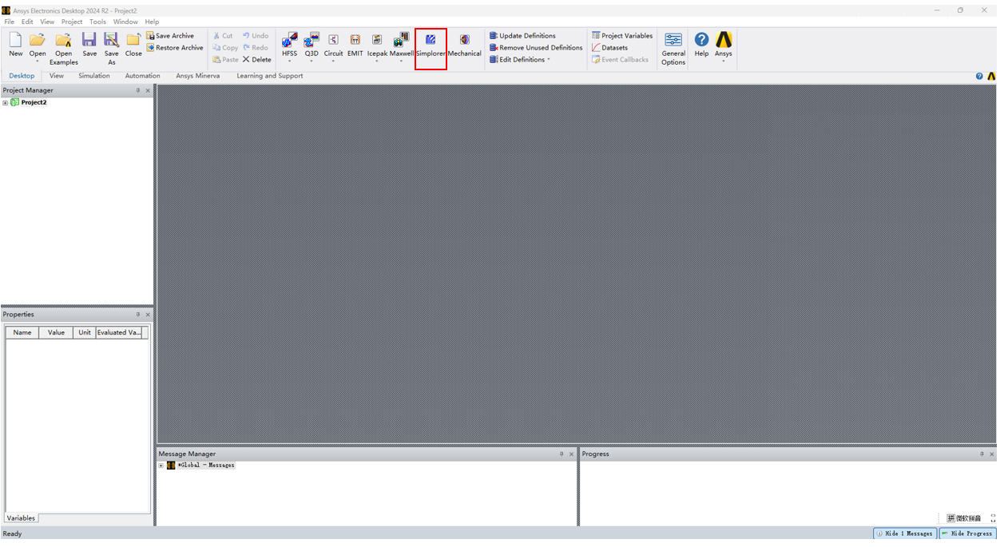

   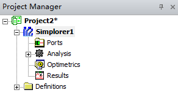

   > - `Ports`：端口；
   > - `Analysis`：求解器，包括(TR(瞬态)，AC(交流)，DC(直流))
   > - `Optimetrics`：其他可选项(比如扫频)；
   > - `Results`：求解结果。

2. 右侧的 Component Libraries 是组件仓库，用于搭建仿真：

   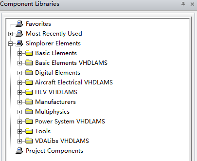

   通常使用 Simplorer Component 的组件进行仿真搭建。

   > 如果没有对应的组件，需要自行导入组件：
   >
   > 1. `SML`：XML 的衍生格式，Simplorer 原生支持，但是应用并不广泛；
   > 2. `C-Model`：使用 C 语言编写的组件，需要导出为可执行文件(dll)，使用十分复杂，不推荐使用；
   > 3. `Spice`，`Modelica`，`VHDL-AMS`：外部组件。

3. 使用 Basic Elements 搭建一个简单整流电路：

   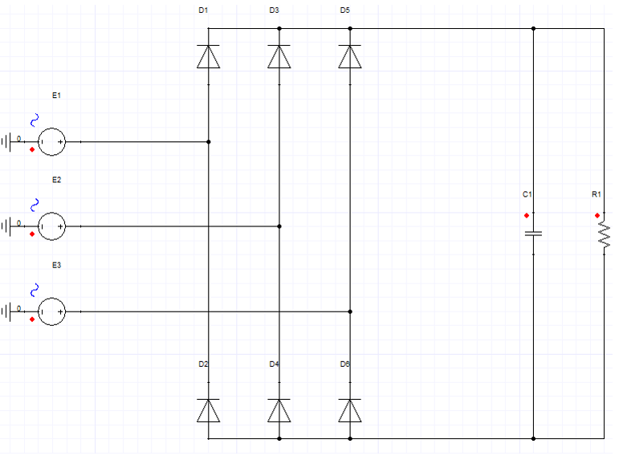

   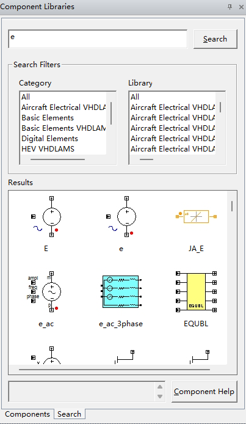

   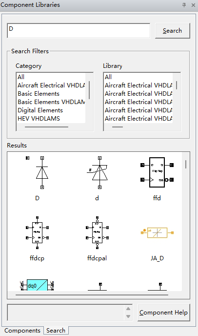

   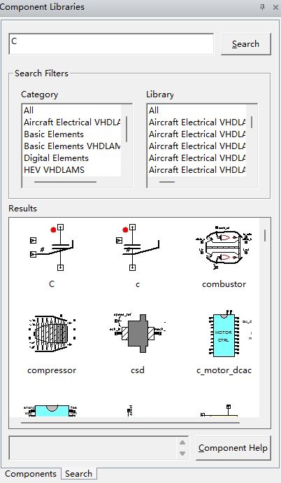

   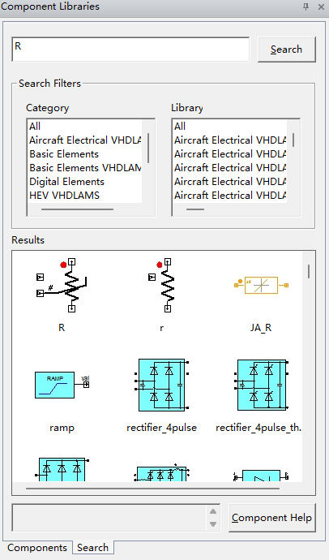

   点击组件内部可以修改组件参数：

   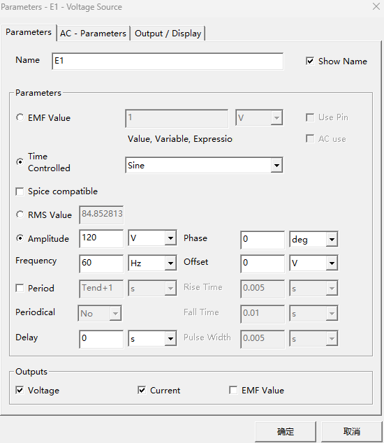

   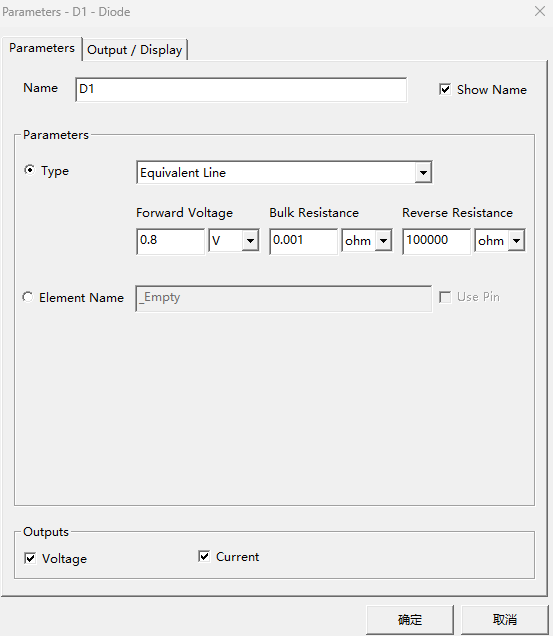

   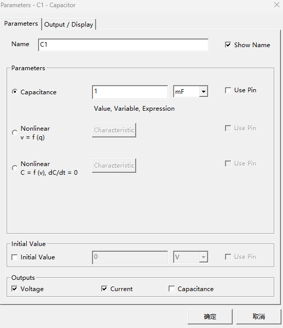

   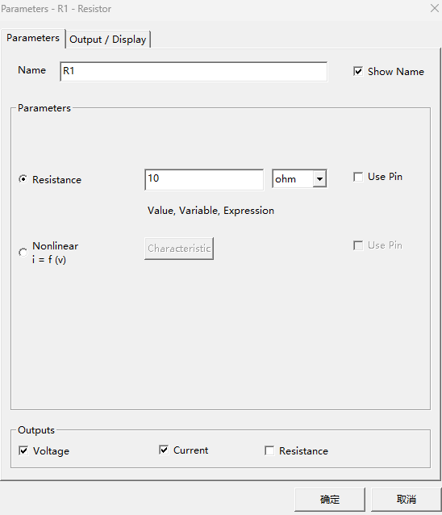

4. 求解器参数设置，开始求解：

   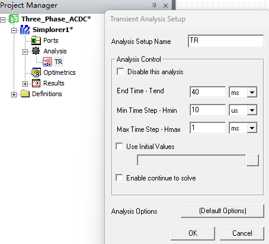

5. 求解结束后可以查看求解结果。

