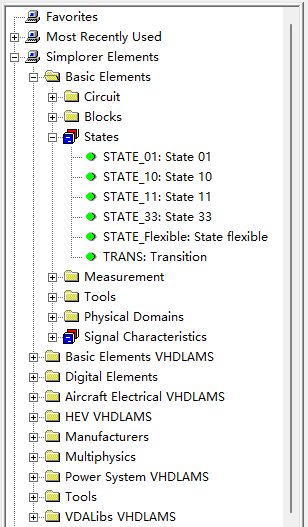
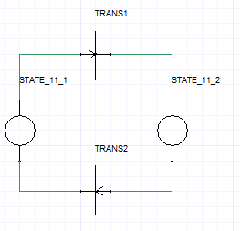
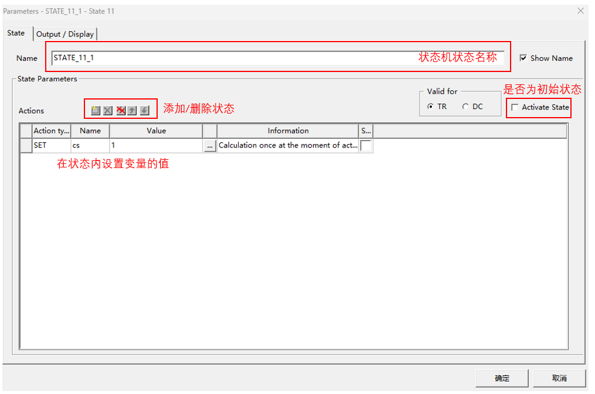
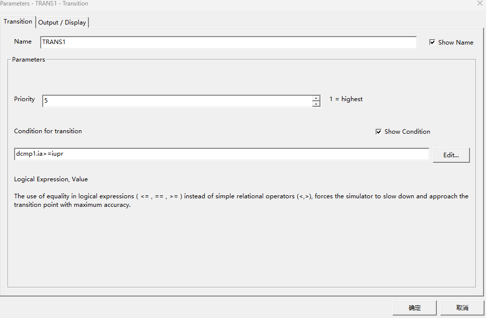
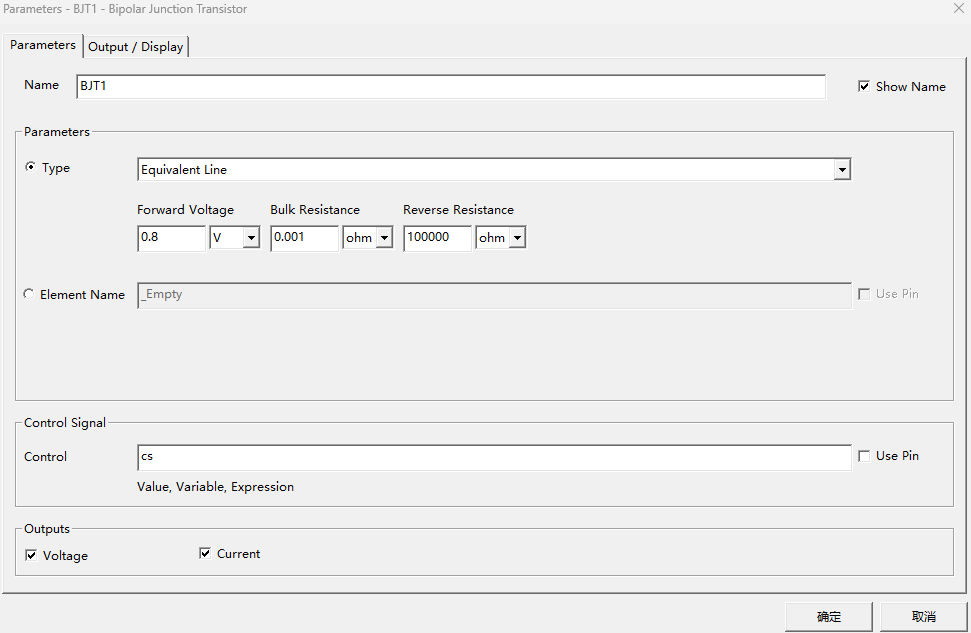

# Simplorer 状态机

> 参考教程：[链接](https://www.bilibili.com/video/BV1Sa411p7ei?vd_source=2d2507d13250e2545de99f3c552af296&spm_id_from=333.788.videopod.sections)

Simplorer 的状态机组件：

> - `STATE_01`，`STATE_10`：单端状态：只能从该状态转移到另一个状态或者从另一个状态转移到该状态；
> - `STATE_11`：双端状态：可以从该状态转移到另一个状态或者从另一个状态转移到该状态；
> - `TRANS`：状态转换条件。

一个状态机例子：

> - 在状态机内设置状态
> 
>   
>
> - 设置状态机的状态转移条件
>
>   

状态机的中的状态可以作为开关器件的输入，需要取消 Use Pin 选项。

使用 FML INIT 模块可以定义变量。
