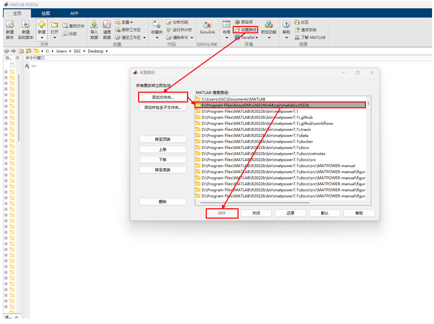
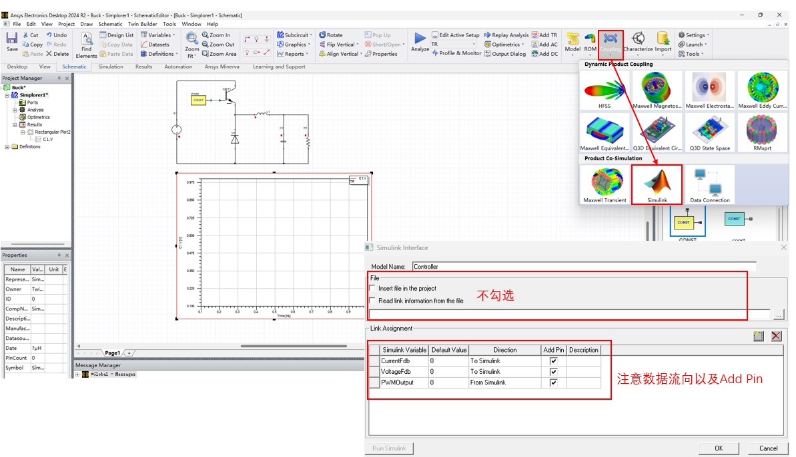
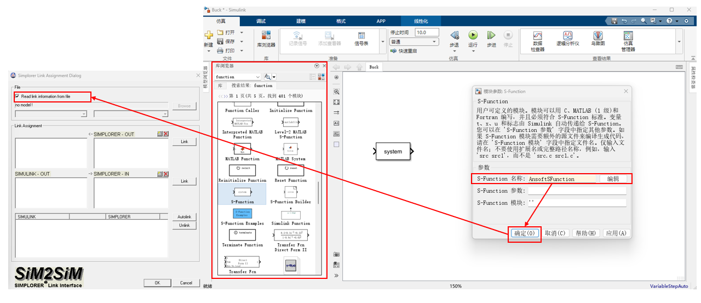
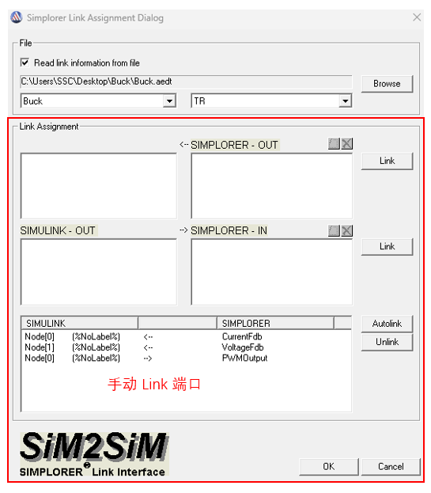
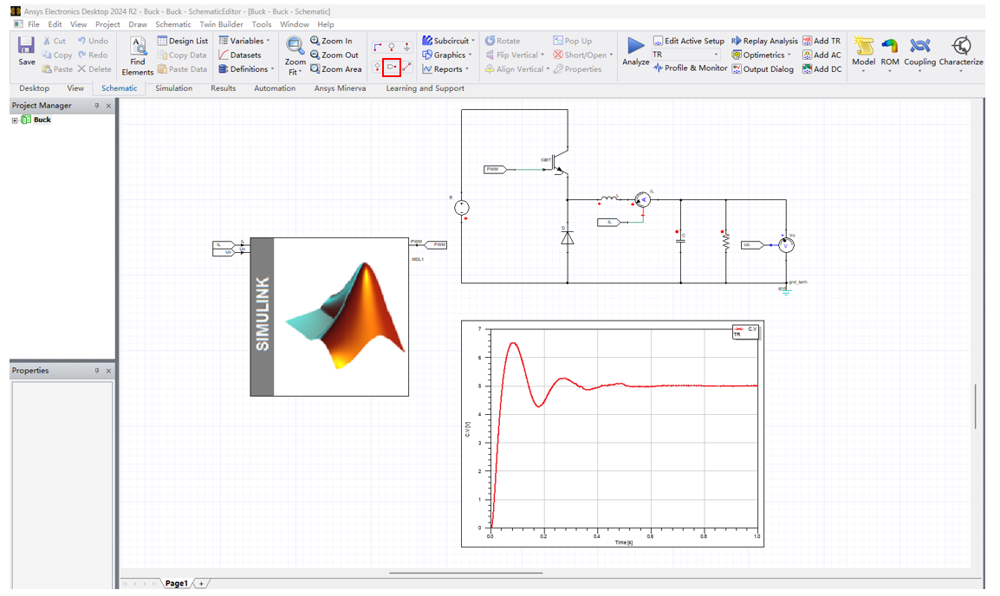
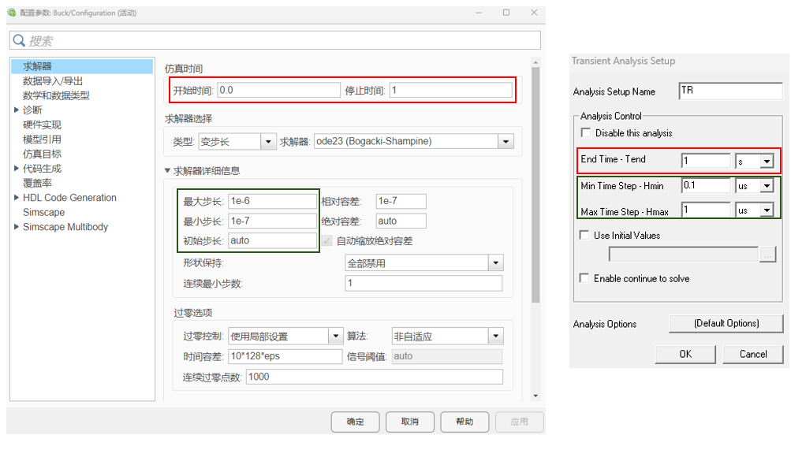
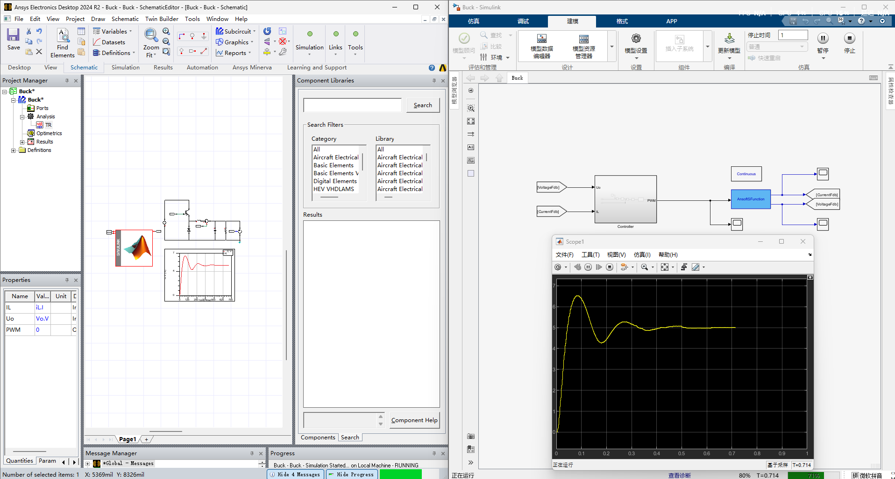

# Simplorer+Simulink 联合仿真

## 1. Method 1: Simulink + Simplorer 联合仿真

1. 添加 Simplorer 目录至 MATLAB 环境目录中：

   

   注意版本需要保持一致。

2. 在 Simplorer 中添加 Simulink 组件：

   

3. 在 Simulink 中添加 S-Function 模块，***重命名为 `AnsoftSFunction`***，确定后进入 Simplorer 导入界面，点击 `Read link information from file` 选取对应 Simplorer 仿真工程：

   

   

   > 如果报错"缺少 MinGW 编译器"，需要根据提示下载对应的 Matlab 组件(见附件的工程)。

   此时 Simulink 和 Simplorer 通过 S-Function 建立了桥接。

4. 完成 Simulink 和 Simplorer 各自的仿真模型搭建：

   注意 Simplorer 内通过端口和各个信号进行链接。

   

5. 设置 Simplorer 和 Simulink 的仿真时间，最好保持一致：

   

6. 在 Simulink 内开启仿真，此时可以看到已经实现联合仿真：

   
