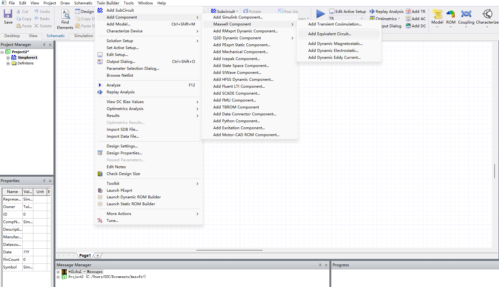
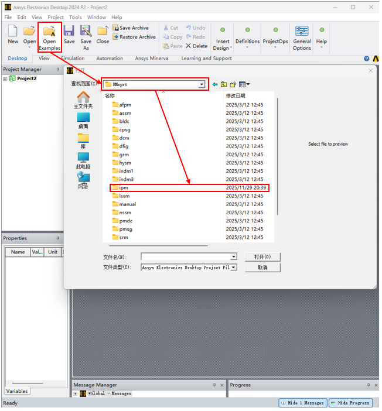
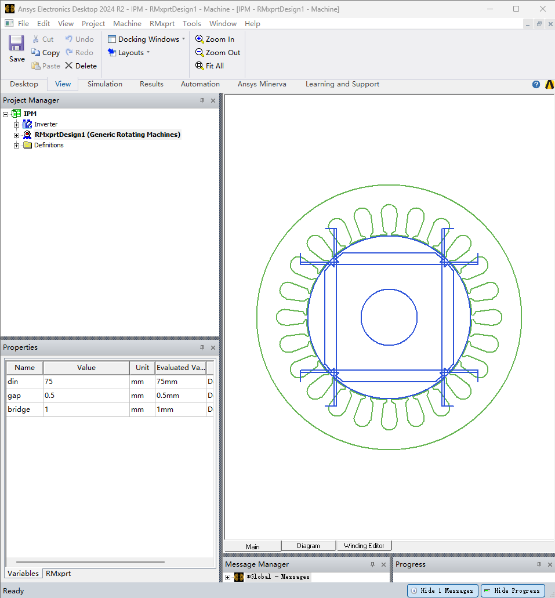
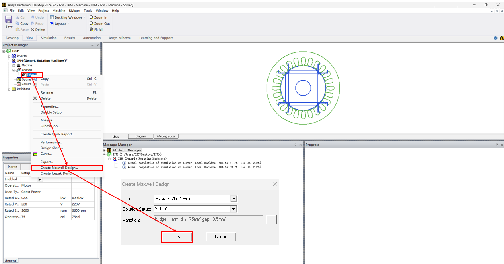
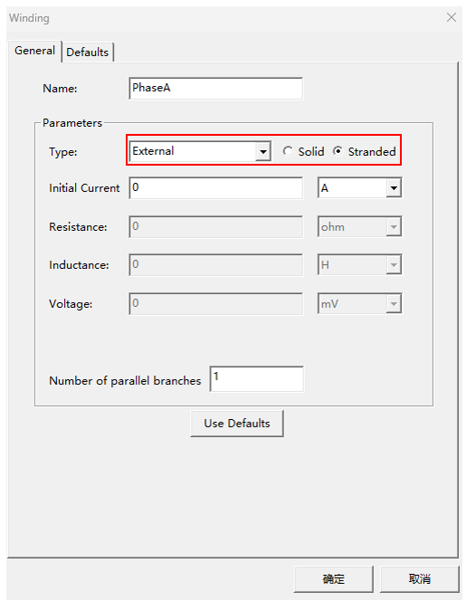
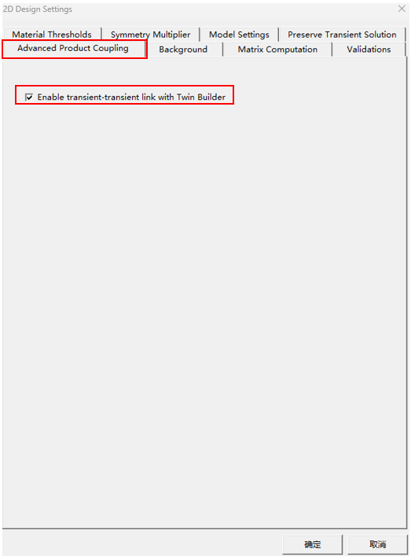
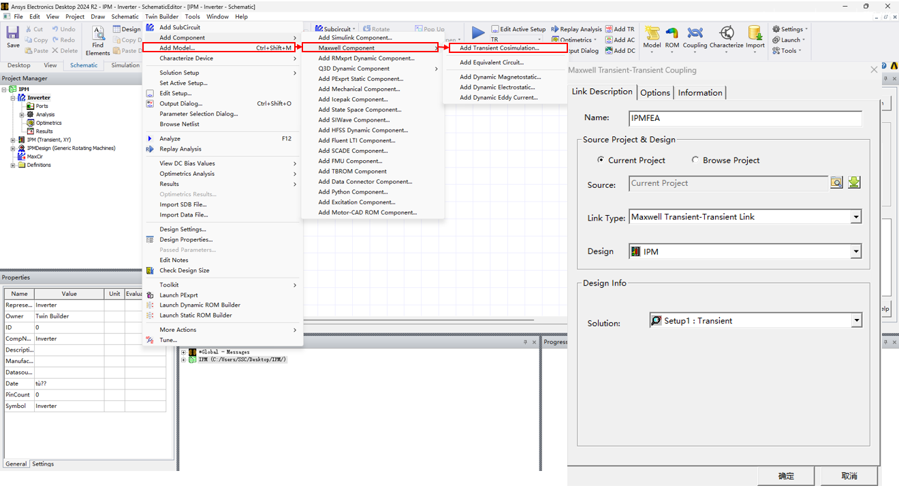
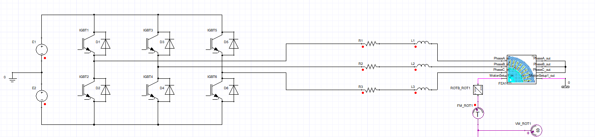
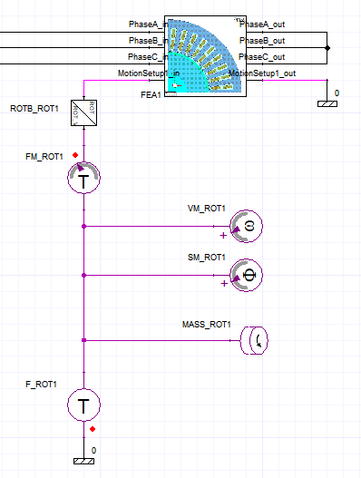

# Simplorer+Maxwell 联合仿真

Simplorer + Maxwell 耦合仿真有三种方式：**TR-TR，ECE等效电路，Dynamic**。

> - TR-TR 方式(瞬态场联合仿真)：Simplorer 和 Maxwell 瞬态求解器直接耦合，进行双向数据交换，计算精确度很高，但是计算资源消耗很大，仿真速度慢；
> - ECE 方式(等效电路模型仿真)：首先通过有限元分析从 Maxwell 模型中提取一个参数化的等效电路模型，然后在 Simplorer 中该模型被视为一个等效电路进行运行(本质是查表法，在 Maxwell 中构造了一个响应面)；计算精确度相对较低，但是计算资源消耗小，仿真速度快；
> - Dynamic 方式：动态静磁场模型/涡流场模型/静电场模型，首先在 Maxwell 中求出部分工况下的参数，然后在 Simplorer 联合仿真时通过已求解的工况得到未求解的工况参数。

## 1. TR-TR 联合仿真

1. 建立有限元仿真模型

   > 这里使用 RMxprt 进行 IPM 模型导入：
   >
   > 
   >
   > 打开其中一个工程，复制其中的 RMxprtDesign 到当前工程中即可：
   >
   > 
   >
   > 关闭工程再打开，**不要直接删除示例工程**。
   >
   > 在 RMxprtDesign 设计文件中生成 IPM 有限元仿真文件：
   >
   > 

   设置线圈为外部激励：

   

   MaxWell 设置为可以进行 TR-TR 仿真：

   

   

2. 在 Simplorer 中导入 Maxwell 仿真模型

   

   此后即可进行 Simplorer 仿真。

------

***注意事项：***

1. 仿真时间设定：

   Simplorer 是主动者，Maxwell 是被动者，当 Maxwell 运行完毕但 Simplorer 尚在运行时，Maxwell 将重新运行，与 Simplorer 进行数据交换。一般的，如果将二者仿真时间和步长设置相同，仿真的结果就不正确。

   **通常将 Simplorer 的时间和步长设置长一些，将 Maxwell 的时间和步长设置短一些。**

2. 外部激励：

   电机外电路需要串联定子漏感和绕组电阻，不然使用电压源时 Simplorer 报错(不能生成诺顿等效电路)：

   

   电阻可以稍大以加快初始状态收敛速度。

3. 机械环路：

   需要为电机适配合适的机械环路：

   

   一般将 MotionSetup_Out 接入机械地，在 MotionSetup_In 处接入机械激励：

   > - F_ROT：力矩源，提供负载力矩；
   > - FM_ROT：力矩测量；
   > - VM_ROT/SM_ROT：转速/位置测量；
   > - MASS_ROT：转子，可以设定初始位置/初始角度/转动惯量。

------

   
