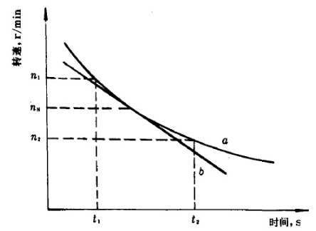

# PMSM 参数离线检测和辨识

## 2. PMSM 参数辨识

### 极对数辨识

> 1. 读取当前机械角度；
> 2. 采用 VF 方式，使用 $u_d = U,u_q = 0$ 的电压矢量，生成电角度缓慢拖动转子运动；
> 3. 再次运动到初始机械角度时，读取生成的电角度总量，除以 $2\pi$ 即可得到极对数值。

### 编码器安装方向和编码器零点辨识

***零点辨识：***
$$
\theta_e = ±p\theta_m - \theta_{offset}
$$

> 1. 采用 VF 方式，使用 $u_d = U,u_q = 0,\theta_e = 0$ 的电压矢量使得转子固定；
> 2. 读取当前的机械角度 $\theta_m$，$\theta_{offset} = ±p\theta_m$；

***安装方向辨识：***

> 1. 使用 $u_d = U,u_q = 0,\theta_e = 0$ 的电压矢量使得转子固定，读取机械角度 $\theta_{m1}$；
> 2. 通过 $u_d = U,u_q = 0,\theta_e = \frac{\pi}{2}$ 和 $u_d = U,u_q = 0,\theta_e = -\frac{\pi}{2}$ 的两个电压矢量，读取 $\theta_{m2},\theta_{m3}$；
> 3. 如果 $\theta_{m2} > \theta_{m1} > \theta_{m3}$ ，转向为正，反之转向为负。

### 电阻辨识

#### 直流电压检测法

$\omega_e = 0$ 时，稳态下的 PMSM 方程为：
$$
u_d = R_si_d
$$
使用 $u_d = U,u_q = 0,\theta_e = 0$ 的电压矢量，读取 $i_q$，则有：
$$
R_s = \frac{u_d}{i_d}
$$

### 电感辨识

#### 脉冲检测法

$\omega_e = 0$ 时，PMSM 的 dq 轴电压方程为：
$$
u_d = R_si_d + L_d\frac{di_d}{dt} \\
u_q = R_si_q + L_q\frac{di_q}{dt} \\
$$
可以向 d 轴/q 轴注入脉冲电压，如果注入电压足够窄，可以用响应电流的斜率求得 $L_d$ / $L_q$：
$$
L_d = \frac{u_d}{\frac{\Delta i_d}{\Delta t}} \\
L_q = \frac{u_q}{\frac{\Delta i_q}{\Delta t}}
$$

#### 高频正弦注入法

$\omega_e = 0$ 时，PMSM 的 dq 轴电压方程为：
$$
u_d = R_si_d + L_d\frac{di_d}{dt} \\
u_q = R_si_q + L_q\frac{di_q}{dt} \\
$$

可以向 d 轴/q 轴注入高频正弦波 ($u_d = U + U_{dh}sin\omega_ht,u_q = 0,\theta_e = 0$ / $u_d = U ,u_q = U_{qh}sin\omega_ht,\theta_e = 0$)，可以用响应电流的幅值求得 $L_d$ / $L_q$：
$$
L_d = \frac{U_{dh}}{\omega_hI_{dh}} \\ 
L_q = \frac{U_{qh}}{\omega_hI_{qh}}
$$

### 磁链辨识

PMSM 旋转进入稳态时，PMSM 的方程如下：
$$
u_d = R_si_d - \omega_eL_qi_q \\
u_q = R_si_q + \omega_eL_di_d + \omega_e\psi_f
$$

此时可以施加旋转电压矢量 $u_d = 0,u_q = U,\theta_e$ 拖动电机进入稳态，然后通过 q 轴电压方程求得磁链。

### 转动惯量辨识

#### 自减速法

[参考链接](https://www.vfe.ac.cn/NewsDetail-1926.aspx)

首先测定电机在一定转速下的输入功率 (施加旋转电压矢量 $u_d = 0,u_q = U,\theta_e$ )，然后切断三相桥，使其由于惯性自然减速，测试被减速电机的减速曲线：

此时可以按照以下经验公式求转子转动惯量：
$$
J = \frac{P_{in}}{4\times1.37\frac{n_1^2-n_2^2}{{t_2}-{t_1}}}\times 10^3
$$
