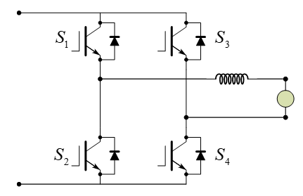
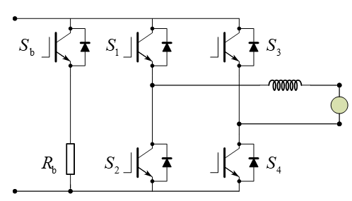
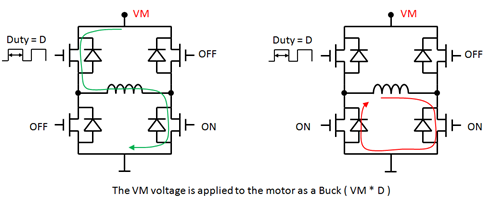
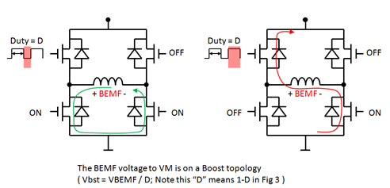
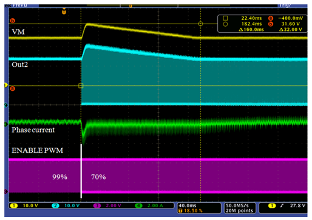

# 电机的制动和泵升电压

## 1. 直流电机的制动和泵升电压

### 直流电机的制动方式

#### 能耗制动

传统的能耗制动指在直流电机需要制动时，将主电路切断，将直流电机转接到一个制动电阻上。在 H 桥驱动电路中，可以通过短接制动的方式实现更简单的能耗制动，如图，关断 $S_1,S_3$，打开 $S_2,S_4$ （或者打开 $S_1,S_3$，关断 $S_2,S_4$）可以将电机短接。此时制动电阻主要是开关管导通电阻和线阻。

制动电阻越大，制动越慢，电枢的电流越小。由此短接制动带来的电流很大，制动速度很快，但是对开关管的瞬间电流要求大，有击穿风险。电机的机械能量主要转化为线路热能损耗。

一种可控的能耗制动方式是通过关断 H 桥所有开关管实现的，此时直流电机处于发电机状态，电流电压反向使得对角线上的开关管体二极管导通，同时打开制动开关管 $S_b$，外加制动电阻 $R_b$ 进行制动。电机机械能量主要转化为制动电阻热能进行损耗。

#### 反接制动

反接制动指施加反向电枢电压以实现提供反向电流，从而产生反向力矩从而进行更快速的制动。实际上，在电机闭环控制系统中，使用带宽较大的 PID 控制器可以实现输出反向的电流从而实现反接制动。

#### 反馈制动

反馈制动时电机的转速通常高于额定转速，此时 H 桥的输出电压低于电机反电动势，电机处于发电状态。

### 直流电机的泵升电压

泵升电压的产生原因本质就是：**直流电机处于发电机状态（反电动势高于输出电压导致电流反向），电机向电源反馈电能。**

> **从电路的角度进行解释：**[参考链接](https://e2echina.ti.com/blogs_/b/industry/posts/2-vm)
>
> 对 H 桥母线电压 $U_{dc}$，H 桥为 Buck 电路：
>
> 
>
> 而对于电机的反电动势，H 桥为 Boost 电路：
>
> 
>
> 正常运行下，根据电机运行方程 $U_{DRV} = Ri+L\frac{di}{dt}+U_{EMF}$；由 $U_{DRV} = DU_{dc}$，$U_{BEMF} = \frac{U_{EMF}}{D}$，则在母线侧有 $U_{dc} > U_{BEMF}$，没有泵升现象；
>
> 一旦 PWM 占空比减小($D_2 < D_1$)，在减小之前，有：$U_{EMF1} = KU_{dc}D_1$；占空比变化后，由于机械惯性，电机速度不能立刻改变，$U_{BEMF2} = \frac{U_{EMF1}}{D_2}$；则 $U_{BEMF2} = \frac{KU_{dc}D_1}{D_2}$，如果 $\frac{KD_1}{D_2} > 1$，则 $U_{BEMF2} > U_{dc}$，产生泵升现象。
>
> 

泵升现象在短路制动中不会发生，但是如果使用断路制动，泵升现象必须注意。如果电源是单向的，泵升现象的电能将只能通过线路电阻释放，这是十分危险的。通常需要在母线侧并联大电容以抑制泵升：
$$
\frac{1}{2}CU_{dcmax}^2 - \frac{1}{2}CU_{dc}^2 = E_k
$$
母线电容越大，泵升电压越小。如果泵升电压超过了选取电容规定的电压，此时必须加入制动电阻回路进行能耗制动。同时，大的母线电容意味着预充电措施是必要的。

## 2. PMSM 的制动和泵升电压

PMSM 的制动和泵升电压原理和 BDC 的制动和泵升电压原理一致。
