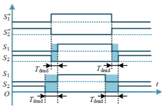
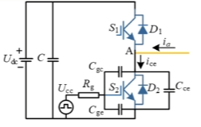
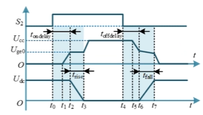
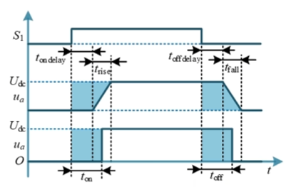
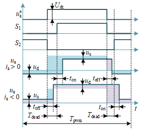
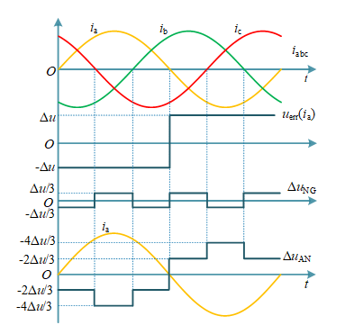
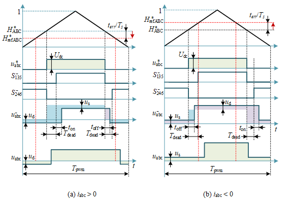

# 逆变器非线性和死区补偿

> 参考：[链接](https://www.bilibili.com/video/BV13VSTBhEtK/?spm_id_from=333.337.search-card.all.click&vd_source=2d2507d13250e2545de99f3c552af296)

 ## 1. 死区和逆变器非线性

### 死区

实际的功率开关管的导通时间常常小于关断时间，为了防止同一个桥臂上下开关管导通，需要是的互补工作的开关管在开关状态切换时加入同时关断的驱动信号，即加入死区。

死区有两种加入形式：

- 延时导通，立即关断；
- 延时导通，提前关断。

### 逆变器非线性

以 A 相桥下管的等效电路为例，下管导通时电流流经 $S_2$，下管关断时电流经过上管的反并联二极管 $D_1$ 进行续流：

$R_g$ 为驱动电阻，$U_{cc}$ 为驱动电源，$C_{gc},C_{ge},C_{ce}$ 为寄生电容，一个周期内的波形如下：

> 1. $t_0 - t_1$：驱动器存在延时，使得 $u_{ge}$ 无变化；
> 2. $t_1 - t_2$：$U_{cc}$ 向 $C_{ge}$ 充电，$u_{ge}$ 上升直到 $u_{ge} = U_{ge(th)}$，此时开关管开始导通，开关管开始流过电流；开关管导通后，流过电流，$U_{cc}$ 向 $C_{gc},C_{ge}$ 充电，$u_{ge}$ 上升斜率稍微下降，此时 A 点电压稍微下降(对感性负载)，下管电流逐渐上升直到最大值。
> 3. $t_2-t_3$：$u_{ce}$ 迅速下降，使得电容 $C_{gc}$ 两侧电压差迅速减小，此时驱动器的电流大部分流向 $C_{gc}$ ，$C_{ge}$ 充电速度减慢，使得 $u_{ge}$ 基本不变(米勒平台)，直到 $u_{ce}$ 下降到管开通压降 $U_{ce(on)}$。
> 4. $t_3-t_4$：米勒平台结束，$u_{ge}$ 继续上升到 $U_{cc}$。 
> 5. $t_4-t_5$：驱动器存在延时，使得 $u_{ge}$ 无变化；
> 6. $t_5-t_6$：$C_{ge},C_{gc}$ 放电，$u_{ge}$ 逐渐下降到 $U_{ge(th)}$，开关管关断；
> 7. $t_6-t_7$：$C_{ce}$ 充电。

开通时间和关断时间和输出电流有关，电流越大，开通时间越长，关断时间越小。

### 逆变器输出误差

死区和逆变器非线性都会导致开通和关断时间的延时，可以合并考虑；同时近似考虑开通和关断过程是线性的。根据面积等效原理，得到等效的开通和关断延时：

$$
t_{on} = t_{on(delay)}+\frac{1}{2}t_{rise} \\
t_{off} = t_{off(delay)}+\frac{1}{2}t_{fall}
$$
由此可以得到一个周期的单相电压误差(同时考虑续流管和开关管的压降)：

$$
\Delta u_{+} = -(1-D)u_d-Du_s-\frac{t_{dead}+t_{on}-t_{off}}{T_s}(U_{dc}-u_s+u_d),i>0 \\
\Delta u_{-} = (1-D)u_s+Du_d-\frac{t_{dead}+t_{on}-t_{off}}{T_s}(U_{dc}-u_s+u_d),i<0
$$
管压降可以通过器件手册得到，等效开关时间可以通过离线测量得到。
$$
u_a = u_a^* + u_{err}(i_a) \\
u_{err}(i_a) = -\Delta u sgn(i_a) \\
\Delta u \approx |\Delta u_{+}| \approx |\Delta u_{-}| 
$$
对于 SVPWM 而言，$u_a^*,u_b^*,u_c^*$ 为注入了三次谐波的三相正弦信号并叠加 $\frac{1}{2}U_{dc}$ 的直流信号，从而使得
$$
u_a^*+u_b^*+u_c^* = \frac{3}{2}U_{dc}
$$
由于死区和逆变器非线性带来的中性点电位：
$$
u_{N} = \frac{1}{2}U_{dc}+\frac{1}{3}\Delta u(-sgn(i_a)-sgn(i_b)-sgn(i_c))
$$
使得 
$$
u_{aN} = u_a^* - \frac{1}{2}U_{dc} + \frac{1}{3}\Delta u(-2sgn(i_a)+sgn(i_b)+sgn(i_c))
$$

中性点电压会存在一个六阶梯波的电压信号，从而导致相电压产生 $6k±1$ 次谐波，从而导致 $6k$ 次谐波的转矩脉动。

误差电压与相电流的极性相反，即误差电压会阻碍相电流的变化，这使得相电流在过零点时具有保持为零的趋势，这会导致极性判断的困难。

## 2. 死区补偿

### 时间补偿

为了弥补逆变器非线性导致的电压损失，需要对 ABC 三相桥臂上管的 PWM 高电平时间延长 $t_{err(a,b,c)}$。可以通过调整调制波实现死区非线性补偿(调整比较值)：
$$
t_{err}(i_a) = -\frac{\Delta u sgn(i_a)T_s}{U_{dc}} \\
t_{err}(i_b) = -\frac{\Delta u sgn(i_b)T_s}{U_{dc}} \\
t_{err}(i_c) = -\frac{\Delta u sgn(i_c)T_s}{U_{dc}} \\
$$
调整的比较值为：$-\frac{t_{err}(i)}{T_s}$；

### 电压补偿

对电压误差进行坐标变换，将变换后的误差加到 $u_{dq}$ 上即可。