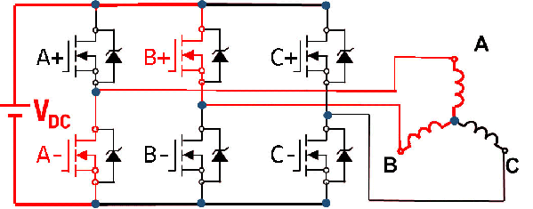
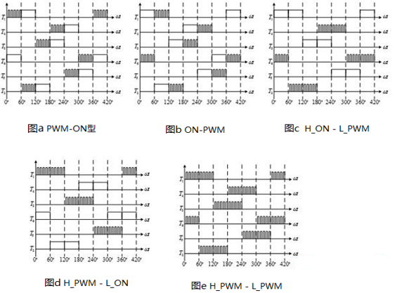

# Engine BLDC的逆变器调制

## 1. BLDC六步换向法的逆变器调制

仍然使用三相 VSI 作为 BLDC 的驱动电路，与 SPWM/SVPWM 不同的是，此时在一步内只需要打开一个上桥臂和一个下桥臂。（而 SPWM/SVPWM 需要同时打开三个桥臂）

如果直接导通一个上桥臂和一个下桥臂进行六步换向，电流无法控制，从而无法控制力矩，也无法由此控制速度。

为了能控制电流，**导通的桥臂必须有一个使用 PWM 进行斩波控制**。常见的 PWM 控制方法如下：

**H_PWM_L_ON 是最常用的控制方式**，用此方式只需要控制上桥臂的占空比，下桥臂只需要控制开关即可。
