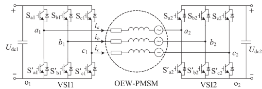
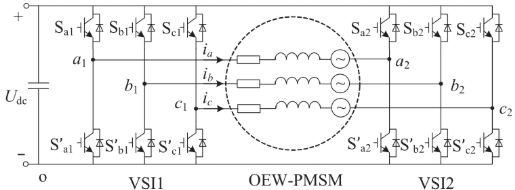
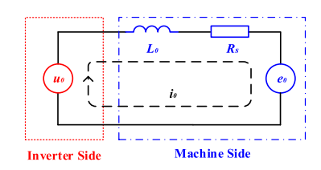

# Open-Winding-PMSM 1_Mathematical Model

## 1. 开绕组永磁同步电机简介

开绕组(Open Winding)电机指把传统的交流电机的三相定子绕组的中性点 X/Y/Z 打开，这样具有六个接线端子结构的电机即开绕组电机，开绕组电机具有高直流电压利用率、更好的容错性能、多电平调制和高转矩密度的优点。

开绕组电机的驱动拓扑根据逆变器直流侧分为隔离直流母线(isolated-DC-bus)和共直流母线(common-DC-bus)两种类型。

> 1. 隔离直流母线有两个电源，不存在零序通路，因而不必考虑这种拓扑的零序抑制问题。且两个电源的电压等级可以不同，因而存在更多控制的灵活性。缺点在于系统的体积会较共直流母线的拓扑更为庞大。
>
>    
>
> 2. 共直流母线的拓扑只有一个电源，存在零序通路，但该种拓扑结构更为简洁，能量密度更高，由此更多的研究是基于共直流母线的研究。
>
>    

> **零序通路：**
>
> 三相系统中，ABC三相存在相位顺序的区别，由此分为正序，负序和零序。
>
> > 1. 正序： A相领先B相 120 度， B相领先C相 120 度， C相领先A相 120 度。
> > 2. 负序： A相落后B相 120 度， B相落后C相 120 度， C相落后A相 120 度。
> > 3. 零序： ABC 三相相位相同。
>
> 对于电机系统而言，正序基波分量的三次谐波正好形成零序分量，在 PMSM 中，由于 PMSM 星接，所以三次谐波电压激励无法产生三次谐波电流，也就没有零序分量。
>
> **三次谐波电压激励的来源包括三次谐波转子磁链，以及逆变器的SVPWM调制引入的三次谐波分量。**
>
> 零序电压属于共模电压（因为瞬时流向是相同的，相对的，正序和负序分量是差模电压），PWM输出的共模电压定义为：
> $$
> \frac{U_{AN}+U_{BN}+U_{CN}}{3}
> $$
> 由此可以得到：共模电压是逆变器输出侧三相星形负载中性点对逆变器参考地点的电位差。对于隔离直流母线，由于逆变器参考地不连接，所以没有零序通路；而共直流母线的参考地是连接的，零序通路必然存在。

## 2. 开绕组永磁同步电机数学模型

> 参考文献：
>
> 1. H. Zhan and Z. Q. Zhu, "Nonintrusive online rotor permanent magnet temperature tracking for permanent magnet synchronous machine based on third harmonic voltage," *2016 IEEE Energy Conversion Congress and Exposition (ECCE)*, Milwaukee, WI, USA, 2016, pp. 1-8, doi: 10.1109/ECCE.2016.7855293.
> 2. H. Zhan, Z. -q. Zhu and M. Odavic, "Analysis and Suppression of Zero Sequence Circulating Current in Open Winding PMSM Drives With Common DC Bus," in *IEEE Transactions on Industry Applications*, vol. 53, no. 4, pp. 3609-3620, July-Aug. 2017, doi: 10.1109/TIA.2017.2679678. 

此时必须要考虑零序分量的影响，这里需要考虑三次谐波的转子磁链。

ABC 三相静止坐标系的电压方程为：
$$
\left[
\begin{matrix}
u_a \\ u_b \\ u_c
\end{matrix}
\right] = 
\left[
\begin{matrix}
R_s & & \\
& R_s & \\
& & R_s 
\end{matrix}
\right]\left[
\begin{matrix}
i_a \\ i_b \\ i_c
\end{matrix}
\right]
+
\left[
\begin{matrix}
L_{aa} & M_{ab} & M_{ac} \\
L_{ba} & M_{bb} & M_{bc} \\
L_{ca} & M_{cb} & M_{cc} 
\end{matrix}
\right]
\frac{d}{dt}
\left[
\begin{matrix}
i_a \\ i_b \\ i_c
\end{matrix}
\right]
+
\frac{d}{dt}
\left[
\begin{matrix}
\psi_{f1}cos\theta+\psi_{f3}cos3\theta \\
\psi_{f1}cos(\theta-\frac{2\pi}{3})+\psi_{f3}cos3\theta \\
\psi_{f1}cos(\theta+\frac{2\pi}{3})+\psi_{f3}cos3\theta \\
\end{matrix}
\right]
$$
dq0 旋转坐标系的电压方程为：
$$
\left[
\begin{matrix}
u_d \\ u_q \\ u_0
\end{matrix}
\right] 
=
\left[
\begin{matrix}
pL_d + R_s & -\omega_eL_q & \\
\omega_eL_d & pL_q+R_s & \\
& &  pL_0+R_s 
\end{matrix}
\right]
\left[
\begin{matrix}
i_d \\ i_q \\ i_0
\end{matrix}
\right] 
+
\left[
\begin{matrix}
0 \\ \omega_e\psi_{f1} \\
-3\omega_e\psi_{f3}sin3\theta_e
\end{matrix}
\right]
$$
转矩方程：
$$
T_e = \frac{3}{2}p[i_q\psi_{f1}+(L_d-L_q)i_di_q-6i_0\psi_{f3}sin3\theta_e]
$$
记 $e_0 = -3\omega_e\psi_{f3}sin(3\theta_e)$ 为零序反电动势。

常规的永磁电机在制造时，通常有意保留永磁体的三次谐波谐波来提高电机的转矩密度，因此零序电流的存在会显著影响电磁转矩，从而造成转矩脉动。

零序等效电路如图：

$u_0$ 是逆变器经调制施加到电机机端上等效的零序电压(Zero Sequence Voltage,ZSV)/共模电压(Common Mode Voltage, CMV)；$e_0$ 是电机的零序反电动势。
