# Open-Winding-PMSM 2_Modulation 

## 1. SVPWM-中间六边形/最大六边形调制

参考链接：[链接](https://zhuanlan.zhihu.com/p/659764058)

两个逆变器分别能产生以下的空间矢量，每个逆变器输出的基本矢量幅值为 $\frac{2}{3}U_d$：

> 基本矢量幅值为 $\frac{2}{3}U_d$，这是在两相静止坐标系下看待的，因为 Clark 等幅值变换会保证分量幅值相等，所以三相矢量幅值和两相矢量幅值有 $\frac{2}{3}$ 的比例关系。

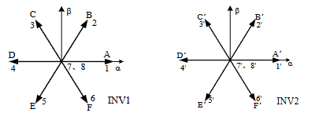

对于开绕组电机，由于 $u_a = u_{a1} - u_{a2}$，对所有可能的空间矢量组合进行减法运算，合成两个逆变器能产生的空间矢量：

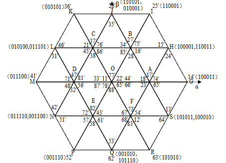

逆变器产生的零序电压的表达式为：
$$
u_0 = \frac{1}{3}(u_{a1N}+u_{b1N}+u_{c1N})-\frac{1}{3}(u_{a2N}+u_{b2N}+u_{c2N}) =  \frac{u_{a1a2}+u_{b1b2}+u_{c1c3}}{3}
$$
由此可以得到空间各点的零序电压分量：

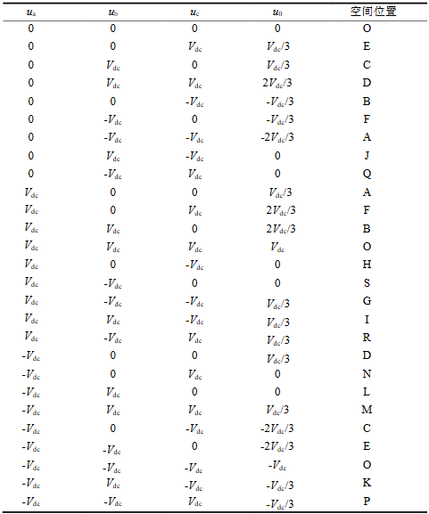

### 中间六边形调制

中间六边形调制的核心思想在于，控制逆变器产生的共模电压 $u_0$ 保持为零，进而抑制由共模电压产生的零序电流。

非零合成矢量 53’，35’，15’，51’，13’，31’，46’，64’，24’，42’，26’，62’各自对应的开关组合所产生的零序电压均为零。六个电压矢量的终点同时也是中间的正六边形 HSJLNQ 对称分布的六个顶点。

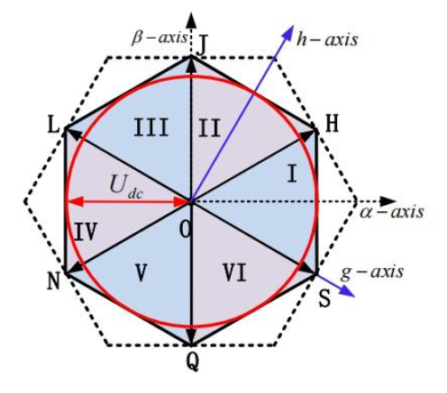

中间六边形的开关组合方式有很多，但是考虑 MCU/DSP 实现的复杂度，只有 4 种组合有研究价值：

> 1. 24’，35’，46’，51’，62’，13’；
> 2. 15’，26’，31’，42’，53’，64’；
> 3. 15’，35’，31’，51’，53’，13’；
> 4. 24’，26’，46’，42’，62’，64’；

3，4 两种方式从一个状态到另一个状态切换时，虽然有一组逆变器不动作，但是另一组逆变器中的两相开关都发生动作；所以 1，2 方式是符合 SVPWM 的开关切换原则的。以下以 1 方式为例：

1. 双逆变器合成的空间电压矢量分为 6 个扇区（相比于普通的 SVPWM 旋转了 $\frac{\pi}{6}$）；重新定义 h  轴和 g 轴：
   $$
   u_g = \frac{\sqrt{3}}{2}u_\alpha - \frac{1}{2}u_\beta \\
   u_h = \frac{1}{2}u_\alpha + \frac{\sqrt3}{2}u_\beta
   $$
   
2. 定义变量：
   $$
   u_{ref1} = u_h \\
   u_{ref2} = -\frac{1}{2}u_h + \frac{\sqrt3}{2}u_g \\
   u_{ref3} = -\frac{1}{2}u_h - \frac{\sqrt3}{2}u_g
   $$
   扇区计算：
   $$
   N = A + 2B+4C
   $$
   其中，如果 $u_{ref1} \textgreater 0$，则 $A = 1$，反之为 0；如果 $u_{ref2} \textgreater 0$，则 $B = 1$，反之为 0；如果 $u_{ref3} \textgreater 0$，则 $C = 1$，反之为 0。

   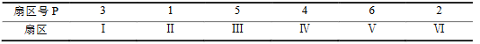

3. 电压矢量作用时间计算：以扇区 Ⅰ 为例

   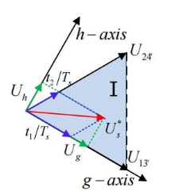

   $t_1$ 为电压矢量 13’ 作用时间，$t_2$ 为电压矢量 24’ 作用时间，$T_s$ 为载波周期，得到：
   $$
   t_1 = \frac{T_s}{2U_{dc}}(\sqrt3 u_g-u_h) \\
   t_2 = \frac{T_s}{U_{dc}}u_h
   $$
   定义 $X,Y,Z$ 计算电压矢量作用时间：
   $$
   X = \frac{u_h}{U_{dc}}T_s \\
   Y = \frac{u_h+\sqrt3 u_g}{2U_{dc}}T_s \\
   Z = \frac{u_h-\sqrt3 u_g}{2U_{dc}}T_s
   $$
   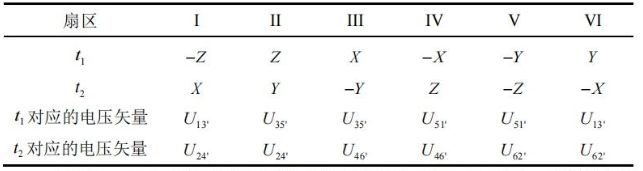

   当 $t_1+t_2 \textgreater T_s$ 时，产生过调制，令 $t_1^* = t_1 \frac{T_s}{t_1+t_2}$，$t_2^* = t_2 \frac{T_s}{t_1+t_2}$ 即可。

4. 为减小电流谐波含量，一般采用七段式SVPWM。且在电压矢量切换的时候，每个逆变器每次只允许有一个开关发生切换动作。

   定义以下时间：
   $$
   T_a = \frac{1}{4}(T_s-t_1-t_2) \\
   T_b = T_a + \frac{t_1}{2} \\
   T_c = T_b + \frac{t_2}{2}
   $$
   
   $T_a$ 是 $t_1$ 矢量开始作用时间，$T_b$ 是 $t_2$ 矢量开始作用时间，$T_c$ 是零矢量开始作用时间。
   
   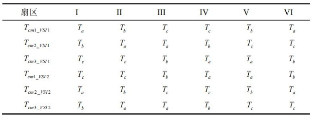
   
   两个逆变器切换时间点如表所示。

中间六边形调制虽然使得 $u_0 = 0$，但是由于零序反电动势存在，零序环流仍然需要抑制。

### 最大六边形调制

最大六边形调制策略能输出幅值更大的空间电压矢量，提高电压利用率，增强电机的带负载能力，拓宽调速范围。但是在采用最大六边形调制时，两个逆变器产生的共模电压无法相互抵消，进而会在电机绕组上产生共模电压。

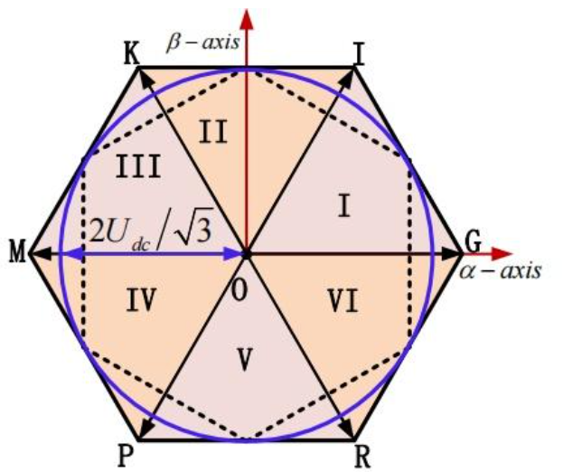

最大六边形调制的实现方法是和中间六边形类似的。

1. 双逆变器合成的空间电压矢量分为 6 个扇区，定义变量：
   $$
   u_{ref1} = u_\beta \\
   u_{ref2} = -\frac{1}{2}u_\beta  + \frac{\sqrt3}{2}u_\alpha \\
   u_{ref3} = -\frac{1}{2}u_\beta  - \frac{\sqrt3}{2}u_\alpha
   $$
   扇区计算：
   $$
   N = A + 2B+4C
   $$
   其中，如果 $u_{ref1} \textgreater 0$，则 $A = 1$，反之为 0；如果 $u_{ref2} \textgreater 0$，则 $B = 1$，反之为 0；如果 $u_{ref3} \textgreater 0$，则 $C = 1$，反之为 0。

   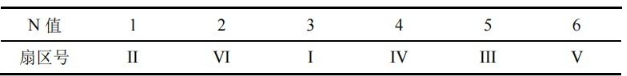

2. 定义 $X,Y,Z$ 计算电压矢量作用时间：
   $$
   X = \frac{u_\beta}{U_{dc}}T_s \\
   Y = \frac{u_\beta+\sqrt3 u_\alpha}{2U_{dc}}T_s \\
   Z = \frac{u_\beta-\sqrt3 u_\alpha}{2U_{dc}}T_s
   $$
   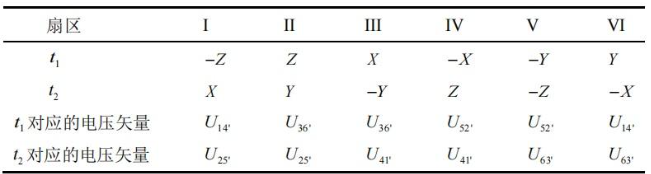

3. 类似定义 $T_a,T_b,T_c$，可以得到切换时间点：

   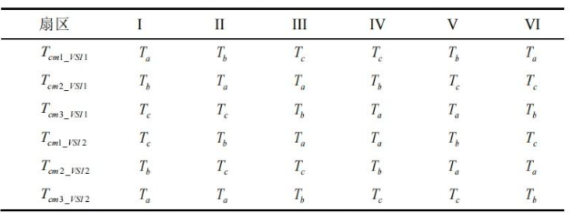

