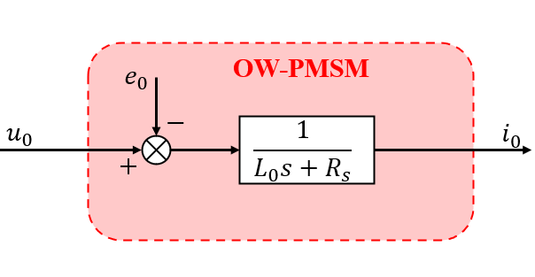
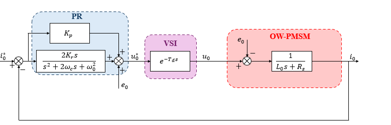
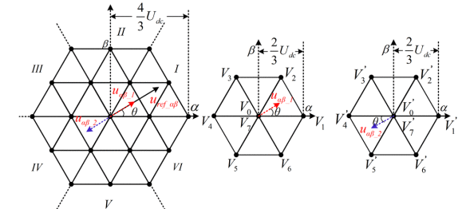
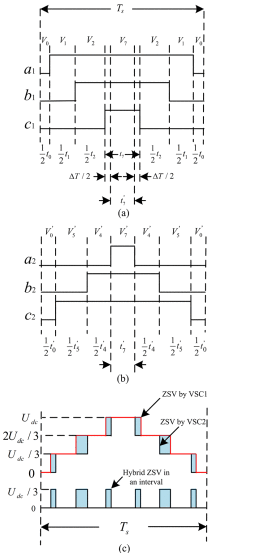
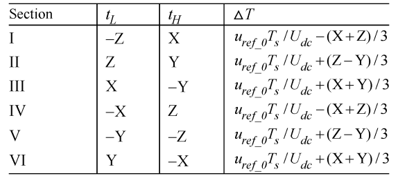
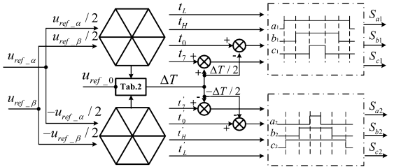
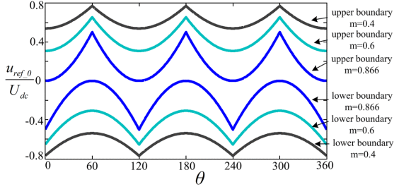
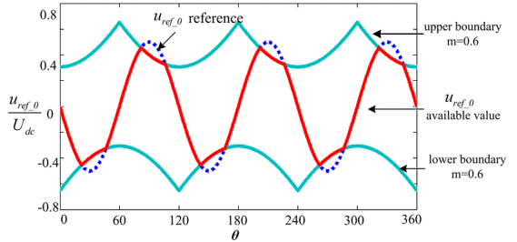
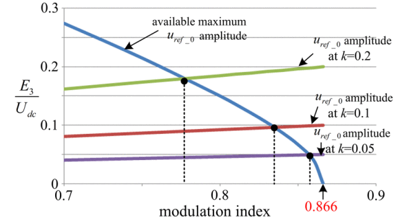

# Open-Winding PMSM 3_Zero-Sequence Current Suppression

## 1. 基于零矢量重新分布的零序电流抑制策略

> 参考文献：
>
> 1. Y. Zhou and H. Nian, "Zero-Sequence Current Suppression Strategy of Open-Winding PMSG System With Common DC Bus Based on Zero Vector Redistribution," in *IEEE Transactions on Industrial Electronics*, vol. 62, no. 6, pp. 3399-3408, June 2015, doi: 10.1109/TIE.2014.2366715. 

### 零序电流抑制算法

不论是中间六边形调制和最大六边形调制，由于可变的零序反电动势存在，不加零序抑制的调制策略总是会带来零序电流，造成转矩脉动。因此需要通过逆变器输出零序电压对零序电流进行抑制。

OW-PMSM 的零序框图如下：

零序回路中存在永磁体三次谐波反电动势和逆变器作用在电机绕组上的共模电压，所以零序电流一般是三倍频脉动的。根据内模原理，PI 控制器无法有效无差调节交流信号，由此采用 PR 控制器对零序电流进行控制。

 

> $e_0$ 用于前馈补偿，增加动态性能。

### 逆变器的零序电压产生方法

#### SPWM 

SPWM 只需要将电压零序指令加入调制波就可以实现对电压零序分量的调节(缺点是电压利用率低)。

此时只需要按照以下方式分配电压指令：
$$
\left\{
\begin{aligned}
u_{d1}^* = k_du_d^* \\
u_{q1}^* = k_qu_q^*  \\
u_{01}^* = k_0u_0^*  
\end{aligned}
\right. \\
\left\{
\begin{aligned}
u_{d2}^* = (1-k_d)u_d^* \\
u_{q2}^* = (1-k_q)u_q^*  \\
u_{02}^* = (1-k_0)u_0^*  
\end{aligned}
\right.
$$
$k_d$，$k_q$ 和 $k_0$ 为分配系数，可以任取，一般可以取为 0.5 以避免过调制。

#### ZVR-SVPWM(零矢量重新分配)

首先将 $u_{ref-\alpha\beta}$ 分成两个方向相同且相反的电压矢量 $u_{ref-\alpha\beta1}$ 和 $u_{ref-\alpha\beta2}$。以下以区域 Ⅰ 为例：

根据伏秒平衡，在一个 PWM 周期内，每个向量的占空时间可以计算为：
$$
u_{ref-\alpha\beta1}T_s = u_0t_0 + u_1t_1 + u_2t_2 + u_7t_7 \\
u_{ref-\alpha\beta2}T_s = u_0^,t_0^, + u_5^,t_5^, + u_4^,t_4^, + u_7^,t_7^, \\
T_s = t_0 + t_1 + t_2 + t_7 = t_0^, + t_5^, + t_4^, + t_7^,
$$
根据对称性：$t_1=t_4^,,t_2=t_5^,$。

定义调制指数：
$$
M = \frac{|u_{ref-\alpha\beta}|}{\frac{2\sqrt 3}{3}U_{dc}}
$$
由正弦定理可以推导得到：
$$
t_1 = t_4^, = \frac{\sqrt 3M\sin(60\degree-\theta_e)}{2\sin 60\degree}T_s\\
t_2 = t_5^, = \frac{\sqrt 3M\sin(\theta_e)}{2\sin 60\degree}T_s
$$
为了调制零轴电压，需要重新分配零矢量的时间。

> $u_1$，$u_3$，$u_5$ 的零序电压是 $\frac{1}{3}U_{dc}$；$u_2$，$u_4$，$u_6$ 的零序电压是 $\frac{2}{3}U_{dc}$；$u_7$ 的零序电压是 $U_{dc}$；

$$
u_{0\_1}T_s = \frac{1}{3}U_{dc}t_1+\frac{2}{3}U_{dc}t_2+U_{dc}t_7 \\
u_{0\_2}T_s = \frac{2}{3}U_{dc}t_4^,+\frac{1}{3}U_{dc}t_5^,+U_{dc}t_7^, \\
u_{ref\_0}T_s = (u_{0\_1}-u_{0\_2})T_s=\frac{1}{3}U_{dc}t_2-\frac{1}{3}U_{dc}t_1+U_{dc}(t_7-t_7^,)
$$

由此两个逆变器的 $u_7$ 作用时间应当存在偏差以控制输出的零序电压：
$$
\Delta T= t_7 - t_7^, = \frac{u_{ref\_0}}{U_{dc}}T_s-\frac{1}{3}t_2+\frac{1}{3}t_1
$$
通常为了使得逆变器处于对称工作状态，按照以下方式分配零矢量：
$$
t_7 = t_0^, = \frac{\Delta T}{2}+\frac{1}{2}(T_s-t_1-t_2) \\
t_0 = t_7^, = -\frac{\Delta T}{2}+\frac{1}{2}(T_s-t_1-t_2)
$$
由此可以得到 PWM 一个周期内的波形：

接下来说明具体实现，定义 $X,Y,Z$：
$$
\left\{
\begin{aligned}
X = Msin\theta_eT_s \\
Y = \frac{\sqrt 3M\cos\theta_e+M\sin\theta_e}{2}T_s \\ 
Z = \frac{-\sqrt 3M\cos\theta_e+M\sin\theta_e}{2}T_s
\end{aligned}
\right.
$$
计算 $t_L$ ，$t_H$ 和 $\Delta T$，$t_L$ 表示调制零序电压为 $\frac{1}{3}U_{dc}$ 的矢量的占空时间；$t_H$ 表示调制零序电压为 $\frac{2}{3}U_{dc}$ 的矢量的占空时间。

生成开关动作的逻辑如下：

> - 调制范围
>
>   通过 $t_7 = 0$ 和 $t_7^, = 0$ 的限制条件可以得到可用调制区，这里不做过多推导。
>
>   调制范围通过 $M$ 决定：
>
>   
>
>   如果零序电压的指令值超出调制范围，将会造成零序电压过调制：
>
>   
>
>   同时考虑到系统中**零序反电动势幅值与 $M$ (表征稳态转速，推导见参考文献)以及 $\psi_{3r}$ 成正比**，由此，调制比 $M$，零序反电动势幅值和可调制的零序电压范围关系如图所示，交点表示可调制的零序电压范围和零序反电动势幅值相等：
>
>   
>
>   为了实现零序电流抑制，转子磁链中更大的三次谐波分量会导致调制范围较低。可以使用更大的直流母线电压来扩大调制范围。如果工作在弱磁状态，扩大调制范围是更必要的。
