# 单逆变器并联永磁同步电机控制策略

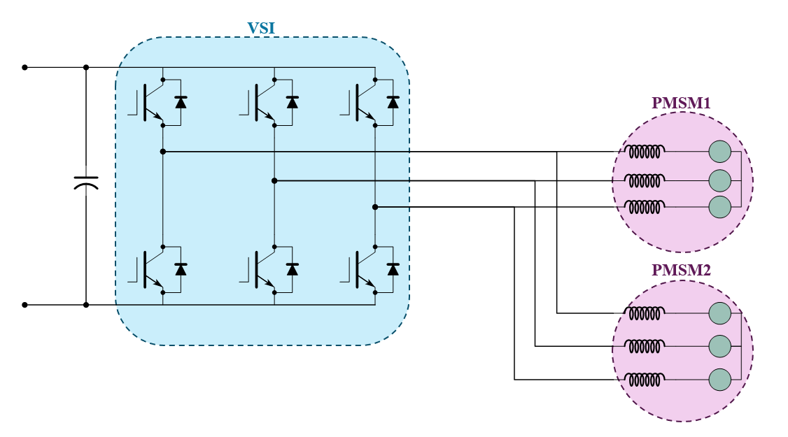

通常一个电机由一个变换器进行控制，这称之为单机单变换器系统(SMSC)；多机系统(MMS)更加常用，但是多机系统常常需要对应数量的变换器，为了节约成本，多机单变换器系统具有更高的研究价值。本节介绍最简单的多机单变换器系统：单逆变器驱动双永磁同步电机，其中两台电机的参数相同。

单逆变器驱动双永磁同步电机控制系统主要有***平均控制***，***主从控制***和***模型预测控制***三种控制策略。

## 1. 平均控制策略

> 参考文献：
>
> 1. J. M. Lazi, Z. Ibrahim, M. H. N. Talib and R. Mustafa, "Dual motor drives for PMSM using average phase current technique," *2010 IEEE International Conference on Power and Energy*, Kuala Lumpur, Malaysia, 2010, pp. 786-790.

经典的平均控制策略如下图，核心思想是将两台电机平均等效为一个电机。但是两个电机的负载差异较大时，对于负载扰动和速度指令变化的响应振荡会较大。

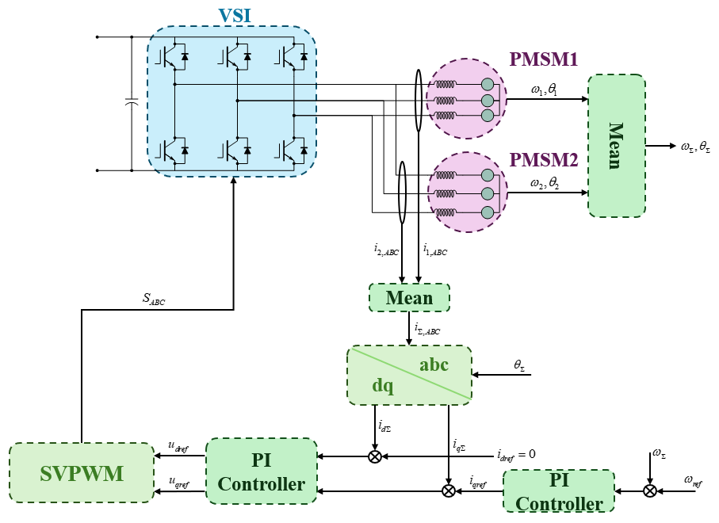

## 2. 主从控制策略

> 参考文献：
>
> 1. D. Bidart, M. Pietrzak-David, P. Maussion and M. Fadel, "Mono inverter dual parallel PMSM - structure and control strategy," *2008 34th Annual Conference of IEEE Industrial Electronics*, Orlando, FL, USA, 2008, pp. 268-273.
> 2. Y. Lee and J. -I. Ha, "Control Method for Mono Inverter Dual Parallel Surface-Mounted Permanent-Magnet Synchronous Machine Drive System," in *IEEE Transactions on Industrial Electronics*, vol. 62, no. 10, pp. 6096-6107.
> 3. Y. Lee and J. -I. Ha, "Analysis and control of mono inverter dual parallel SPMSM drive system," *2014 IEEE Energy Conversion Congress and Exposition (ECCE)*, Pittsburgh, PA, USA, 2014, pp. 4843-4849.
> 4. Y. Lee and J. -I. Ha, "Control Method of Monoinverter Dual Parallel Drive System With Interior Permanent Magnet Synchronous Machines," in *IEEE Transactions on Power Electronics*, vol. 31, no. 10, pp. 7077-7086

经典的主从控制策略如下图，核心思想是将一台电机作为主电机进行 FOC 控制，而另一台电机作为从电机。***此时从电机相当于被主电机生成的旋转电压矢量拖动做开环旋转，由于同步电机的性质，其旋转速度和主电机一致。***

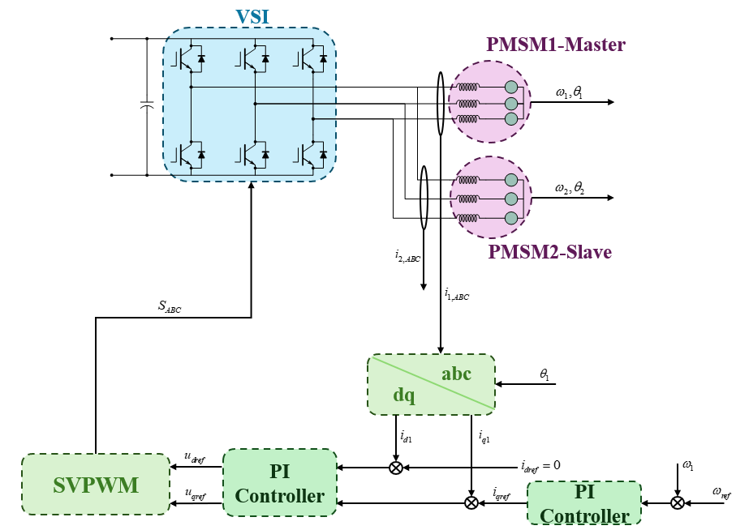

### 主电机选择 —— 功角特性

功角特性将会呈现为一个凸函数(见电机学)，电机的工作区间分为稳定区间和不稳定区间。FOC 控制下的电机应当工作在稳定区间（负载为 $T_{e1}$，功角为 $\delta_1$）；根据功角特性，稳定条件下，如果 $T_{e2} > T_{e1}$ ，则 $\delta_2 > \delta_1$ ，由此应当***选择最大负载的电机作为主电机以保证系统的静态稳定性***，这时需要根据带载情况不停切换主电机；如果固定主电机，则会在从电机带载能力上存在一定的限制。

主从电机控制系统的矢量图如下图所示：

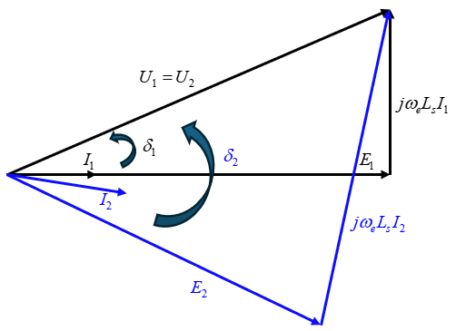

### SPMSM 主从控制

#### 静态性能优化 —— MTPA 控制

电机的定子电压幅值受到逆变器输出的约束：
$$
\begin{align*}
u_s^2 &= u_{d1}^2 + u_{q1}^2 \\
&= u_{d2}^2+u_{q2}^2 \\
&= (R_si_{d1}-\omega_eL_si_{q1})^2+(R_si_{q1}+\omega_e(\psi_f+L_si_{d1}))^2 \\
&= (R_si_{d2}-\omega_eL_si_{q2})^2+(R_si_{q2}+\omega_e(\psi_f+L_si_{d2}))^2
\end{align*}
$$
使用以下系数可以将该约束简化为 $i_{d1},i_{d2}$ 电流约束：
$$
\alpha = R_s^2+\omega_e^2L_s^2 \\
\beta = 2\omega_e^2\psi_fL_s \\
\gamma_1 = (R_s^2+\omega_e^2L_s^2)i_{q1}^2+2R_s\omega_r\psi_fi_{q1}^2+\omega_e^2\psi_f^2 \\
\gamma_2 = (R_s^2+\omega_e^2L_s^2)i_{q2}^2+2R_s\omega_r\psi_fi_{q2}^2+\omega_e^2\psi_f^2 \\
$$

$$
(i_{d1}+\frac{\beta}{2\alpha})^2-(i_{d2}+\frac{\beta}{2\alpha})^2=\frac{\gamma_2-\gamma_1}{\alpha}
$$

同时包含输出电流约束：
$$
i_{dk}^2+i_{qk}^2 ≤ i_{s\max}^2 (k=1,2)
$$
MTPA 用于优化电机的铜损：$P_{copper} = \frac{3}{2}R_s(i_{d1}^2+i_{q1}^2+i_{d2}^2+i_{q2}^2)$，由于 $i_{qk}$ 由负载决定，定义目标函数：
$$
f(i_{d1},i_{d2}) = i_{d1}^2+i_{d2}^2
$$
由此可以通过 KKT 条件获得最优解。

---

***MTPA 计算：***

1. 电流约束不等式内部区域：使用拉格朗日乘子法；
   $$
   L(i_{d1},i_{d2},\lambda) = f(i_{d1},i_{d2})+\lambda((i_{d1}+\frac{\beta}{2\alpha})^2-(i_{d2}+\frac{\beta}{2\alpha})^2-\frac{\gamma_2-\gamma_1}{\alpha})
   $$

   $$
   \frac{\partial L(i_{d1},i_{d2},\lambda)}{\partial i_{d1}} = 2i_{d1}+2\lambda(i_{d1}+\frac\beta {2\alpha}) \\
   \frac{\partial L(i_{d1},i_{d2},\lambda)}{\partial i_{d2}} = 2i_{d2}-2\lambda(i_{d2}+\frac\beta {2\alpha}) \\
   \frac{\partial L(i_{d1},i_{d2},\lambda)}{\partial \lambda} = (i_{d1}+\frac{\beta}{2\alpha})^2-(i_{d2}+\frac{\beta}{2\alpha})^2-\frac{\gamma_2-\gamma_1}{\alpha}
   $$

   可以化简为：
   $$
   (i_{d1}+\frac{\beta}{2\alpha})^2-(i_{d2}+\frac{\beta}{2\alpha})^2-\frac{\gamma_2-\gamma_1}{\alpha} = 0 \\
   \frac{1}{i_{d1}}+\frac{1}{i_{d2}} = -\frac{4\alpha}{\beta}
   $$
   由此可以得到 MTPA 所需的主电机电流指令 $i_{d1}$ 和对应的 MTPA 轨迹。

2. 电流约束不等式上：

   主电机负载较大时，系统在主电机电流限制边界上运行：
   $$
   \begin{equation*}\begin{cases}i_{d1}=-\sqrt{i_{s\max}^{2}-i_{q1}^{2}}\\i_{d2}=\sqrt{\left(i_{d1}+\frac{\beta}{2\alpha}\right)^{2}-\frac{\gamma_{2}-\gamma_{1}}{\alpha}}-\frac{\beta}{2\alpha}.\end{cases}\end{equation*}
   $$
   
   从电机负载较大时，系统在从电机电流限制边界上运行：
   
   $$
   \begin{equation*}\begin{cases}i_{d1}=\sqrt{\left(i_{d2}+\frac{\beta}{2\alpha}\right)^{2}-\frac{\gamma_{2}-\gamma_{1}}{\alpha}}-\frac{\beta}{2\alpha}\\i_{d2}=-\sqrt{i_{s\max}^{2}-i_{q2}^{2}}.\end{cases}\end{equation*}
   $$

---

MTPA 状态下从电机的运行状态如下：

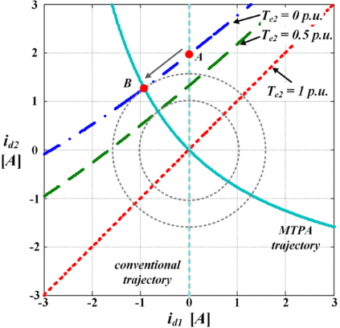

考虑电流限制的从电机运行状态(主电机带载总大于从电机)：

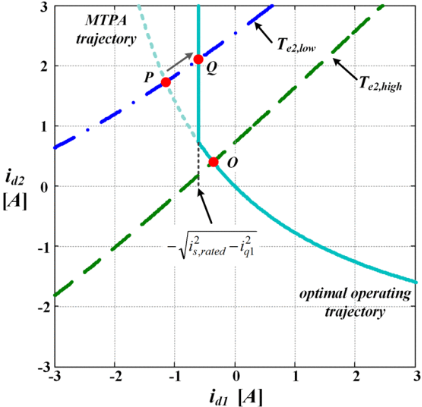

#### 动态性能优化 —— 主动阻尼控制

当负载发生突变时，主从电机的负载差异受到扰动，同时主从电机的转子角度差异(功角差异) $\theta_d$ 和速度差异 $\omega_d$ 随之产生，主动阻尼控制的作用就是抑制负载突变时产生的速度差值，使得主从电机仍然能保持同步。

PMSM 的稳态电压方程：
$$
\begin{bmatrix}
u_d \\
u_q 
\end{bmatrix}
= 
\begin{bmatrix}
R_s &  -\omega_eL_s \\
\omega_eL_s & R_s
\end{bmatrix}
\begin{bmatrix}
i_d \\
i_q
\end{bmatrix}
+
\begin{bmatrix}
0 \\
\omega_e\psi_f
\end{bmatrix}
$$
可以得到从电机的电流方程：
$$
\begin{bmatrix}
i_{d2} \\
i_{q2} 
\end{bmatrix}
= 
\begin{bmatrix}
R_s &  -\omega_eL_s \\
\omega_eL_s & R_s
\end{bmatrix}^{-1}(
\begin{bmatrix}
u_{d2} \\
u_{q2}
\end{bmatrix}
-
\begin{bmatrix}
0 \\
\omega_e\psi_f
\end{bmatrix})
$$
从电机和主电机的电压幅值相等，则：
$$
\begin{bmatrix}
u_{d2} \\
u_{q2}
\end{bmatrix}
= 
\begin{bmatrix}
\cos\theta_d & \sin\theta_d \\
-\sin\theta_d & \cos\theta_d
\end{bmatrix}
\begin{bmatrix}
u_{d1} \\
u_{q1}
\end{bmatrix}
$$

$$
\theta_d = \theta_2 - \theta_1
$$

可以得到主从电机的电流关系：
$$
\begin{bmatrix}
i_{d2} \\
i_{q2}
\end{bmatrix}
=
\begin{bmatrix}
\cos\theta_d & \sin\theta_d \\
-\sin\theta_d & \cos\theta_d
\end{bmatrix}
\begin{bmatrix}
i_{d1} \\
i_{q1}
\end{bmatrix}
+
\frac{\omega_e\psi_f}{R_s^2+\omega_e^2L_s^2}
\begin{bmatrix}
R_s & \omega_eL_s \\
-\omega_eL_s &  R_s
\end{bmatrix}
\begin{bmatrix}
\sin\theta_d \\
\cos\theta_d - 1
\end{bmatrix}
$$
第一项为主电机电流的投影分量，第二项表示来自主电机反电动势带来的从电机电流。
$$
T_{e2} = K_t\psi_f[-\sin\theta_di_{d1}+\cos\theta_di_{q1}-\frac{\omega_e^2\psi_fL_s}{R_s^2+\omega_e^2L_s^2}\sin\theta_d+\frac{\omega_e\psi_fR_s}{R_s^2+\omega_e^2L_s^2}(\cos\theta_d-1)]
\\
T_{e1} = K_t\psi_fi_{q1}
$$
PMSM 的机械方程：
$$
T_{ek} = J\frac{d\omega_{mk}}{dt}+B\omega_{mk}+T_{Lk}
$$
主从电机相减可以得到：
$$
(T_{e2}-T_{e1})-(T_{L2}-T_{L1}) = J\frac{d\omega_{md}}{dt}+B\omega_{md}
$$

$$
K_t\psi_f[-\sin\theta_di_{d1}+(\cos\theta_d-1)i_{q1}-\frac{\omega_e^2\psi_fL_s}{R_s^2+\omega_e^2L_s^2}\sin\theta_d+\frac{\omega_e\psi_fR_s}{R_s^2+\omega_e^2L_s^2}(\cos\theta_d-1)]-T_{Ld}=J\frac{d\omega_{md}}{dt}+B\omega_{md}
$$

现在通过小信号方法推导传递函数 $\frac{\hat{\omega_{md}}(s)}{\hat{T_{Ld}}(s)}$。

---

***$\frac{\hat{\omega_{md}}(s)}{\hat{T_{Ld}}(s)}$ 的推导：***

定义 $T_{ed} = T_{e2}-T_{e1}$，稳态条件下：$\theta_d = \theta_{d0}$，$\omega_{md} = \omega_{md0} = 0$，$T_{Ld} = T_{Ld0}$，$T_{ed}(\theta_{d0}) = T_{ed0} = T_{Ld0}$。现在对稳态做小扰动：
$$
\begin{cases}
\theta_d = \theta_{d0} + \hat \theta_d \\
\omega_{md} = \omega_{md0} + \hat \omega_{md} \\
T_{Ld} = T_{Ld0} + \hat T_{Ld} \\
T_{ed}(\theta_d) = T_{ed0} + \hat T_{ed}
\end{cases}
$$
在扰动状态下，$T_{ed} = T_{ed0} + \hat T_{ed}$，对 $T_{ed}$ 在 $\theta_{d0}$ 处 进行泰勒展开：
$$
T_{ed}(\theta_d) = T_{ed}(\theta_{d0})+\frac{\partial T_{ed}(\theta_d)}{\partial\theta_d}|_{\theta_{d0}}\hat\theta_d = T_{Ld0} + K_f\hat \theta_d
$$
主从电机的机械瞬态方程可以改写为：
$$
T_{ed0}-T_{Ld0} = 0 \\
(T_{ed0} + K_f\hat \theta_d)-(T_{Ld0}+\hat T_{Ld}) = J\frac{d(\omega_{md0}+\hat \omega_{md})}{dt}+B(\omega_{md0}+\hat \omega_{md}) \\
K_f\hat \theta_d - \hat T_{Ld} = J\frac{d\hat \omega_{md}}{dt}+B\hat \omega_{md}
$$
由于 $\omega_{md} = \frac{d\theta_d}{dt}$，则小信号条件下 $\hat \omega_{md} = \frac{d \hat\theta_d}{dt}$。

小信号传递函数为：

对小信号机械瞬态方程做 Laplace 变换可以得到小信号传递函数：
$$
\frac{\hat{\omega_{md}}(s)}{\hat{T_{Ld}}(s)} = -\frac{s}{Js^2+Bs-K_f}
$$
其中，$K_f = \frac{\partial T_{ed}(\theta_d)}{\partial\theta_d}|_{\theta_{d0}} = -K_t\psi_f[\cos\theta_{d0}i_{d1}+\sin\theta_{d0}i_{q1}+\frac{\omega_e^2\psi_fL_s}{R_s^2+\omega_e^2L_s^2}\cos\theta_{d0}+\frac{\omega_e\psi_fR_s}{R_s^2+\omega_e^2L_s^2}\sin\theta_{d0}]$ 

这适用于 $i_{d1}$ 为常数的情况。

---

可以看到小信号函数存在一个零点和两个极点。

主动阻尼控制器通过 $i_{d1}$ 控制 $i_{q2}$ 间接控制从电机转矩，$i_{d1}$ 设计为：
$$
i_{d1} = \frac{K_B\omega_{md}}{\sin\theta_d}
$$
此时 $T_{ed}$ 为：
$$
K_t\psi_f[-K_B\omega_{md}+(\cos\theta_d-1)i_{q1}-\frac{\omega_e^2\psi_fL_s}{R_s^2+\omega_e^2L_s^2}\sin\theta_d+\frac{\omega_e\psi_fR_s}{R_s^2+\omega_e^2L_s^2}(\cos\theta_d-1)]-T_{Ld}=J\frac{d\omega_{md}}{dt}+B\omega_{md}
$$
此时对系统进行小信号分析：

---

***加入主动阻尼控制器的 $\frac{\hat{\omega_{md}}(s)}{\hat{T_{Ld}}(s)}$ 推导：***

此时 $T_{ed} = f(\theta_d)-K_t\psi_fK_B\omega_{md}$；

类似的小信号推导可以得到：
$$
\frac{\hat{\omega_{md}}(s)}{\hat{T_{Ld}}(s)} = -\frac{s}{Js^2+(B+B_{av})s-K_f}
$$
其中 $B_{av} = K_t\psi_fK_B$ 为主动阻尼。$K_f = \frac{\partial f(\theta_d)}{\partial\theta_d}|_{\theta_{d0}} = -K_t\psi_f[\sin\theta_{d0}i_{q1}+\frac{\omega_e^2\psi_fL_s}{R_s^2+\omega_e^2L_s^2}\cos\theta_{d0}+\frac{\omega_e\psi_fR_s}{R_s^2+\omega_e^2L_s^2}\sin\theta_{d0}]$。

---

由此可以设计主动阻尼控制器系统：

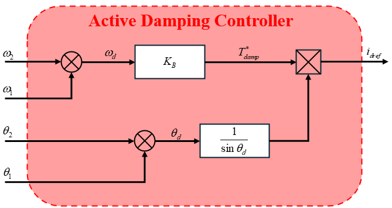

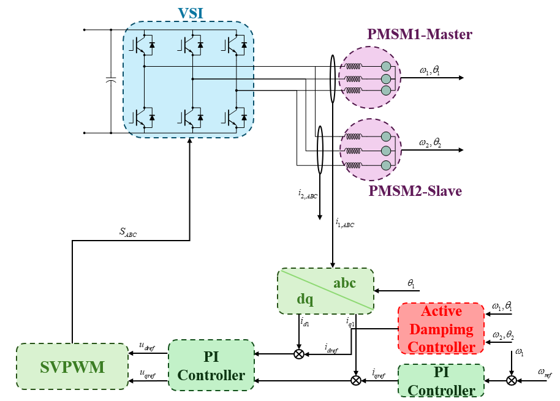

主动阻尼控制器有以下特性：

1. 稳态时不输出指令 d 轴电流，便于与 MTPA 结合；

2. 为了实现恒定的主动阻尼，必须使用 $\csc$ 函数，但是其在 $\theta_d$ 很小时会产生极大的电流指令，在 $\theta_d = 0$ 处瞬时改变符号也会突然改变 d 轴电流参考值；不仅会降低电流调节性能，还会产生可听噪声和扭矩纹波。所以通常在 $\theta_d = 0$ 附近区域将 $\csc\theta_d$ 改为 $\theta_d$ 函数，此时由于接近零角度差区域的奇点，小振荡难以避免，但系统仍可保持在同步状态。由于高度非线性，非线性区域的宽度和比例增益难以设计，需要通过实验进行调整。如果系统具有足够的电流和电压裕度，非线性区域可以被最小化以获得更好的性能。

   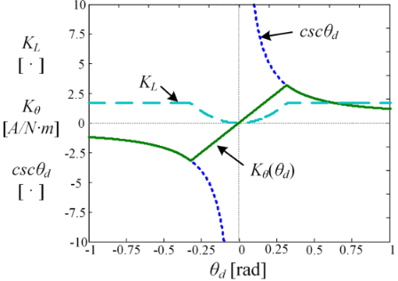

3. 可以将主动阻尼控制器和 MTPA 控制器结合，主动阻尼控制器是高频控制器，而 MTPA 作为稳态控制器用于控制稳态，输出需要经过 LPF 滤波。 

   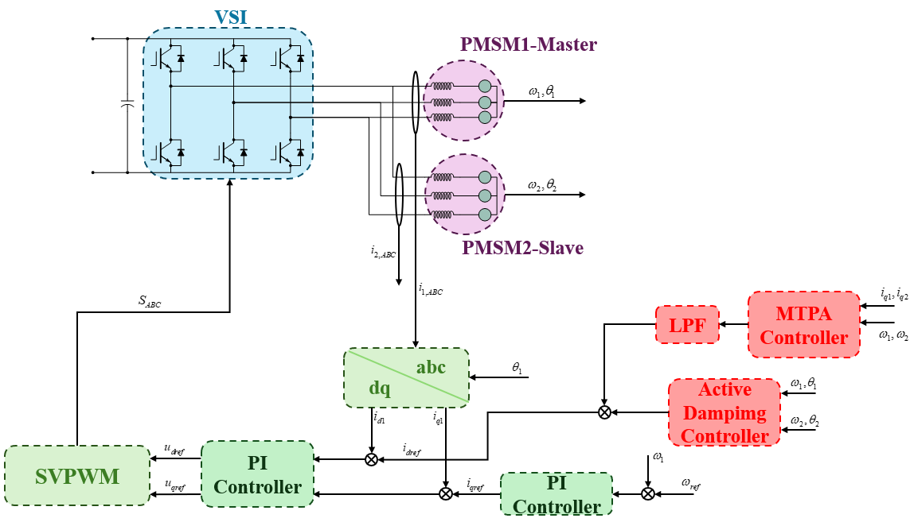

### IPMSM 主从控制

#### 静态性能优化 —— MTPA 控制

IPMSM 的稳态电压方程为：
$$
\begin{bmatrix}
u_{dk} \\
u_{qk}
\end{bmatrix} = 
\begin{bmatrix}
R_s & -\omega_eL_q \\
\omega_eL_d & R_s
\end{bmatrix}
\begin{bmatrix}
i_{dk} \\
i_{qk}
\end{bmatrix}+
\begin{bmatrix}
0 \\
\omega_e\psi_f
\end{bmatrix}(k=1,2)
$$
转矩方程为：
$$
T_{ek} = K_t(\psi_f+\Delta Li_{dk})i_{qk}(k=1,2)
$$
电机的定子电压幅值受到逆变器输出的约束：
$$
\begin{align*}
u_s^2 &= u_{d1}^2 + u_{q1}^2 \\
&= u_{d2}^2+u_{q2}^2 \\
\end{align*}
$$
这可以简化为：
$$
Z_d = \omega_e^2L_d^2+R_s^2 \\
Z_q = \omega_e^2L_q^2+R_s^2 \\
g(i_{d1},i_{q1},i_{d2},i_{q2})=Z_d(i_{d1}^2-i_{d2}^2)+Z_q(i_{q1}^2-i_{q2}^2)+2\omega_eR_s\Delta L(i_{d1}i_{q1}-i_{d2}i_{q2})+2\omega_e\psi_f(\omega_eL_d(i_{d1}-i_{d2})+R_s(i_{q1}-i_{q2})) = 0
$$
和 SPMSM 的 MTPA 相似，使用拉格朗日乘子法求 MTPA 指令电流：

---

***MTPA 计算：***

目标函数：
$$
f(i_{d1},i_{q1},i_{d2},i_{q2}) = i_{d1}^2+i_{q1}^2+i_{d1}^2+i_{q1}^2
$$
拉格朗日函数：
$$
\begin{align*}
L(i_{d1},i_{q1},i_{d2},i_{q2},\lambda_1,\lambda_2,\lambda_3) &= 
i_{d1}^2+i_{q1}^2+i_{d1}^2+i_{q1}^2+\lambda_1g(i_{d1},i_{q1},i_{d2},i_{q2})+\lambda_2(T_{e1}- K_t(\psi_f+\Delta Li_{d1})i_{q1})+\lambda_3(T_{e2}- K_t(\psi_f+\Delta Li_{d2})i_{q2})
\end{align*}
$$
其偏导数为：
$$
\begin{eqnarray} \frac{{\partial f}}{{\partial i_{d1} }} & =& 2i_{d1} + 2\lambda _1 \left[ {Z_d i_{d1} + R_s \Delta L\omega _r i_{q1} + L_d \psi_f \omega _r^2 } \right] \nonumber\\ & & -\, \lambda _2 K_t \Delta Li_{q1}\\ \frac{{\partial f}}{{\partial i_{q1} }} & =& 2i_{q1} + 2\lambda _1 \left[ {Z_q i_{q1} + R_s \Delta L\omega _r i_{d1} + R_s \psi_f \omega _r } \right] \nonumber\\ & &-\, \lambda _2 K_t (\psi_f+\Delta Li_{d1})\\ \frac{{\partial f}}{{\partial i_{d2} }} & =& 2i_{d2} - 2\lambda _1 \left[ {Z_d i_{d2} + R_s \Delta L\omega _r i_{q2} + L_d \psi_f \omega _r^2 } \right] \nonumber\\ & &-\, \lambda _3 K_t \Delta Li_{q2}\\ \frac{{\partial f}}{{\partial i_{q2} }} & =& 2i_{q2} - 2\lambda _1 \left[ {Z_q i_{q2} + R_s \Delta L\omega _r i_{d2} + R_s \psi_f \omega _r } \right] \nonumber\\ & &-\, \lambda _3 K_t (\psi_f+\Delta Li_{d2}) \end{eqnarray}
$$
得到 $i_{d1}$ 的最优解为：
$$
Ai_{d1}^2+Bi_{d1}+C=0 \\
A = -\Delta L (L_d\psi_f^2\omega_e^2-\psi_fZ_ci_{d2}+3\psi_fZ_di_{d2}+2\Delta LZ_di_{d2}^2-\Delta LZ_di_{q2}^2-\Delta LZ_qi_{q2}^2) \\
B = \psi_f[2\psi_fZ_ci_{d2}-4\psi_fZ_di_{d2}-L_d\psi_f^2\omega_e^2-\Delta L ((3Z_d-Z_c)i_{d2}^2+(Z_c-2Z_d-Z_q)i_{q2}^2)] \\
C = \Delta L[\Delta L(Z_d+Z_q)i_{q1}^2-L_d\psi_f^2\omega_e^2]i_{d2}^2+[\Delta L\psi_f(2Z_d-Z_c+Z_q)i_{q1}^2-L_d\psi_f^3\omega_e^2]i_{d2}-2\Delta L^2Z_qi_{q1}^2i_{q2}^2+L_d\Delta L\psi_f^2\omega_e^2(i_{q1}^2+i_{q2}^2) \\
Z_c = \omega_e^2L_dL_q+R_s^2
$$

$$
i_{d1} = \frac{-B-\sqrt{B^2-4AC}}{2A}
$$

---

#### 动态性能优化 —— 主动阻尼控制

从电机的电流方程：
$$
\begin{bmatrix}
i_{d2} \\
i_{q2} 
\end{bmatrix}
= 
\cos\theta_d
\begin{bmatrix}
i_{d1} \\
i_{q1}
\end{bmatrix}
+\frac{\sin\theta_d}{Z_c}
\begin{bmatrix}
\omega_eR_s\Delta L & Z_q \\
-Z_d & -\omega_eR_s\Delta L
\end{bmatrix}
\begin{bmatrix}
i_{d1} \\
i_{q1}
\end{bmatrix}
-\frac{\omega_e\psi_f}{Z_c}(
(1-\cos\theta_d)
\begin{bmatrix}
L_q\omega_e \\
R_s
\end{bmatrix}+
\sin\theta_d
\begin{bmatrix}
-R_s \\
L_d\omega_e
\end{bmatrix}
)
$$
此时的 $T_{e2}$ 将会十分复杂，以下将解释主动阻尼控制器设计上的复杂性。

---

***主动阻尼控制器的强非线性论证：***

在 SPMSM 内，$T_{e2}$ 和 $i_{d1}$ 的关系是简单非线性关系：
$$
\frac{\partial T_{e2}}{\partial i_{d1}} = -K_t\psi_f\sin\theta_d
$$
这时可以很方便的设计主动阻尼控制器以将 $K_f$ 内的项改到阻尼项 $B$ 内。

但是在 IPMSM 内，有以下关系：
$$
\frac{\partial T_{e2}}{\partial i_{d1}} = \frac{\partial T_{e2}}{\partial i_{d2}}(\frac{\partial i_{d2}}{\partial i_{d1}}+\frac{\partial i_{d2}}{\partial i_{q1}})+\frac{\partial T_{e2}}{\partial i_{q2}}(\frac{\partial i_{q2}}{\partial i_{d1}}+\frac{\partial i_{q2}}{\partial i_{q1}}\frac{\partial i_{q1}}{\partial i_{d1}})
$$
最后表示为:
$$
\frac{\partial T_{e2}}{\partial i_{d1}} = \alpha\sin\theta_d+\beta\sin2\theta_d+\gamma\sin^2\theta_d+\delta(1-\cos\theta_d) \\
\alpha = K_t \psi_f ({1-\frac{{2Z_dZ_q }}{{Z_c}}+\frac{{2\Delta L^2R_sZ_q\omega _e}}{{Z_c^2(\psi_f+\Delta Li_{d1})}}i_{q1}})\\
\beta = - \frac{{\Delta LK_t}}{{Z_c}}(Z_di_{d1}+\frac{{L_q\psi_fZ_d\omega_e^2}}{{Z_c }}+\frac{{\Delta LZ_q}}{{\psi_f + \Delta Li_{d1}}}i_{q1}^2+\frac{{\Delta LR_s \psi_f Z_q\omega_e}}{{Z_c(\psi_f+\Delta Li_{d1})}}i_{q1})\\
\gamma = -\frac{{2\Delta LK_t}}{{Z_c^2(\psi_f+\Delta Li_{d1})}}[\psi_fZ_cZ_qi_{q1}+R_s\psi_f^2Z_d \omega_e+ 2\Delta LR_s\psi_fZ_d\omega_ei_{d1}+\Delta L^2R_s\omega_e({Z_di_{d1}^2-Z_qi_{q1}^2})] \\
\delta= - \Delta L\psi_fK_t({\frac{{Z_q}}{{Z_c(\psi_f+\Delta Li_{d1})}}i_{q1}+\frac{{R_s\omega_e}}{{Z_c}}})
$$
这意味着理想的主动阻尼控制器将会呈现极强的非线性。

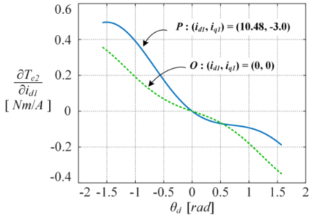

---

一种简单的设计方法是使用简单饱和函数：

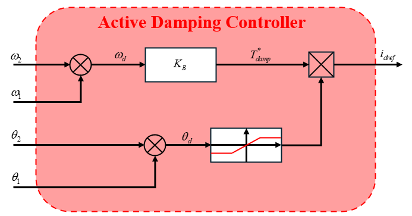

同时注意由于 $i_{d1}$ 和 $i_{q1}$ 存在耦合，通过消除主动阻尼电流对主电机产生的额外转矩，可以使主电机的转矩与主动阻尼控制解耦。

由转矩表达式可以得到：
$$
\frac{\partial i_{q1}}{\partial i_{d1}} = -\frac{\Delta Li_{q1}}{\psi_f+\Delta Li_{d1}} 
$$
由此在生成主动阻尼电流 $i_{d,damp}$ 后，需要在 q 轴上加入补偿电流以消除额外转矩：
$$
i_{q,ref} = i_{q,PIout}+i_{q,damp} \\
i_{q,damp} = -i_{q1}\frac{\Delta Li_{d,damp}}{\psi_f+\Delta Li_{d1}}
$$

