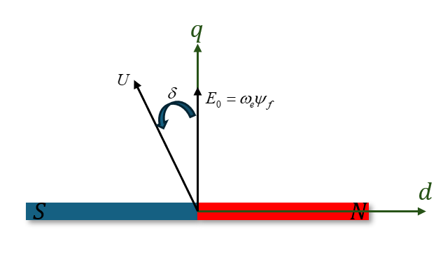
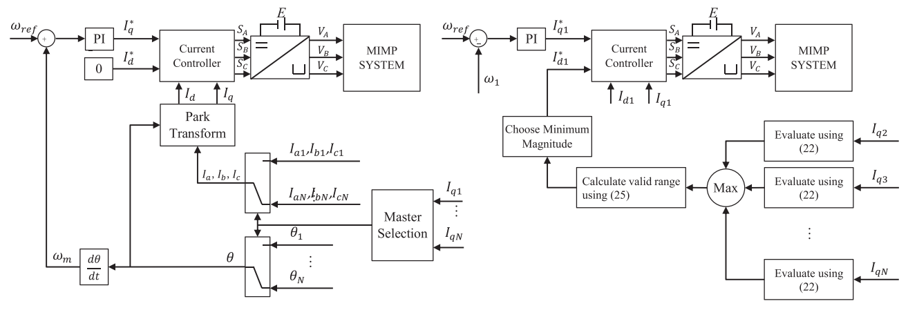

# 单逆变器并联多永磁同步电机控制策略

本节介绍单逆变器驱动多永磁同步电机(电机数量为 $N$，$N ≥ 3$)控制系统。

## 1. 主从控制策略

> 参考文献：
>
> 1. Tianyi Liu, Maurice Fadel, Jun Li and Xiaoyan Ma, "A MTPA Control Strategy for Mono-Inverter Multi-PMSM System" ,in *IEEE Transactions on Power Electronics*, vol. 36,no. 4, pp. 7165 - 7177, November, 2020.

### 多永磁同步电机并联系统的稳态模型

作出以下假设：

> 1. 每台 PMSM 均为 SPMSM ，定子电阻 $R_s$ ，定子电感 $L_s$，永磁磁链 $\psi_f$ 均一致；
> 2. 直流母线被认为具有足够的容量，可以供应或吸收功率。

注意到多永磁同步电机并联系统的拓扑中，各个 PMSM 的端电压 $u_{dk}$ 和 $u_{qk}$ 相同，这意味着在稳定条件下，所有 PMSM 均按照相同转速 $\omega_e$ 运行。

PMSM 1 的**稳态模型**如下：
$$
\begin{bmatrix}
U_{d1} \\
U_{q1} 
\end{bmatrix}
= 
\begin{bmatrix}
R_s & -L_s\omega_e \\
L_s\omega_e & R_s 
\end{bmatrix}
\begin{bmatrix}
I_{d1} \\
I_{q1} 
\end{bmatrix} 
+
\begin{bmatrix}
0 \\
\omega_e \psi_f
\end{bmatrix}
$$
其稳态转矩为 $T_{e1} = N\psi_f I_{q1}$；

对于剩余的电机，由于负载的不同，转子之间存在相对角位移，定义 $\theta_{dk} = \theta_k - \theta_1$，对于剩余的 PMSM 2 - PMSM N，考虑到各个 PMSM 的端电压 $u_{dk}$ 和 $u_{qk}$ 相同，稳态模型如下：
$$
\begin{bmatrix}
\cos\theta_{dk} & \sin\theta_{dk} \\
-\sin\theta_{dk} & \cos\theta_{dk}
\end{bmatrix}
\begin{bmatrix}
U_{d1} \\
U_{q1} 
\end{bmatrix}
= 
\begin{bmatrix}
R_s & -L_s\omega_e \\
L_s\omega_e & R_s 
\end{bmatrix}
\begin{bmatrix}
I_{dk} \\
I_{qk} 
\end{bmatrix} 
+
\begin{bmatrix}
0 \\
\omega_e \psi_f
\end{bmatrix}
$$
由此可以得到系统的稳态模型：
$$
\begin{bmatrix}
1 & 0 \\
0 & 1 \\
\cos\theta_{d2} & \sin\theta_{d2} \\
-\sin\theta_{d2} & \cos\theta_{d2} \\
\vdots & \vdots \\
\cos\theta_{dN} & \sin\theta_{dN} \\
-\sin\theta_{dN} & \cos\theta_{dN}
\end{bmatrix}_{2\times2N}
\begin{bmatrix}
U_{d1} \\
U_{q1} 
\end{bmatrix}
= 
\begin{bmatrix}
R_s & -L_s\omega_e & \cdots & 0 & 0 \\
L_s\omega_e & R_s & \cdots & 0 & 0 \\
\vdots & \vdots & \ddots & \vdots & \vdots \\
0 & 0 & \cdots & R_s & -L_s\omega_e  \\
0 & 0 & \cdots & L_s\omega_e & R_s 
\end{bmatrix}_{2N\times2N}
\begin{bmatrix}
I_{d1} \\
I_{q1} \\
\vdots \\
I_{dN} \\
I_{qN}
\end{bmatrix}_{1\times2N}
+
\begin{bmatrix}
0 \\
\omega_e \psi_f \\
\vdots \\
0 \\
\omega_e \psi_f 
\end{bmatrix}_{1\times2N}
$$
接下来根据约束方法选取控制变量，在稳态模型中，只有对于期望的扭矩 $\{I_{q1},I_{q2},\cdots,I_{qN}\}$ 和速度 $\omega_e$ 存在唯一电压解时，才能够存在合适的控制策略。在单 PMSM 系统中，$\{I_{q1}\}$ 由负载被动确定，$\omega_e$ 为主动确定，但是系统仍然存在三个未知变量 $\{I_{d1},U_{q1},U_{d1}\}$ 和两个方程，这会存在无穷个解，因此在传统 FOC 中添加一个 $I_{d1} = 0$ 的约束使得系统存在唯一一解用于控制。对于多永磁同步电机并联系统，存在未知变量 $\underbrace{\{U_{d1},U_{q1}\}}_{2}$，$\underbrace{\{I_{d1},\cdots,I_{qN}\}}_{N}$，$\underbrace{\{\theta_{d2},\cdots,\theta_{qN}\}}_{N-1}$ $2N+1$ 个，但是有 $2N$ 个方程，这时使得 $I_{d1}$ 作为控制变量。

> ***这意味着无法做到对每个 PMSM 进行精确的控制，如果需要对每个 PMSM 进行控制会导致过约束。***

### 多永磁同步电机并联系统的控制器设计

#### 同步条件 —— 功角特性

在主从控制中，主电机将会被施加精确的 FOC 控制，而剩余的从电机只能根据逆变器输出的旋转电压矢量进行开环拖动。首先通过功角特性分析 PMSM 在开环拖动条件下的同步条件。

使用功角定义的稳态 PMSM 模型如下：
$$
\begin{bmatrix}
U_d \\
U_q 
\end{bmatrix}
= 
\begin{bmatrix}
-|U_s|\sin\delta \\
|U_s|\cos\delta 
\end{bmatrix}
=
\begin{bmatrix}
R_s & -L_s\omega_e \\
L_s\omega_e & R_s 
\end{bmatrix}
\begin{bmatrix}
I_{d} \\
I_{q} 
\end{bmatrix} 
+
\begin{bmatrix}
0 \\
\omega_e \psi_f
\end{bmatrix}
$$
由此可以解出 $T_e$ (考虑定子电阻的功角特性):
$$
T_e = N\psi_f\frac{|U_s|}{Z}\cos(\delta-\arctan\frac{\omega_eL_s}{R_s})-N\psi_f\frac{R_s\omega_e\psi_f}{Z^2}
$$

$$
Z = \sqrt{R_s^2+(\omega_eL_s)^2}
$$

功角特性将是一个单峰曲线(见电机学)，仅当 $\frac{dT_e}{d\delta} > 0$ 时才能保持同步运行，这意味着负载转矩不能大于最大转矩点。

可以得到允许的转矩值为：
$$
T_e^{\max} = T_e^n+N\psi_f\frac{|U_s|}{Z} \\
T_e^{\min} = T_e^n-N\psi_f\frac{|U_s|}{Z} \\
T_e^n = -N\psi_f\frac{R_s\omega_e\psi_f}{Z^2} \\
T_e^{\max} ≥ T_L ≥ T_e^{\min}
$$
由此能得到允许的最小电压幅值，需要注意，满足电压幅值条件后，功角将由负载唯一确定：
$$
|U_s| ≥ \frac{Z}{N\psi_f}|T_L-T_e^n|
$$
对于多永磁同步电机并联系统，最小电压幅值扩展为：
$$
|U_s| ≥ \frac{Z}{N\psi_f}\max\{|T_{L1}-T_e^n|,|T_{L2}-T_e^n|,\cdots,|T_{LN}-T_e^n|\}
$$
这意味着最小的电压幅值受到最大负载电机的约束。

#### 控制器设计 

控制器需要基于电压幅值约束给出 $I_{d1}$ 指令。

---
***$I_{d1}$ 范围推导：***

根据功角表达的 PMSM 稳态模型，有：
$$
|U_s|^2\sin^2\delta = (R_sI_{d1}-\omega_eL_sI_{q1})^2 \\
|U_s|^2\cos^2\delta = (R_sI_{q1}+\omega_eL_sI_{d1}+\omega_e\psi_f)^2
$$
将两式相加：
$$
|U_s|^2 = Z^2(I_{d1}^2+I_{q1}^2)+(\omega_e\psi_f)^2+2\omega_e^2L_s\psi_fI_{d1}+2\omega_eR_s\psi_fI_{q1} ≥ (\frac{Z}{N\psi_f})^2(T_{L\max}-T_e^n)^2
$$
将会得到关于 $I_{d1}$ 的不等式。讨论其判别式：
$$
a = Z^2\\
b = 2\omega_e^2L_s\psi_f \\
c = Z^2I_{q1}^2+\omega_e^2\psi_f^2+2\omega_eR_s\psi_fI_{q1}-(\frac{Z}{N\psi_f})^2(T_{L\max}-T_e^n)^2\\
\begin{align*}
\Delta &=  b^2-4ac \\
&= 4\omega_e^4L_s^2\psi_f^2-4Z^4I_{q1}^2-4Z^2\omega_e^2\psi_f^2-8Z^2\omega_eR_s\psi_fI_{q1}+4Z^2(\frac{Z}{N\psi_f})^2(T_{L\max}-T_e^n)^2\\
&= -4Z^4I_{q1}^2-4R_s^2\omega_e^2\psi_f^2-8Z^2\omega_eR_s\psi_fI_{q1}+4Z^2(\frac{Z}{N\psi_f})^2(T_{L\max}-T_e^n)^2
\end{align*}
$$
考虑 $T_{e1} = N\psi_fI_{q1}$，$T_e^n=-N\psi_f\frac{R_s\omega_e\psi_f}{Z^2}$，求得：
$$
\Delta = 4Z^4(f(T_{e1},\omega_e)-f(T_{L\max},\omega_e)) \\
f(T_e,\omega_e) = -\frac{1}{N^2\psi_f^2}(T_e^2-2T_e^nT_e)
$$

由于 $T_{e1} ≤ T_{L\max}$，分两种情况讨论：

1. $T_{e1} = T_{L\max}$ ，判别式 $\Delta = 0$，不等式解为 $I_{d1}\in(-\infin,+\infin)$。

2. $T_{e1}<T_{L\max}$，判别式 $\Delta > 0$，不等式解为：
   $$
   I_{d1} \in (-\infin,-\frac{\omega_e^2\psi_fL_s}{Z^2}-\sqrt{f(T_{e1},\omega_e)-f(T_{L\max},\omega_e)}]\cup[-\frac{\omega_e^2\psi_fL_s}{Z^2}+\sqrt{f(T_{e1},\omega_e)-f(T_{L\max},\omega_e)}，+\infin)
   $$

---

根据 $I_{d1}$ 的范围可以得到两种控制策略：

1. 扩展主从控制

   > 1. 计算每台电机的评估值 $f(T_{ek},\omega_e)$；
   > 2. 选取最大评估值的电机作为主电机，此时可以取 $I_{d1}^* = 0$ 或者根据 MTPA 方法取值；

2. 传统主从控制

   > 1. 计算每台电机的评估值 $f(T_{ek},\omega_e)$；
   > 2. 选取最大评估值的电机，计算 $I_{d1}$ 范围，此时取 $I_{d1}$ 为范围中最小的值，或者根据MTPA 方法取值。

#### MTPA 策略

考虑定子电阻带来的损耗：
$$
E_{loss} = R_s(I_{d1}^2+I_{q1}^2)+\cdots+R_s(I_{dN}^2+I_{qN}^2)
$$
定义成本函数($I_{qk}$ 取决于负载)：
$$
f(I_{d1},\cdots,I_{dN}) = \sum_{k=1}^N(I_{dk}^2)
$$

---

***使用拉格朗日乘子法进行 MTPA 计算：***

目标函数最小化，其约束由电压约束推导得出：
$$
U_{d1}^2+U_{q1}^2=U_{dk}^2+U_{qk}^2
$$
代入 PMSM 稳态方程，可以得到 $I_{dk}$ 的约束：
$$
Z^2I_{dk}^2+\alpha I_{dk}+\beta = 0 \\
\alpha = 2\omega_e^2L_s\psi_f \\
\beta = (\omega_eL_sI_{qk})^2+(R_sI_{qk}+\omega_e\psi_f)^2-(R_sI_{d1}-\omega_eL_sI_{q1})^2-(R_sI_{q1}+\omega_eL_sI_{d1}+\omega_e\psi_f)^2
$$
则令拉格朗日函数：
$$
L(I_{d1},\cdots,I_{dN},\lambda_2,\cdots,\lambda_N)=f(I_{d1},\cdots,I_{dN})+\sum_{i=2}^N\lambda_ig_i(I_{d1},I_{di})\\
g_i(I_{d1},I_{di}) = Z^2I_{di}^2+\alpha I_{di}+\beta 
$$
对拉格朗日函数进行偏微分，结果分为三部分：
$$
\begin{cases}
\frac{\partial L}{\partial I_{d1}} = 2I_{d1}-(2Z^2I_{d1}+\alpha)\sum_{k=2}^N\lambda_k = 0 
\end{cases} 
$$

$$
\begin{cases}
\frac{\partial L}{\partial I_{d2}} = 2I_{d2}+\lambda_2(2Z^2I_{d2}+\alpha) = 0 \\
\vdots \\
\frac{\partial L}{\partial I_{dN}} = 2I_{dN}+\lambda_N(2Z^2I_{dN}+\alpha) = 0 
\end{cases}
$$

$$
\begin{cases}
\frac{\partial L}{\partial \lambda_{2}} = Z^2I_{d2}^2+\alpha I_{d2}+\beta= 0 \\
\vdots \\
\frac{\partial L}{\partial \lambda_{N}} =Z^2I_{dN}^2+\alpha I_{dN}+\beta= 0 
\end{cases}
$$

由此可以得到最优 $I_{d1}$ 取值：
$$
\begin{cases}
\sum_{k=1}^N \frac{2I_{dk}}{2Z^2I_{dk}+\alpha} = 0 \\
Z^2I_{d2}^2+\alpha I_{d2}+\beta = 0 \\
\vdots \\
Z^2I_{dN}^2+\alpha I_{dN}+\beta = 0 
\end{cases}
$$
 $N = 1$ 时可以立刻得到 $I_{d1} = 0$，$N=2$ 时存在解析解，但是当 $N≥3$ 时，难以获得解析解，必须使用数值方法进行求解。

---

