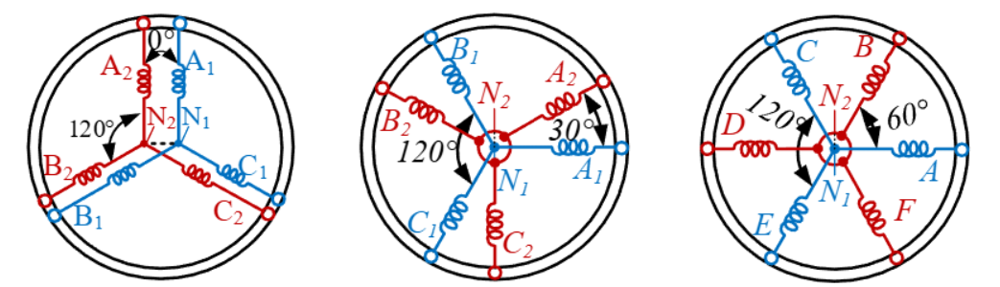
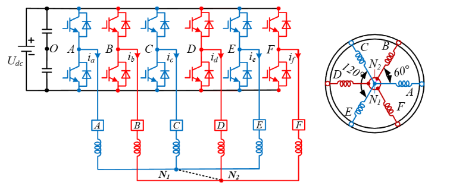
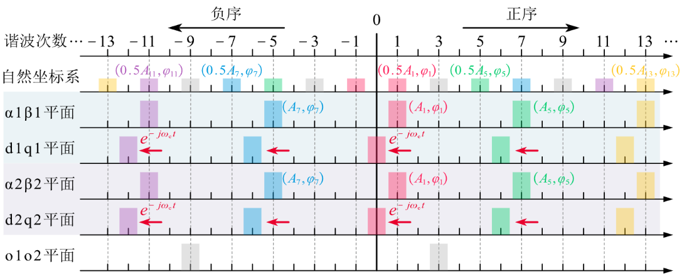
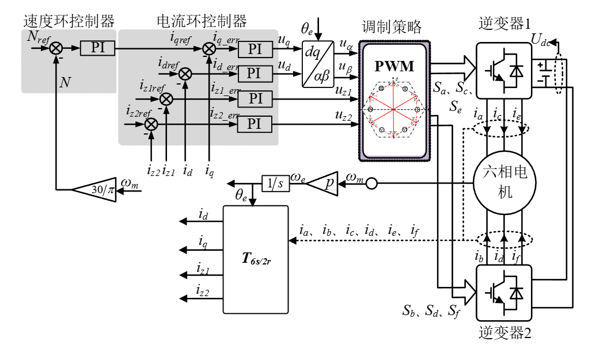

# 六相电机的原理和驱动

> 参考文献：
>
> 1. 鲁光旭.高速双三相永磁同步起发电机系统参数辨识及控制策略优化研究[D].哈尔滨工业大学,2025.
> 1. P. P. Das, S. Satpathy, S. Bhattacharya, V. Veliadis, U. Deshpande and B. Bhargava, "Determination of Parameters of Symmetrical Six-Phase Permanent Magnet Synchronous Machines," *2023 IEEE International Electric Machines & Drives Conference (IEMDC)*, San Francisco, CA, USA, 2023, pp. 1-7.

> 多相电机相对于三相电机有以下优点：
>
> 1. 当电机功率保持不变时，多相电机的多个桥臂具有分散承担电机功率的功能。同时多相电机在设计上可以更好利用磁场和电流，通常具有更高的功率密度。在相同的尺寸和重量下，多相电机可以提供更大的功率输出。
> 2. 电机相数的增加会增加空间谐波阶次，这样可以能够降低电机系统运行过程中产生的低频振动和噪声，提升调速系统的稳态运行性能。
> 3. 多相电机在稳态运行时具有更高的容错性。传统三相电机发生缺相故障时，大多都无法实现自启动。多相电机由于相冗余，当一路或者多路发生故障时，只要正常运行相数不少于三相系统都可正常降频运行无需停机重组，结合适当的容错控制策略都可以保证电机稳定运行。因此在对可靠性要求较高的应用场景下，多相电机特具有显著优势。
> 4. 桥臂的增多和可选择绕组结构类型的增多使得电机控制更加灵活。

六相电机有以下结构：双三相电机/不对称六相电机/对称六相电机。

六相电机的驱动系统如下：

中性点 $N_1$ 和 $N_2$ 可以隔离和不隔离，中性点隔离的结构由于两套绕组没有构成零序通路，因而没有零序电流流通，减小了 PWM 控制的复杂性和工作量，且中性点隔离还可以通过注入零序信号来提高调制系数，能有效提升直流母线电压的利用率。共中性点的连接方式有零序通路存在，电路中会产生零序电流，虽然需要对零序电流进行抑制，但同时中性点连接为电机控制提供了额外的自由度使得其具备更好的容错性能。

和三相电机类似，六相电机的电压方程为：
$$
\bold u_s = \bold R_s\bold i_s+\frac{d}{dt}\bold \psi_s
$$
$\bold R_s = diag[R_s,R_s,R_s,R_s,R_s,R_s]$，$\bold u_s = [u_{a1},u_{b1},u_{c1},u_{a2},u_{b2},u_{c2}]$，$\bold i_s = [i_{a1},i_{b1},i_{c1},i_{a2},i_{b2},i_{c2}]$，$\bold \psi_s = [\psi_{a1},\psi_{b1},\psi_{c1},\psi_{a2},\psi_{b2},\psi_{c2}]$。

磁链方程为(考虑三次磁链)：
$$
\psi_s = \bold L_s\bold i_s + 
\begin{bmatrix}
\cos\theta_e \\
\cos(\theta_e - \frac{2\pi}{3}) \\
\cos(\theta_e - \frac{4\pi}{3}) \\
\cos(\theta_e - \theta_d) \\
\cos(\theta_e - \theta_d - \frac{2\pi}{3}) \\
\cos(\theta_e - \theta_d - \frac{4\pi}{3})
\end{bmatrix}
\psi_f
+
\begin{bmatrix}
\cos3\theta_e \\
\cos3\theta_e \\
\cos3\theta_e \\
\cos3(\theta_e - \theta_d) \\
\cos3(\theta_e - \theta_d) \\
\cos3(\theta_e - \theta_d)
\end{bmatrix}
\psi_{3f}
$$
$\theta_d$ 为绕组 $A_1B_1C_1$ 和 $A_2B_2C_2$ 之间相差的角度。
$$
\bold L_s =
\begin{bmatrix}
\bold L_1 & \bold M_{12} \\
\bold M_{21} & \bold L_2
\end{bmatrix}
= 
\begin{bmatrix}
L_{A_1A_1} & M_{A_1B_1} & M_{A_1C_1} & M_{A_1A_2} & M_{A_1B_2} & M_{A_1C_2} \\
M_{B_1A_1} & L_{B_1B_1} & M_{B_1C_1} & M_{B_1A_2} & M_{B_1B_2} & M_{B_1C_2} \\
M_{C_1A_1} & M_{C_1B_1} & L_{C_1C_1} & M_{C_1A_2} & M_{C_1B_2} & M_{C_1C_2} \\
M_{A_2A_1} & M_{A_2B_1} & M_{A_2C_1} & L_{A_2A_2} & M_{A_2B_2} & M_{A_2C_2} \\
M_{B_2A_1} & M_{B_2B_1} & M_{B_2C_1} & M_{B_2A_2} & L_{B_2B_2} & M_{B_2C_2} \\
M_{C_2A_1} & M_{C_2B_1} & M_{C_2C_1} & M_{C_2A_2} & M_{C_2B_2} & L_{C_2C_2} \\
\end{bmatrix}
$$
$\bold L_1$ 为绕组 $A_1B_1C_1$ 的自感，$\bold L_2$ 为绕组 $A_2B_2C_2$ 的自感，$\bold M_{12} = \bold M_{21}^T$ 为两套绕组之间的互感(忽略互漏感)。假设 $d$ 轴的磁导最小，$q$ 轴的磁导最大，则：
$$
\bold L_1 = L_{s\sigma} \bold E + 
\frac{1}{2}(L_{sd}+L_{sq})
\begin{bmatrix}
1 & -\frac{1}{2} & -\frac{1}{2} \\
-\frac{1}{2} & 1 & -\frac{1}{2} \\
-\frac{1}{2} & -\frac{1}{2} & 1
\end{bmatrix}
+
\frac{1}{2}(L_{sd}-L_{sq})
\begin{bmatrix}
\cos2\theta_e & \cos2(\theta_e-\frac{\pi}{3}) & \cos2(\theta_e+\frac{\pi}{3}) \\
\cos2(\theta_e-\frac{\pi}{3}) & \cos2(\theta_e+\frac{\pi}{3}) & \cos2\theta_e \\
\cos2(\theta_e+\frac{\pi}{3}) & \cos2\theta_e & \cos2(\theta_e-\frac{\pi}{3})
\end{bmatrix}
$$

$$
\bold L_2 = L_{s\sigma} \bold E + 
\frac{1}{2}(L_{sd}+L_{sq})
\begin{bmatrix}
1 & -\frac{1}{2} & -\frac{1}{2} \\
-\frac{1}{2} & 1 & -\frac{1}{2} \\
-\frac{1}{2} & -\frac{1}{2} & 1
\end{bmatrix}
+
\frac{1}{2}(L_{sd}-L_{sq})
\begin{bmatrix}
\cos2(\theta_e-\theta_d) & \cos2(\theta_e-\theta_d-\frac{\pi}{3}) & \cos2(\theta_e-\theta_d+\frac{\pi}{3}) \\
\cos2(\theta_e-\theta_d-\frac{\pi}{3}) & \cos2(\theta_e-\theta_d+\frac{\pi}{3}) & \cos2(\theta_e-\theta_d) \\
\cos2(\theta_e-\theta_d+\frac{\pi}{3}) & \cos2(\theta_e-\theta_d) & \cos2(\theta_e-\theta_d-\frac{\pi}{3})
\end{bmatrix}
$$

$$
\bold M_{12} =
\frac{1}{2}(L_{sd}+L_{sq})
\begin{bmatrix}
\cos\theta_d & \cos(\frac{2\pi}{3}+\theta_d) & \cos(\frac{4\pi}{3}+\theta_d) \\
\cos(-\frac{2\pi}{3}+\theta_d) & \cos\theta_d & \cos(\frac{2\pi}{3}+\theta_d) \\
\cos(-\frac{4\pi}{3}+\theta_d) & \cos(-\frac{2\pi}{3}+\theta_d) & \cos\theta_d 
\end{bmatrix}
+
\frac{1}{2}(L_{sd}-L_{sq})
\begin{bmatrix}
\cos(2\theta_e-\theta_d) & \cos(2(\theta_e-\frac{\pi}{3})-\theta_d) & \cos(2(\theta_e+\frac{\pi}{3})-\theta_d) \\
\cos(2(\theta_e-\frac{\pi}{3})-\theta_d) & \cos(2(\theta_e+\frac{\pi}{3})-\theta_d) & \cos(2\theta_e-\theta_d) \\
\cos(2(\theta_e+\frac{\pi}{3})-\theta_d) & \cos(2\theta_e-\theta_d) & \cos(2(\theta_e-\frac{\pi}{3})-\theta_d)
\end{bmatrix}
$$

同样的，需要选择合适的坐标系进行降阶和解耦，对于六相电机，可以用双 dq 坐标系建模和 VSD 坐标系建模。

## 1. 双 dq 坐标系

将每一套三相绕组作为一个基本单元，对每一个基本单元采用传统的三相坐标变换：

双 dq 坐标变换的变换式为：
$$
\begin{bmatrix}
f_{d1} \\
f_{q1} \\
f_{01}
\end{bmatrix}
=
\bold T_{abc-dq1}
\begin{bmatrix}
f_{a1} \\
f_{b1} \\
f_{c1}
\end{bmatrix} 
$$

$$
\bold T_{abc-dq1} = \frac{2}{3}
\begin{bmatrix}
\cos\theta_e & \cos(\theta_e - \frac{2\pi}{3}) & \cos(\theta_e - \frac{4\pi}{3}) \\
-\sin\theta_e & -\sin(\theta_e - \frac{2\pi}{3}) & -\sin(\theta_e - \frac{4\pi}{3}) \\
\frac{1}{2} & \frac{1}{2} & \frac{1}{2}
\end{bmatrix}
$$

$$
\begin{bmatrix}
f_{d2} \\
f_{q2} \\
f_{02}
\end{bmatrix}
=
\bold T_{abc-dq2}
\begin{bmatrix}
f_{a2} \\
f_{b2} \\
f_{c2}
\end{bmatrix}
$$

$$
\bold T_{abc-dq2} = \frac{2}{3}
\begin{bmatrix}
\cos(\theta_e-\theta_d) & \cos(\theta_e - \frac{2\pi}{3}-\theta_d) & \cos(\theta_e - \frac{4\pi}{3}-\theta_d) \\
-\sin(\theta_e-\theta_d) & -\sin(\theta_e - \frac{2\pi}{3}-\theta_d) & -\sin(\theta_e - \frac{4\pi}{3}-\theta_d) \\
\frac{1}{2} & \frac{1}{2} & \frac{1}{2}
\end{bmatrix}
$$

$$
\bold T_{abc-dq} =
\begin{bmatrix}
\bold T_{abc-dq1} & 0 \\
0 & \bold T_{abc-dq2}
\end{bmatrix}
$$

进行变换后得到($L_{d} = \frac{3}{2}L_{sd}$，$L_{q} = \frac{3}{2}L_{sq}$)^[1][2]^：
$$
\begin{bmatrix}
u_{d1} \\
u_{q1} \\
u_{d2} \\
u_{q2} \\
u_{01} \\
u_{02}
\end{bmatrix}
=
\begin{bmatrix}
R_s & 0 & 0 & 0 & 0 & 0\\
0 & R_s & 0 & 0 & 0 & 0\\
0 & 0 & R_s & 0 & 0 & 0\\
0 & 0 & 0 & R_s & 0 & 0\\
0 & 0 & 0 & 0 & R_s & 0\\
0 & 0 & 0 & 0 & 0 & R_s
\end{bmatrix}
\begin{bmatrix}
i_{d1} \\
i_{q1} \\
i_{d2} \\
i_{q2} \\
i_{01} \\
i_{02} \\
\end{bmatrix}
+
\frac{d}{dt}
\begin{bmatrix}
\psi_{d1} \\
\psi_{q1} \\
\psi_{d2} \\
\psi_{q2} \\
\psi_{01} \\
\psi_{02} 
\end{bmatrix}
+
\omega_e
\begin{bmatrix}
0 & -1 & 0 & 0 & 0 & 0\\
1 & 0 & 0 & 0 & 0 & 0\\
0 & 0 & 0 & -1 & 0 & 0\\
0 & 0 & 1 & 0 & 0 & 0\\
0 & 0 & 0 & 0 & 0 & 0\\
0 & 0 & 0 & 0 & 0 & 0\\
\end{bmatrix}
\begin{bmatrix}
\psi_{d1} \\
\psi_{q1} \\
\psi_{d2} \\
\psi_{q2} \\
\psi_{01} \\
\psi_{02}
\end{bmatrix}
$$

$$
\begin{bmatrix} 
\psi_{d1} \\ 
\psi_{q1} \\ 
\psi_{d2} \\ 
\psi_{q2} \\
\psi_{01} \\
\psi_{02}
\end{bmatrix} = 
\begin{bmatrix} 
L_d+L_{s\sigma} & 0 & L_d & 0 & 0 & 0\\ 
0 & L_q+L_{s\sigma} & 0 & L_q & 0 & 0\\ 
L_d & 0 & L_d+L_{s\sigma} & 0 & 0 & 0\\ 
0 & L_q & 0 & L_q+L_{s\sigma} & 0 & 0\\
0 & 0 & 0 & 0 & L_{s\sigma} & 0 \\
0 & 0 & 0 & 0 & 0 & L_{s\sigma} \\
\end{bmatrix}
\begin{bmatrix} 
i_{d1} \\ 
i_{q1} \\ 
i_{d2} \\ 
i_{q2} \\
i_{01} \\ 
i_{02} \\
\end{bmatrix} 
+ 
\begin{bmatrix} 
1 \\ 
0 \\ 
1 \\ 
0 \\
0 \\
0
\end{bmatrix} 
\psi_f
+
\begin{bmatrix} 
0 \\ 
0 \\ 
0 \\ 
0 \\
\cos3\theta_e \\
\cos3(\theta_e-\theta_d)
\end{bmatrix} 
\psi_{3f}
$$

可以看到，此时 $d_1q_1$ 和 $d_2q_2$ 坐标系由于两套绕组之间存在互感从而导致耦合(这个结果和 $\theta_d$ 无关)。

此时的电磁转矩为(中性点断开时零序电流为 0)：
$$
T_e =\frac{3}{2}p_n(i_{q1}\psi_{d1}-i_{d1}\psi_{q1}+i_{q2}\psi_{d2}-i_{d2}\psi_{d2}) + \frac{3}{2}p_n\psi_3(i_{01}\sin3\theta_e+i_{02}\sin3(\theta_e-\theta_d))
$$
基于双 dq 坐标系的矢量控制框图如下：

本质上双 dq 变换实现了以下的映射($\theta_d = 30\degree$)：

## 2. VSD 坐标系

VSD 方法是 Clark 变换的扩展方法，将物理量映射到彼此正交的子空间中(三相电机将物理量分解到一个正交子空间 $\alpha-\beta$ 和一个零序子空间中)，随着电机相数的增加，正交子空间数量随即增加，同时也会有多个零序轴系。

首先分析基波子空间，和普通的 $\alpha-\beta$ 变换类似，可以得到六相电机的表达式：
$$
\begin{bmatrix}
f_{\alpha} \\
f_{\beta} 
\end{bmatrix} 
=
\begin{bmatrix}
\cos 0 & \cos\theta_d & \cos\frac{2\pi}{3} & \cos(\frac{2\pi}{3}+\theta_d) & \cos\frac{4\pi}{3} & \cos(\frac{4\pi}{3}+\theta_d)   \\
\sin 0 & \sin\theta_d & \sin\frac{2\pi}{3} & \sin(\frac{2\pi}{3}+\theta_d) & \sin\frac{4\pi}{3} & \sin(\frac{4\pi}{3}+\theta_d)  
\end{bmatrix} 
\begin{bmatrix}
f_{a1} \\
f_{a2} \\
f_{b1} \\
f_{b2} \\
f_{c1} \\
f_{c2} \\
\end{bmatrix}
$$

> 实际上对于任意的多相电机，基波子空间的转换矩阵可以写为：
> $$
> \begin{bmatrix}
> \cos\phi_1 & \cos\phi_2 & \cos\phi_3 & ... & \cos\phi_m \\
> \sin\phi_1 & \sin\phi_2 & \sin\phi_3 & ... & \sin\phi_m
> \end{bmatrix}
> $$
> $\phi_i$ 为每个绕组的角度。
>
> 对于对称 $m$ 相绕组：
> $$
> \begin{bmatrix}
> \cos0 & \cos\frac{2\pi}{m} & \cos\frac{4\pi}{m} & ... & \frac{2(m-1)\pi}{m} \\
> \sin0 & \sin\frac{2\pi}{m} & \sin\frac{4\pi}{m} & ... & \frac{2(m-1)\pi}{m}
> \end{bmatrix}
> $$

对于谐波子空间，转换矩阵可以写为：
$$
\begin{bmatrix}
\cos k\phi_1 & \cos k\phi_2 & \cos k\phi_3 & ... & \cos k\phi_m \\
\sin k\phi_1 & \sin k\phi_2 & \sin k\phi_3 & ... & \sin k\phi_m
\end{bmatrix}
$$
**实际上就是对称分量法 (Fortescue 变换) 将虚部和实部分解的结果。**

正交子空间的个数：$m$ 为偶数时，有 $\frac{m-2}{2}$ 个正交子空间（2个零序子空间），$k$ 最大取到 $\frac{m-2}{2}$；$m$ 为奇数时，有 $\frac{m-1}{2}$ 个正交子空间，$k$ 最大取到 $\frac{m-1}{2}$（1个零序子空间）；

> 零序子空间通常不符合上述构造规则，对于对称奇数相电机，一般选择一个全 1 行；对于对称偶数相电机，一般选择一个全 1 行和一个 1 和 -1 的交错行。

1. 双三相电机($\theta_d = 30\degree$)

   从 12 相电机推导，同时考虑到 3 次谐波为零序，2/4 次谐波被抵消，保留 1/3/5 次谐波子空间：
   $$
   T_{abc-\alpha\beta} = \frac{1}{3}
   \begin{bmatrix}
   1 & -\frac{1}{2} & -\frac{1}{2} & \frac{\sqrt 3}{2} & -\frac{\sqrt 3}{2} & 0 \\
   0 & \frac{\sqrt 3}{2} & -\frac{\sqrt 3}{2} & \frac{1}{2} & -\frac{1}{2} & -1 \\
   1 & -\frac{1}{2} & -\frac{1}{2} & -\frac{\sqrt 3}{2} & \frac{\sqrt 3}{2} & 0 \\
   0 & -\frac{\sqrt 3}{2} & -\frac{\sqrt 3}{2} & \frac{1}{2} & \frac{1}{2} & -1 \\
   1 & 1 & 1 & 0 & 0 & 0 \\
   0 & 0 & 0 & 1 & 1 & 1 \\
   \end{bmatrix}
   $$
   系数 $\frac{1}{3}$ 为等幅值变换，系数 $\frac{1}{\sqrt 3}$ 为等功率变换。

   选取 Park 旋转矩阵时，基波子空间和三相一致，剩余的子空间可以选择单位阵。(对于谐波子空间可以选择旋转矩阵使得 5 次谐波分量转换为直流量)
   $$
   T_{\alpha\beta-dq} =
   \begin{bmatrix}
   \cos\theta_e & \sin\theta_e & 0 & 0 & 0 & 0 \\
   -\sin\theta_e & \cos\theta_e & 0 & 0 & 0 & 0 \\
   0 & 0 & 1 & 0 & 0 & 0 \\
   0 & 0 & 0 & 1 & 0 & 0 \\
   0 & 0 & 0 & 0 & 1 & 0 \\
   0 & 0 & 0 & 0 & 0 & 1 \\
   \end{bmatrix}
   $$
   转换后的电压和磁链方程($L_d = 3L_{sd},L_q = 3L_{sq}$)：
   $$
   \begin{bmatrix}
   u_{d} \\
   u_{q} \\
   u_{x} \\
   u_{y} \\
   u_{01} \\
   u_{02}
   \end{bmatrix}
   =
   \begin{bmatrix}
   R_s & 0 & 0 & 0 & 0 & 0\\
   0 & R_s & 0 & 0 & 0 & 0\\
   0 & 0 & R_s & 0 & 0 & 0\\
   0 & 0 & 0 & R_s & 0 & 0\\
   0 & 0 & 0 & 0 & R_s & 0\\
   0 & 0 & 0 & 0 & 0 & R_s
   \end{bmatrix}
   \begin{bmatrix}
   i_{d} \\
   i_{q} \\
   i_{x} \\
   i_{y} \\
   i_{01} \\
   i_{02} \\
   \end{bmatrix}
   +
   \frac{d}{dt}
   \begin{bmatrix}
   \psi_{d} \\
   \psi_{q} \\
   \psi_{x} \\
   \psi_{y} \\
   \psi_{01} \\
   \psi_{02} 
   \end{bmatrix}
   +
   \omega_e
   \begin{bmatrix}
   0 & -1 & 0 & 0 & 0 & 0\\
   1 & 0 & 0 & 0 & 0 & 0\\
   0 & 0 & 0 & 0 & 0 & 0\\
   0 & 0 & 0 & 0 & 0 & 0\\
   0 & 0 & 0 & 0 & 0 & 0\\
   0 & 0 & 0 & 0 & 0 & 0\\
   \end{bmatrix}
   \begin{bmatrix}
   \psi_{d} \\
   \psi_{q} \\
   \psi_{x} \\
   \psi_{y} \\
   \psi_{01} \\
   \psi_{02}
   \end{bmatrix}
   $$

   $$
   \begin{bmatrix} 
   \psi_{d} \\ 
   \psi_{q} \\ 
   \psi_{x} \\ 
   \psi_{y} \\
   \psi_{01} \\
   \psi_{02}
   \end{bmatrix} = 
   \begin{bmatrix} 
   L_d+L_{s\sigma} & 0 & 0 & 0 & 0 & 0\\ 
   0 & L_q+L_{s\sigma} & 0 & 0 & 0 & 0\\ 
   0 & 0 & L_{s\sigma} & 0 & 0 & 0\\ 
   0 & 0 & 0 & L_{s\sigma} & 0 & 0\\
   0 & 0 & 0 & 0 & L_{s\sigma} & 0 \\
   0 & 0 & 0 & 0 & 0 & L_{s\sigma} \\
   \end{bmatrix}
   \begin{bmatrix} 
   i_{d} \\ 
   i_{q} \\ 
   i_{x} \\ 
   i_{y} \\
   i_{01} \\ 
   i_{02} \\
   \end{bmatrix} 
   + 
   \begin{bmatrix} 
   1 \\ 
   0 \\ 
   0 \\ 
   0 \\
   0 \\
   0
   \end{bmatrix} 
   \psi_f
   +
   \begin{bmatrix} 
   0 \\ 
   0 \\ 
   0 \\ 
   0 \\
   \cos3\theta_e \\
   \cos3(\theta_e-\frac{\pi}{6})
   \end{bmatrix} 
   \psi_{3f}
   $$

   电磁转矩：
   $$
   T_e =3p_n[\psi_f+(L_d-L_q)i_d]i_q + \frac{3}{2}p_n\psi_3(i_{01}\sin3\theta_e+i_{02}\sin3(\theta_e-\frac{\pi}{6}))
   $$
   

2. 对称六相电机($\theta_d = 60\degree$)
   $$
   T_{abc-\alpha\beta} = \frac{1}{3}
   \begin{bmatrix}
   1 & -\frac{1}{2} & -\frac{1}{2} & \frac{1}{2} & -1 & \frac{1}{2} \\
   0 & \frac{\sqrt 3}{2} & -\frac{\sqrt 3}{2} & \frac{\sqrt 3}{2} & 0 & -\frac{\sqrt 3}{2} \\
   1 & -\frac{1}{2} & -\frac{1}{2} & -\frac{1}{2} & 1 & -\frac{1}{2} \\
   0 & -\frac{\sqrt 3}{2} & \frac{\sqrt 3}{2} & \frac{\sqrt 3}{2} & 0 & -\frac{\sqrt 3}{2} \\
   \frac{\sqrt 2}{2} & \frac{\sqrt 2}{2} & \frac{\sqrt 2}{2} & \frac{\sqrt 2}{2} & \frac{\sqrt 2}{2} & \frac{\sqrt 2}{2} \\
   \frac{\sqrt 2}{2} & \frac{\sqrt 2}{2} & \frac{\sqrt 2}{2} & -\frac{\sqrt 2}{2} & -\frac{\sqrt 2}{2} & -\frac{\sqrt 2}{2}
   \end{bmatrix}
   $$
   结论和双三相电机一致。

   电磁转矩：
   $$
   T_e =3p_n[\psi_f+(L_d-L_q)i_d]i_q + \frac{3}{2}p_n\psi_3(i_{01}\sin3\theta_e+i_{02}\sin3(\theta_e-\frac{\pi}{3}))
   $$

基于 VSD 坐标变换的矢量控制框图如下：

