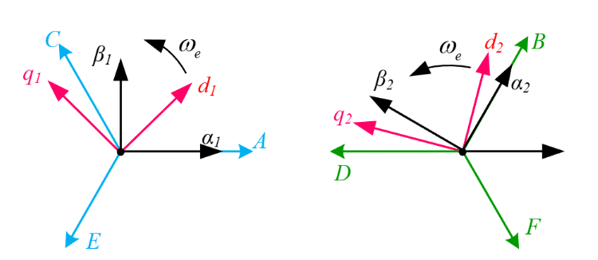
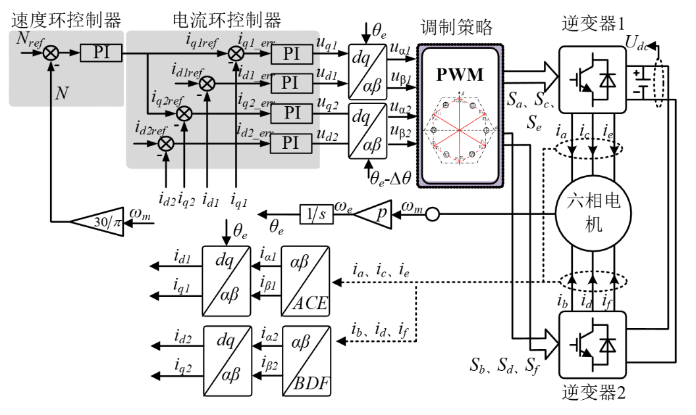
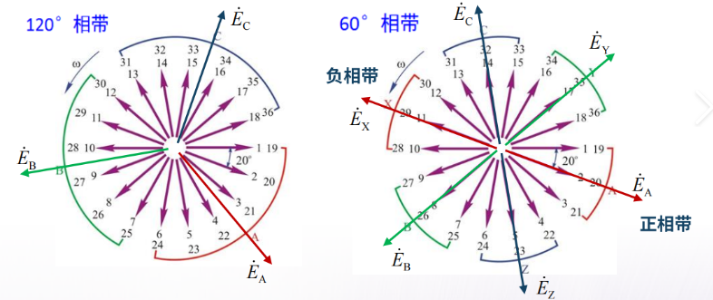
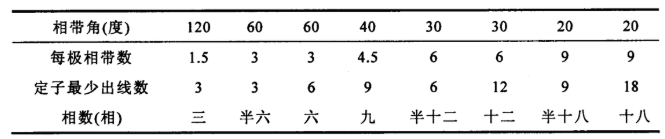
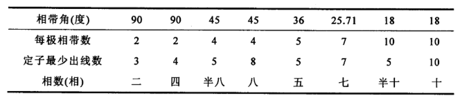
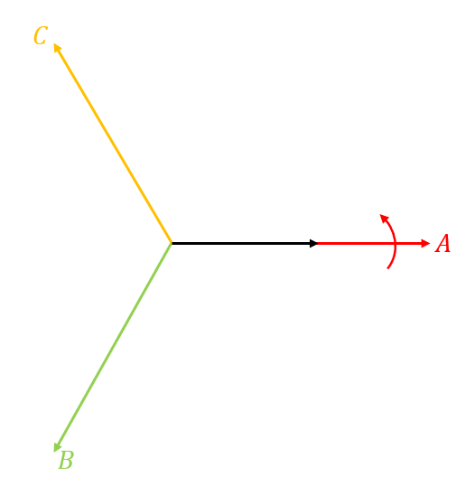
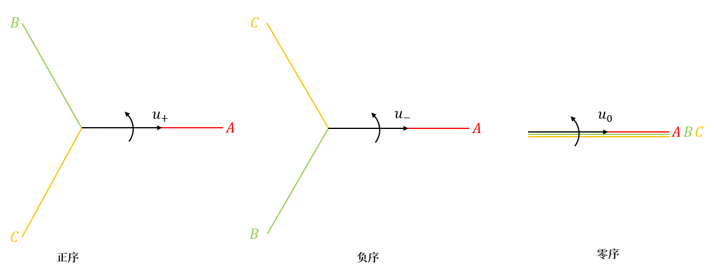
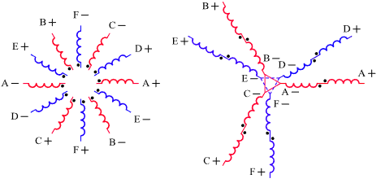
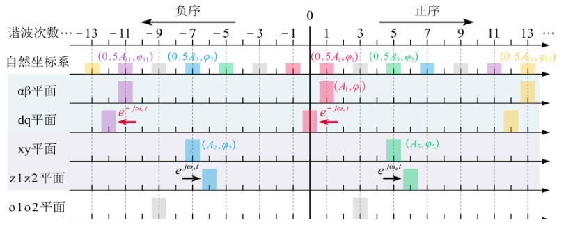

# 六相电机的原理和驱动

> 参考文献：
>
> 1. 鲁光旭.高速双三相永磁同步起发电机系统参数辨识及控制策略优化研究[D].哈尔滨工业大学,2025.
> 1. P. P. Das, S. Satpathy, S. Bhattacharya, V. Veliadis, U. Deshpande and B. Bhargava, "Determination of Parameters of Symmetrical Six-Phase Permanent Magnet Synchronous Machines," *2023 IEEE International Electric Machines & Drives Conference (IEMDC)*, San Francisco, CA, USA, 2023, pp. 1-7.
> 1. 薛山.多相永磁同步电机驱动技术研究[D].中国科学院研究生院(电工研究所),2006.

> 多相电机相对于三相电机有以下优点：
>
> 1. 当电机功率保持不变时，多相电机的多个桥臂具有分散承担电机功率的功能。同时多相电机在设计上可以更好利用磁场和电流，通常具有更高的功率密度。在相同的尺寸和重量下，多相电机可以提供更大的功率输出。
> 2. 电机相数的增加会增加空间谐波阶次，这样可以能够降低电机系统运行过程中产生的低频振动和噪声，提升调速系统的稳态运行性能。
> 3. 多相电机在稳态运行时具有更高的容错性。传统三相电机发生缺相故障时，大多都无法实现自启动。多相电机由于相冗余，当一路或者多路发生故障时，只要正常运行相数不少于三相系统都可正常降频运行无需停机重组，结合适当的容错控制策略都可以保证电机稳定运行。因此在对可靠性要求较高的应用场景下，多相电机特具有显著优势。
> 4. 桥臂的增多和可选择绕组结构类型的增多使得电机控制更加灵活。

六相电机有以下结构：双三相电机/不对称六相电机/对称六相电机。

六相电机的驱动系统如下：

中性点 $N_1$ 和 $N_2$ 可以隔离和不隔离，中性点隔离的结构由于两套绕组没有构成零序通路，因而没有零序电流流通，减小了 PWM 控制的复杂性和工作量，且中性点隔离还可以通过注入零序信号来提高调制系数，能有效提升直流母线电压的利用率。共中性点的连接方式有零序通路存在，电路中会产生零序电流，虽然需要对零序电流进行抑制，但同时中性点连接为电机控制提供了额外的自由度使得其具备更好的容错性能。

和三相电机类似，六相电机的电压方程为：
$$
\bold u_s = \bold R_s\bold i_s+\frac{d}{dt}\bold \psi_s
$$
$\bold R_s = diag[R_s,R_s,R_s,R_s,R_s,R_s]$，$\bold u_s = [u_{a1},u_{b1},u_{c1},u_{a2},u_{b2},u_{c2}]$，$\bold i_s = [i_{a1},i_{b1},i_{c1},i_{a2},i_{b2},i_{c2}]$，$\bold \psi_s = [\psi_{a1},\psi_{b1},\psi_{c1},\psi_{a2},\psi_{b2},\psi_{c2}]$。

磁链方程为(考虑三次磁链)：
$$
\psi_s = \bold L_s\bold i_s + 
\begin{bmatrix}
\cos\theta_e \\
\cos(\theta_e - \frac{2\pi}{3}) \\
\cos(\theta_e - \frac{4\pi}{3}) \\
\cos(\theta_e - \theta_d) \\
\cos(\theta_e - \theta_d - \frac{2\pi}{3}) \\
\cos(\theta_e - \theta_d - \frac{4\pi}{3})
\end{bmatrix}
\psi_f
+
\begin{bmatrix}
\cos3\theta_e \\
\cos3\theta_e \\
\cos3\theta_e \\
\cos3(\theta_e - \theta_d) \\
\cos3(\theta_e - \theta_d) \\
\cos3(\theta_e - \theta_d)
\end{bmatrix}
\psi_{3f}
$$
$\theta_d$ 为绕组 $A_1B_1C_1$ 和 $A_2B_2C_2$ 之间相差的角度。
$$
\bold L_s =
\begin{bmatrix}
\bold L_1 & \bold M_{12} \\
\bold M_{21} & \bold L_2
\end{bmatrix}
= 
\begin{bmatrix}
L_{A_1A_1} & M_{A_1B_1} & M_{A_1C_1} & M_{A_1A_2} & M_{A_1B_2} & M_{A_1C_2} \\
M_{B_1A_1} & L_{B_1B_1} & M_{B_1C_1} & M_{B_1A_2} & M_{B_1B_2} & M_{B_1C_2} \\
M_{C_1A_1} & M_{C_1B_1} & L_{C_1C_1} & M_{C_1A_2} & M_{C_1B_2} & M_{C_1C_2} \\
M_{A_2A_1} & M_{A_2B_1} & M_{A_2C_1} & L_{A_2A_2} & M_{A_2B_2} & M_{A_2C_2} \\
M_{B_2A_1} & M_{B_2B_1} & M_{B_2C_1} & M_{B_2A_2} & L_{B_2B_2} & M_{B_2C_2} \\
M_{C_2A_1} & M_{C_2B_1} & M_{C_2C_1} & M_{C_2A_2} & M_{C_2B_2} & L_{C_2C_2} \\
\end{bmatrix}
$$
$\bold L_1$ 为绕组 $A_1B_1C_1$ 的自感，$\bold L_2$ 为绕组 $A_2B_2C_2$ 的自感，$\bold M_{12} = \bold M_{21}^T$ 为两套绕组之间的互感(忽略互漏感)。假设 $d$ 轴的磁导最小，$q$ 轴的磁导最大，则：
$$
\bold L_1 = L_{s\sigma} \bold E + 
\frac{1}{2}(L_{sd}+L_{sq})
\begin{bmatrix}
1 & -\frac{1}{2} & -\frac{1}{2} \\
-\frac{1}{2} & 1 & -\frac{1}{2} \\
-\frac{1}{2} & -\frac{1}{2} & 1
\end{bmatrix}
+
\frac{1}{2}(L_{sd}-L_{sq})
\begin{bmatrix}
\cos2\theta_e & \cos2(\theta_e-\frac{\pi}{3}) & \cos2(\theta_e+\frac{\pi}{3}) \\
\cos2(\theta_e-\frac{\pi}{3}) & \cos2(\theta_e+\frac{\pi}{3}) & \cos2\theta_e \\
\cos2(\theta_e+\frac{\pi}{3}) & \cos2\theta_e & \cos2(\theta_e-\frac{\pi}{3})
\end{bmatrix}
$$

$$
\bold L_2 = L_{s\sigma} \bold E + 
\frac{1}{2}(L_{sd}+L_{sq})
\begin{bmatrix}
1 & -\frac{1}{2} & -\frac{1}{2} \\
-\frac{1}{2} & 1 & -\frac{1}{2} \\
-\frac{1}{2} & -\frac{1}{2} & 1
\end{bmatrix}
+
\frac{1}{2}(L_{sd}-L_{sq})
\begin{bmatrix}
\cos2(\theta_e-\theta_d) & \cos2(\theta_e-\theta_d-\frac{\pi}{3}) & \cos2(\theta_e-\theta_d+\frac{\pi}{3}) \\
\cos2(\theta_e-\theta_d-\frac{\pi}{3}) & \cos2(\theta_e-\theta_d+\frac{\pi}{3}) & \cos2(\theta_e-\theta_d) \\
\cos2(\theta_e-\theta_d+\frac{\pi}{3}) & \cos2(\theta_e-\theta_d) & \cos2(\theta_e-\theta_d-\frac{\pi}{3})
\end{bmatrix}
$$

$$
\bold M_{12} =
\frac{1}{2}(L_{sd}+L_{sq})
\begin{bmatrix}
\cos\theta_d & \cos(\frac{2\pi}{3}+\theta_d) & \cos(\frac{4\pi}{3}+\theta_d) \\
\cos(-\frac{2\pi}{3}+\theta_d) & \cos\theta_d & \cos(\frac{2\pi}{3}+\theta_d) \\
\cos(-\frac{4\pi}{3}+\theta_d) & \cos(-\frac{2\pi}{3}+\theta_d) & \cos\theta_d 
\end{bmatrix}
+
\frac{1}{2}(L_{sd}-L_{sq})
\begin{bmatrix}
\cos(2\theta_e-\theta_d) & \cos(2(\theta_e-\frac{\pi}{3})-\theta_d) & \cos(2(\theta_e+\frac{\pi}{3})-\theta_d) \\
\cos(2(\theta_e-\frac{\pi}{3})-\theta_d) & \cos(2(\theta_e+\frac{\pi}{3})-\theta_d) & \cos(2\theta_e-\theta_d) \\
\cos(2(\theta_e+\frac{\pi}{3})-\theta_d) & \cos(2\theta_e-\theta_d) & \cos(2(\theta_e-\frac{\pi}{3})-\theta_d)
\end{bmatrix}
$$

同样的，需要选择合适的坐标系进行降阶和解耦，对于六相电机，可以用双 dq 坐标系建模和 VSD 坐标系建模。

## 1. 双 dq 坐标系

将每一套三相绕组作为一个基本单元，对每一个基本单元采用传统的三相坐标变换：

双 dq 坐标变换的变换式为：
$$
\begin{bmatrix}
f_{d1} \\
f_{q1} \\
f_{01}
\end{bmatrix}
=
\bold T_{abc-dq1}
\begin{bmatrix}
f_{a1} \\
f_{b1} \\
f_{c1}
\end{bmatrix} 
$$

$$
\bold T_{abc-dq1} = \frac{2}{3}
\begin{bmatrix}
\cos\theta_e & \cos(\theta_e - \frac{2\pi}{3}) & \cos(\theta_e - \frac{4\pi}{3}) \\
-\sin\theta_e & -\sin(\theta_e - \frac{2\pi}{3}) & -\sin(\theta_e - \frac{4\pi}{3}) \\
\frac{1}{2} & \frac{1}{2} & \frac{1}{2}
\end{bmatrix}
$$

$$
\begin{bmatrix}
f_{d2} \\
f_{q2} \\
f_{02}
\end{bmatrix}
=
\bold T_{abc-dq2}
\begin{bmatrix}
f_{a2} \\
f_{b2} \\
f_{c2}
\end{bmatrix}
$$

$$
\bold T_{abc-dq2} = \frac{2}{3}
\begin{bmatrix}
\cos(\theta_e-\theta_d) & \cos(\theta_e - \frac{2\pi}{3}-\theta_d) & \cos(\theta_e - \frac{4\pi}{3}-\theta_d) \\
-\sin(\theta_e-\theta_d) & -\sin(\theta_e - \frac{2\pi}{3}-\theta_d) & -\sin(\theta_e - \frac{4\pi}{3}-\theta_d) \\
\frac{1}{2} & \frac{1}{2} & \frac{1}{2}
\end{bmatrix}
$$

$$
\bold T_{abc-dq} =
\begin{bmatrix}
\bold T_{abc-dq1} & 0 \\
0 & \bold T_{abc-dq2}
\end{bmatrix}
$$

进行变换后得到($L_{d} = \frac{3}{2}L_{sd}$，$L_{q} = \frac{3}{2}L_{sq}$)^[1][2]^：
$$
\begin{bmatrix}
u_{d1} \\
u_{q1} \\
u_{d2} \\
u_{q2} \\
u_{01} \\
u_{02}
\end{bmatrix}
=
\begin{bmatrix}
R_s & 0 & 0 & 0 & 0 & 0\\
0 & R_s & 0 & 0 & 0 & 0\\
0 & 0 & R_s & 0 & 0 & 0\\
0 & 0 & 0 & R_s & 0 & 0\\
0 & 0 & 0 & 0 & R_s & 0\\
0 & 0 & 0 & 0 & 0 & R_s
\end{bmatrix}
\begin{bmatrix}
i_{d1} \\
i_{q1} \\
i_{d2} \\
i_{q2} \\
i_{01} \\
i_{02} \\
\end{bmatrix}
+
\frac{d}{dt}
\begin{bmatrix}
\psi_{d1} \\
\psi_{q1} \\
\psi_{d2} \\
\psi_{q2} \\
\psi_{01} \\
\psi_{02} 
\end{bmatrix}
+
\omega_e
\begin{bmatrix}
0 & -1 & 0 & 0 & 0 & 0\\
1 & 0 & 0 & 0 & 0 & 0\\
0 & 0 & 0 & -1 & 0 & 0\\
0 & 0 & 1 & 0 & 0 & 0\\
0 & 0 & 0 & 0 & 0 & 0\\
0 & 0 & 0 & 0 & 0 & 0\\
\end{bmatrix}
\begin{bmatrix}
\psi_{d1} \\
\psi_{q1} \\
\psi_{d2} \\
\psi_{q2} \\
\psi_{01} \\
\psi_{02}
\end{bmatrix}
$$

$$
\begin{bmatrix} 
\psi_{d1} \\ 
\psi_{q1} \\ 
\psi_{d2} \\ 
\psi_{q2} \\
\psi_{01} \\
\psi_{02}
\end{bmatrix} = 
\begin{bmatrix} 
L_d+L_{s\sigma} & 0 & L_d & 0 & 0 & 0\\ 
0 & L_q+L_{s\sigma} & 0 & L_q & 0 & 0\\ 
L_d & 0 & L_d+L_{s\sigma} & 0 & 0 & 0\\ 
0 & L_q & 0 & L_q+L_{s\sigma} & 0 & 0\\
0 & 0 & 0 & 0 & L_{s\sigma} & 0 \\
0 & 0 & 0 & 0 & 0 & L_{s\sigma} \\
\end{bmatrix}
\begin{bmatrix} 
i_{d1} \\ 
i_{q1} \\ 
i_{d2} \\ 
i_{q2} \\
i_{01} \\ 
i_{02} \\
\end{bmatrix} 
+ 
\begin{bmatrix} 
1 \\ 
0 \\ 
1 \\ 
0 \\
0 \\
0
\end{bmatrix} 
\psi_f
+
\begin{bmatrix} 
0 \\ 
0 \\ 
0 \\ 
0 \\
\cos3\theta_e \\
\cos3(\theta_e-\theta_d)
\end{bmatrix} 
\psi_{3f}
$$

可以看到，此时 $d_1q_1$ 和 $d_2q_2$ 坐标系由于两套绕组之间存在互感从而导致耦合(这个结果和 $\theta_d$ 无关)。

此时的电磁转矩为(中性点断开时零序电流为 0)：
$$
T_e =\frac{3}{2}p_n(i_{q1}\psi_{d1}-i_{d1}\psi_{q1}+i_{q2}\psi_{d2}-i_{d2}\psi_{d2}) + \frac{3}{2}p_n\psi_3(i_{01}\sin3\theta_e+i_{02}\sin3(\theta_e-\theta_d))
$$
基于双 dq 坐标系的矢量控制框图如下：

本质上双 dq 变换实现了以下的映射($\theta_d = 30\degree$)：

## 2. VSD 坐标系

VSD 方法是 Clark 变换的扩展方法，将物理量映射到彼此正交的子空间中(三相电机将物理量分解到一个正交子空间 $\alpha-\beta$ 和一个零序子空间中)，随着电机相数的增加，正交子空间数量随即增加，同时也会有多个零序轴系。

---

***按照电机的相带定义电机相数***：
$$
m = \frac{2\pi}{\beta}
$$
$\beta$ 为绕组的相带角度。

> 例：左侧和右侧都是传统意义的三相电机，但是相带角度不同，左侧是 120° 相带角度，右侧是 60° 相带角度，同一个相带下的导体通过串联获得最大的反电动势幅值。
>
> 
>
> 左侧的电机有 3 个相带，可以直接引出 3 个出线端，称为三相电机；右侧的电机有 6 个相带，虽然能引出 6 个出线端，但是通常将相对的相带进行反串联，从而减少为 3 个出线端，称为半六相电机。

当电机相带数为 $2n$，每个相带相互独立，电机有 $2n$ 个出线端，称为 $2n$ 相电机；若相对的相带通过反串联进行连接，电机有 $n$ 个出线端，则称为半 $2n$ 相电机。

因此，双三相电机实质是半十二相电机，对称六相电机实质是六相电机。

---

***多相感应电机的数学模型：***

接下来研究 $n$ 相定子，$m$ 相 1 对极转子的 $n-m$ 相(气隙均匀)感应电机，推导得到推广的 Clarke 变换。

定子电压方程：
$$
\bold u_s = \bold R_s \bold i_s + \frac{d}{dt}\bold \psi_s
$$
定子磁链方程：
$$
\psi_s = \bold L_{ss}\bold i_s + \bold L_{sr} \bold i_r
$$
$\bold L_{ss}$ 为定子电感矩阵，由于假设电机对称，该矩阵为循环对称矩阵：
$$
\bold L_{ss} = 
\begin{bmatrix}
L_{1s1s} & L_{1s2s} & \cdots & L_{1sns} \\
L_{2s1s} & L_{2s2s} & \cdots & L_{2sns} \\
\cdots & \cdots & \cdots & \cdots \\
L_{ns1s} & L_{ns2s} & \cdots & L_{nsns} \\
\end{bmatrix}
$$
$\bold L_{sr}$ 为定转子互感矩阵：
$$
\bold L_{sr} =
\begin{bmatrix}
L_{1s1r} & L_{1s2r} & \cdots & L_{1smr} \\
L_{2s1r} & L_{2s2r} & \cdots & L_{2smr} \\
\cdots & \cdots & \cdots & \cdots \\
L_{ns1r} & L_{ns2r} & \cdots & L_{nsmr} \\
\end{bmatrix}
=
L_{sr}
\begin{bmatrix}
\cos\theta & \cos(\theta+\frac{2\pi}{m}) & \cdots & \cos(\theta+\frac{2(m-1)\pi}{m}) \\
\cos(\theta-\frac{2\pi}{n}) & \cos(\theta+\frac{2\pi}{m}-\frac{2\pi}{n}) & \cdots & \cos(\theta+\frac{2(m-1)\pi}{m}-\frac{2\pi}{n}) \\
\cdots & \cdots & \cdots & \cdots \\
\cos(\theta-\frac{2(n-1)\pi}{n}) & \cos(\theta+\frac{2\pi}{m}-\frac{2(n-1)\pi}{n}) & \cdots & \cos(\theta+\frac{2(m-1)\pi}{m}-\frac{2(n-1)\pi}{n}) \\
\end{bmatrix}
$$
定子电压方程转化为：
$$
\bold u_s = \bold R_s\bold i_s+\bold L_{ss}\frac{d}{dt}\bold i_s+\bold L_{sr}\frac{d}{dt}\bold i_r + \omega \frac{d}{d\theta}\bold L_{sr}
$$
第一项为绕组电阻压降，第二项为变压器电动势，第三项为运动电动势。

转子电压方程：
$$
\bold u_r = \bold R_r\bold i_r+\frac{d}{dt}\psi_r
$$
转子磁链方程：
$$
\psi_r = \bold L_{rr}\bold i_r+\bold L_{sr}\bold i_s
$$
$\bold L_{rr}$ 为转子电感矩阵，亦为循环对称矩阵。$\bold L_{sr} = \bold L_{rs}^T$。

由此，电压方程为：
$$
\begin{bmatrix}
\bold u_s \\
\bold u_r
\end{bmatrix}
=
\begin{bmatrix}
\bold R_s+p\bold L_{ss} & p\bold L_{sr} \\
\bold L_{sr}^T & \bold R_r+p\bold L_{rr}
\end{bmatrix}
\begin{bmatrix}
\bold i_s \\
\bold i_r
\end{bmatrix}
$$

磁共能：

$$
W = \frac{1}{2}
\begin{bmatrix}
\bold i_s &
\bold i_r
\end{bmatrix}
\begin{bmatrix}
\bold L_{ss} & \bold L_{sr} \\
\bold L_{sr}^T & \bold L_{rr}
\end{bmatrix}
\begin{bmatrix}
\bold i_s \\
\bold i_r
\end{bmatrix}
$$
电磁转矩：
$$
T_e = p\frac{\partial W}{\partial \theta} = p \bold i_s^T\frac{\partial \bold L_{sr}}{\partial \theta}\bold i_r
$$

---

***对称分量法***：

三相对称分量法中，正序，负序和零序分量可以合成为三相不对称量：
$$
\begin{bmatrix}
u_a \\
u_b \\
u_c
\end{bmatrix}
= 
\frac{1}{\sqrt 3}\begin{bmatrix}
1 & 1 & 1 \\
1 & \bold a^2 & \bold a \\
1 & \bold a & \bold a^2
\end{bmatrix}
\begin{bmatrix}
u_0 \\
u_+ \\
u_-
\end{bmatrix}
$$
由此可以得到分解矩阵：
$$
\begin{bmatrix}
u_0 \\
u_+ \\
u_-
\end{bmatrix}
= 
\frac{1}{\sqrt 3}\begin{bmatrix}
1 & 1 & 1 \\
1 & \bold a & \bold a^2 \\
1 & \bold a^2 & \bold a
\end{bmatrix}
\begin{bmatrix}
u_a \\
u_b \\
u_c
\end{bmatrix}
$$
进行推广，从而有以下定义：

定义对称分量变换矩阵 $\bold \Gamma$，定义 $\bold x^s$ 为 $\bold x$ 的对称分量向量：
$$
\bold x = \bold\Gamma \bold x^s (合成公式)\\
\bold x^s = \bold\Gamma^{-1}\bold x(分解公式)
$$

$$
\bold \Gamma
 = \sqrt \frac{1}{n}
\begin{bmatrix}
1 & 1 & 1 & \cdots & 1 & 1 \\
1 & \bold a^{-1} & \bold a^{-2} & \cdots & \bold a^{-(n-2)} & \bold a^{-(n-1)} \\
1 & \bold a^{-2} & \bold a^{-4} & \cdots & \bold a^{-2(n-2)} & \bold a^{-2(n-1)} \\
\cdots & \cdots & \cdots & \cdots & \cdots & \cdots \\
1 & \bold a^{-(n-1)} & \bold a^{-(n-1)2} & \cdots & \bold a^{-(n-1)(n-2)} & \bold a^{-(n-1)(n-1)} \\
\end{bmatrix}
$$

其中 $\bold x^s$ 为对称向量分量：$\bold x^s = \begin{bmatrix}x_0^s & x_1^s & x_2^s & \cdots & x_{n-1}^s\end{bmatrix}$，其中 $x_0^s$ 为零序分量，$x_1^s$ 为正序分量，$x_{n-1}^s$ 为负序分量，其余为广义零序分量。$\bold a$ 为单位旋转因子，$\bold a = e^{j\frac{2\pi}{n}}$。

> 几何含义：
>
> $\bold x$ 表征 $n$ 个旋转向量的投影($n$ 相电压波形)，是实数，每相旋转向量在正交轴上投影可以分别得到 $n$ 相电压波形：
>
> 
>
> $\bold x^s$ 表征每个相序的分量，是复数，每个序分量为一个旋转向量(实际上为 $n$ 相，但是只保留了其中一相的旋转向量)，注意相序和旋转速度无关。每个序分量在对应的相序轴上进行投影可以得到 $n$ 相电压波形。
>
> 

对称分量变换矩阵有以下性质：

- $\bold \Gamma = ((\bold\Gamma^{-1})^T)^*$，则：
  $$
  \bold \Gamma
   = \sqrt \frac{1}{n}
  \begin{bmatrix}
  1 & 1 & 1 & \cdots & 1 & 1 \\
  1 & \bold a^{1} & \bold a^{2} & \cdots & \bold a^{(n-2)} & \bold a^{(n-1)} \\
  1 & \bold a^{2} & \bold a^{4} & \cdots & \bold a^{2(n-2)} & \bold a^{2(n-1)} \\
  \cdots & \cdots & \cdots & \cdots & \cdots & \cdots \\
  1 & \bold a^{(n-1)} & \bold a^{(n-1)2} & \cdots & \bold a^{(n-1)(n-2)} & \bold a^{(n-1)(n-1)} \\
  \end{bmatrix}
  $$

- $\bold a^k = \bold a^{-(n-k)}$，$\bold a^k = (\bold a^{n-k})^*$，则 $x^s_k = (x^s_{n-k})^*$。

- $\bold x$ 中的基波分量若定义为正序分量，则 $\bold x$ 中的 $kn+1$ 次谐波为正序分量，$kn-1$ 次谐波为负序分量，$kn$ 次谐波为零序分量，剩余次数谐波为广义零序分量。

  > 谐波的相位差一定是 $k\frac{2\pi}{n}$，根据这个关系可以推导该谐波的相序；

---

  ***多相感应电机的对称分量模型：***

定义 $\bold i_s = \bold \Gamma_s\bold i_s^s$， $\bold u_s = \bold \Gamma_s\bold u_s^s$； $\bold i_r = \bold \Gamma_r\bold i_r^s$， $\bold u_r = \bold \Gamma_s\bold u_r^s$

代入电机方程：
$$
\begin{bmatrix}
\bold u_s^s \\
\bold u_r^s
\end{bmatrix}
=
\begin{bmatrix}
\bold \Gamma_s^{-1}(\bold R_s+p\bold L_{ss})\bold \Gamma_s & \bold \Gamma_s^{-1}p\bold L_{sr}\bold \Gamma_r \\
\bold \Gamma_r^{-1}\bold L_{sr}^T\bold \Gamma_s & \bold \Gamma_r^{-1}(\bold R_r+p\bold L_{rr})\bold \Gamma_r
\end{bmatrix}
\begin{bmatrix}
\bold i_s \\
\bold i_r
\end{bmatrix}
$$

定转子电阻矩阵：$\bold \Gamma_s^{-1}\bold R_s\bold \Gamma_s = \bold R_s$，$\bold \Gamma_r^{-1}\bold R_r\bold \Gamma_r = \bold R_r$；

自然坐标系中定转子电感矩阵为对称循环阵，可以证明一个对称循环阵可以被对称分量变换矩阵对角化(此处不证明)，则：
$$
\bold L_{ss}^s  =
diag\begin{bmatrix}
L_{0s0s}^s & L_{1s1s}^s & L_{2s2s}^s & \cdots & L_{(n-1)s(n-1)s}
\end{bmatrix} 
$$

$$
L_{0s0s}^s = \sum_{k=1}^n L_{1sks} \\
L_{1s1s}^s = \sum_{k=1}^n \bold a^{-(k-1)} L_{1sks} \\
L_{2s2s}^s = \sum_{k=1}^n \bold a^{-2(k-1)} L_{1sks} \\
\cdots \\
L_{(n-1)s(n-1)s}^s = \sum_{k=1}^n \bold a^{-(n-1)(k-1)} L_{1sks}
$$

由于：$\bold a^k = (\bold a^{n-k})^*$，则 $L_{isis}^s = (L_{(n-i)s(n-i)s}^s)^*$；

对于定转子互感矩阵有：
$$
\bold L_{sr}^s = \frac{\sqrt {nm}}{2}L_{sr}
\begin{bmatrix}
0 & 0 & 0 & \cdots & 0 \\
0 & e^{j\theta} & 0 & \cdots & 0 \\
0 & 0 & 0 & \cdots & 0 \\
\cdots & \cdots & \cdots & \cdots & \cdots \\
0 & 0 & 0 & \cdots & e^{-j\theta} \\
\end{bmatrix} \\
\bold L_{rs}^s = \frac{\sqrt {nm}}{2}L_{sr}
\begin{bmatrix}
0 & 0 & 0 & \cdots & 0 \\
0 & e^{-j\theta} & 0 & \cdots & 0 \\
0 & 0 & 0 & \cdots & 0 \\
\cdots & \cdots & \cdots & \cdots & \cdots \\
0 & 0 & 0 & \cdots & e^{j\theta} \\
\end{bmatrix}
$$

由矩阵的形式可以得知，除了 $u_{1s}^s,u_{(n-1)s}^s,u_{1r}^s,u_{(m-1)r}^s$ 四个电压方程，其余的电压方程可以表示为：
$$
u_{k}^s = (R_s+pL_{kk}^s)i_k^s
$$
对于这四个电压方程，令 $u_{1s}^s = u_s^+$，$u_{(n-1)s}^s = u_s^-$，$u_{1r}^s = u_r^+$，$u_{(n-1)r}^s = u_r^-$。可以得知正负序电压方程有一个额外的定转子耦合项。

电磁转矩可以表示为：
$$
T_e = \frac{1}{2}p\frac{\sqrt{nm}}{2}L_{sr}j[(i_s^{+*}i_r^++i_r^{-*}i_s^-)e^{j\theta}-(i_r^{-*}i_s^-+i_s^{+*}i_r^+)e^{-j\theta}]
$$
绕组正弦分布 $n-m$ 相感应电机对称分量数学模型电压方程中只有定转子正序电压和负序电压四个方程与电机机械运动相关，因而只有这四个电压方程与电机的机电能量转换有关。所以从机电能量转换的角度来说，通过对称分量法，绕组正弦分布 $n-m$ 相感应电机等效为两相电机，而其余的 $(n+m-4)$ 个电压方程是独立的线性微分方程，与机电能量转换无关。

---

***推广 Clarke/Park 变换：***

为了方便运算，需要将 $\bold x^s$ 转化为实数，可以得知：

- $x_i^s+x_{n-i}^s$ 为实数；
- $x_0^s$ 和 $x_{n/2}^s$ 为实数，$n$ 为偶数时 $x_{n/2}^s$ 存在；

由此可以进行线性变换使得 $\bold x^s$ 转化为实数，定义变换矩阵：
$$
\bold B =
\begin{bmatrix}
\sqrt 2 & 0 & 0 & & & & & & 0 & 0 \\
0 & 1 & 0 &     & & & & & 0 & j \\
  &   & 1 &     & & & & & j & 0 \\
  &   &   & 1   & & & & j & & \\
  &   &   &   & \ddots                        &         & .\cdot{}^{\,\displaystyle{}.}  &\\
  &   &   &   &                               & \sqrt 2 &        & \\
  &   &   &   & .\cdot{}^{\,\displaystyle{}.} &         & \ddots & \\
  &   &   & 1 &                               &         &        & -j \\
  0 & 0 & 1 & & & & & & -j & 0 \\
  0 & 1 & 0 & & & & & & 0 & -j
\end{bmatrix}
$$

$$
\bold x^s = \bold B\bold x_{\alpha\beta} \\
\bold x_{\alpha\beta} = \bold B\bold x^s
$$

$\bold x_{\alpha\beta}$ 的分量均为实数。变换矩阵满足 $\bold B^{-1} = (\bold B^*)^T$；

由此定义广义 Clarke 变换矩阵：
$$
\bold T_{clarke} =
\begin{bmatrix}
\frac{1}{\sqrt2} & \frac{1}{\sqrt2} & \frac{1}{\sqrt2} & \frac{1}{\sqrt2} & \cdots \\
1 & \cos\alpha & \cos2\alpha & \cos3\alpha & \cdots \\
1 & \cos2\alpha & \cos4\alpha & \cos6\alpha & \cdots \\
\vdots & \vdots & \vdots  & \vdots & \cdots \\
\frac{1}{\sqrt2} & -\frac{1}{\sqrt2} & \frac{1}{\sqrt2} & -\frac{1}{\sqrt2} & \cdots \\
\vdots & \vdots & \vdots  & \vdots & \cdots \\
0 & \sin2\alpha & \sin4\alpha & \sin6\alpha & \cdots \\
0 & \sin\alpha & \sin2\alpha & \sin3\alpha & \cdots \\
\end{bmatrix}
$$
重排该矩阵：
$$
\bold T_{clarke} =
\begin{bmatrix}
1 & \cos\alpha & \cos2\alpha & \cos3\alpha & \cdots \\
0 & \sin\alpha & \sin2\alpha & \sin3\alpha & \cdots \\
1 & \cos2\alpha & \cos4\alpha & \cos6\alpha & \cdots \\
0 & \sin2\alpha & \sin4\alpha & \sin6\alpha & \cdots \\
\vdots & \vdots & \vdots  & \vdots & \cdots \\
1 & \cos k\alpha & \cos2k\alpha & \cos3k\alpha & \cdots \\
0 & \sin k\alpha & \sin2k\alpha & \sin3k\alpha & \cdots \\
\frac{1}{\sqrt2} & \frac{1}{\sqrt2} & \frac{1}{\sqrt2} & \frac{1}{\sqrt2} & \cdots \\
\frac{1}{\sqrt2} & -\frac{1}{\sqrt2} & \frac{1}{\sqrt2} & -\frac{1}{\sqrt2} & \cdots \\
\end{bmatrix}
$$
$\alpha = \frac{2\pi}{n}$；最后一行在 $n$ 为偶数时存在，$k = [\frac{n-1}{2}]$；

Clarke 变换有以下性质：

- $\bold T^{-1} = \bold T^T$；经过 Clarke 变换后 $n$ 维空间由两两正交的 $\alpha_1-\beta_1$ 子空间、$\alpha_2-\beta_2$ 子空间等构成；
- 绕组变量的 $±(kn±1)$ 次谐波(正序和负序分量)都被投影到 $\alpha_1-\beta_1$ 子空间，与机电能量转换相关，电机的控制等效为将被控制量定位于这个二维子空间，并按照给定的方式运动；其它次数谐波分量被投影到相应的子空间中，对于绕组正弦分布的绕组来说，它们与机电能量转换无关，导致电机损耗增加。
- 对于非正弦分布的绕组，可以利用傅立叶级数分解将绕组函数展开为基波绕组和一系列正弦谐波绕组之和；
- 对于半 $2n$ 相电机，用相带绕组变量之间的约束关系化简变换矩阵。

---

### 六相电机的 VSD 坐标变换

1. 双三相电机($\theta_d = 30\degree$)

   双三相电机为半十二相电机，使用十二相电机的 Clark 变换矩阵，由于约束关系：

   

   导致以行基向量 $\bold a^{p}, \bold a^{2p}, \cdots$ 进行的变换均为 0，也就是不存在这类广义零序分量，删除这些行变换。(**实际上，偶数次谐波的反电动势可以在相对的绕组上存在，但是由于反串联无法产生偶次谐波电流；从外部通入的偶次谐波电流也无法产生偶次谐波磁动势)
   $$
   T_{abc-\alpha\beta} = \frac{1}{3}
   \begin{bmatrix}
   1 & -\frac{1}{2} & -\frac{1}{2} & \frac{\sqrt 3}{2} & -\frac{\sqrt 3}{2} & 0 \\
   0 & \frac{\sqrt 3}{2} & -\frac{\sqrt 3}{2} & \frac{1}{2} & \frac{1}{2} & -1 \\
   1 & -\frac{1}{2} & -\frac{1}{2} & -\frac{\sqrt 3}{2} & \frac{\sqrt 3}{2} & 0 \\
   0 & -\frac{\sqrt 3}{2} & \frac{\sqrt 3}{2} & \frac{1}{2} & \frac{1}{2} & -1 \\
   1 & 1 & 1 & 0 & 0 & 0 \\
   0 & 0 & 0 & 1 & 1 & 1 \\
   \end{bmatrix}
   $$
   系数 $\frac{1}{3}$ 为等幅值变换，系数 $\frac{1}{\sqrt 3}$ 为等功率变换。

   选取 Park 旋转矩阵时，基波子空间和三相一致，剩余的子空间可以选择单位阵。(对于谐波子空间可以选择旋转矩阵使得 5 次谐波分量转换为直流量)
   $$
   T_{\alpha\beta-dq} =
   \begin{bmatrix}
   \cos\theta_e & \sin\theta_e & 0 & 0 & 0 & 0 \\
   -\sin\theta_e & \cos\theta_e & 0 & 0 & 0 & 0 \\
   0 & 0 & 1 & 0 & 0 & 0 \\
   0 & 0 & 0 & 1 & 0 & 0 \\
   0 & 0 & 0 & 0 & 1 & 0 \\
   0 & 0 & 0 & 0 & 0 & 1 \\
   \end{bmatrix}
   $$
   转换后的电压和磁链方程($L_d = 3L_{sd},L_q = 3L_{sq}$)：
   $$
   \begin{bmatrix}
   u_{d} \\
   u_{q} \\
   u_{x} \\
   u_{y} \\
   u_{01} \\
   u_{02}
   \end{bmatrix}
   =
   \begin{bmatrix}
   R_s & 0 & 0 & 0 & 0 & 0\\
   0 & R_s & 0 & 0 & 0 & 0\\
   0 & 0 & R_s & 0 & 0 & 0\\
   0 & 0 & 0 & R_s & 0 & 0\\
   0 & 0 & 0 & 0 & R_s & 0\\
   0 & 0 & 0 & 0 & 0 & R_s
   \end{bmatrix}
   \begin{bmatrix}
   i_{d} \\
   i_{q} \\
   i_{x} \\
   i_{y} \\
   i_{01} \\
   i_{02} \\
   \end{bmatrix}
   +
   \frac{d}{dt}
   \begin{bmatrix}
   \psi_{d} \\
   \psi_{q} \\
   \psi_{x} \\
   \psi_{y} \\
   \psi_{01} \\
   \psi_{02} 
   \end{bmatrix}
   +
   \omega_e
   \begin{bmatrix}
   0 & -1 & 0 & 0 & 0 & 0\\
   1 & 0 & 0 & 0 & 0 & 0\\
   0 & 0 & 0 & 0 & 0 & 0\\
   0 & 0 & 0 & 0 & 0 & 0\\
   0 & 0 & 0 & 0 & 0 & 0\\
   0 & 0 & 0 & 0 & 0 & 0\\
   \end{bmatrix}
   \begin{bmatrix}
   \psi_{d} \\
   \psi_{q} \\
   \psi_{x} \\
   \psi_{y} \\
   \psi_{01} \\
   \psi_{02}
   \end{bmatrix}
   $$

   $$
   \begin{bmatrix} 
   \psi_{d} \\ 
   \psi_{q} \\ 
   \psi_{x} \\ 
   \psi_{y} \\
   \psi_{01} \\
   \psi_{02}
   \end{bmatrix} = 
   \begin{bmatrix} 
   L_d+L_{s\sigma} & 0 & 0 & 0 & 0 & 0\\ 
   0 & L_q+L_{s\sigma} & 0 & 0 & 0 & 0\\ 
   0 & 0 & L_{s\sigma} & 0 & 0 & 0\\ 
   0 & 0 & 0 & L_{s\sigma} & 0 & 0\\
   0 & 0 & 0 & 0 & L_{s\sigma} & 0 \\
   0 & 0 & 0 & 0 & 0 & L_{s\sigma} \\
   \end{bmatrix}
   \begin{bmatrix} 
   i_{d} \\ 
   i_{q} \\ 
   i_{x} \\ 
   i_{y} \\
   i_{01} \\ 
   i_{02} \\
   \end{bmatrix} 
   + 
   \begin{bmatrix} 
   1 \\ 
   0 \\ 
   0 \\ 
   0 \\
   0 \\
   0
   \end{bmatrix} 
   \psi_f
   +
   \begin{bmatrix} 
   0 \\ 
   0 \\ 
   0 \\ 
   0 \\
   \cos3\theta_e \\
   \cos3(\theta_e-\frac{\pi}{6})
   \end{bmatrix} 
   \psi_{3f}
   $$

   电磁转矩：
   $$
   T_e =3p_n[\psi_f+(L_d-L_q)i_d]i_q + \frac{3}{2}p_n\psi_3(i_{01}\sin3\theta_e+i_{02}\sin3(\theta_e-\frac{\pi}{6}))
   $$
   

   > 1. 变换矩阵的前两行对应 $\alpha-\beta$ 子空间，电机的基波分量和 $12k±1$ 次谐波分量被映射到子空间上，参与电机的机电能量转换；
   > 2. 变换矩阵的中间两行对应 $x-y$ 子空间，电机的 $12k±5$ 次谐波分量(不贡献平均转矩)被映射到子空间上，不参与电机的机电能量转换；
   > 3. 变换矩阵的最后两行对应零序子空间，电机的 $12k±3$ 次谐波分量(不贡献平均转矩)被映射到子空间上，不参与电机的机电能量转换。
   >
   > 实际上起到了谐波分离的效果，使得控制系统能够在控制运动时同时进行谐波优化。

2. 对称六相电机($\theta_d = 60\degree$)
   $$
   T_{abc-\alpha\beta} = \frac{1}{3}
   \begin{bmatrix}
   1 & -\frac{1}{2} & -\frac{1}{2} & \frac{1}{2} & -1 & \frac{1}{2} \\
   0 & \frac{\sqrt 3}{2} & -\frac{\sqrt 3}{2} & \frac{\sqrt 3}{2} & 0 & -\frac{\sqrt 3}{2} \\
   1 & -\frac{1}{2} & -\frac{1}{2} & -\frac{1}{2} & 1 & -\frac{1}{2} \\
   0 & -\frac{\sqrt 3}{2} & \frac{\sqrt 3}{2} & \frac{\sqrt 3}{2} & 0 & -\frac{\sqrt 3}{2} \\
   \frac{\sqrt 2}{2} & \frac{\sqrt 2}{2} & \frac{\sqrt 2}{2} & \frac{\sqrt 2}{2} & \frac{\sqrt 2}{2} & \frac{\sqrt 2}{2} \\
   \frac{\sqrt 2}{2} & \frac{\sqrt 2}{2} & \frac{\sqrt 2}{2} & -\frac{\sqrt 2}{2} & -\frac{\sqrt 2}{2} & -\frac{\sqrt 2}{2}
   \end{bmatrix}
   $$
   结论和双三相电机一致。

   电磁转矩：
   $$
   T_e =3p_n[\psi_f+(L_d-L_q)i_d]i_q + \frac{3}{2}p_n\psi_3(i_{01}\sin3\theta_e+i_{02}\sin3(\theta_e-\frac{\pi}{3}))
   $$

   基于 VSD 坐标变换的矢量控制框图如下：

   

   > 1. 变换矩阵的前两行对应 $\alpha-\beta$ 子空间，电机的基波分量和 $6k±1$ 次谐波分量被映射到子空间上，参与电机的机电能量转换；
   > 2. 变换矩阵的中间两行对应 $x-y$ 子空间，电机的 $6k±2$ 次谐波分量(不贡献平均转矩)被映射到子空间上，不参与电机的机电能量转换；
   > 3. 变换矩阵的最后两行对应零序子空间，电机的 $6k±3$ 次谐波分量(不贡献平均转矩)被映射到子空间上，不参与电机的机电能量转换。
