# 六相逆变器的 PWM 调制技术

## 1. 电压矢量

### 双三相电机的电压矢量

这里考虑 VSD 坐标变换下的电压矢量表现形式，如果只需要考虑机电能量转换，只需要考虑基波子空间的电压矢量合成；而如果需要进行五七次谐波抑制，需要同时考虑谐波子空间的电压矢量合成。

电机电压矢量在基波子空间和谐波子空间的表达式为：
$$
\bold u = \frac{1}{3}U_{dc}(S_{A1}+S_{B1}e^{j120\degree}+S_{C1}e^{j240\degree}+S_{A2}e^{j30\degree}+S_{B2}e^{j150\degree}+S_{C1}e^{j270\degree})
$$

$$
\bold{u}_z = \frac{1}{3}U_{dc}(S_{A1}+S_{B1}e^{j240\degree}+S_{C1}e^{j120\degree}+S_{A2}e^{j150\degree}+S_{B2}e^{j30\degree}+S_{C2}e^{j270\degree})
$$

由此可以得到基波子空间和谐波子空间下基本电压矢量分别表达为：

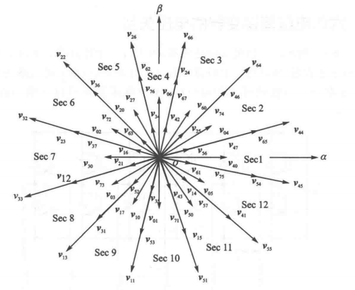

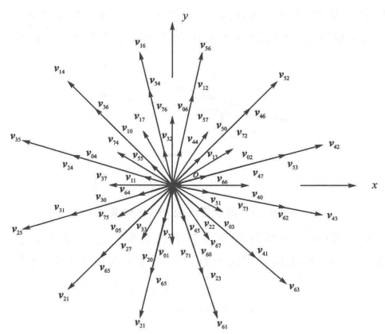

其中 $A_1B_1C_1$ 为一个 8 进制数字，$A_2B_2C_2$ 为另一个 8 进制数字，高低位组合形成电压矢量编号。根据 $\alpha-\beta$ 空间内电压矢量的幅值可以将基本电压矢量可以分为最小矢量(12个)、小矢量(24个)、中矢量(12个)、大矢量(12个)。每一种矢量都可以构建出一个正十二边形。幅值分别为：
$$
|\bold u_{max}| = \frac{\sqrt 2(\sqrt 3+1)}{6}U_{dc} = 0.644U_{dc} \\
|\bold u_{midL}| = \frac{\sqrt 2}{3}U_{dc} = 0.471U_{dc} \\
|\bold u_{midS}| = \frac{1}{3}U_{dc} = 0.333U_{dc} \\
|\bold u_{min}| = \frac{\sqrt 2(\sqrt 3-1)}{6}U_{dc} = 0.173U_{dc} \\
$$

> - 基波子空间的大矢量对应谐波子空间的最小矢量，相位相差 5 倍；
> - 基波子空间的中矢量对应谐波子空间的中矢量，相位相差 5 倍；
> - 基波子空间的小矢量对应谐波子空间的小矢量，相位相差 5 倍；
> - 基波子空间的最小矢量对应谐波子空间的大矢量，相位相差 5 倍；

### 对称六相电机的电压矢量

电机电压矢量在基波子空间和谐波子空间的表达式为：
$$
\bold u = \frac{1}{3}U_{dc}(S_{A1}+S_{B1}e^{j120\degree}+S_{C1}e^{j240\degree}+S_{A2}e^{j60\degree}+S_{B2}e^{j180\degree}+S_{C2}e^{j300\degree}) \\
\bold u_z = \frac{1}{3}U_{dc}(S_{A1}+S_{B1}e^{j240\degree}+S_{C1}e^{j120\degree}+S_{A2}e^{j120\degree}+S_{B2}+S_{C2}e^{j240\degree})
$$

由此可以得到基波子空间和谐波子空间下基本电压矢量分别表达为：

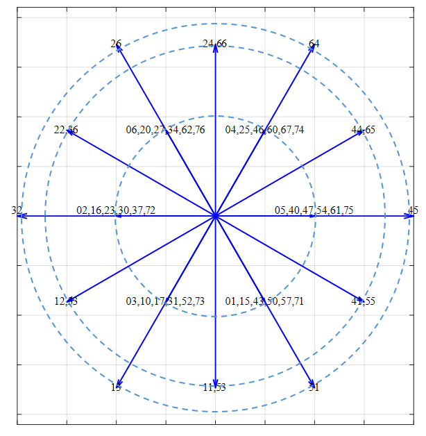

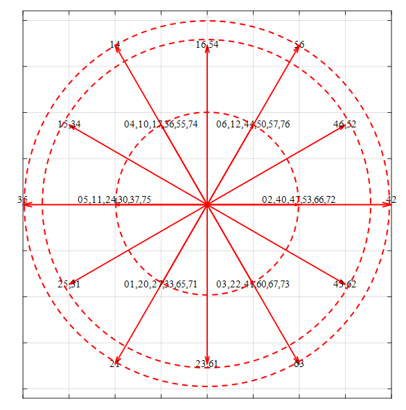

根据 $\alpha-\beta$ 空间内电压矢量的幅值可以将基本电压矢量可以分为大矢量(6个)、中矢量(12个)、小矢量(36个)。每一种矢量都可以构建出一个正六边形。幅值分别为：
$$
|\bold u_{max}| = \frac{2}{3}U_{dc} = 0.667U_{dc} \\
|\bold u_{mid}| = \frac{1}{\sqrt 3}U_{dc} = 0.577U_{dc} \\
|\bold u_{min}| = \frac{1}{3}U_{dc} = 0.333U_{dc} \\
$$

## 2. 双三相电机的 PWM 算法

### 两矢量方法

取幅值最大的 12 个电压矢量为基本电压矢量，方法和 SVPWM 类似。

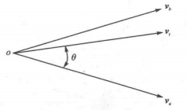
$$
t_a = \frac{|\bold u_r|}{|\bold u_{max}|\sin\frac{\pi}{6}}T_s\sin(\frac{\pi}{6}-\theta) \\
t_b = \frac{|\bold u_r|}{|\bold u_{max}|\sin\frac{\pi}{6}}T_s\sin\theta \\
t_0 = T_s-t_a-t_b
$$
第一扇区的波形如下：

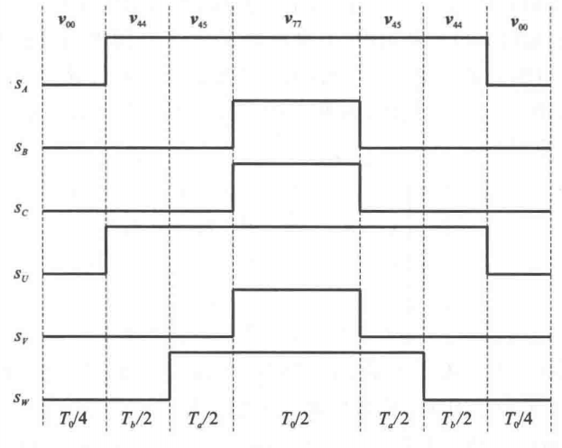

最大调制比：
$$
M_{max} = \frac{2}{\pi}\frac{|u_{max}|\cos\frac{\pi}{12}}{U_{dc}} = 0.977
$$

### 四矢量方法

在两矢量方法上增加两个基本电压矢量以抵消谐波子空间的电压作用效果。本质是解一个五元方程组：
$$
\begin{bmatrix}
u_{\alpha}^1 & u_{\alpha}^2 & u_{\alpha}^3 & u_{\alpha}^4 & u_{\alpha}^0 \\
u_{\beta}^1 & u_{\beta}^2 & u_{\beta}^3 & u_{\beta}^4 & u_{\beta}^0 \\
u_{x}^1 & u_{x}^2 & u_{x}^3 & u_{x}^4 & u_{x}^0 \\
u_{y}^1 & u_{y}^2 & u_{y}^3 & u_{y}^4 & u_{y}^0 \\
1 & 1 & 1 & 1 & 1 \\
\end{bmatrix}
\begin{bmatrix}
t_1 \\
t_2 \\
t_3 \\
t_4 \\
t_0 
\end{bmatrix}
=
\begin{bmatrix}
u_{\alpha}^* \\
u_{\beta}^* \\
0 \\
0 \\
1 
\end{bmatrix}T_s
$$
投影分量相等。其中 $t_k$ 是作用在第 $k$ 个电压矢量上的时间，$t_0$ 为零矢量作用时间，$u_{\alpha},u_{\beta},u_x,u_y$ 为电压矢量在各个轴上的投影，$T_s$ 为开关周期。

可以通过中间矢量的方法简化计算：用相邻的三个基本矢量合成新的矢量，这个矢量方向和最中间的基本矢量方向一致(两边的基本矢量作用时间相同时合成的电压矢量方向和中间基本矢量方向一致)，由此重新得到 12 个电压矢量。

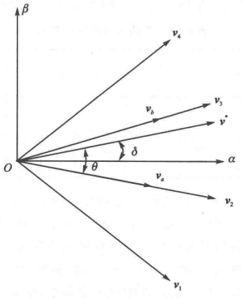

最后得到作用时间：
$$
T_1 = \frac{\sqrt{3}(\sqrt{3}-1)}{2\sqrt{2}U_{dc}} | u^* | T_s \sin \left( \frac{\pi}{6} - \theta \right) \\
T_2 = \frac{\sqrt{3}(\sqrt{3}-1)}{2\sqrt{2}U_{dc}} | u^* | T_s \left[ \sin \theta + \sqrt{3} \sin \left( \frac{\pi}{6} - \theta \right) \right] \\
T_3 = \frac{\sqrt{3}(\sqrt{3}-1)}{2\sqrt{2}U_{dc}} | u^* | T_s \left[ \sqrt{3} \sin \theta + \sin \left( \frac{\pi}{6} - \theta \right) \right] \\
T_4 = \frac{\sqrt{3}(\sqrt{3}-1)}{2\sqrt{2}U_{dc}} | u^* | T_s \sin \theta \\
T_0 = T_s - \frac{3+\sqrt{3}}{2\sqrt{2}U_{dc}} | u^* | T_s \left[ \sin \theta + \sin \left( \frac{\pi}{6} - \theta \right) \right]
$$
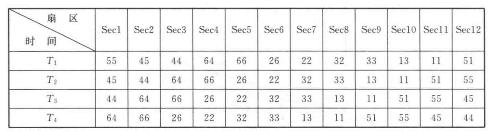

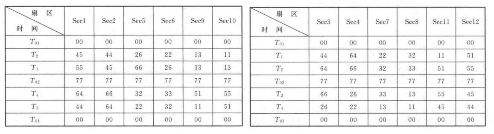

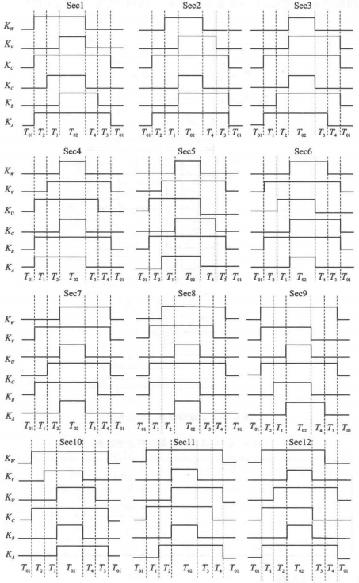

四矢量 SVPWM 生成的开关动作是不对称的，引入了更多的谐波含量。

### 三相解耦方法

双三相电机在两个子空间的电压矢量和每一套三相绕组电压矢量有对应关系：
$$
u_1 = u_{\alpha\beta} + u_{xy}^* \\
u_2 = e^{-j30\degree}(u_{\alpha\beta} - u_{xy}^*)
$$
此时可以分别对两套绕组进行 SVPWM 控制。令 $u_{xy}^* = 0$ 即可将谐波子空间的电压矢量控制为 0。

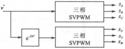

### 零序信号注入法

采用均值零序信号注入即可，实际上就是两套绕组分别使用 SVPWM。
$$
u_{o1} = -\frac{1}{2}(u_{max1}+u_{min1})\\
u_{o2} = -\frac{1}{2}(u_{max2}+u_{min2})
$$

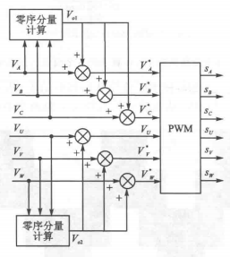
