# 磁通切换电机基本原理

> 参考文献：
>
> 1. 贾红云,程明,花为等.磁通切换永磁电机等效模型与控制策略分析[J].电机与控制学报,2009,13(05):631-637.
> 2. 赵桂书.磁通切换电机若干关键问题研究[D].东南大学,2019.

传统的永磁同步电机将在定子和转子上都有励磁(双边励磁)，如果将转子上的励磁去掉，将会形成单边励磁，称为定子永磁型电机，以下是最早提出的单相定子永磁型电机(1955,S.E.Rauch & L.J.Johnson)的结构：

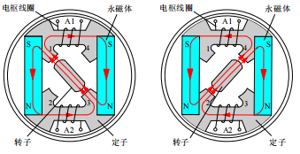

> 两块永磁体充磁方向相同，均匀分布于定子两侧，并将定子铁心分割成独立的两部分，每部分定子铁心包含两个凸极齿，凸极齿之间的定子轭部绕置有电枢线圈，转子为简单的凸极结构。
>
> 1. 转子运行到典型位置 1(左)时，转子凸极齿与定子齿 1、3 对齐，永磁磁通从左至右地穿过电枢线圈 $A_1$ 和 $A_2$，并经定子齿 3、转子齿、定子齿 1 闭合；
> 2. 转子运行到典型位置 2(右)时，转子凸极齿与定子齿 2、4 对齐，永磁磁通从右至左地穿过电枢线圈 $A_1$ 和 $A_2$，并经定子齿 2、转子齿、定子齿 4 闭合；
> 3. 随着转子位置改变，绕置于定子轭部的电枢线圈匝链的永磁磁链极性和大小也不断变化，变化的磁链会在线圈两端产生交变电动势。

随后提出了三种典型的定子永磁电机：双凸极电机 DSM(1992,Lipo)，磁通反向电机 FRM(1996,Boldea)，磁通切换电机 FSM(1997,E.Hoang)：

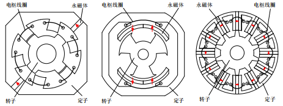

三种电机都是双凸极结构，永磁体和电枢绕组均置于定子，转子结构简单、既无励磁源又无绕组，电枢绕组均采用集中式线圈，绕组端部较短、用铜量少、铜耗小；三种电机都是依靠定子恒定励磁源经凸极转子调制后，使**电枢绕组中匝链的励磁磁链随转子位置变化而产生感应电势**，进而与电枢电流相互作用，产生电磁转矩。

> - DSM 结构的永磁体用量较少，单个电枢线圈匝链的磁链为单极性，电磁转矩较小，转矩脉动相对较大，三相 DSM 中两块永磁体之间有三个绕于定子齿上的电枢线圈，靠近永磁体的两个电枢线圈中穿过的磁通闭合回路相同，而与中间的电枢线圈中穿过的磁通闭合回路不同，导致三相电枢绕组特性不完全相同，影响了电机的电磁性能。
> - FRM 结构中充磁方向相反的两块永磁体表贴于一个定子齿面，增加了气隙的长度，影响电机出力，转矩密度较小；电枢反应磁通会直接穿过永磁体，存在发生不可逆退磁的风险。电枢绕组中的谐波电流会导致永磁体涡流损耗较大；同一定子齿表面贴装的两块永磁体极性相反，会导致部分磁路短路，降低了永磁材料利用率，减小了电机功率密度。
> - FSM 的空载反电动势正弦度高、效率高、转矩密度大、容错性能好、不易退磁、控制灵活。

- FSM 的磁通切换原理：**磁通总是沿着磁阻最小的路径闭合**。

  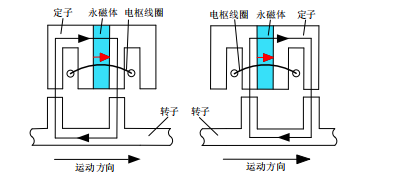

  随着电机转子位置的变化，电枢绕组中穿过的励磁磁通会同时改变大小和方向（极性）。一个转子齿距（对应一个电周期）内，励磁磁通会从最大变为最小、再变为最大，方向从穿出电枢绕组到穿入电枢绕组（或从穿入电枢绕组变为穿出绕组），随着转子位置变化，励磁磁通在穿出绕组与穿入绕组之间交替变化，即在电枢绕组中匝链交变的励磁磁链，进而产生交变感应电势。

- 传统 FSM 的结构

  传统的 FSM 包括永磁型、电励磁型和混合励磁型。

  经典的永磁 FSM 是 12/10 结构的：

  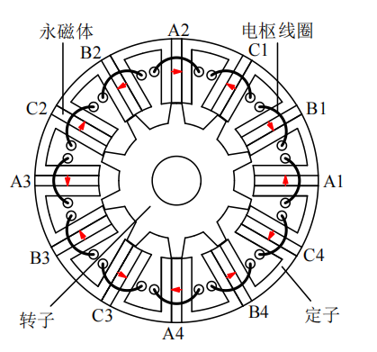

  可以替换为电励磁结构：

  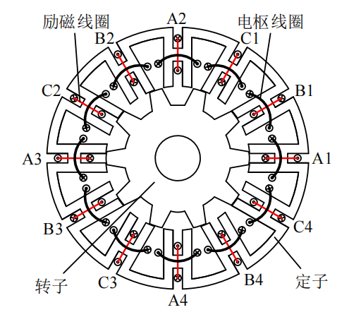

  或者做成混合励磁结构(永磁体顶置/中置/底置)：

  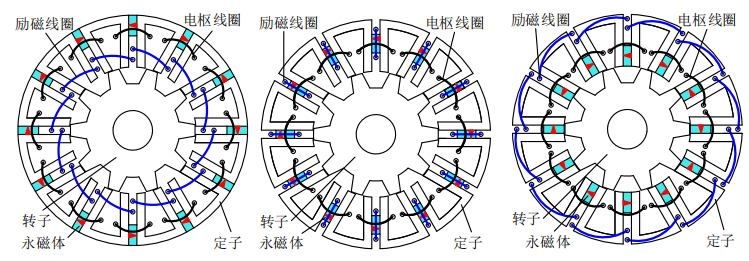
  
- 衍生的 FSM 结构(半齿绕/C 型铁心/E 型铁心/V 型铁心/多齿型铁心)

  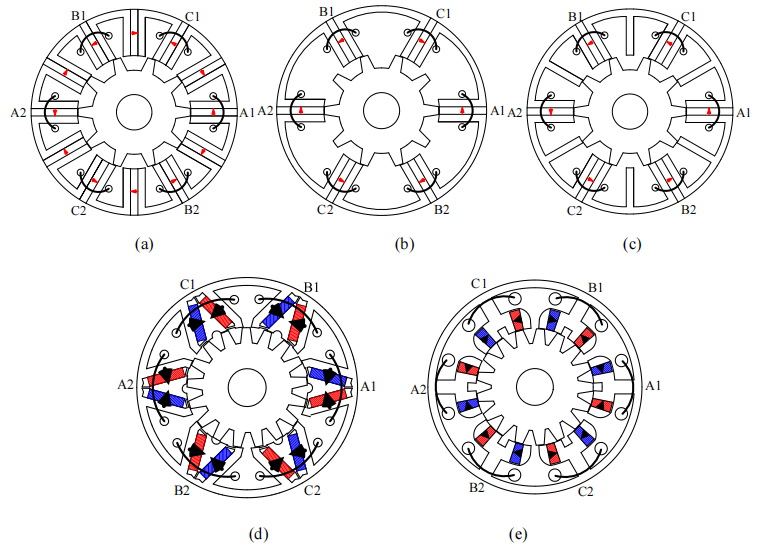

## 1. 磁通切换电机的基本原理

以经典的 12/10 三相 FSM 为例子：

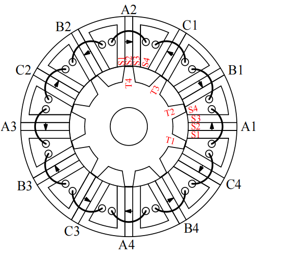

A 相绕组由线圈 $A_1$、$A_2$、$A_3$、$A_4$ 组成。线圈 $A_1$、$A_3$ 与转子齿的相对位置完全相同，线圈 $A_2$、$A_4$ 与转子齿的相对位置完全相同。接下来分析 1/4 电机模型：$\theta_r = 0\degree,9\degree,18\degree,27\degree$(10齿，对于一个电枢绕组的机械周期是 36°)。

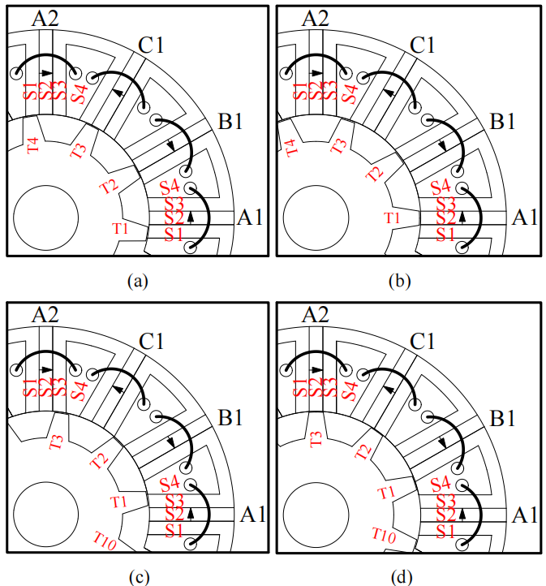

随着转子位置的变化，转子齿与电枢线圈重叠位置可用 $S_1$、$S_2$、$S_3$、$S_4$ 表示：

1. $\theta_r = 0\degree$ 时，$T_1,T_4$ 和 $S_1$ 对齐，A 相永磁磁链最大。
2. $\theta_r = 9\degree$ 时， $T_1$ 和 $S_2$ 对齐，$T_2$ 和 $S_4$ 对齐，A 相永磁磁链为 0。
3. $\theta_r = 18\degree$ 时，$T_1,T_4$ 和 $S_3$ 对齐，A 相永磁磁链反向最大。
4. $\theta_r = 27\degree$ 时， $T_1$ 和 $S_4$ 对齐，$T_2$ 和 $S_2$ 对齐，A 相永磁磁链为 0。

$A_1$ 和 $A_2$ 线圈和转子齿的重叠部分变化如下：

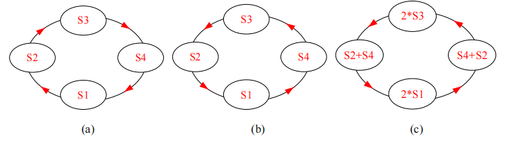

随着转子位置变化，两个线圈与转子齿重叠位置从同一位置开始、沿相反方向变化。对于每个独立线圈来讲，由于在重叠位置 $S_2$ 和 $S_4$ 的磁路不同，因此每个线圈匝链的永磁磁链波形不对称、进而产生了大量谐波，严重影响到电机的性能。为了避免这个问题，需要串联 $A_1$ 和 $A_2$ 线圈以使得谐波对消，$A_1$ 和 $A_2$​ 是一对互补线圈。FSM 齿槽配合设计时，只要将线圈组作为基本单元进行设计，就可以保证设计的 FSM 具有互补性，从而电机具有较小的转矩脉动。

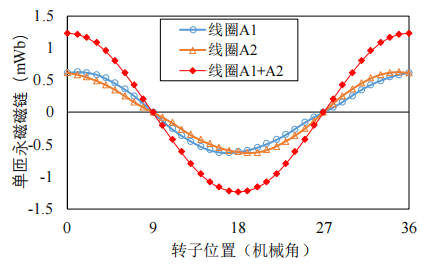

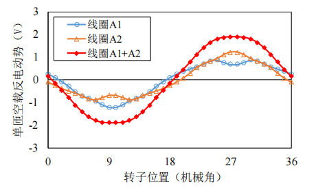

## 2. 磁通切换电机和永磁同步电机的控制等效性

12/10 三相 FSM 的永磁磁链分布如下：

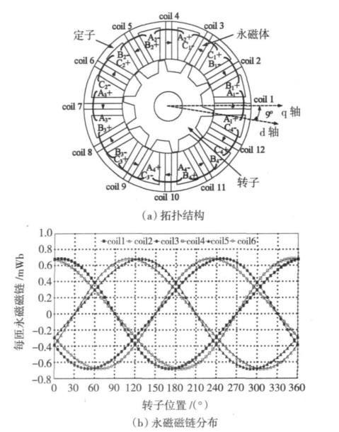

将 FSM 定子上的永磁体转换到转子上，可以得到等效的 PMSM，以 12/10 三相 FSM 为例子，可以转换为 12/20 三相 PMSM：

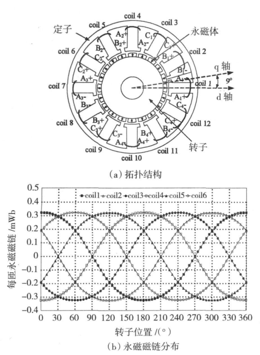

> 可以看到，实际上线圈 1 和线圈 4 在 FSM 中需要正串联，而在 PMSM 中需要反串联，其余都是等效的：
>
> 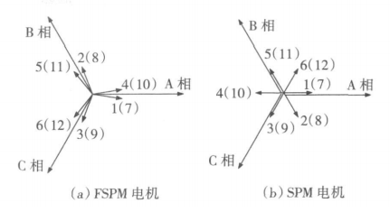
>
> 由此 FOC/DTC 等控制方法仍然适用。

