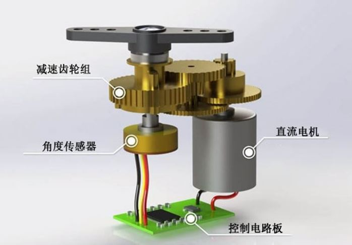
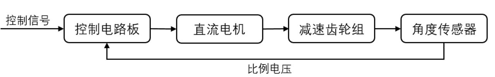
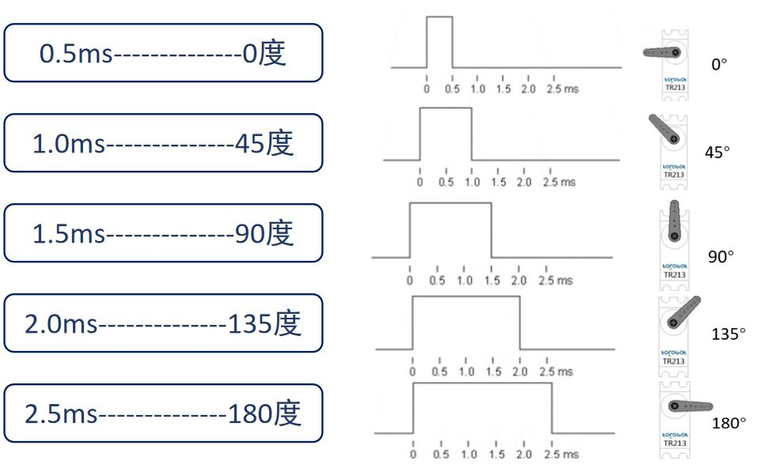

# STM32 电机驱动 3_舵机

# 1. 舵机

舵机（Servo）实际上可以看作一个伺服电机，服从控制信号的要求而动作，可以很好的掌握电机角度。

特点：体积小、力矩大、结构简单、稳定性高。

舵机主要由**直流电机、减速齿轮组、角度传感器、控制电路**构成。

舵机内部是一个闭环回路：

## 2. 舵机驱动方法
舵机一般需要**周期为20ms**的PWM信号来控制，该脉冲的高电平时间一般为**0.5ms-2.5ms**范围，相对应舵盘位置的0-180°。

舵机有三条输入线：

>红线：VCC
>
>棕线：GND
>
>橙线：信号线

