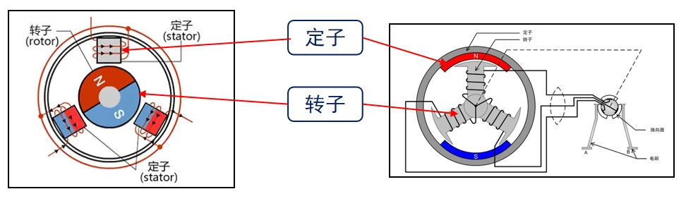
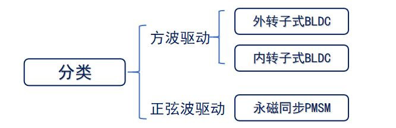
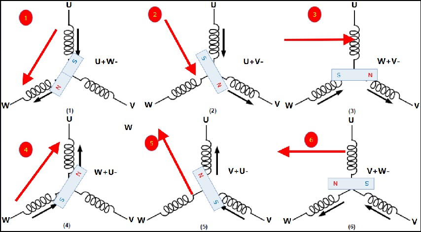
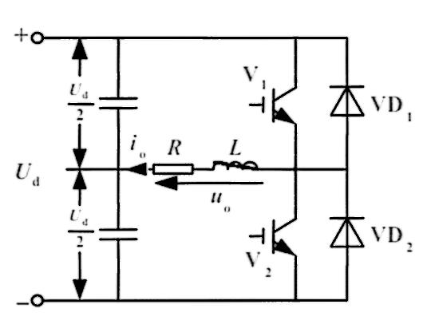
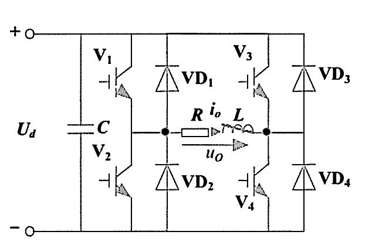
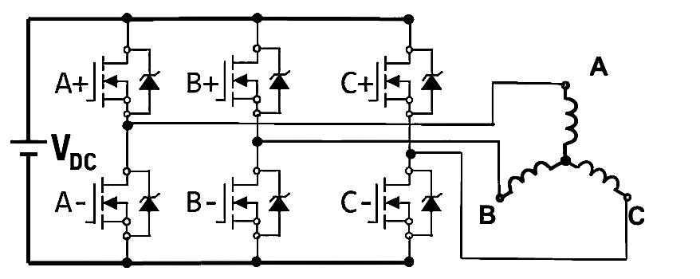
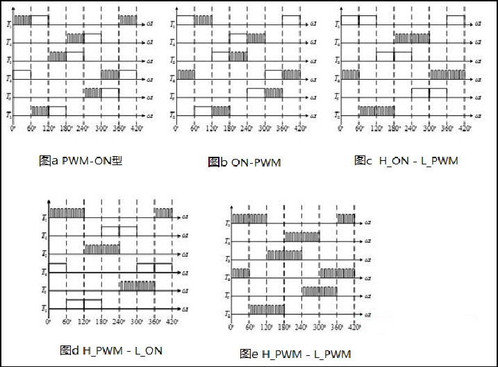
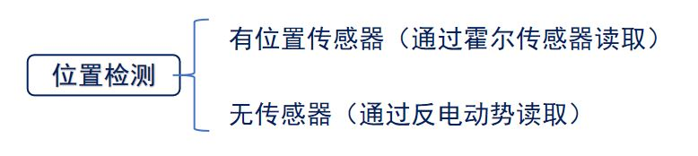
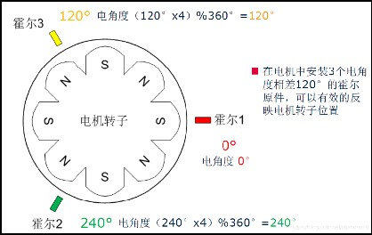
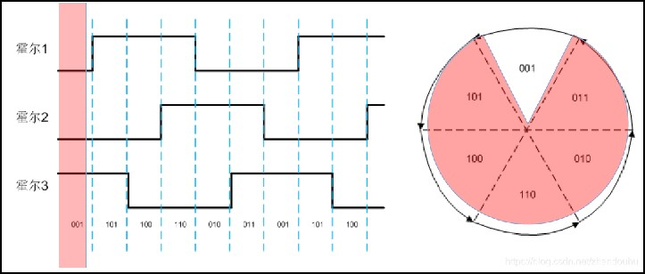

# STM32 电机驱动 4-1 直流无刷电机

[【自制FOC驱动器】深入浅出讲解FOC算法与SVPWM技术 - 知乎 (zhihu.com)](https://zhuanlan.zhihu.com/p/147659820)

[【直流无刷电机】BLDC六步换向法控制原理及Matlab/Simulink仿真分析 - 知乎 (zhihu.com)](https://zhuanlan.zhihu.com/p/609517326)

[56-直流无刷电机专题-第1讲 直流无刷电机的简介_哔哩哔哩_bilibili](https://www.bilibili.com/video/BV1hv4y1g7s3?p=56&vd_source=2d2507d13250e2545de99f3c552af296)

## 1. 直流无刷电机简介

直流无刷电机是无电刷和无换向器的电机。无刷直流电机的实质是**直流电源输入，采用电子逆变器将直流电转换为交流电**，有转子位置反馈的三相交流永磁同步电机。



### 直流无刷电机的分类



| **不同点** | **BLDC**                                 | **PMSM**                                 |
| ---------- | ---------------------------------------- | ---------------------------------------- |
| 反电动势   | 具有梯形反电动势                         | 具有正弦波反电动势                       |
| 运行电流   | 梯形波电流                               | 正弦波电流                               |
| 绕组方式   | 定子绕组为集中绕组，永磁转子形成方波磁场 | 定子绕组为分布绕组，永磁转子形成正弦磁场 |
| 控制方式   | 控制算法相对简单                         | 控制算法复杂                             |
| 运行方式   | 绕组两两导通                             | 绕组三相全部导通                         |

### 直流无刷电机的主要参数

1. 极对数：转子磁铁NS级的对数，此参数和电机旋转速度有关。
   $$
   转子速度 =  电机实际速度 \times 极对数
   $$

2. KV 值：

$$
电机转速 = KV \times 工作电压
$$

3. 额定转速：额定的电流下的空载转速，通常单位用RPM表示。
4. 转矩：电机中转子产生的可以带动机械负载的驱动力矩。

## 2. 直流无刷电机的硬件驱动

### 三相驱动原理

通常的，直流无刷电机会引出三根线作为电机驱动线，对应电机的三相定子，分别称为U，V，W。



> 通过矢量合成的方式确定电机方向：
>
> - 若U接24V，V悬空，W接GND，此时电机的转轴对应1的转子位置。
> - 若U接24V，V接GND，W悬空，此时电机的转轴对应2的转子位置。
> - 若U悬空，V接GND，W接24V，此时电机的转轴对应3的转子位置。
> - 若U接GND，V悬空，W接24V，此时电机的转轴对应4的转子位置。
> - 若U接GND，V接24V，W悬空，此时电机的转轴对应5的转子位置。
> - 若U悬空，V接24V，W接GND，此时电机的转轴对应6的转子位置。
>
> 在上述基础上进行循环即可驱动直流无刷电机。

### 逆变器电路（全桥和半桥驱动）

**逆变电路**，即把**直流电**变换为**交流电**的电路，在无刷电机电路中，通过逆变电路将直流电转换为交流电的三相电路，从而驱动直流无刷电机。

#### 半桥逆变电路



半桥电路由两个MOS管组成上桥臂和下桥臂，中间引出一条输出线，通过控制MOS管的栅极即可实现对输出的控制。

半桥电路由一个臂即可形成正负半波，每个逆变模块的臂和其他臂上的功率管不发生任何关系。

由三个相同的半桥电路即可实现三相半桥逆变电路。通常的会使用高频脉冲调制进行控制。

#### 全桥逆变电路



全桥电路可视为两个半桥电路的组合，1，4为一对桥臂；2，3为一对桥臂，成对的桥臂同时导通。每个逆变模块的臂和其他臂上的功率管同时导通，分时控制。

#### 半桥驱动器

通常使用半桥电路实现对无刷电机的驱动：



直接把电源加载到线圈上，会使电机很快升到很高的速度。一般将高低电平用PWM来代替，通过使得MOS快速通断达到将直流电源进行PWM调制，这样可以方便的控制线圈电流，从而控制转子扭矩及转速。

PWM有全桥调制和半桥调制两种调制方式，半桥调制只对一个桥臂进行PWM控制，另一个桥臂接高/低电平；全桥调制对两个桥臂进行PWM控制。由于使用PWM对MOSFET损耗较大，通常使用半桥调制方式（3路PWM输入）。



半桥调制分为对称和非对称型调制方式，对称型调制使用一段高电平和一段PWM进行调制，非对称型使用全PWM或全高电平调制半个桥臂。使用非对称调制可以很方便的使用PWM控制转速。

## 3. 直流无刷电机的霍尔传感器



霍尔传感器在N级指向时输出高电平，在S级指向时输出低电平。

在电机中安装3个电角度相差120°的霍尔传感器，可以有效反映转子位置。


$$
电角度 = 机械角度 \times 极对数
$$


- 真值表（不同电机有所不同）

|          | 霍尔3(C) | 霍尔2(B) | 霍尔1(A) | **U+** | **U-** | **V+** | **V-** | **W+** | **W-** | **通电情况** | **霍尔值** |
| -------- | -------- | -------- | -------- | ------ | ------ | ------ | ------ | ------ | ------ | ------------ | ---------- |
| **正转** | 1        | 0        | 1        | 打开   | 关闭   | 关闭   | 打开   | 关闭   | 关闭   | UH_VL        | 5          |
|          | 0        | 0        | 1        | 打开   | 关闭   | 关闭   | 关闭   | 关闭   | 打开   | UH_WL        | 1          |
|          | 0        | 1        | 1        | 关闭   | 关闭   | 打开   | 关闭   | 关闭   | 打开   | VH_WL        | 3          |
|          | 0        | 1        | 0        | 关闭   | 打开   | 打开   | 关闭   | 关闭   | 关闭   | VH_UL        | 2          |
|          | 1        | 1        | 0        | 关闭   | 打开   | 关闭   | 关闭   | 打开   | 关闭   | WH_UL        | 6          |
|          | 1        | 0        | 0        | 关闭   | 关闭   | 关闭   | 打开   | 打开   | 关闭   | WH_VL        | 4          |
| **反转** | 1        | 0        | 1        | 关闭   | 打开   | 打开   | 关闭   | 关闭   | 关闭   | VH_UL        | 5          |
|          | 0        | 0        | 1        | 关闭   | 打开   | 关闭   | 关闭   | 打开   | 关闭   | WH_UL        | 1          |
|          | 0        | 1        | 1        | 关闭   | 关闭   | 关闭   | 打开   | 打开   | 关闭   | WH_VL        | 3          |
|          | 0        | 1        | 0        | 打开   | 关闭   | 关闭   | 打开   | 关闭   | 关闭   | UH_VL        | 2          |
|          | 1        | 1        | 0        | 打开   | 关闭   | 关闭   | 关闭   | 关闭   | 打开   | UH_WL        | 6          |
|          | 1        | 0        | 0        | 关闭   | 关闭   | 打开   | 关闭   | 关闭   | 打开   | VH_WL        | 4          |

## 4. 直流无刷电机的开环驱动

### 半桥驱动方式

- 根据霍尔真值表设定输出：

```c
/**
 * @brief  U相上桥臂导通，V相下桥臂导通
 * @param  无
 * @retval 无
 */
static void UH_VL(void)
{
    __HAL_TIM_SET_COMPARE(MOTOR_HIGH_SIDE_TIMER_HANDLE, MOTOR_HIGH_SIDE_U_CHANNEL, motor.pwm_duty); /* U相上桥臂PWM */
    __HAL_TIM_SET_COMPARE(MOTOR_HIGH_SIDE_TIMER_HANDLE, MOTOR_HIGH_SIDE_V_CHANNEL, 0);
    __HAL_TIM_SET_COMPARE(MOTOR_HIGH_SIDE_TIMER_HANDLE, MOTOR_HIGH_SIDE_W_CHANNEL, 0);
    HAL_GPIO_WritePin(MOTOR_LOW_SIDE_U_PORT, MOTOR_LOW_SIDE_U_PIN, GPIO_PIN_RESET); /* U相下桥臂关闭 */
    HAL_GPIO_WritePin(MOTOR_LOW_SIDE_V_PORT, MOTOR_LOW_SIDE_V_PIN, GPIO_PIN_SET);   /* V相下桥臂导通 */
    HAL_GPIO_WritePin(MOTOR_LOW_SIDE_W_PORT, MOTOR_LOW_SIDE_W_PIN, GPIO_PIN_RESET); /* W相下桥臂关闭 */
}

/**
 * @brief  U相上桥臂导通，W相下桥臂导通
 * @param  无
 * @retval 无
 */
static void UH_WL(void)
{
    __HAL_TIM_SET_COMPARE(MOTOR_HIGH_SIDE_TIMER_HANDLE, MOTOR_HIGH_SIDE_U_CHANNEL, motor.pwm_duty); /* U相上桥臂PWM */
    __HAL_TIM_SET_COMPARE(MOTOR_HIGH_SIDE_TIMER_HANDLE, MOTOR_HIGH_SIDE_V_CHANNEL, 0);
    __HAL_TIM_SET_COMPARE(MOTOR_HIGH_SIDE_TIMER_HANDLE, MOTOR_HIGH_SIDE_W_CHANNEL, 0);
    HAL_GPIO_WritePin(MOTOR_LOW_SIDE_U_PORT, MOTOR_LOW_SIDE_U_PIN, GPIO_PIN_RESET); /* U相下桥臂关闭 */
    HAL_GPIO_WritePin(MOTOR_LOW_SIDE_V_PORT, MOTOR_LOW_SIDE_V_PIN, GPIO_PIN_RESET); /* V相下桥臂关闭 */
    HAL_GPIO_WritePin(MOTOR_LOW_SIDE_W_PORT, MOTOR_LOW_SIDE_W_PIN, GPIO_PIN_SET);   /* W相下桥臂导通 */
}

/**
 * @brief  V相上桥臂导通，W相下桥臂导通
 * @param  无
 * @retval 无
 */
static void VH_WL(void)
{
    __HAL_TIM_SET_COMPARE(MOTOR_HIGH_SIDE_TIMER_HANDLE, MOTOR_HIGH_SIDE_V_CHANNEL, motor.pwm_duty); /* V相上桥臂PWM */
    __HAL_TIM_SET_COMPARE(MOTOR_HIGH_SIDE_TIMER_HANDLE, MOTOR_HIGH_SIDE_U_CHANNEL, 0);
    __HAL_TIM_SET_COMPARE(MOTOR_HIGH_SIDE_TIMER_HANDLE, MOTOR_HIGH_SIDE_W_CHANNEL, 0);
    HAL_GPIO_WritePin(MOTOR_LOW_SIDE_U_PORT, MOTOR_LOW_SIDE_U_PIN, GPIO_PIN_RESET); /* U相下桥臂关闭 */
    HAL_GPIO_WritePin(MOTOR_LOW_SIDE_V_PORT, MOTOR_LOW_SIDE_V_PIN, GPIO_PIN_RESET); /* V相下桥臂关闭 */
    HAL_GPIO_WritePin(MOTOR_LOW_SIDE_W_PORT, MOTOR_LOW_SIDE_W_PIN, GPIO_PIN_SET);   /* W相下桥臂导通 */
}

/**
 * @brief  V相上桥臂导通，U相下桥臂导通
 * @param  无
 * @retval 无
 */
static void VH_UL(void)
{
    __HAL_TIM_SET_COMPARE(MOTOR_HIGH_SIDE_TIMER_HANDLE, MOTOR_HIGH_SIDE_V_CHANNEL, motor.pwm_duty); /* V相上桥臂PWM */
    __HAL_TIM_SET_COMPARE(MOTOR_HIGH_SIDE_TIMER_HANDLE, MOTOR_HIGH_SIDE_U_CHANNEL, 0);
    __HAL_TIM_SET_COMPARE(MOTOR_HIGH_SIDE_TIMER_HANDLE, MOTOR_HIGH_SIDE_W_CHANNEL, 0);
    HAL_GPIO_WritePin(MOTOR_LOW_SIDE_U_PORT, MOTOR_LOW_SIDE_U_PIN, GPIO_PIN_SET);   /* U相下桥臂导通 */
    HAL_GPIO_WritePin(MOTOR_LOW_SIDE_V_PORT, MOTOR_LOW_SIDE_V_PIN, GPIO_PIN_RESET); /* V相下桥臂关闭 */
    HAL_GPIO_WritePin(MOTOR_LOW_SIDE_W_PORT, MOTOR_LOW_SIDE_W_PIN, GPIO_PIN_RESET); /* W相下桥臂关闭 */
}

/**
 * @brief  W相上桥臂导通，U相下桥臂导通
 * @param  无
 * @retval 无
 */
static void WH_UL(void)
{
    __HAL_TIM_SET_COMPARE(MOTOR_HIGH_SIDE_TIMER_HANDLE, MOTOR_HIGH_SIDE_W_CHANNEL, motor.pwm_duty); /* W相上桥臂PWM */
    __HAL_TIM_SET_COMPARE(MOTOR_HIGH_SIDE_TIMER_HANDLE, MOTOR_HIGH_SIDE_U_CHANNEL, 0);
    __HAL_TIM_SET_COMPARE(MOTOR_HIGH_SIDE_TIMER_HANDLE, MOTOR_HIGH_SIDE_V_CHANNEL, 0);
    HAL_GPIO_WritePin(MOTOR_LOW_SIDE_U_PORT, MOTOR_LOW_SIDE_U_PIN, GPIO_PIN_SET);   /* U相下桥臂导通 */
    HAL_GPIO_WritePin(MOTOR_LOW_SIDE_V_PORT, MOTOR_LOW_SIDE_V_PIN, GPIO_PIN_RESET); /* V相下桥臂关闭 */
    HAL_GPIO_WritePin(MOTOR_LOW_SIDE_W_PORT, MOTOR_LOW_SIDE_W_PIN, GPIO_PIN_RESET); /* W相下桥臂关闭 */
}

/**
 * @brief  W相上桥臂导通，V相下桥臂导通
 * @param  无
 * @retval 无
 */
static void WH_VL(void)
{
    __HAL_TIM_SET_COMPARE(MOTOR_HIGH_SIDE_TIMER_HANDLE, MOTOR_HIGH_SIDE_W_CHANNEL, motor.pwm_duty); /* W相上桥臂PWM */
    __HAL_TIM_SET_COMPARE(MOTOR_HIGH_SIDE_TIMER_HANDLE, MOTOR_HIGH_SIDE_U_CHANNEL, 0);
    __HAL_TIM_SET_COMPARE(MOTOR_HIGH_SIDE_TIMER_HANDLE, MOTOR_HIGH_SIDE_V_CHANNEL, 0);
    HAL_GPIO_WritePin(MOTOR_LOW_SIDE_U_PORT, MOTOR_LOW_SIDE_U_PIN, GPIO_PIN_RESET); /* U相下桥臂关闭 */
    HAL_GPIO_WritePin(MOTOR_LOW_SIDE_V_PORT, MOTOR_LOW_SIDE_V_PIN, GPIO_PIN_SET);   /* V相下桥臂导通 */
    HAL_GPIO_WritePin(MOTOR_LOW_SIDE_W_PORT, MOTOR_LOW_SIDE_W_PIN, GPIO_PIN_RESET); /* W相下桥臂关闭 */
}
```

- 采样定时器进行状态检测，给出步进：

```c
void HAL_TIM_PeriodElapsedCallback(TIM_HandleTypeDef *htim)
{
    if (htim->Instance == SAMPLE_TIMER) {
        if (motor.run_flag == RUN) {
            if (motor.dir == CW) /* 正转 */
            {
                motor.step_sta = HALL_Get_State(); /* 顺序6,2,3,1,5,4 */
            } else                                 /* 反转 */
            {
                motor.step_sta = 7 - HALL_Get_State(); /* 顺序5,1,3,2,6,4 。使用7减完后可与数组pfunclist_m1对应上顺序 实际霍尔值为：2,6,4,5,1,3*/
            }

            if ((motor.step_sta <= 6) && (motor.step_sta >= 1)) /* 判断霍尔组合值是否正常 */
            {
                pfunclist[motor.step_sta - 1](); /* 通过数组成员查找对应的函数指针 */

            } else /* 霍尔传感器错误、接触不良、断开等情况 */
            {
                BLDC_Motor_Stop();
                motor.run_flag = STOP;
            }
        }
    }
}
```

### 


