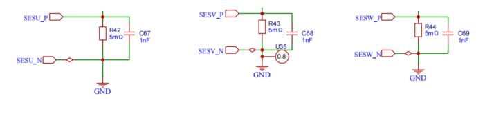
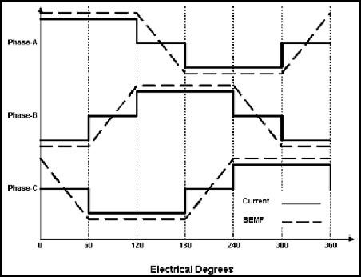

# STM32 电机驱动 4-2 BLDC电机闭环驱动

## 1. 电压电流采样

### ADC（电源电压采样）

首先使用规则组进行电源的电压采样，见STM32_Basic的ADC篇即可。

**注入组用于采集相电流，规则组为其他ADC通道转换**。

### OPAMP 内置运算放大器 + ADC（三相电流采样）

STM32G4 系列内置运算放大器可以用于模拟信号的放大。使用`HAL_OPAMP_Start()`打开运放，运放可以配合ADC进行使用。




> - 1.5kΩ 电阻是为了输入的正向端和负向端输入阻抗匹配；
> - 22kΩ 为分压电阻，作用是将输入正向端电压正向偏置 1.65V；
> - 11kΩ 为负反馈电路。
>
> 电流计算公式：
> $$
> I_{in} = \frac{ADC\_Value \times 3.3}{4096 \times R_{42} \times (1+\frac{R_{56}}{R_{59}})}
> $$
>
> ```c
> void HAL_ADCEx_InjectedConvCpltCallback(ADC_HandleTypeDef *hadc)
> {
>     if (hadc == &hadc1) {
>         temp[2] = hadc1.Instance->JDR1;
>         temp[2] = (temp[2] - 0x7ef) * 0.0193359375f; // 0.193359375为运放增益，7ef，7f5，7e8为运放直流偏置
>         temp[3] = hadc1.Instance->JDR2;
>         temp[3] = (temp[3] - 0x7f5) * 0.0193359375f;
>     } else if (hadc == &hadc2) {
>         temp[4] = hadc2.Instance->JDR1;
>         temp[4] = (temp[4] - 0x7e8) * 0.0193359375f;
>     }
> }
> ```

## 2. BLDC 电机有感测速原理和速度闭环驱动

### 霍尔传感器测速原理

1. 当只有一对级时，旋转一圈霍尔输出一个完整脉冲（一N一S）。（50%占空比方波）

2. 计算高电平的持续时间：

$$
t = \frac{C}{f_t}
$$

$f_t$为计数频率，$C$为计数值。

3. 旋转一圈时间：

$$
T = \frac{2C}{f_t}
$$


```c
void HAL_TIM_PeriodElapsedCallback(TIM_HandleTypeDef *htim)
{
    int16_t speed    = 0; /* 临时速度存储 */
    uint8_t bldc_dir = 0; /* 方向 */
    if (htim->Instance == SAMPLE_TIMER) {
        // 六步换相
        if (motor.run_flag == RUN) {
            if (motor.dir == CW) /* 正转 */
            {
                motor.step_sta = HALL_Get_State(); /* 顺序6,2,3,1,5,4 */
            } else                                 /* 反转 */
            {
                motor.step_sta = 7 - HALL_Get_State(); /* 顺序5,1,3,2,6,4 。使用7减完后可与数组pfunclist_m1对应上顺序 实际霍尔值为：2,6,4,5,1,3*/
            }

            if ((motor.step_sta <= 6) && (motor.step_sta >= 1)) /* 判断霍尔组合值是否正常 */
            {
                pfunclist[motor.step_sta - 1](); /* 通过数组成员查找对应的函数指针 */

            } else /* 霍尔传感器错误、接触不良、断开等情况 */
            {
                BLDC_Motor_Stop();
                motor.run_flag = STOP;
            }
        }
        // 速度计算
        motor.count_j++;                                        /* 计算速度专用计数值 */
        motor.hall_sta_edge = HALL_Edge(motor.hall_single_sta); /* 检测单个霍尔信号的变化 */
        if (motor.hall_sta_edge == 0)                           /* 统计单个霍尔信号的高电平时间，当只有一对级的时候，旋转一圈为一个完整脉冲。一高一低相加即旋转一圈所花的时间*/
        {
            /*计算速度*/
            if (motor.dir == CW)
                speed = (SPEED_COEFF / motor.count_j);
            else
                speed = -(SPEED_COEFF / motor.count_j);
            FirstOrderRC_LPF(motor.speed, speed, 0.2379f); /* 一阶滤波 */
            motor.no_single = 0;
            motor.count_j   = 0;
        }
        if (motor.hall_sta_edge == 1) /* 当采集到下降沿时数据清0 */
        {
            motor.no_single = 0;
            motor.count_j   = 0;
        }
        if (motor.hall_sta_edge == 2) /* 霍尔值一直不变代表未换向 */
        {
            motor.no_single++; /* 不换相时间累计 超时则判定速度为0 */

            if (motor.no_single > 15000) {

                motor.no_single = 0;
                motor.speed     = 0; /* 超时换向 判定为停止 速度为0 */
            }
        }
        // 位置记录
        if (motor.step_last != motor.step_sta) {
            bldc_dir = HALL_Check_Dir(&motor);
            if (bldc_dir == CCW) {
                motor.pos -= 1;
            } else if (bldc_dir == CW) {
                motor.pos += 1;
            }
            motor.step_last = motor.step_sta;
        }
        // PID 控制
        temp_pwm = PID_Cal(&speed_pid, motor.speed);    /* PID控制算法，输出期望值 */
        FirstOrderRC_LPF(motor_pwm_s, temp_pwm, 0.085); /* 一阶滤波 */
        if (motor_pwm_s < -47999) {
            motor_pwm_s = -47999;
        }
        if (motor_pwm_s > 47999) {
            motor_pwm_s = 47999;
        }
        if (motor_pwm_s < 0) /* 判断正负值 */
        {
            motor.pwm_duty = -motor_pwm_s;
        } else {
            motor.pwm_duty = motor_pwm_s;
        }
    }
}
```

## 3. BLDC 电机无感测速原理

无感驱动：通过过零信号的组合判断转子当前位置。

| **驱动方式** | **优点**                                                     | **缺点**                                                     |
| ------------ | ------------------------------------------------------------ | ------------------------------------------------------------ |
| 有感驱动     | 内装有霍尔传感器，能够检测到转子的位置，启动平稳；电机支持0速度启动 | 成本相对较高，有霍尔，体积大；8根引脚线、安装麻烦；位置传感器在多尘、潮湿环境干扰大 |
| 无感驱动     | 不需要传感器、成本低、只需3根引脚线、体积小；寿命和可靠性更长，因为没有霍尔可以损坏 | 启动不流畅，因低速或转子静止时，反电动势过小、检测不到过零点；这是所有反电动势法的共同缺点 |

过零点：反电点势从正变化为负或者从负变化为正的点；反电动势过零点都发生在不通电的那一相。

- 电机旋转一个电周期中电流和反电动势的波形如下：



> - 第一个 60°内，A相电流为正，B相电流为负，C相电流为零，这说明电机AB相通电，电流从A相流入B相，C相为开路，反电动势的过零点正好出现在C相，因此只要在每个60°内检测不通电那一相的电压，即可检测反电动势过零点。
> - 检测出反电动势的过零点，将其延迟 30°，即为需要换相的时刻。

|          | ZERO_W | ZERO_V | ZERO_U | **U+** | **U-** | **V+** | **V-** | **W+** | **W-** | **通电情况** | **过零值** |
| -------- | ------ | ------ | ------ | ------ | ------ | ------ | ------ | ------ | ------ | ------------ | ---------- |
| **正转** | 0      | 0      | 1      | 打开   | 关闭   | 关闭   | 打开   | 关闭   | 关闭   | UH_VL        | 1          |
| 0        | 1      | 1      | 打开   | 关闭   | 关闭   | 关闭   | 关闭   | 打开   | UH_WL  | 3            |            |
| 0        | 1      | 0      | 关闭   | 关闭   | 打开   | 关闭   | 关闭   | 打开   | VH_WL  | 2            |            |
| 1        | 1      | 0      | 关闭   | 打开   | 打开   | 关闭   | 关闭   | 关闭   | VH_UL  | 6            |            |
| 1        | 0      | 0      | 关闭   | 打开   | 关闭   | 关闭   | 打开   | 关闭   | WH_UL  | 4            |            |
| 1        | 0      | 1      | 关闭   | 关闭   | 关闭   | 打开   | 打开   | 关闭   | WH_VL  | 5            |            |
| **反转** | 0      | 1      | 0      | 关闭   | 打开   | 打开   | 关闭   | 关闭   | 关闭   | VH_UL        | 2          |
| 1        | 1      | 0      | 关闭   | 打开   | 关闭   | 关闭   | 打开   | 关闭   | WH_UL  | 6            |            |
| 1        | 0      | 0      | 关闭   | 关闭   | 关闭   | 打开   | 打开   | 关闭   | WH_VL  | 4            |            |
| 1        | 0      | 1      | 打开   | 关闭   | 关闭   | 打开   | 关闭   | 关闭   | UH_VL  | 5            |            |
| 0        | 0      | 1      | 打开   | 关闭   | 关闭   | 关闭   | 关闭   | 打开   | UH_WL  | 1            |            |
| 0        | 1      | 1      | 关闭   | 关闭   | 打开   | 关闭   | 关闭   | 打开   | VH_WL  | 3            |            |
