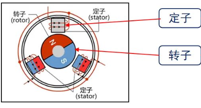
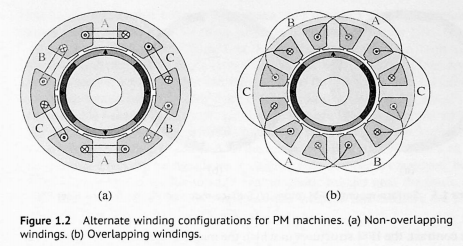
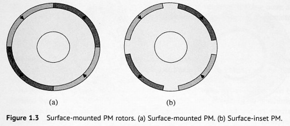
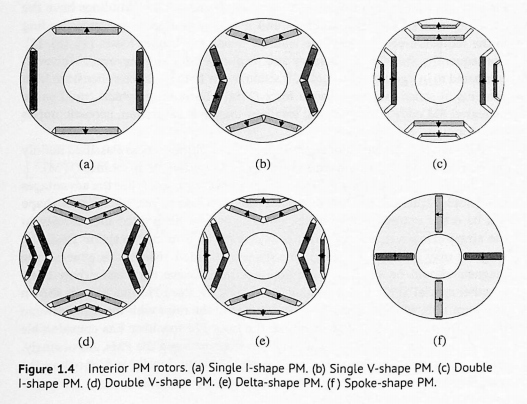

# Engine 4.1_永磁同步电机简介

## 1. 交流电机简介

交流电机，是用交流电驱动的电机。交流电机分为**同步电机**和**异步电机(感应电机)**两种。

***异步电机***：通过流入三相定子绕组的三相电流产生气隙旋转磁场，通过电磁感应原理，在转子绕组内产生感生电动势和电流，再由气隙磁场和转子感应电流相互作用产生电磁转矩，从而实现电机的转动。考虑到产生电磁力矩总是延迟于向定子内通电，所以电机的旋转频率总是比定子旋转磁场旋转频率低，称为异步电机。异步电机的调速性能较差，所以在机器人运动控制中是不常用的。

***同步电机***：通过流入三相定子绕组的三相电流产生气隙旋转磁场，但是此时的转子存在直流励磁或者为永磁体，使得转子立刻随着定子的气隙旋转磁场运动，转子的旋转频率和定子旋转磁场的旋转频率一致，称为同步电机。考虑到同步电机基本上无转差率，调速性能较好，在机器人控制中较为常用，关节电机，云台电机，航模/滑板电机基本上都是同步电机。

---

本笔记讨论的均为永磁同步电机，此时转子为永磁体，无需直流励磁。定子为三相交流电输入产生旋转磁场带动转子运动。

- 按照转子贴装方式分类，PMSM 分为外转子式PMSM和内转子式PMSM。

- 按照定子绕组方式分类，PMSM 分为集中式绕组和分布式绕组。

- 按照永磁体在铁心中的位置分类，PMSM分为表贴式PMSM(SPMSM)和内置式PMSM(IPMSM)。

SPMSM为隐极机，凸极效应不明显。

IPMSM为凸极机，凸极效应明显。

- 按照感应电动势的波形分类，永磁同步电机分为**永磁同步电机(PMSM，感应电动势为正弦波)**，**直流无刷电机(BLDC，感应电动势为梯形波)**。二者的区别在于永磁体的安装方式不同，产生的反电动势不同，这里不做过多讨论。

| **不同点** | **BLDC**                                 | **PMSM**                                 |
| ---------- | ---------------------------------------- | ---------------------------------------- |
| 反电动势   | 具有梯形反电动势                         | 具有正弦波反电动势                       |
| 运行电流   | 梯形波电流                               | 正弦波电流                               |
| 绕组方式   | 定子绕组为集中绕组，永磁转子形成方波磁场 | 定子绕组为分布绕组，永磁转子形成正弦磁场 |
| 控制方式   | 控制算法相对简单                         | 控制算法复杂                             |
| 运行方式   | 绕组两两导通                             | 绕组三相全部导通                         |

- PMSM 和 BLDC 的主要参数

> 1. 极对数$p$：转子永磁体NS级的对数，此参数和电机旋转速度有关。$ 转子速度 = 电机实际速度 \times 极对数 $
> 2. KV值：$电机转速 = KV \times 工作电压$。
> 3. 额定转速：额定的电流下的空载转速，通常单位用RPM表示。
> 4. 转矩：电机中转子产生的可以带动机械负载的驱动力矩。
