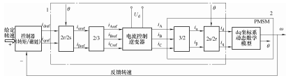
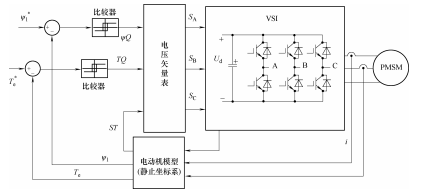

# Engine 2_永磁同步电机模型建立

## 1. 三相交流电机基本理论

### 交流电机的电动势

假设气隙磁场为正弦分布，

当转子恒速旋转时，定子产生的感应电动势是正弦变化的交流电动势（假想定子不动，定子表面的磁场由于转子的转动从而正弦变化）。

假设定子旋转的电角速度为$\omega_e$，则单个线圈边产生的感应电动势为 $e_1 = B_mlvsin\omega_et = \sqrt{2}E_1sin\omega_et$ ，考虑到机械速度和电角速度的换算关系为 $v = \pi D_i \cdot \frac{n}{60} = 2 \tau f$，$D_i$ 为定子绕组的直径， $\tau$ 为极距， $\tau = \frac{\pi D_i}{2p}$ ，则得到单个线圈边产生的感应电动势有效值 $ E_1 = \sqrt{2}fB_m\tau l$。

一个极下的平均磁感应强度为 $B_{av} = \frac{2}{\pi}B_m$ ，平均磁通量为 $\Phi_1 = \frac{2}{\pi}B_m\tau l$，则 $ E_1 = 2.22f\Phi_1 $。

考虑到线圈有的为整距线圈，有的为短距线圈：

所以单个线圈的感应电动势有效值为 $E_{c1} = 4.44fk_{p1}\Phi_1$， $ k_{p1} $ 为线圈基波节距因数，$k_{p1} \leq 1$ （整距线圈为1，短距线圈小于1）。

再考虑到同步电机的定子绕组通常采用分布绕组（不是通过三个三相线圈产生磁场，而是由多个线圈构成一相，由分布在电枢表面的线圈共同产生磁场），每个线圈之间的电动势相差电角度为 $\alpha$ ，则每一相绕组的电动势为 $E_{q1} = qE_{c1}k_{d1}$， $q$ 为每极每相槽数（即每极每相线圈数），$ k_{d1} $ 为基波分布因数。 

所以单相相电动势为正弦电动势，有效值为 $ E_{\Phi 1} = 4.44fNk_{p1}k_{d1}\Phi_1$ 。 

如果气隙磁场非正弦分布，谐波磁场也会随着转子的转动旋转，产生谐波电动势，对于星形绕组，不会产生三次谐波。

### 交流电机的磁动势

考虑定子通入三相电的情况。

首先分析单相绕组通入正弦电流产生的磁动势。

通过安培环路定理，可以得到磁场分布沿线圈轴线对称，气隙内的磁动势分布为矩形波（短距绕组产生的仍为矩形波，但是不对称），通过 Fourier 级数分解可以得到单个线圈的基波磁动势 $ f_{c1} = \frac{4}{\pi} \frac{N_ci_c}{2} k_{p1} cos\theta_e $。

对于分布绕组，和电动势的分析同理，分布绕组产生的气隙磁动势的基波分布为 $  f_{q1} = \frac{4}{\pi} \frac{N_ci_c}{2} k_{p1}k_{d1} cos\theta_e $ 。

当绕组通入正弦电流时，基波磁动势在空间上按照 $\theta_e$ 余弦分布，同时按照 $\omega t$ 向前旋转。

三相绕组通入三相电流时，合成的基波磁动势幅值为单相基波磁动势幅值的 $\frac{3}{2}$ ，在空间上按照 $\theta_e$ 余弦分布，同时按照 $\omega t$ 向前旋转。当一相达到幅值时，磁动势方向指向该相线圈轴线。

## 2. PMSM 数学模型建模

### 电压方程

[参考资料1](https://blog.csdn.net/weixin_48720266/article/details/133626883)

[参考资料2](https://www.bilibili.com/video/BV1Rs4y1Z7Hj/?spm_id_from=333.337.search-card.all.click&vd_source=2d2507d13250e2545de99f3c552af296)

首先建立三相坐标系，注意由于安培环路定理，每一相的轴线垂直于对应线圈。

首先对A，B，C三相列电压方程：
$$
\left\{
\begin{aligned}
u_a = R_si_a + \frac{d}{dt}\Psi_a \\
u_b = R_si_b + \frac{d}{dt}\Psi_b \\
u_c = R_si_c + \frac{d}{dt}\Psi_c \\
\end{aligned}
\right.
$$
$ R_s $为定子绕组的相电组，$ u_a,u_b,u_c $ 为定子三相电压，$i_a,i_b,i_c$ 为定子三相电流，$\Psi_a,\Psi_b,\Psi_c$ 为和定子线圈交链的磁链（电磁感应定律）。

每相磁链由两个独立的磁链提供：转子的励磁磁链和定子磁链，故磁链表示为
$$
\begin{bmatrix}
\Psi_a \\
\Psi_b \\
\Psi_c \\
\end{bmatrix} =
\begin{bmatrix}
L_{aa} & M_{ab} & M_{ac} \\
M_{ba} & L_{bb} & M_{bc} \\
M_{ca} & M_{cb} & L_{cc} \\
\end{bmatrix}
\begin{bmatrix}
i_a \\
i_b \\
i_c \\
\end{bmatrix}
+ \Psi_m
\begin{bmatrix}
cos \theta_e \\
cos (\theta_e-\frac{2\pi}{3}) \\
cos (\theta_e+\frac{2\pi}{3}) \\
\end{bmatrix}
$$
前一项为定子磁链，包括定子绕组自感和其他两相绕组和本相绕组的互感。后一项为转子定子磁链。

> **定子自感推导**：采用双反应理论，由于PMSM大多数为凸极结构，直轴和交轴处的气隙宽度不同导致气隙磁导不同，将磁动势分解为直轴（d轴，转子磁极轴线）和交轴（q轴，转子磁极轴线垂线，超前电角度90度）磁动势后分别求取各自作用。
>
> A 相产生的磁动势沿 A 相轴线，在直轴和交轴分量为：
> $$
> \left\{
> \begin{aligned}
> f_{ad} = Ni_acos\theta_e \\
> f_{aq} = -Ni_asin\theta_e \\
> \end{aligned}
> \right.
> $$
> 由磁路欧姆定律，在 A 相的磁链为：
> $$
> \left\{
> \begin{aligned}
> \Psi_{aad} = kN\frac{f_{ad}}{R_{md}}cos\theta_e \\
> \Psi_{aaq} = -kN\frac{f_{aq}}{R_{mq}}sin\theta_e
> \end{aligned}
> \right.
> $$
> $ k $为基波绕组系数。
>
> 故 A 相自感为：
> $$
> L_{aa} 
> &= \frac{kN^2}{R_{md}}cos^2\theta_e + \frac{kN^2}{R_{mq}}sin^2\theta_e \\
> &= P_dcos^2\theta_e + P_qsin^2\theta_e \\
> &= P_d - (P_d - P_q)sin^2\theta_e \\
> &= \frac{P_d+P_q}{2} + \frac{P_d-P_q}{2}cos(2\theta_e) \\
> &= L_1 + L_2cos(2\theta_e)
> $$

> **定子互感推导**：仍然采用双反应理论方式
>
> AB 相互感为：
> $$
> M_{ab} 
> &= P_dcos\theta_ecos(\theta_e - \frac{2\pi}{3}) + P_qsin\theta_esin(\theta_e - \frac{2\pi}{3})\\
> &= -\frac{1}{2}L_1 + L_2cos(2\theta_e - \frac{2\pi}{3})
> $$
> 

定子电感矩阵为：
$$
\begin{bmatrix}
L_{aa} & M_{ab} & M_{ac} \\
M_{ba} & L_{bb} & M_{bc} \\
M_{ca} & M_{cb} & L_{cc} \\
\end{bmatrix} 
=
\begin{bmatrix}
L_1 + L_2cos2\theta_e & -\frac{1}{2}L_1 + L_2cos(2\theta_e-\frac{2\pi}{3}) & -\frac{1}{2}L_1 + L_2cos(2\theta_e+\frac{2\pi}{3}) \\
-\frac{1}{2}L_1 + L_2cos(2\theta_e-\frac{2\pi}{3}) & L_1 + L_2cos(2\theta_e+\frac{2\pi}{3}) & -\frac{1}{2}L_1+L_2cos(2\theta_e) \\
-\frac{1}{2}L_1 + L_2cos(2\theta_e+\frac{2\pi}{3}) & -\frac{1}{2}L_1+L_2cos(2\theta_e) & L_1 + L_2cos(2\theta_e+\frac{2\pi}{3}) \\
\end{bmatrix}
$$
此电感矩阵形式复杂且随时间变化，考虑使用对角化的方式化简。这里直接给出线性变换矩阵（Park变换）：
$$
\begin{bmatrix}
f_d \\
f_q \\
f_0 \\
\end{bmatrix} 
= \frac{2}{3}
\begin{bmatrix}
cos\theta_e & cos(\theta_e-\frac{2\pi}{3}) & cos(\theta_e+\frac{2\pi}{3}) \\
-sin\theta_e & -sin(\theta_e-\frac{2\pi}{3}) & -sin(\theta_e+\frac{2\pi}{3}) \\
\frac{1}{2} & \frac{1}{2} & \frac{1}{2}
\end{bmatrix} 
\begin{bmatrix}
f_a \\
f_b \\
f_c \\
\end{bmatrix}
$$
令
$$
\left\{
\begin{aligned}
L_d = \frac{3}{2}(L_1+L_2) \\
L_q = \frac{3}{2}(L_1-L_2) \\
\end{aligned}
\right.
$$
同时，在一般情况下$f_0 = 0$（化简可得），在电压方程左右两侧左乘变换矩阵，电压方程转化为：
$$
\begin{bmatrix}
u_d \\
u_q \\
\end{bmatrix} 
=
\begin{bmatrix}
R_s & 0 \\
0 & R_s \\
\end{bmatrix} 
\begin{bmatrix}
i_d \\
i_q 
\end{bmatrix}
+
\begin{bmatrix}
L_d & 0 \\
0 & L_q \\
\end{bmatrix} 
\frac{d}{dt}
\begin{bmatrix}
i_d \\
i_q 
\end{bmatrix}
+
\omega_e
\begin{bmatrix}
0 & -L_q \\
L_d & 0 \\
\end{bmatrix} 
\begin{bmatrix}
i_d \\
i_q 
\end{bmatrix}
+
\omega_e\Psi_m
\begin{bmatrix}
0 \\
1
\end{bmatrix}
$$
为 PMSM 电机的 dq 轴电压方程。

### 力矩方程

电机内磁场的磁能为：
$$
W_e = \frac{1}{2} \bold{i^T} \bold{L(\theta)} \bold{i} + \bold{i^T}\bold{\Psi_f(\theta)}
$$
由机电能量转换原理：
$$
T_e = p\frac{\partial W_e}{\partial \theta} = p (\frac{1}{2} \bold{i^T} \frac{\partial\bold{L(\theta)}}{\partial \theta} \bold{i} + \bold{i^T} \frac{\partial \bold{\Psi_f(\theta)}}{\partial \theta})
$$
前一项为磁阻转矩，后一项为永磁转矩。对于正弦波反电动势的PMSM而言，上式在 ABC 静止坐标系中的表达式为：
$$
T_e = -p
\begin{bmatrix}
i_A & i_B & i_C
\end{bmatrix} 
\begin{bmatrix}
L_2sin2\theta_e & L_2sin(2\theta_e-\frac{2\pi}{3}) & L_2sin(2\theta_e+\frac{2\pi}{3}) \\
L_2sin(2\theta_e-\frac{2\pi}{3}) & L_2sin2(\theta_e-\frac{2\pi}{3}) &  L_2sin2\theta_e \\
L_2sin(2\theta_e+\frac{2\pi}{3}) & L_2sin2\theta_e & L_2sin2(\theta_e+\frac{2\pi}{3}) \\
\end{bmatrix}
\begin{bmatrix}
i_A \\ i_B \\ i_C
\end{bmatrix} 
+
p\psi_f\begin{bmatrix}
i_A & i_B & i_C
\end{bmatrix} 
\begin{bmatrix}
sin\theta_e \\
sin(\theta_e-\frac{2\pi}{3}) \\
sin(\theta_e+\frac{2\pi}{3})
\end{bmatrix} 
$$
转换到 dq 坐标系中后，得到：
$$
T_e = \frac{3}{2}p((\psi_f+L_di_d)i_q-L_qi_qi_d)
$$

## 3. PMSM 控制算法概览

对 PMSM 调速系统的转速控制需要通过对电磁转矩控制进行实现。重新列写转矩方程如下：
$$
T_e = \frac{3}{2}pi_q(\psi_f+(L_d-L_q)i_d)
$$
前一项为永磁转矩，为 $i_q$ 和 $\psi_f$ 相互作用产生，后一项为凸极效应产生的磁阻转矩（因此对于隐极机的控制更为简单）。

在对交流电动机的转矩进行控制时， 必须以磁场的良好控制为前提。 目前 PMSM 的高
性能控制技术主要有**磁场定向矢量控制技术(Field Orientation Control，FOC)**与**直接转矩控制技术 (Direct Torque Control，DTC)**。

- FOC 技术的核心是在转子磁场旋转 dq 坐标系中， 针对电动机定子电流的励磁电流 $i_d$ 和转矩电流 $i_q$ 分别进行控制。

- DTC 技术的核心是在定子静止 ABC 坐标系中， 针对电动机定子磁链和电磁转矩分别进行控制。

对于 FOC ，工程中常常使用有感FOC控制，目前比较成熟的工程有感FOC方案为VESC和Odrive方案，有感FOC核心是通过编码器直接返回机械角度数据从而得到电角度数据。无感FOC核心是通过高频注入等算法直接获取电角度进行控制。
