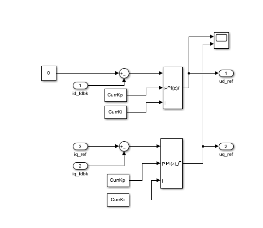
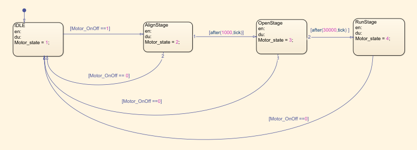
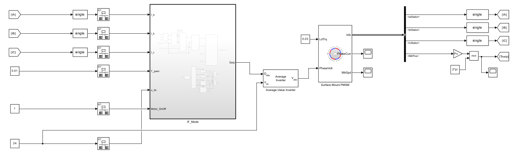
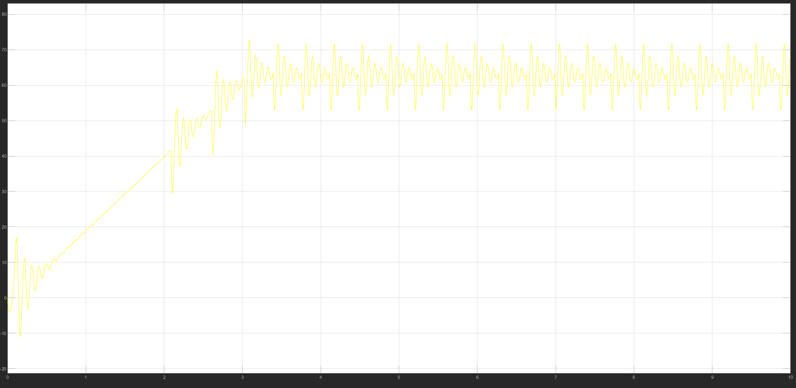
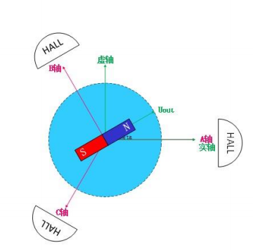
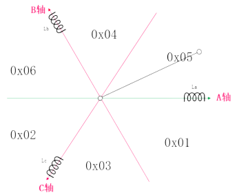
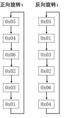

# Engine 4.2.2 FOC 电流PI闭环控制


## 1. 电流PI控制器

### 电流PI控制模型

dq 坐标系下的电压方程可以表示为：
$$
\begin{cases}
\frac{d}{dt}i_d = -\frac{R_s}{L_d}i_d+\frac{L_q}{L_d}\omega_ei_q+\frac{1}{L_d}u_d \\
\frac{d}{dt}i_q = -\frac{R_s}{L_d}i_d+\frac{1}{L_q}\omega_e(L_di_d+\psi_f)+\frac{1}{L_q}u_q
\end{cases}
$$
定子电流分别在q轴和d轴产生耦合电动势，对上述方程进行解耦得到变换后的电压 $u_{d0}$ 和 $u_{q0}$ ：
$$
\begin{cases}
u_{d0} = u_d + \omega_eL_qi_q = Ri_d+L_d\frac{d}{dt}i_d \\
u_{q0} = u_q - \omega_e(L_di_d+\psi_f)=Ri_q+L_q\frac{d}{dt}i_q
\end{cases}
$$
 拉氏变换得到：
$$
\begin{bmatrix}
u_{d0} \\
u_{q0}
\end{bmatrix} 
=
\begin{bmatrix}
R_s+sL_d & 0 \\
0 & R_s+sL_q
\end{bmatrix} 
\begin{bmatrix}
i_d \\
i_q
\end{bmatrix}
$$


采用 PI 控制器后可以得到输出方程为：
$$
\begin{cases}
u_d^* = (K_{pd}+\frac{K_{id}}{s})(i_d^*-i_d)-\omega_eL_qi_q \\
u_q^* = (K_{pq}+\frac{K_{iq}}{s})(i_q^*-i_q)+\omega_e(L_di_d+\psi_f)
\end{cases}
$$
如果使用前馈解耦（考虑反电动势时），虽然 PI 控制器的参数可以按照典型Ⅰ型系统进行设计，但该方法却仅当电机的实际参数与模型参数匹配时，交叉耦合电动势才能得到完全解耦。再考虑到模型误差，应当采用采用模型精度要求低且对参数变化不灵敏的控制方式。

### 内模控制器简介

[参考资料1](https://www.bilibili.com/read/cv24581856/)


$\hat{G(s)}$ 为过程模型， $G(s)$ 为被控过程， $C(s)$ 为内模控制器。

对上述系统进行相加点交换，得到等效控制器：
$$
C^*(s) = \frac{C(s)}{1-C(s)\hat{G(s)}}
$$
系统闭环响应为：
$$
Y(s) = \frac{C(s)G(s)}{1+C(s)(G(s)-\hat{G(s)})}X(s)
$$
反馈信号为：
$$
F(s) = (G(s)-\hat G(s))U(s)
$$
模型精确时， $G(s) = \hat{G(s)}$ ，反馈信号为0，则在模型精确和无外界扰动输入的条件下，内模控制具有开环结构，且稳定性取决于控制器和被控过程。对开环稳定的过程而言，反馈的目的是克服过程的不确定性。也就是说，如果过程和过程输入都完全清楚，只需要前馈（开环）控制，而不需要反馈（闭环）控制。事实上，在工业过程控制中，克服扰动是控制系统的主要任务，而模型不确定性也是难免的。此时，反馈信号就反映了过程模型的不确定性和扰动的影响，从而构成了闭环控制结构。

当被控过程稳定且模型精确 $G(s) = \hat{G(s)}$ 时，设计控制器使得 $ C(s) = \hat{G(s)}^{-1}$ 可以使得系统输出值都等于系统输入设定值。

设计控制器时，通常需要加上滤波器从而保证系统的稳定性和鲁棒性。 使得：
$$
C(s) = \hat{G(s)}^{-1} \frac{1}{(Ts+1)^\gamma}
$$


### 基于内模控制对 PI 控制器进行参数整定

[参考资料2](https://www.bilibili.com/read/cv25000595/)

<font color=LightGreen>1. 求得内模控制器</font>
$$
C(s) = \hat{G(s)}^{-1} \frac{1}{(Ts+1)^\gamma}
$$
基于内模控制的PID控制器设计中可以允许 $C(s)$ 的分子阶数大于分母的阶数。 由于电机的电磁时间常数比机械时间常数小很多，控制系统的电流环可近似视为一阶系统，取滤波器参数为1。
$$
G(s) = \hat{G(s)} = \begin{bmatrix}
R_s+sL_d & 0 \\
0 & R_s+sL_q
\end{bmatrix}
$$
<font color=LightGreen>2. 求得内模控制的等效反馈控制器</font>
$$
C^*(s) = \frac{C(s)}{1-C(s)\hat{G(s)}}
$$
求得：
$$
C^*(s) = \alpha 
\begin{bmatrix}
L_d+\frac{R}{s} & 0 \\
0 & L_q+\frac{R}{s}
\end{bmatrix}
$$
<font color=LightGreen>3. 通过比较内模控制的等效反馈控制器与PID控制器的标准形式，则可求得PID的控制参数。对于一阶系统，采用PI控制形式就可，对于二阶系统，采用PID控制形式即可。</font>
$$
\begin{cases}
K_{pd} = \alpha L_d \\
K_{id} = \alpha R_s \\
K_{pq} = \alpha L_q \\
K_{iq} = \alpha R_s
\end{cases}
$$
<font color=LightGreen>4. 通过调节滤波器参数去平衡PID控制的动态性能和稳态误差。</font>

### Simulink 电流环 PI 控制器



## 2. PMSM IF模式

IF 模式为电流环闭环，转速环开环模式。考虑到在一开始使用电流环闭环控制会直接将电机转向一个固定角度（0速度但是有大力矩，通常会将电机转向电角度零点实现电角度对齐）。所以 IF 模式通常将电机使用开环方式进行拖动，然后使用开环电角度生成器和 PID 控制器控制 dq 轴电流。



> - 第一阶段：IDLE，电机电角度未定，q轴电流取为0。
> - 第二阶段：零点对齐，取 d 轴电流为定值，保持电机电角度为0，定子产生的电流矢量将会使得电机转向电角度零点。(或者 q 轴电流为定值，电角度定义为 270° )
>
> > 在某些FOC零点校正中，常常控制电压实现零点校正。实际上，考虑稳态静止时，定子电压和定子电流确实成正比关系，因此使用电压控制方案校正，使得电机静止稳定时，此点也为电角度零点。
>
> - 第三/四阶段：开环拉起并保持，电角度由开环速度和开环拉起时间给出，电流进行闭环控制。





三相电流存在波动，这是由于 q 轴电流参考值与实际负载不匹配导致。

实际上在有反馈的条件下可以直接使用电机的角度进行反馈，IF 模式仍然为无反馈的纯开环，其反馈的 dq 轴电流和实际电流必然存在差值。

## 3. 速度PI控制器

速度 PI 控制器的 PI 参数如下：
$$
\begin{cases}
K_{p\omega} = \frac{\beta J}{1.5p\psi_f} \\
K_{i\omega} = \beta K_{p\omega}
\end{cases}
$$
电机的转动惯量都很难得到一个较准确的值，一些电机出厂铭牌中也少有提到，根据经验值可以自己判断（即使用手动调参法）。

## 4. HALL 传感器补偿

无刷电机的转子上通常有若干个磁极，而霍尔传感器能够检测这些磁极的位置。在电机的定子上有霍尔传感器，它们与转子的磁极相对应。

信号输出：每个霍尔传感器输出一个二进制信号（0 或 1），通常 N 为 1， S 为 0。表示其对应位置的磁极是否存在。

无刷电机通常都会安装 3 个hall元器件，分为 60 度安装和 120 度安装；大部分采用 120 度安装。



HALL 传感器的精度相对于磁编码器非常低，通常需要进行补偿得到较为准确的角度。

1. HALL 初始化

在电机未启动前，可以通过获取当前 HALL 状态，及转子所在扇区，将电机初始角度定义为该扇区的中点，即在当前扇区的角度上增加 30 度。



```c
void HALL_Init_Electrical_Angle(void)
{
	HALL_Handle_t *phandle = &Motor_App.HALL_Handle;
	phandle->HallState = HAL_GPIO_ReadPin(GPIOB, GPIO_PIN_8);
	phandle->HallState |= HAL_GPIO_ReadPin(GPIOB, GPIO_PIN_7) << 1;
	phandle->HallState |= HAL_GPIO_ReadPin(GPIOB, GPIO_PIN_6) << 2;
	switch (phandle->HallState)
		{
			case STATE_5:
			{
				phandle->HallElAngle = PHASE_SHIFT_ANGLE + PI/6;
				break;
			}
			case STATE_4:
			{
				phandle->HallElAngle = (PI/3.0f)+PHASE_SHIFT_ANGLE + PI/6;
				break;
			}
			case STATE_6:
			{
				phandle->HallElAngle = (PI*2.0f/3.0f)+PHASE_SHIFT_ANGLE + PI/6;
				break;
			}
			case STATE_2:
			{
				phandle->HallElAngle = PI + PHASE_SHIFT_ANGLE + PI/6;
				break;
			}
			case STATE_3:
			{
				phandle->HallElAngle = (PI*4.0f/3.0f)+PHASE_SHIFT_ANGLE + PI/6;
				break;
			}
			case STATE_1:
			{
				phandle->HallElAngle = (PI*5.0f/3.0f)+PHASE_SHIFT_ANGLE + PI/6;
				break;
			}
			default:
		 {
			 break;
		 }
	 }
}
```

2. HALL 读取速度



> 当电机正向旋转时，HALL状态由`0x05`->`0x04`时，由 HC 的下降沿触发进入中断，在中断中获取的 HALL 状态为`0x04`，此时机械角度为 60 度。
>
> 而当电机反转时，HALL 状态由 `0x06` -> `0x04` 时，由 HB 的上降沿触发进入中断，在中断中获取的 HALL 状态为 `0x04`，此时认为机械角度为 120 度。

```c
void HALL_Get_Electrical_Angle(void *pHandleVoid)
{
	HALL_Handle_t *phandle = (HALL_Handle_t *)pHandleVoid;
	phandle->hHighSpeedCapture = HAL_TIM_ReadCapturedValue(&htim4, TIM_CHANNEL_1);
	phandle->bPrevHallState = phandle->HallState;
	phandle->HallState = HAL_GPIO_ReadPin(GPIOB, GPIO_PIN_8);
	phandle->HallState |= HAL_GPIO_ReadPin(GPIOB, GPIO_PIN_7) << 1;
	phandle->HallState |= HAL_GPIO_ReadPin(GPIOB, GPIO_PIN_6) << 2;
	switch (phandle->HallState)
	{
	case STATE_5:
	{
		if (STATE_1 == phandle->bPrevHallState)
		{
			phandle->MeasuredElAngle = PHASE_SHIFT_ANGLE;
			phandle->Direction = POSITIVE;
		}
		else if (STATE_4 == phandle->bPrevHallState)
		{
			phandle->MeasuredElAngle = PHASE_SHIFT_ANGLE + PI / 3.0f;
			phandle->Direction = NEGATIVE;
		}
		else
		{
		}; // nothing
		break;
	}
	case STATE_4:
	{
		if (STATE_5 == phandle->bPrevHallState)
		{
			phandle->MeasuredElAngle = PHASE_SHIFT_ANGLE + PI / 3.0f;
			phandle->Direction = POSITIVE;
		}
		else if (STATE_6 == phandle->bPrevHallState)
		{
			phandle->MeasuredElAngle = PHASE_SHIFT_ANGLE + 2 * PI / 3.0f;
			phandle->Direction = NEGATIVE;
		}
		else
		{
		}; // nothing
		break;
	}
	case STATE_6:
	{
		if (STATE_4 == phandle->bPrevHallState)
		{
			phandle->MeasuredElAngle = PHASE_SHIFT_ANGLE + 2 * PI / 3.0f;
			phandle->Direction = POSITIVE;
		}
		else if (STATE_2 == phandle->bPrevHallState)
		{
			phandle->MeasuredElAngle = PHASE_SHIFT_ANGLE + PI;
			phandle->Direction = NEGATIVE;
		}
		else
		{
		}; // nothing
		break;
	}
	case STATE_2:
	{
		if (STATE_6 == phandle->bPrevHallState)
		{
			phandle->MeasuredElAngle = PHASE_SHIFT_ANGLE + PI;
			phandle->Direction = POSITIVE;
		}
		else if (STATE_3 == phandle->bPrevHallState)
		{
			phandle->MeasuredElAngle = PHASE_SHIFT_ANGLE + 4 * PI / 3.0f;
			phandle->Direction = NEGATIVE;
		}
		else
		{
		}; // nothing
		break;
	}
	case STATE_3:
	{
		if (STATE_2 == phandle->bPrevHallState)
		{
			phandle->MeasuredElAngle = PHASE_SHIFT_ANGLE + 4 * PI / 3.0f;
			phandle->Direction = POSITIVE;
		}
		else if (STATE_1 == phandle->bPrevHallState)
		{
			phandle->MeasuredElAngle = PHASE_SHIFT_ANGLE + 5 * PI / 3.0f;
			phandle->Direction = NEGATIVE;
		}
		else
		{
		}; // nothing
		break;
	}
	case STATE_1:
	{
		if (STATE_3 == phandle->bPrevHallState)
		{
			phandle->MeasuredElAngle = PHASE_SHIFT_ANGLE + 5 * PI / 3.0f;
			phandle->Direction = POSITIVE;
		}
		else if (STATE_5 == phandle->bPrevHallState)
		{
			phandle->MeasuredElAngle = PHASE_SHIFT_ANGLE;
			phandle->Direction = NEGATIVE;
		}
		else
		{
		}; // nothing
		break;
	}
	default:
	{
		break;
	}
	}
	if (phandle->MeasuredElAngle < 0.0f)
	{
		phandle->MeasuredElAngle += 2.0f * PI;
	}
	else if (phandle->MeasuredElAngle > (2.0f * PI))
	{
		phandle->MeasuredElAngle -= 2.0f * PI;
	}
    // AvrElSpeedDpp为平均电角速度，在电流环任务中累加就得到角度
	phandle->AvrElSpeedDpp = (PI/3)/((phandle->hHighSpeedCapture/3200000)*10000);
    // HallSpeed 为上一个 60 度的平均速度
	phandle->HallSpeed = (PI/3)/(phandle->hHighSpeedCapture/3200000)*30/(2*PI);
    // 根据电机转动方向，判断转速及平均电角速度的正负
	phandle->HallSpeed = phandle->HallSpeed * phandle->Direction;
	phandle->AvrElSpeedDpp = phandle->AvrElSpeedDpp * phandle->Direction;
	// HALL处理是基于之前 60° 的 HALL 时间处理的，不是当前的值，所以这么处理的前提是默认每个扇区的运行时间是不突变的，HALL 处理总归会存在误差，因此需要进行补偿
    // 补偿方法：HALL测量到角度减去电流环中累加得到角度，除以10000后在电流环中进行补偿
    phandle->DeltaAngle = (phandle->MeasuredElAngle - phandle->HallElAngle) / 10000;
}
```

在电流环线程中进行补偿：

```c
	// 当HALL测量的角度等于偏置角度时，需要对累加得到的电角度做一次校准，即每转一圈（电角度）校准一次    
	if (Motor_App.HALL_Handle.MeasuredElAngle == PHASE_SHIFT_ANGLE && Motor_App.HALL_Handle.Direction == 1)
    {
      // 正转校准，就是让hall获取的角度等于实际的电角度
      Motor_App.HALL_Handle.HallElAngle = Motor_App.HALL_Handle.MeasuredElAngle;
      Motor_App.HALL_Handle.MeasuredElAngle = Motor_App.HALL_Handle.MeasuredElAngle + Motor_App.HALL_Handle.AvrElSpeedDpp;
      Motor_App.HALL_Handle.HallElAngle = Motor_App.HALL_Handle.HallElAngle + Motor_App.HALL_Handle.AvrElSpeedDpp;
    }
    else if (Motor_App.HALL_Handle.MeasuredElAngle == PHASE_SHIFT_ANGLE + PI / 3 && Motor_App.HALL_Handle.Direction == -1)
    {
      // 反转校准 
      Motor_App.HALL_Handle.HallElAngle = Motor_App.HALL_Handle.MeasuredElAngle;
      Motor_App.HALL_Handle.MeasuredElAngle = Motor_App.HALL_Handle.MeasuredElAngle + Motor_App.HALL_Handle.AvrElSpeedDpp;
      Motor_App.HALL_Handle.HallElAngle = Motor_App.HALL_Handle.HallElAngle + Motor_App.HALL_Handle.AvrElSpeedDpp;
    }
    else
    {
      // 角度累加阶段，不校准
      Motor_App.HALL_Handle.MeasuredElAngle = Motor_App.HALL_Handle.MeasuredElAngle + Motor_App.HALL_Handle.AvrElSpeedDpp;
      Motor_App.HALL_Handle.HallElAngle = Motor_App.HALL_Handle.HallElAngle + Motor_App.HALL_Handle.AvrElSpeedDpp + Motor_App.HALL_Handle.DeltaAngle;
    }
    // 归一化
    if (Motor_App.HALL_Handle.HallElAngle < 0.0f)
    {
      Motor_App.HALL_Handle.HallElAngle += 2.0f * PI;
    }
    else if (Motor_App.HALL_Handle.HallElAngle > (2.0f * PI))
    {
      Motor_App.HALL_Handle.HallElAngle -= 2.0f * PI;
    }
```

