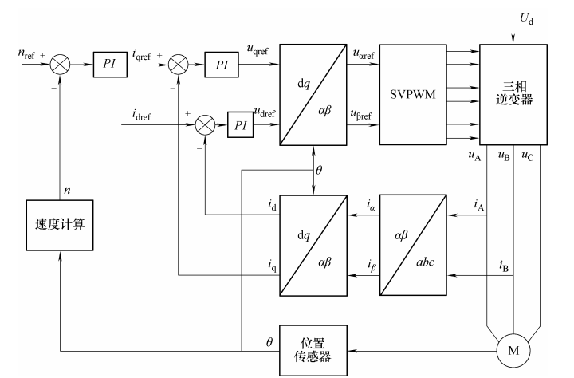
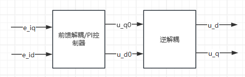
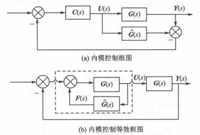

# Engine 4.2.2 FOC 电流PI闭环控制

## 1. 电流PI控制器

### 电流PI控制模型

dq 坐标系下的电压方程可以表示为：
$$
\begin{cases}
\frac{d}{dt}i_d = -\frac{R_s}{L_d}i_d+\frac{L_q}{L_d}\omega_ei_q+\frac{1}{L_d}u_d \\
\frac{d}{dt}i_q = -\frac{R_s}{L_d}i_d+\frac{1}{L_q}\omega_e(L_di_d+\psi_f)+\frac{1}{L_q}u_q
\end{cases}
$$
定子电流分别在q轴和d轴产生耦合电动势，对上述方程进行解耦得到变换后的电压 $u_{d0}$ 和 $u_{q0}$ ：
$$
\begin{cases}
u_{d0} = u_d + \omega_eL_qi_q = Ri_d+L_d\frac{d}{dt}i_d \\
u_{q0} = u_q - \omega_e(L_di_d+\psi_f)=Ri_q+L_q\frac{d}{dt}i_q
\end{cases}
$$
 拉氏变换得到：
$$
\begin{bmatrix}
u_{d0} \\
u_{q0}
\end{bmatrix} 
=
\begin{bmatrix}
R_s+sL_d & 0 \\
0 & R_s+sL_q
\end{bmatrix} 
\begin{bmatrix}
i_d \\
i_q
\end{bmatrix}
$$

采用 PI 控制器后可以得到输出方程为：
$$
\begin{cases}
u_d^* = (K_{pd}+\frac{K_{id}}{s})(i_d^*-i_d)-\omega_eL_qi_q \\
u_q^* = (K_{pq}+\frac{K_{iq}}{s})(i_q^*-i_q)+\omega_e(L_di_d+\psi_f)
\end{cases}
$$
如果使用前馈解耦（考虑反电动势时），虽然 PI 控制器的参数可以按照典型Ⅰ型系统进行设计，但该方法却仅当电机的实际参数与模型参数匹配时，交叉耦合电动势才能得到完全解耦。再考虑到模型误差，应当采用采用模型精度要求低且对参数变化不灵敏的控制方式。

### 内模控制器简介

[参考资料1](https://www.bilibili.com/read/cv24581856/)

$\hat{G(s)}$ 为过程模型， $G(s)$ 为被控过程， $C(s)$ 为内模控制器。

对上述系统进行相加点交换，得到等效控制器：
$$
C^*(s) = \frac{C(s)}{1-C(s)\hat{G(s)}}
$$
系统闭环响应为：
$$
Y(s) = \frac{C(s)G(s)}{1+C(s)(G(s)-\hat{G(s)})}X(s)
$$
反馈信号为：
$$
F(s) = (G(s)-\hat G(s))U(s)
$$
模型精确时， $G(s) = \hat{G(s)}$ ，反馈信号为0，则在模型精确和无外界扰动输入的条件下，内模控制具有开环结构，且稳定性取决于控制器和被控过程。对开环稳定的过程而言，反馈的目的是克服过程的不确定性。也就是说，如果过程和过程输入都完全清楚，只需要前馈（开环）控制，而不需要反馈（闭环）控制。事实上，在工业过程控制中，克服扰动是控制系统的主要任务，而模型不确定性也是难免的。此时，反馈信号就反映了过程模型的不确定性和扰动的影响，从而构成了闭环控制结构。

当被控过程稳定且模型精确 $G(s) = \hat{G(s)}$ 时，设计控制器使得 $ C(s) = \hat{G(s)}^{-1}$ 可以使得系统输出值都等于系统输入设定值。

设计控制器时，通常需要加上滤波器从而保证系统的稳定性和鲁棒性。 使得：
$$
C(s) = \hat{G(s)}^{-1} \frac{1}{(Ts+1)^\gamma}
$$

### 基于内模控制对 PI 控制器进行参数整定

[参考资料2](https://www.bilibili.com/read/cv25000595/)

1. 求得内模控制器
$$
C(s) = \hat{G(s)}^{-1} \frac{1}{(Ts+1)^\gamma}
$$
基于内模控制的PID控制器设计中可以允许 $C(s)$ 的分子阶数大于分母的阶数。 由于电机的电磁时间常数比机械时间常数小很多，控制系统的电流环可近似视为一阶系统，取滤波器参数为1。
$$
G(s) = \hat{G(s)} = \begin{bmatrix}
R_s+sL_d & 0 \\
0 & R_s+sL_q
\end{bmatrix}
$$
2. 求得内模控制的等效反馈控制器
$$
C^*(s) = \frac{C(s)}{1-C(s)\hat{G(s)}}
$$
求得：
$$
C^*(s) = \alpha 
\begin{bmatrix}
L_d+\frac{R}{s} & 0 \\
0 & L_q+\frac{R}{s}
\end{bmatrix}
$$
3. 通过比较内模控制的等效反馈控制器与PID控制器的标准形式，则可求得PID的控制参数。对于一阶系统，采用PI控制形式就可，对于二阶系统，采用PID控制形式即可。
$$
\begin{cases}
K_{pd} = \alpha L_d \\
K_{id} = \alpha R_s \\
K_{pq} = \alpha L_q \\
K_{iq} = \alpha R_s
\end{cases}
$$
4. 通过调节滤波器参数去平衡PID控制的动态性能和稳态误差。

## 2. 转速PI控制器

