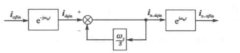

# Engine 4.2.3 无感FOC 高频注入简介

> **Attention**：本笔记仅介绍最基本的高频注入，关于更加深入的内容暂不公开。

对于 FOC ，获取当前的电角度是一个重要的研究方向，使用 HALL 传感器虽然低成本，但是误差较大，难以实现位置控制；使用磁编码器虽然精度高，但是硬件成本较高，设计较复杂。无感 FOC 是当前交流电机控制的主要研究方向。

无感技术分为两大类：

>- 基于反电动势的无感算法：磁链观测器，滑膜观测器，扩展 Kalman 滤波器 ... 该方法在中高速时存在良好的控制效果，但是在低速时由于反电动势噪声较大，跟踪效果较差。
>- 基于检测电机凸极特性的无感算法：高频注入，电感测量法 ... 该方法在低速时存在良好的控制效果。

高频注入法基于转子的凸极效应：一类是通过转子本身的凸极效应得到（IPMSM的凸极效应），称为结构性凸极；另一类是通过磁路饱和产生的突击性，称之饱和性凸极。

高频注入法有四种，旋转高频电压注入，旋转高频电流注入，脉振高频电压注入，高频方波电压注入，考虑到 PMSM 的驱动器通常使用电压源型逆变器，使用旋转高频电压注入，脉振高频电压注入，高频方波电压注入较为普遍。

## 0. 高频注入的 PMSM 模型

$$
\begin{bmatrix}
u_d \\
u_q \\
\end{bmatrix} 
=
\begin{bmatrix}
R_s & 0 \\
0 & R_s \\
\end{bmatrix} 
\begin{bmatrix}
i_d \\
i_q 
\end{bmatrix}
+
\begin{bmatrix}
L_d & 0 \\
0 & L_q \\
\end{bmatrix} 
\frac{d}{dt}
\begin{bmatrix}
i_d \\
i_q 
\end{bmatrix}
+
\omega_e
\begin{bmatrix}
0 & -L_q \\
L_d & 0 \\
\end{bmatrix} 
\begin{bmatrix}
i_d \\
i_q 
\end{bmatrix}
+
\omega_e\Psi_m
\begin{bmatrix}
0 \\
1
\end{bmatrix}
$$

通常，高频注入时注入信号的频率远高于电机基波频率，同时电阻远小于电抗，因此忽略有关项可以得到：
$$
\begin{bmatrix}
u_d \\
u_q \\
\end{bmatrix} 
=
\begin{bmatrix}
L_d & 0 \\
0 & L_q \\
\end{bmatrix} 
\frac{d}{dt}
\begin{bmatrix}
i_d \\
i_q 
\end{bmatrix}
$$

## 1. 旋转高频电压注入

### 高频电流响应

旋转高频电压注入要求在 $\alpha - \beta$ 坐标系下注入高频正交正弦电压：
$$
\begin{bmatrix}
u_{\alpha h} \\
u_{\beta h} 
\end{bmatrix}
=
U_h
\begin{bmatrix}
cos(\omega_h t) \\
sin(\omega_h t)
\end{bmatrix}
$$
 首先进行 Park 变换：
$$
\begin{bmatrix}
u_{d h} \\
u_{q h} 
\end{bmatrix}
=
U_h
\begin{bmatrix}
cos(\omega_h t - \theta_e) \\
sin(\omega_h t - \theta_e)
\end{bmatrix}
$$
由于 $\omega_h$ 很大，可以忽略此时 $\theta_e$ 的变化，代入 PMSM 的基本方程，得到：
$$
\begin{bmatrix}
i_{dh} \\
i_{qh}
\end{bmatrix}
=
\frac{U_h}{\omega_h}
\begin{bmatrix}
\frac{1}{L_d}sin(\omega_h t - \theta_e) \\
-\frac{1}{L_q}cos(\omega_h t - \theta_e)
\end{bmatrix}
$$
进行 Park 反变换，可以得到电流响应：
$$
i_{\alpha \beta h} = I_{hp}e^{j(\omega_h t -\frac{\pi}{2})} + I_{hn}e^{j(- \omega_h t + 2\theta_e + \frac{\pi}{2})}
$$
$I_{hp} = \frac{U_h}{\omega_h L_q L_d}\frac{L_d + L_q}{2}$ 为正序分量，$I_{hn} = \frac{U_h}{\omega_h L_q L_d}\frac{L_q - L_d}{2}$ 为负序分量。仅负序分量包含当前的电机电角度。

### 位置跟踪

- 基波电流与高频电流幅值相差较大，PWM 开关频率远高于注入频率，可以使用带通滤波器进行滤除；
- 使用同步轴系高通滤波器（SFF）滤除正序分量：首先基于以注入频率旋转的坐标系进行坐标变换将正序分量变换为直流分量，用高通滤波器滤除后仅剩余负序分量。
- 控制时，使用低通滤波器得到非高频分量进行控制。

- 为了提取相位信息中的位置信号，使用锁相环进行位置提取。

